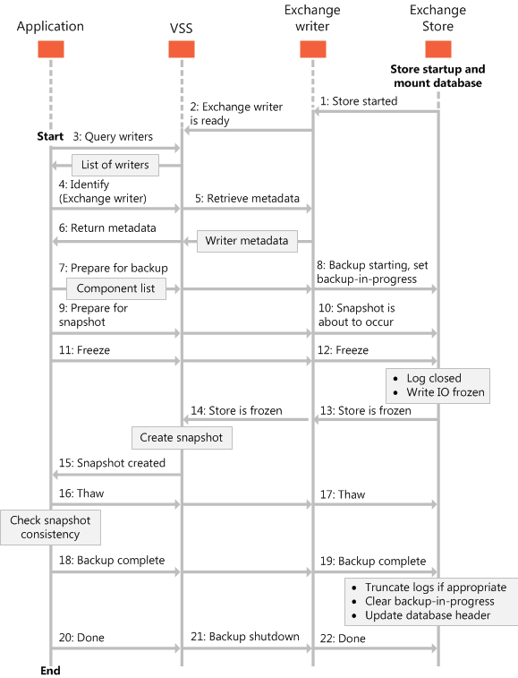

# Tipos de operaciones de copia de seguridad para Exchange 2013Types of backup operations for Exchange 2013

Encuentre información acerca de los distintos tipos de copias de seguridad se pueden realizar en el Exchange 2013 almacenar bases de datos, incluidos completa, copia, incremental y copias de seguridad diferenciales.Find information about the different types of backups you can perform on your Exchange 2013 store databases, including full, copy, incremental, and differential backups.
  
**Se aplica a:** Exchange Server 2013**Applies to:** Exchange Server 2013 
  
En este artículo se proporciona información acerca de los distintos tipos de copias de seguridad se pueden realizar en las bases de datos de Exchange Server 2013, y cómo afectan esas copias de seguridad a los archivos de base de datos.This article provides information about the different types of backups you can perform on Exchange Server 2013 databases, and how those backups affect the database files. 
  
Copia de seguridad y restauración de las aplicaciones que usan el servicio de instantáneas de volumen (VSS) y el escritor de Exchange pueden realizar los tipos de copias de seguridad que aparecen en la siguiente tabla.Backup and restore applications that use the Volume Shadow Copy Service (VSS) and the Exchange writer can perform the types of backups listed in the following table.
  
**La tabla 1. Tipos de operaciones de copia de seguridad****Table 1. Types of backup operations**

|**Tipo de copia de seguridad****Backup type**|**Descripción****Description**|
|:-----|:-----|
|[Copias de seguridad completasFull backups](types-of-backup-operations-for-exchange-2013.md#bk_FullBackups)   |Realiza una copia de seguridad de las bases de datos (\*.edb), los registros de transacciones (\*. log), archivos de punto de comprobación (\*.chk) y, a continuación, se trunca los registros de transacciones de una base de datos específica.Backs up the databases (\*.edb), transaction logs (\*.log), checkpoint files (\*.chk), and then truncates the transaction logs for a specific database.    |
|[Copiar las copias de seguridadCopy backups](types-of-backup-operations-for-exchange-2013.md#bk_CopyBackups)   |Realiza una copia de seguridad de la base de datos, registros de transacciones y archivos de punto de control.Backs up the database, transaction logs, and checkpoint files. Copias de seguridad no truncan los registros de transacciones de la base de datos.Copy backups do not truncate the transaction logs for the database.    |
|[Copias de seguridad incrementalesIncremental backups](types-of-backup-operations-for-exchange-2013.md#bk_IncrementalBackups)   |Realiza una copia de los registros de transacciones para registrar los cambios desde la copia de seguridad por última vez completo o incremental y, a continuación, se trunca los registros de transacciones.Backs up the transaction logs to record changes since the last full or incremental backup, and then truncates the transaction logs.    |
|[Copias de seguridad diferencialesDifferential backups](types-of-backup-operations-for-exchange-2013.md#bk_DifferentialBackups)   |Realiza una copia de los registros de transacciones para registrar los cambios desde la copia de seguridad por última vez completo o incremental y no trunca los registros de transacciones.Backs up the transaction logs to record changes since the last full or incremental backup, and does not truncate the transaction logs.    |
   
Los componentes o archivos de base de datos, definidos por el escritor de Exchange representan los archivos de base de datos y los registros de transacciones dentro de las bases de datos de Exchange 2013.The components, or database files, defined by the Exchange writer represent the database files and transaction logs within Exchange 2013 databases. Esto permite que la aplicación de copia de seguridad y restauración mostrar los nombres de los componentes dentro de una base de datos de Exchange 2013 durante las operaciones de copia de seguridad.This allows your backup and restore application to display the names of the components within an Exchange 2013 database during backup operations. La aplicación de copia de seguridad no se puede realizar una copia de seguridad de componentes de base de datos individual, sin embargo; sólo puede hacer una copia seguridad de bases de datos de todo.Your backup application cannot back up individual database components, however; it can only back up whole databases. 
  
El escritor de Exchange estandariza las rutas lógicas de componente base de datos, que se especifican en los metadatos del escritor de Exchange.The Exchange writer standardizes the database component logical paths, which are specified in the Exchange writer metadata. El escritor de Exchange devuelve las rutas de acceso lógicas a la aplicación de copia de seguridad y restauración según sea necesario.The Exchange writer returns the logical paths to your backup and restore application as needed.
  
El escritor de Exchange proporciona lógicas rutas de acceso en el formulario:The Exchange writer provides logical paths in the form: 
  
 `logicalPath = "Exchange Server\Microsoft Information Store\<Server name>"`
  
Los componentes de servidor y base de datos son componentes del grupo de archivos, pero no tienen todos los archivos asociados.The server and database components are file group components, but they do not have any associated files. Tienen subcomponentes que especifican los archivos individuales.They have subcomponents that specify the individual files. Una base de datos contiene sólo un componente de registro, denominado registros.A database contains only one log component, named Logs. Los nombres de componente de los componentes individuales de la base de datos son los GUID de las bases de datos, que se muestran como cadenas.The component names of the individual database components are the GUIDs of the databases, shown as strings. 
  
El escritor de Exchange sólo enumera las bases de datos que se copia de seguridad pueden, basándose en directrices de marco de trabajo VSS.The Exchange writer only lists databases that can be backed up, based on VSS framework guidelines. Las bases de datos que se montan la base de datos de recuperación de Exchange 2013, así como las bases de datos que no están montadas, no se puede realizar una copia y, por lo tanto, no aparecen en los metadatos del escritor de Exchange.Databases that are mounted as the Exchange 2013 recovery database, as well as databases that are not mounted, cannot be backed up, and therefore are not listed in the Exchange writer's metadata.
  
La siguiente ilustración muestra el escritor de Exchange proceso de copia de seguridad.The following figure shows the Exchange writer backup process. 
  
**En la figura 1. Secuencia de eventos para el proceso de copia de seguridad****Figure 1. Sequence of events for the backup process**

  
## Copias de seguridad completasFull backups

Una copia de seguridad completa de una base de datos de Exchange implica crear y almacenar una copia del archivo de base de datos, los registros de transacciones y archivos de punto de control.A full backup of an Exchange database involves creating and storing a copy of the database file, transaction logs, and checkpoint files. Una base de datos de Exchange 2013 tiene un conjunto de archivos de registro de transacciones dedicado.An Exchange 2013 database has one set of dedicated transaction log files.
  
Una vez que ha sido una copia de seguridad de la base de datos, se truncan los archivos de registro de transacciones en el disco para que permanezcan sólo los cambios de base de datos que se ha producido una vez que se realizó la copia de seguridad.After the database has been backed up, the transaction log files on the disk are truncated so that only database changes that occurred after the backup was made will remain. Durante este proceso, el escritor de Exchange elimina todas las entradas de registro hasta el punto de control, basado en la suposición de que las bases de datos ahora se copiaron en un estado coherente que contiene todos los cambios de seguridad para el punto de control más reciente.During this process, the Exchange writer deletes all log entries up to the checkpoint, based on the assumption that the databases have now been backed up in a consistent state that contains all changes up to the most recent checkpoint. 
  
Si va a realizar una copia de la base de datos se desmonta durante la operación de copia de seguridad, Exchange 2013 no se truncarán los registros de transacciones y el resultado será el equivalente de una operación de copia de seguridad de copia, no una operación de copia de seguridad completa.If the database being backed up is dismounted during the backup operation, Exchange 2013 will not truncate the transaction logs and the result will be the equivalent of a copy backup operation, not a full backup operation. 
  
Cuando se complete una copia de seguridad completa, los encabezados de la base de datos montada activo se actualizan con la información de copia de seguridad actual.When a full backup is completed, the headers of the active mounted database are updated with the current backup information. En las implementaciones de replicada, esta información se compromete a un archivo de registro de transacciones y se replican en las demás copias DAG de la base de datos.In replicated deployments, this information will be committed to a transaction log file and replicated to the other DAG copies of the database. Los encabezados de las copias de base de datos se actualizan como este archivo de registro de transacciones se reproduce en la copia de la base de datos.Headers of the database copies are updated as this transaction log file is replayed into the database copy.
  
Una copia de seguridad completa de sombra es necesario para poder ejecutar las copias de seguridad diferenciales o incrementales sombra.A full shadow copy backup is required in order to run incremental or differential shadow copy backups. Las copias de seguridad completas pueden consultarse desde cualquier copia como es una instantánea de copia de seguridad.The full backups can be taken from any copy as long as it is a shadow copy backup.
  
Copias de seguridad completas se usan en los siguientes escenarios:Full backups are used in the following scenarios:
  
- Una base de datos se daña o se pierde, pero están intactos los archivos de registro de transacciones en el disco.A database becomes corrupted or is lost, but the transaction log files on disk are intact. En este escenario, los archivos de base de datos afectada pueden restaurar a partir de la copia de seguridad completa y, a continuación, recuperarse mediante la reproducción de los registros de transacciones que están todavía en disco.In this scenario, the affected database files can be restored from the full backup, and then recovered by replaying the transaction logs that are still on disk. 
    
- Los archivos de registro de transacciones, así como el archivo de base de datos en el disco, se pierden.Transaction log files, as well as the database file on disk, are lost. En este escenario, se restauran los archivos de registro de transacciones que se realizó la copia en el momento de la copia de seguridad completa junto con la base de datos.In this scenario, the transaction log files that were backed up at the time of the full backup are restored together with the database.
    
En Exchange 2013, se puede restaurar registros sin tener que restaurar la base de datos aplicable a partir de un conjunto de copia de seguridad completa.In Exchange 2013, logs can be restored without having to restore the applicable database from a full backup set. Esta opción posibilita una copia de seguridad completa anterior que se restaurarán y se combinan con los archivos de registro de transacciones desde la copia de seguridad completa más reciente rehacer.This option makes it possible for a previous full backup to be restored and combined with the transaction log files from the most recent full backup to roll forward.
  
Cuando se establece la enumeración [VSS_BACKUP_TYPE](http://msdn.microsoft.com/en-us/library/windows/desktop/aa384679%28v=vs.85%29.aspx) en VSS a **VSS_BT_FULL** cuando el escritor de Exchange realiza una copia de seguridad, se incluyen los siguientes componentes en la copia de seguridad:When the [VSS_BACKUP_TYPE](http://msdn.microsoft.com/en-us/library/windows/desktop/aa384679%28v=vs.85%29.aspx) enumeration in VSS is set to **VSS_BT_FULL** when the Exchange writer performs a backup, the following components are included in the backup: 
  
- Una base de datos con la ruta de acceso lógica almacén de información de Exchange Server\Microsoft\\< nombre de servidor\>\\< GUID de base de datos\>A database with the logical path Exchange Server\Microsoft Information Store\\<Server Name\>\\<Database GUID\> 
    
- Un archivo de registro con la ruta de acceso lógica almacén de información de Exchange Server\Microsoft\\< nombre de servidor\>\\< GUID de base de datos\>A log file with the logical path Exchange Server\Microsoft Information Store\\<Server Name\>\\<Database GUID\> 
    
## Copiar las copias de seguridadCopy backups

Una copia de seguridad de una base de datos de Exchange implica la creación y almacenamiento de los mismos elementos que se incluyen en una copia de seguridad completa.A copy backup of an Exchange database involves creating and storing the same elements that are included in a full backup. Sin embargo, a diferencia de con una copia de seguridad completa, los archivos de registro de transacciones en el disco no se truncan cuando se haya completado la copia de seguridad.However, unlike with a full backup, the transaction log files on disk are not truncated when the backup is complete. Copias de seguridad no están diseñados para fines de recuperación de datos.Copy backups are not intended for data recovery purposes. En su lugar, las copias de seguridad proporcionan una imagen de los datos para su uso en las pruebas de diagnóstico de problemas, o para la inicialización de una réplica.Instead, copy backups provide an image of the data for use in testing, problem diagnosis, or for seeding a replica.
  
Por ejemplo, un administrador de Exchange 2013 que está experimentando problemas con el almacén de Exchange puede realizar una copia copia de seguridad para su uso en un entorno de prueba sin que ello afecte al sistema de producción.For example, an Exchange 2013 administrator who is experiencing problems with the Exchange store can make a copy backup for use in a test environment without affecting the production system. Copias de seguridad no afectan a las programaciones de copia de seguridad regulares; Sin embargo, debido a que una copia de seguridad también pone el almacén de Exchange en un estado de copia de seguridad en curso, bloquea otras copias de seguridad programadas continúe hasta que la copia de seguridad se haya completado o cancelado.Copy backups do not affect regular backup schedules; however, because a copy backup also puts the Exchange store in a backup-in-progress state, it blocks other scheduled backups from proceeding until the copy backup is completed or aborted. 
  
Cuando se establece la enumeración [VSS_BACKUP_TYPE](http://msdn.microsoft.com/en-us/library/windows/desktop/aa384679%28v=vs.85%29.aspx) en VSS en **VSS_BT_COPY**, se incluyen los siguientes componentes en una copia de seguridad:When the [VSS_BACKUP_TYPE](http://msdn.microsoft.com/en-us/library/windows/desktop/aa384679%28v=vs.85%29.aspx) enumeration in VSS is set to **VSS_BT_COPY**, the following components are included in a copy backup: 
  
- Una base de datos con la ruta de acceso lógica almacén de información de Exchange Server\Microsoft\\< nombre de servidor\>\\< GUID de base de datos\>A database with the logical path Exchange Server\Microsoft Information Store\\<Server Name\>\\<Database GUID\> 
    
- Un componente del archivo de registro con la ruta de acceso lógica almacén de información de Exchange Server\Microsoft\\< nombre de servidor\>\\< GUID de base de datos\>A log file component with the logical path Exchange Server\Microsoft Information Store\\<Server Name\>\\<Database GUID\>
    
## Copias de seguridad incrementalesIncremental backups

Una copia de seguridad incremental de una base de datos de Exchange 2013 guarda los cambios realizados a la base de datos que se han producido desde la última copia de seguridad completa o incremental.An incremental backup of an Exchange 2013 database saves changes to the database that have occurred since the last full or incremental backup. Cuando se restauran todos los archivos de base de datos y los archivos de registro en el sistema, que se puede recuperar en el estado que se encontraban en el momento de la última copia de seguridad incremental.When all the database files and log files are restored to the system, they can be recovered to the state they were in at the time of the last incremental backup. Los datos almacenados en una copia de seguridad incremental incluyen sólo los archivos de registro de transacciones hasta la hora actual.The data stored in an incremental backup includes only the transaction log files up to the current time. 
  
Una vez finalizada la copia de seguridad, el servidor de Exchange trunca los archivos de registro y marca el tiempo de copia de seguridad en los encabezados de la base de datos.When the backup is complete, the Exchange server truncates the log files and marks the backup time in the database headers. Uso de una copia de seguridad incremental para recuperar una base de datos requiere al menos dos conjuntos de datos que desea restaurar: la última copia de seguridad completa y, a continuación, cada copia de seguridad incremental realizada después de la última completa de copia de seguridad.Using an incremental backup to recover a database requires at least two data sets to be restored: the last full backup, and then every incremental backup taken after the last full backup. La ventaja de usar copias de seguridad incrementales es que las copias de seguridad individuales son mucho más pequeños que una copia de seguridad completa y copias de seguridad incrementales individuales son con frecuencia más pequeñas que las copias de seguridad diferenciales.The advantage to using incremental backups is that the individual backups are much smaller than a full backup and individual incremental backups are frequently smaller than differential backups. 
  
La desventaja de utilizar copias de seguridad incrementales es que si se han realizado muchas copias de seguridad incrementales entre copias de seguridad completas, recuperación del almacén de Exchange puede implicar la recuperación de muchas copias de seguridad incrementales.The disadvantage to using incremental backups is that if many incremental backups were made between full backups, recovering the Exchange store may involve recovering many incremental backups. Exchange no permite una copia de seguridad incremental que se produzca cuando no existe ninguna copia de seguridad completa anterior para establecer el punto de partida para los cambios incrementales.Exchange does not allow an incremental backup to occur when no previous full backup exists to establish the starting point for the incremental changes. 
  
Una copia de seguridad completa realizada desde una ubicación de copia de DAG puede ir seguida de una copia de seguridad incremental de la ubicación activa y viceversa.A full backup taken from a DAG copy location can be followed by an incremental backup from the active location and vice versa. Una restricción debe tener en cuenta es que el último estado de copia de seguridad se mantiene en el encabezado de la base de datos activa, y los cambios realizados en el encabezado de la base de datos se escriben en registros de transacciones, replicado y reproducir en la ubicación de la base de datos de copia al igual que todas las otras transacciones registros en las implementaciones de DAG.One restriction to keep in mind is that the last backup state is maintained in the active database's header, and the changes to the database header are written to transaction logs, replicated, and replayed at the copy database location just like all other transaction logs in DAG deployments. Debido a que las copias de seguridad y restauraciones interoperan, aplicaciones de copia de seguridad pueden proporcionar la funcionalidad para ejecutar las copias de seguridad exclusivamente en un nodo específico de DAG, independientemente de si el nodo está activo o pasivo, así como para ejecutar las copias de seguridad exclusivamente desde el nodo pasivo o exclusivamente desde el nodo activo.Because backups and restores interoperate, backup applications can provide the functionality to run backups exclusively on a specific DAG node, regardless of whether the node is active or passive, as well as to run backups exclusively from the passive node or exclusively from the active node.
  
Cuando se establece la enumeración [VSS_BACKUP_TYPE](http://msdn.microsoft.com/en-us/library/windows/desktop/aa384679%28v=vs.85%29.aspx) en VSS en **VSS_BT_INCREMENTAL**, se incluyen los siguientes componentes en una copia de seguridad incremental:When the [VSS_BACKUP_TYPE](http://msdn.microsoft.com/en-us/library/windows/desktop/aa384679%28v=vs.85%29.aspx) enumeration in VSS is set to **VSS_BT_INCREMENTAL**, the following components are included in an incremental backup: 
  
- Una base de datos con la ruta de acceso lógica almacén de información de Exchange Server\Microsoft\\< nombre de servidor\>\\< GUID de base de datos\>A database with the logical path Exchange Server\Microsoft Information Store\\<Server Name\>\\<Database GUID\> 
    
- Un archivo de registro con la ruta de acceso lógica almacén de información de Exchange Server\Microsoft\\< nombre de servidor\>\\< GUID de base de datos\>A log file with the logical path Exchange Server\Microsoft Information Store\\<Server Name\>\\<Database GUID\>
    
## Copias de seguridad diferencialesDifferential backups

Una copia de seguridad diferencial de una base de datos de Exchange 2013 guarda los cambios realizados a la base de datos que se han producido desde la última copia de seguridad completa o incremental.A differential backup of an Exchange 2013 database saves changes to the database that have occurred since the last full or incremental backup. Cuando el sistema se restauran los archivos de base de datos y los archivos de registro, que se puede recuperar en el estado que se encontraban en la última copia de seguridad diferencial.When the database files and log files are restored by the system, they can be recovered to the state they were in at the last differential backup. 
  
Los datos almacenados en una copia de seguridad diferencial incluyen sólo los archivos de registro de transacciones hasta el punto de control actual.The data stored in a differential backup includes only the transaction log files up to the current checkpoint. Copias de seguridad diferenciales no eliminar o cambiar los archivos de registro o cambiar los encabezados de la base de datos.Differential backups do not delete or change the log files or change the database headers. Para usar una copia de seguridad diferencial para recuperar una base de datos, sólo necesita restaurar dos conjuntos de datos: la última copia de seguridad completa y, a continuación, en la copia de seguridad diferencial más reciente.To use a differential backup to recover a database, you only need to restore two data sets: the last full backup, and then the most recent differential backup. 
  
La desventaja de utilizar copias de seguridad diferenciales es que las copias de seguridad diferenciales dupliquen la copia de seguridad de los datos en cada copia de seguridad hasta que se realiza una copia de seguridad completa.The disadvantage to using differential backups is that the differential backups duplicate the backed up data in each backup until a full backup is performed. Si se toman muchas copias de seguridad diferenciales entre copias de seguridad completas, puede superar el espacio de almacenamiento necesario requiere el mismo número de copias de seguridad incrementales.If many differential backups are taken between full backups, the storage space required can exceed that required by the same number of incremental backups. Exchange no permite una copia de seguridad diferencial que se produzca cuando no ha habido una copia de seguridad completa o incremental para establecer el punto de partida para copias de seguridad diferenciales.Exchange does not allow a differential backup to occur when there has not been a full or incremental backup to establish the starting point for differential backups.
  
Una copia de seguridad completa realizada desde la ubicación de copia puede ir seguida de una copia de seguridad diferencial de la ubicación activa y viceversa.A full backup taken from the copy location can be followed by a differential backup from the active location and vice versa. Una restricción debe tener en cuenta es que el último estado de copia de seguridad se mantiene en el encabezado de la base de datos activa, y los cambios realizados en el encabezado de la base de datos se escriben en registros de transacciones, replicado y reproducir en la ubicación de la base de datos de copia al igual que todas las otras transacciones registros en las implementaciones de DAG.One restriction to keep in mind is that the last backup state is maintained in the active database's header, and the changes to the database header are written to transaction logs, replicated, and replayed at the copy database location just like all other transaction logs in DAG deployments. Debido a que las copias de seguridad y restauraciones interoperan, aplicaciones de copia de seguridad proporcionan la funcionalidad para ejecutar todas las copias de seguridad exclusivamente en un nodo específico de DAG, independientemente de si el nodo está activo o pasivo, así como para ejecutar las copias de seguridad exclusivamente desde el nodo pasivo o exclusivamente desde el nodo activo.Because backups and restores interoperate, backup applications provide the functionality to run all backups exclusively on a specific DAG node, regardless of whether the node is active or passive, as well as to run backups exclusively from the passive node or exclusively from the active node.
  
Cuando se establece la enumeración [VSS_BACKUP_TYPE](http://msdn.microsoft.com/en-us/library/windows/desktop/aa384679%28v=vs.85%29.aspx) en VSS en **VSS_BT_DIFFERENTIAL**, se incluyen los siguientes componentes en una copia de seguridad diferencial:When the [VSS_BACKUP_TYPE](http://msdn.microsoft.com/en-us/library/windows/desktop/aa384679%28v=vs.85%29.aspx) enumeration in VSS is set to **VSS_BT_DIFFERENTIAL**, the following components are included in a differential backup: 
  
- Una base de datos con la ruta de acceso lógica almacén de información de Exchange Server\Microsoft\\< nombre de servidor\>\\< GUID de base de datos\>A database with the logical path Exchange Server\Microsoft Information Store\\<Server Name\>\\<Database GUID\> 
    
- Un archivo de registro con la ruta de acceso lógica almacén de información de Exchange Server\Microsoft\\< nombre de servidor\>\\< GUID de base de datos\>A log file with the logical path Exchange Server\Microsoft Information Store\\<Server Name\>\\<Database GUID\>
    
## Ver tambiénSee also

- [Crear copia de seguridad y restauración de aplicaciones para Exchange 2013Build backup and restore applications for Exchange 2013](build-backup-and-restore-applications-for-exchange-2013.md)
    
- [Conceptos de copia de seguridad y restauración para Exchange 2013Backup and restore concepts for Exchange 2013](backup-and-restore-concepts-for-exchange-2013.md)
    
- [Restauración de bases de datos de Exchange 2013Restoring Exchange 2013 databases](restoring-exchange-2013-databases.md)
    
- [Validar la integridad de la copia de seguridad mediante el uso de la API CHKSGFILES en Exchange 2013Validate backup integrity by using the CHKSGFILES API in Exchange 2013](how-to-validate-backup-integrity-by-using-the-chksgfiles-api-in-exchange.md)
    
- [Validar la integridad de la copia de seguridad mediante la herramienta Eseutil en Exchange 2013Validate backup integrity by using the Eseutil tool in Exchange 2013](how-to-validate-backup-integrity-by-using-the-eseutil-tool-in-exchange-2013.md)
    

