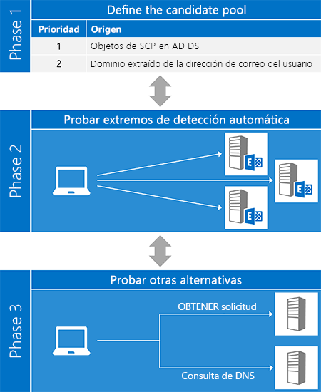
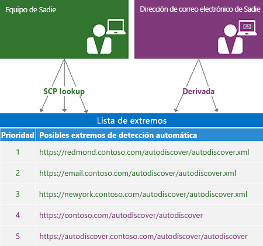
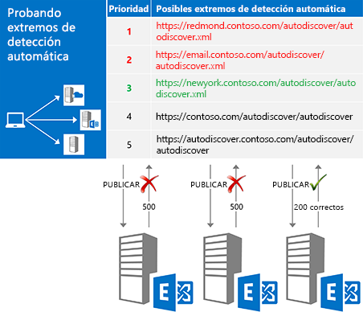
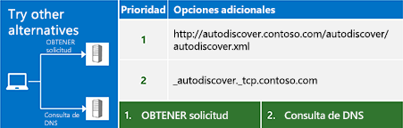

# Detección automática de Exchange

Este documento puede incluir contenido relacionado con funciones o productos preliminares que pueden cambiar mucho antes del lanzamiento comercial final. Este documento se proporciona "tal cual" solamente con fines informativos y Microsoft no realiza ninguna garantía, explícita ni implícita, en el documento. Información sobre el servicio Detección automática de Exchange.
  
El servicio Detección automática de Exchange proporciona una manera sencilla para que la aplicación cliente se configure con una entrada de usuario mínima. La mayoría de los usuarios conocen su dirección de correo electrónico y su contraseña, y con estos dos fragmentos de información, puede recuperar el resto de detalles que necesita para empezar a trabajar. Para los clientes de los servicio Web Exchange (EWS), la Detección automática se usa normalmente para buscar la dirección URL del extremo EWS, pero la Detección automática también puede proporcionar información para configurar los clientes que usan otros protocolos. La Detección automática funciona para las aplicaciones cliente dentro o fuera de los firewall y funcionará en el bosque de recursos y en varios escenarios de bosques.
  
## Información general del proceso Detección automática

Básicamente, el proceso Detección automática tiene tres fases. En la primera fase, se genera una lista de servidores de Detección automática posibles y, en la segunda fase, se prueba cada servidor de la lista hasta que se obtiene una respuesta correcta. Si ninguno de los candidatos funciona, pasa a la fase tres, que representa una intento "última zanja" de buscar un extremo de Detección automática.
  
El método [ExchangeService.AutodiscoverUrl](http://msdn.microsoft.com/en-us/library/microsoft.exchange.webservices.data.exchangeservice.autodiscoverurl%28v=exchg.80%29.aspx) de la API administrada EWS implementa las tres fases de este proceso por lo que, si usa la API administrada EWS, no tiene que preocuparse de implementar la Detección automática. La siguiente figura muestra las tres fases del proceso Detección automática. 
  
**Figura 1. Las tres fases del proceso Detección automática**

  
### Fase 1: Definir el grupo de candidatos

Antes de poder usar Detección automática, tiene que buscar el servidor Detección automática adecuado para el usuario. Afortunadamente, Detección automática define un número limitado de sitios para consultar. En el caso de que se encuentren varios candidatos, Detección automática también define [un modo de generar y dar prioridad a la lista](how-to-generate-a-list-of-autodiscover-endpoints.md).
  
**La tabla 1: Orígenes de candidato del extremo Detección automática**

|**Lugar para buscar**|**Lo que puede encontrar**|
|:-----|:-----|
|Servicios de dominio de Active Directory (AD DS)    |Para los clientes combinados por un dominio, este es el primer lugar para buscar. Exchange publica objetos de punto de conexión de servicio (SCP) en AD DS, lo que permite que las solicitudes de Detección automática se enruten a los servidores basados en sitios de Active Directory. Los resultados de una [búsqueda SCP](how-to-find-autodiscover-endpoints-by-using-scp-lookup-in-exchange.md) deben estar en la parte superior de la lista de candidatos.    **Nota**: búsqueda de SCP no está disponible para los clientes que no están unidos a un dominio o que no tienen acceso a los servidores de Active Directory. En este caso, debe omitir la búsqueda de SCP.  |
|El dominio de la dirección de correo electrónico del usuario    | La Detección automática define dos formularios de dirección URL de extremo estándar que se derivan de la parte del dominio de la dirección de correo electrónico del usuario:   `"https://" + domain + "/autodiscover/autodiscover" +  *fileExtension*`   `"https://autodiscover." + domain + "/autodiscover/autodiscover" +  *fileExtension*`    El valor de  *fileExtension*  depende del método de acceso a Detección automática que use, [SOAP](http://msdn.microsoft.com/library/61c21ea9-7fea-4f56-8ada-bf80e1e6b074%28Office.15%29.aspx) o [POX](http://msdn.microsoft.com/library/877152f0-f4b1-4f63-b2ce-924f4bdf2d20%28Office.15%29.aspx). El servicio SOAP usa una extensión de archivo ".svc"; POX usa ".xml".    |
   
La siguiente figura muestra cómo generar una lista de extremos de Detección automática.
  
**Figura 2. Proceso para generar una lista de extremos de Detección automática**

  
### Fase 2: Probar cada candidato

Después de generar una lista ordenada de candidatos posibles, el siguiente paso es probar cada uno de ellos en la lista [enviando una solicitud a la dirección URL ](how-to-get-user-settings-from-exchange-by-using-autodiscover.md) y validando los resultados, como se muestra en la figura 3. Cuando obtenga una respuesta correcta, habrá acabado. 
  
**Figura 3. Probar cada candidato de extremo en orden**

  
Antes de enviar una solicitud a un candidato, asegúrese de que es de confianza. Recuerde que va a enviar las credenciales del usuario, por lo que es importante asegurarse de que solo las comparte con un servidor de confianza. Como mínimo, debe comprobar:
  
- Que el extremo es un extremo HTTPS. Las aplicaciones cliente no deben autenticar o enviar datos a un extremo que no sea SSL.
    
- Que el certificado SSL presentado por el servidor es válido y de una entidad de confianza.
    
> [!NOTE]
> [!NOTA] Estas son sugerencias de seguridad básicas. Siempre que se trabaje con la autenticación, asegúrese de que el código cumple con los requisitos de seguridad de la organización. 
  
El tipo de solicitud que envíe depende de cómo accede al servicio Detección automática.
  
**Tabla 2. Tipos de solicitudes de Detección automática**

|**Si usa...**|**Enviar una solicitud con...**|
|:-----|:-----|
|La API administrada EWS    |El método [GetUserSettings ](http://msdn.microsoft.com/en-us/library/microsoft.exchange.webservices.autodiscover.autodiscoverservice.getusersettings%28v=exchg.80%29.aspx).    |
|El servicio Detección automática de SOAP    |La operación [GetUserSettings ](http://msdn.microsoft.com/library/758d965c-ef63-4de4-9120-e293abf14ff8%28Office.15%29.aspx).    |
|El servicio Detección automática de POX    |Un HTTP POST con un [cuerpo de solicitud de Detección automática](http://msdn.microsoft.com/library/75671b1d-f35b-497b-8d8c-706f3f2535fd%28Office.15%29.aspx).    |
   
### Fase 3: Probar otras alternativas

En algunos casos puede probar todos los extremos de la lista solo para ver que todas devuelven un error. Antes lanzar la toalla, puede probar un par de cosas más: puede enviar una solicitud GET no autenticada o consultar DNS para obtener un registro SRV. Si estos intentos tampoco producen resultados, no puede ponerse en contacto con el servicio Detección automática.
  
**Figura 4. Probar otras alternativas**

  
#### Enviar una solicitud GET no autenticada

Lo primero que debe probar es enviar una solicitud GET no autenticada a un extremo derivado de la dirección de correo electrónico del usuario. El formato de ese extremo es "http://autodiscover." + dominio + "/ Autodiscover.XML". Tenga en cuenta que NO es un extremo SSL. Si el servidor devuelve una respuesta de redireccionamiento 302, puede intentar volver a [enviar la solicitud de Detección automática](handling-autodiscover-error-messages.md#bk_ResendRequest) a la dirección URL de extremo en el encabezado Ubicación de la respuesta. 
  
#### Consultar DNS para un registro SRV

Si la solicitud GET no autenticada no funciona, lo último que hay que probar es una consulta DNS para los registros SRV para el servicio Detección automática. El registro tendrá el formato "_autodiscover._tcp." + el dominio. Esta consulta puede devolver varios registros, pero solo debe usar los registros que apuntan a un extremo SSL y que tienen la prioridad y el peso más altos.
  
## Opciones para us la Detección automática

Puede acceder a Detección automática con el servicio web POX o SOAP. El método que use depende de los requisitos y del entorno. Sin embargo, recomendamos usar el servicio web SOAP, si es posible. La API administrada EWS también es una opción. Implementa la parte de cliente de los servicios Detección automática de POX y SOAP.
  
**Tabla 3: Opciones para acceder a Detección automática**

|**Opción**|**Ventajas**|**Inconvenientes**|
|:-----|:-----|:-----|
|[API administrada EWS](get-started-with-ews-managed-api-client-applications.md)   | Implementa el proceso Detección automática.  Usa los servicios Detección automática de POX y SOAP.  Funciona con Exchange Online, Exchange Online como parte de Office 365 o una versión de Exchange a partir de Exchange 2007 SP1.  Fácil de usar.    | Limitado a la configuración de usuario disponible en la enumeración [Microsoft.Exchange.WebServices.Autodiscover.UserSettingName ](http://msdn.microsoft.com/en-us/library/microsoft.exchange.webservices.autodiscover.usersettingname%28v=EXCHG.80%29.aspx).  Solo está disponible para las aplicaciones de .NET Framework.    |
|[Detección automática de SOAP](http://msdn.microsoft.com/library/61c21ea9-7fea-4f56-8ada-bf80e1e6b074%28Office.15%29.aspx)   | Independiente de la plataforma.  Permite solicitar solo la configuración que le interesa.    | No está disponible en Exchange 2007.    |
|[Detección automática de POX ](http://msdn.microsoft.com/library/877152f0-f4b1-4f63-b2ce-924f4bdf2d20%28Office.15%29.aspx)   | Independiente de la plataforma.  Compatible en Exchange Online y todas las versiones de Exchange a partir de Exchange 2007 SP1.    | No permite solicitar una configuración específica.    |
   
## En esta sección

- [Busque los extremos de detección automática mediante el uso de búsqueda de SCP en Exchange](how-to-find-autodiscover-endpoints-by-using-scp-lookup-in-exchange.md)
    
- [Generar una lista de extremos de detección automática](how-to-generate-a-list-of-autodiscover-endpoints.md)
    
- [Usar detección automática para buscar puntos de conexión](how-to-use-autodiscover-to-find-connection-points.md)
    
- [Obtener la configuración de usuario de Exchange mediante el uso de detección automática](how-to-get-user-settings-from-exchange-by-using-autodiscover.md)
    
- [Obtener la configuración de dominio de un servidor de Exchange](how-to-get-domain-settings-from-an-exchange-server.md)
    
- [Actualizar información de configuración mediante el uso de detección automática](how-to-refresh-configuration-information-by-using-autodiscover.md)
    
- [Administrar los mensajes de error de detección automática](handling-autodiscover-error-messages.md)
    
- [Mejorar el rendimiento cuando se utiliza la detección automática de Exchange](improving-performance-when-using-autodiscover-for-exchange.md)
    
## Vea también

- [Empezar a utilizar servicios web de Exchange](start-using-web-services-in-exchange.md)    
- [Exchange 2013: Obtener la configuración de usuario con Detección automática ](http://code.msdn.microsoft.com/Exchange-2013-Get-user-7e22c86e)
- [Ejemplo de Comprobador de Detección automática](http://code.msdn.microsoft.com/exchange/Autodiscover-Checker-e1ebca42)  
- [Desarrollo de clientes de servicios web de Exchange](develop-web-service-clients-for-exchange.md)
    

