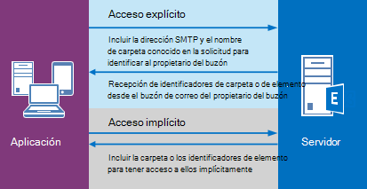

# <a name="delegate-access-and-ews-in-exchange"></a><span data-ttu-id="7e361-103">Acceso delegado y EWS en Exchange</span><span class="sxs-lookup"><span data-stu-id="7e361-103">Delegate access and EWS in Exchange</span></span>

<span data-ttu-id="7e361-104">Descubra cómo usar la API administrada de EWS y EWS en Exchange para proporcionar acceso de delegado a los buzones de los usuarios.</span><span class="sxs-lookup"><span data-stu-id="7e361-104">Find out how to use the EWS Managed API and EWS in Exchange to provide delegate access to users' mailboxes.</span></span>
  
<span data-ttu-id="7e361-105">Puede habilitar a los usuarios para que tengan acceso a los buzones de otros usuarios de una de estas tres maneras:</span><span class="sxs-lookup"><span data-stu-id="7e361-105">You can enable users to access other users' mailboxes in one of three ways:</span></span> 
  
- <span data-ttu-id="7e361-106">Mediante la adición de delegados y la especificación de permisos para cada delegado.</span><span class="sxs-lookup"><span data-stu-id="7e361-106">By adding delegates and specifying permissions for each delegate.</span></span>
    
- <span data-ttu-id="7e361-107">Modificando los permisos de carpeta directamente.</span><span class="sxs-lookup"><span data-stu-id="7e361-107">By modifying folder permissions directly.</span></span>
    
- <span data-ttu-id="7e361-108">Mediante la suplantación.</span><span class="sxs-lookup"><span data-stu-id="7e361-108">By using impersonation.</span></span>
    
<span data-ttu-id="7e361-109">La delegación y los permisos de carpeta son los mejores cuando solo concede acceso a algunos usuarios, porque tiene que agregar permisos individualmente a cada buzón.</span><span class="sxs-lookup"><span data-stu-id="7e361-109">Delegation and folder permissions are best when you're only granting access to a few users, because you have to add permissions individually to each mailbox.</span></span> <span data-ttu-id="7e361-110">La suplantación es la mejor opción cuando se trabaja con cantidades de buzones de correo, ya que es posible habilitar fácilmente una cuenta de servicio para el acceso a todos los buzones de una base de datos.</span><span class="sxs-lookup"><span data-stu-id="7e361-110">Impersonation is the best choice when you're dealing with quantities of mailboxes, because you can easily enable one service account to access every mailbox in a database.</span></span> <span data-ttu-id="7e361-111">La figura 1 muestra algunas de las diferencias entre cada tipo de acceso.</span><span class="sxs-lookup"><span data-stu-id="7e361-111">Figure 1 shows some of the differences between each type of access.</span></span>
  
<span data-ttu-id="7e361-112">**Figura 1. Formas de tener acceso a los buzones de otros usuarios**</span><span class="sxs-lookup"><span data-stu-id="7e361-112">**Figure 1. Ways to access other users' mailboxes**</span></span>


  
<span data-ttu-id="7e361-116">Cuando se trata de enviar reuniones de correo o de programación, se puede proporcionar a los delegados los permisos "enviar en nombre de", por lo que el destinatario de un correo electrónico o una convocatoria de reunión enviada por un delegado verá " *delegar* en nombre de *buzón propietario* " cuando reciban el correo electrónico o la solicitud de reunión en Outlook.</span><span class="sxs-lookup"><span data-stu-id="7e361-116">When it comes to sending mail or scheduling meetings, delegates can be given "send on behalf of" permissions, so the recipient of an email or a meeting request that was sent by a delegate will see " *delegate*  on behalf of  *mailbox owner*  " when they receive the email or meeting request in Outlook.</span></span> <span data-ttu-id="7e361-117">Incluir el texto "enviar en nombre de" es un detalle de la implementación del cliente y se puede crear mediante los valores "desde" y "remitente".</span><span class="sxs-lookup"><span data-stu-id="7e361-117">Including the "send on behalf of" text is a client implementation detail - and can be created by using the "from" and "sender" values.</span></span> <span data-ttu-id="7e361-118">El valor "de" indica el propietario del buzón y el valor "Sender" indica el delegado que envió el correo.</span><span class="sxs-lookup"><span data-stu-id="7e361-118">The "from" value indicates the mailbox owner, and the "sender" value indicates the delegate that sent the mail.</span></span> <span data-ttu-id="7e361-119">Si una cuenta de servicio que suplanta a un usuario envía un correo electrónico o programa una reunión para el propietario del buzón, el mensaje se "envía como" el propietario del buzón.</span><span class="sxs-lookup"><span data-stu-id="7e361-119">If a service account impersonating a user sends an email or schedules a meeting for the mailbox owner, the message is "sent as" the mailbox owner.</span></span> <span data-ttu-id="7e361-120">No hay forma de que el destinatario sepa que el correo se envió mediante la cuenta de servicio.</span><span class="sxs-lookup"><span data-stu-id="7e361-120">There is no way for the recipient to know the mail was sent by the service account.</span></span> <span data-ttu-id="7e361-121">Los usuarios a los que se conceden permisos de carpeta y no acceso delegado no pueden "enviar como" ni "enviar en nombre de" de un propietario de buzón.</span><span class="sxs-lookup"><span data-stu-id="7e361-121">Users who are granted folder permissions and not delegate access are not able to "send as" or "send on behalf of" of a mailbox owner.</span></span> <span data-ttu-id="7e361-122">Tienen acceso a las carpetas del buzón y pueden crear elementos en las carpetas, pero no pueden enviar los elementos.</span><span class="sxs-lookup"><span data-stu-id="7e361-122">They have access to the mailbox folders, and might be able to create items in the folders, but they cannot send the items.</span></span> 
  
<span data-ttu-id="7e361-123">¿Cuándo es apropiado modificar los permisos de carpeta directamente?</span><span class="sxs-lookup"><span data-stu-id="7e361-123">When is it appropriate to modify folder permissions directly?</span></span> <span data-ttu-id="7e361-124">Por lo general, cuando desea proporcionar a un usuario acceso a una carpeta, pero no desea conceder al usuario los permisos "enviar en nombre de", cuando sus requisitos de permisos no se asignan a los valores de enumeración de la API administrada de EWS de [DelegateFolderPermissionLevel](https://msdn.microsoft.com/library/microsoft.exchange.webservices.data.delegatefolderpermissionlevel%28v=exchg.80%29.aspx) o a los valores de los elementos EWS [PermissionLevel](https://msdn.microsoft.com/library/87978600-3523-451e-a725-ef092c543e2a%28Office.15%29.aspx) o cuando desea proporcionar a un usuario acceso a una sola carpeta personalizada.</span><span class="sxs-lookup"><span data-stu-id="7e361-124">Generally, when you want to provide a user access to a folder, but do not want to grant the user "send on behalf of" permissions, when your permissions requirements do not map to the [DelegateFolderPermissionLevel](https://msdn.microsoft.com/library/microsoft.exchange.webservices.data.delegatefolderpermissionlevel%28v=exchg.80%29.aspx) EWS Managed API enumeration values or the [PermissionLevel](https://msdn.microsoft.com/library/87978600-3523-451e-a725-ef092c543e2a%28Office.15%29.aspx) EWS element values, or when you want to provide a user access to a single custom folder.</span></span> 
  
<span data-ttu-id="7e361-125">Si solo necesita modificar los permisos de carpeta para lograr su objetivo y no necesita agregar un delegado (es decir, no necesita "enviar en nombre de"), vea [establecer permisos de carpeta para otro usuario mediante EWS en Exchange](how-to-set-folder-permissions-for-another-user-by-using-ews-in-exchange.md).</span><span class="sxs-lookup"><span data-stu-id="7e361-125">If you only need to modify folder permissions to achieve your goal, and do not need to add a delegate (that is, you don't need "send on behalf of" permissions), see [Set folder permissions for another user by using EWS in Exchange](how-to-set-folder-permissions-for-another-user-by-using-ews-in-exchange.md).</span></span> 

<span data-ttu-id="7e361-126">Tenga en cuenta que también puede usar [Outlook](https://office.microsoft.com/outlook-help/allow-someone-else-to-manage-your-mail-and-calendar-HA102749417.aspx) o [Exchange Server PowerShell (Shell de administración de Exchange)](https://docs.microsoft.com/powershell/exchange/exchange-server/exchange-management-shell?view=exchange-ps) para configurar el acceso delegado.</span><span class="sxs-lookup"><span data-stu-id="7e361-126">Note that you can also use [Outlook](https://office.microsoft.com/outlook-help/allow-someone-else-to-manage-your-mail-and-calendar-HA102749417.aspx) or the [Exchange Server PowerShell (Exchange Management Shell)](https://docs.microsoft.com/powershell/exchange/exchange-server/exchange-management-shell?view=exchange-ps) to set up delegate access.</span></span> 

  
## <a name="how-does-delegate-access-work"></a><span data-ttu-id="7e361-127">¿Cómo funciona el acceso delegado?</span><span class="sxs-lookup"><span data-stu-id="7e361-127">How does delegate access work?</span></span>

<span data-ttu-id="7e361-128">Acceso delegado permite a los usuarios acceder a algunas o a todas las carpetas del propietario del buzón y actuar en nombre del propietario del buzón.</span><span class="sxs-lookup"><span data-stu-id="7e361-128">Delegate access enables users to access some or all of the mailbox owner's folders and act on behalf of the mailbox owner.</span></span> <span data-ttu-id="7e361-129">El propietario del buzón puede ser un usuario o un recurso, como una sala de conferencias.</span><span class="sxs-lookup"><span data-stu-id="7e361-129">The mailbox owner can be a user, or a resource, like a conference room.</span></span> <span data-ttu-id="7e361-130">Por ejemplo, un recepcionista puede tener permisos de delegado en la carpeta Calendario de una sala de conferencias para controlar las solicitudes de reserva.</span><span class="sxs-lookup"><span data-stu-id="7e361-130">For example, a receptionist can be granted delegate permissions to a conference room's calendar folder, to handle booking requests.</span></span> <span data-ttu-id="7e361-131">Puede usar la API administrada de EWS o EWS para habilitar al propietario del buzón o a un administrador para que agregue un delegado, especifique a qué carpetas puede tener acceso el delegado y, a continuación, especifique los permisos para esa carpeta.</span><span class="sxs-lookup"><span data-stu-id="7e361-131">You can use the EWS Managed API or EWS to enable the mailbox owner or an administrator to add a delegate, specify what folders the delegate can access, and then specify permissions for that folder.</span></span> <span data-ttu-id="7e361-132">Se puede conceder acceso a los delegados a las siguientes carpetas:</span><span class="sxs-lookup"><span data-stu-id="7e361-132">Delegates can be granted access to the following folders:</span></span> 
  
- <span data-ttu-id="7e361-133">Calendario</span><span class="sxs-lookup"><span data-stu-id="7e361-133">Calendar</span></span>
    
- <span data-ttu-id="7e361-134">Tareas</span><span class="sxs-lookup"><span data-stu-id="7e361-134">Tasks</span></span>
    
- <span data-ttu-id="7e361-135">Bandeja de entrada</span><span class="sxs-lookup"><span data-stu-id="7e361-135">Inbox</span></span>
    
- <span data-ttu-id="7e361-136">Contactos</span><span class="sxs-lookup"><span data-stu-id="7e361-136">Contacts</span></span>
    
- <span data-ttu-id="7e361-137">Notas</span><span class="sxs-lookup"><span data-stu-id="7e361-137">Notes</span></span>
    
- <span data-ttu-id="7e361-138">Diario</span><span class="sxs-lookup"><span data-stu-id="7e361-138">Journal</span></span>
    
<span data-ttu-id="7e361-139">Cuando un usuario tiene acceso delegado a una o varias de estas carpetas, puede crear, obtener, actualizar, eliminar, copiar y buscar elementos en esa carpeta y en cualquier carpeta secundaria, según los [permisos](#bk_delegateperms) establecidos en la carpeta.</span><span class="sxs-lookup"><span data-stu-id="7e361-139">When a user has delegate access to one or more of these folders, they can create, get, update, delete, copy, and search for items in that folder and any child folders, depending on the [permissions](#bk_delegateperms) set on the folder.</span></span> <span data-ttu-id="7e361-140">La forma en que la aplicación realiza estas acciones depende de si se requiere acceso [explícito](#bk_explicit) o [implícito](#bk_implicit) .</span><span class="sxs-lookup"><span data-stu-id="7e361-140">The way in which the application performs these actions depends on whether [explicit](#bk_explicit) or [implicit](#bk_implicit) access is required.</span></span> 
  
## <a name="delegate-permissions"></a><span data-ttu-id="7e361-141">Delegar permisos</span><span class="sxs-lookup"><span data-stu-id="7e361-141">Delegate permissions</span></span>
<span data-ttu-id="7e361-142"><a name="bk_delegateperms"> </a></span><span class="sxs-lookup"><span data-stu-id="7e361-142"><a name="bk_delegateperms"> </a></span></span>

<span data-ttu-id="7e361-143">Cuando un administrador o el propietario del buzón agrega un delegado a un buzón de correo, también puede establecer el nivel de permisos para una o más carpetas.</span><span class="sxs-lookup"><span data-stu-id="7e361-143">When an administrator or mailbox owner adds a delegate to a mailbox, they can also set the permission level for one or more folders.</span></span> <span data-ttu-id="7e361-144">Si no se establece un nivel de permisos para una carpeta, el valor de permiso predeterminado es None.</span><span class="sxs-lookup"><span data-stu-id="7e361-144">If a permission level is not set for a folder, the permission value defaults to None.</span></span> <span data-ttu-id="7e361-145">Varios usuarios pueden tener el mismo nivel de permisos en una carpeta y los usuarios pueden tener distintos niveles de permisos para distintas carpetas.</span><span class="sxs-lookup"><span data-stu-id="7e361-145">Multiple users can have the same permission level on a folder, and users can have different permission levels for different folders.</span></span> <span data-ttu-id="7e361-146">Si está usando la API administrada de EWS, use la propiedad [DelegateUser. Permissions](https://msdn.microsoft.com/library/microsoft.exchange.webservices.data.delegateuser.permissions%28v=exchg.80%29.aspx) , que contiene uno de los valores de enumeración [DelegateFolderPermissionLevel](https://msdn.microsoft.com/library/microsoft.exchange.webservices.data.delegatefolderpermissionlevel%28v=exchg.80%29.aspx) para cada carpeta, para establecer permisos de delegado en las carpetas.</span><span class="sxs-lookup"><span data-stu-id="7e361-146">If you're using the EWS Managed API, you use the [DelegateUser.Permissions](https://msdn.microsoft.com/library/microsoft.exchange.webservices.data.delegateuser.permissions%28v=exchg.80%29.aspx) property, which contains one of the [DelegateFolderPermissionLevel](https://msdn.microsoft.com/library/microsoft.exchange.webservices.data.delegatefolderpermissionlevel%28v=exchg.80%29.aspx) enumeration values for each folder, to set delegate permissions on folders.</span></span> <span data-ttu-id="7e361-147">Si está usando EWS, use el elemento [DelegatePermissions](https://msdn.microsoft.com/library/292badc7-bab3-4368-9d7c-9a8b7edb279b%28Office.15%29.aspx) para establecer permisos de delegado y el elemento [PermissionLevel](https://msdn.microsoft.com/library/87978600-3523-451e-a725-ef092c543e2a%28Office.15%29.aspx) para definir el nivel de permisos.</span><span class="sxs-lookup"><span data-stu-id="7e361-147">If you're using EWS, you use the [DelegatePermissions](https://msdn.microsoft.com/library/292badc7-bab3-4368-9d7c-9a8b7edb279b%28Office.15%29.aspx) element to set delegate permissions, and the [PermissionLevel](https://msdn.microsoft.com/library/87978600-3523-451e-a725-ef092c543e2a%28Office.15%29.aspx) element to define the permission level.</span></span> 
  
<span data-ttu-id="7e361-148">**Tabla 2. Delegación de niveles de permisos**</span><span class="sxs-lookup"><span data-stu-id="7e361-148">**Table 2. Delegate permission levels**</span></span>

|<span data-ttu-id="7e361-149">**Nivel de permisos**</span><span class="sxs-lookup"><span data-stu-id="7e361-149">**Permission level**</span></span>|<span data-ttu-id="7e361-150">**Descripción**</span><span class="sxs-lookup"><span data-stu-id="7e361-150">**Description**</span></span>|
|:-----|:-----|
|<span data-ttu-id="7e361-151">Ninguno</span><span class="sxs-lookup"><span data-stu-id="7e361-151">None</span></span>  <br/> |<span data-ttu-id="7e361-152">Este es el valor predeterminado de todas las carpetas.</span><span class="sxs-lookup"><span data-stu-id="7e361-152">This is the default value for all folders.</span></span>  <br/> |
|<span data-ttu-id="7e361-153">Autor</span><span class="sxs-lookup"><span data-stu-id="7e361-153">Author</span></span>  <br/> |<span data-ttu-id="7e361-154">Un delegado puede leer y crear elementos, y modificar y eliminar los elementos que crean.</span><span class="sxs-lookup"><span data-stu-id="7e361-154">A delegate can read and create items, and modify and delete items they create.</span></span> <span data-ttu-id="7e361-155">Por ejemplo, un delegado puede crear solicitudes de tareas y convocatorias de reunión directamente en la carpeta de calendario o de tareas del propietario del buzón y, a continuación, enviar cualquier elemento en nombre del propietario del buzón.</span><span class="sxs-lookup"><span data-stu-id="7e361-155">For example, a delegate can create task requests and meeting requests directly in the mailbox owner's Task or Calendar folder, and then send either item on the mailbox owner's behalf.</span></span>  <br/> |
|<span data-ttu-id="7e361-156">Editor</span><span class="sxs-lookup"><span data-stu-id="7e361-156">Editor</span></span>  <br/> |<span data-ttu-id="7e361-157">Un delegado puede hacer todo lo que puede hacer un autor, además de modificar y eliminar los elementos creados por el propietario del buzón.</span><span class="sxs-lookup"><span data-stu-id="7e361-157">A delegate can do everything an Author can do, and also modify and delete the items the mailbox owner created.</span></span>  <br/> |
|<span data-ttu-id="7e361-158">Reviewer</span><span class="sxs-lookup"><span data-stu-id="7e361-158">Reviewer</span></span>  <br/> |<span data-ttu-id="7e361-159">Un delegado puede leer elementos; por ejemplo, un delegado con el permiso de revisor puede leer los mensajes de la bandeja de entrada de otra persona.</span><span class="sxs-lookup"><span data-stu-id="7e361-159">A delegate can read items; for example a delegate with Reviewer permission can read messages in another person's Inbox.</span></span>  <br/> |
|<span data-ttu-id="7e361-160">Personalizado</span><span class="sxs-lookup"><span data-stu-id="7e361-160">Custom</span></span>  <br/> |<span data-ttu-id="7e361-161">El propietario del buzón ha concedido un conjunto personalizado de permisos para el delegado.</span><span class="sxs-lookup"><span data-stu-id="7e361-161">The mailbox owner has granted a custom set of permissions to the delegate.</span></span>  <br/> |
   
<span data-ttu-id="7e361-162">La propiedad de la API administrada de EWS [DelgateUser. ViewPrivateItems](https://msdn.microsoft.com/library/microsoft.exchange.webservices.data.delegateuser.viewprivateitems%28v=exchg.80%29.aspx) y el elemento de EWS [ViewPrivateItems](https://msdn.microsoft.com/library/80b949ac-440c-4a01-b428-ebafb5b1b802%28Office.15%29.aspx) es una configuración global que afecta a todas las carpetas del propietario del buzón, incluidas todas las carpetas correo, contactos, calendario, tareas, notas y diario.</span><span class="sxs-lookup"><span data-stu-id="7e361-162">The [DelgateUser.ViewPrivateItems](https://msdn.microsoft.com/library/microsoft.exchange.webservices.data.delegateuser.viewprivateitems%28v=exchg.80%29.aspx) EWS Managed API property and the [ViewPrivateItems](https://msdn.microsoft.com/library/80b949ac-440c-4a01-b428-ebafb5b1b802%28Office.15%29.aspx) EWS element is a global setting that affects all the mailbox owner's folders, including all Mail, Contacts, Calendar, Tasks, Notes, and Journal folders.</span></span> <span data-ttu-id="7e361-163">No se puede permitir el acceso a elementos privados en una sola carpeta.</span><span class="sxs-lookup"><span data-stu-id="7e361-163">You cannot allow access to private items in only one folder.</span></span> 
  
## <a name="explicit-access"></a><span data-ttu-id="7e361-164">Acceso explícito</span><span class="sxs-lookup"><span data-stu-id="7e361-164">Explicit access</span></span>
<span data-ttu-id="7e361-165"><a name="bk_explicit"> </a></span><span class="sxs-lookup"><span data-stu-id="7e361-165"><a name="bk_explicit"> </a></span></span>

<span data-ttu-id="7e361-166">En pocas palabras, el acceso explícito es la forma en que los delegados realizan acciones en los elementos o carpetas de un propietario del buzón.</span><span class="sxs-lookup"><span data-stu-id="7e361-166">Simply put, explicit access is the entry way for delegates to perform actions on a mailbox owner's folders or items.</span></span> <span data-ttu-id="7e361-167">El acceso explícito se concede a un delegado cuando incluye el nombre de carpeta conocido para la carpeta de un propietario del buzón junto con la dirección SMTP del propietario del buzón de correo en una solicitud al servidor.</span><span class="sxs-lookup"><span data-stu-id="7e361-167">Explicit access is granted to a delegate when they include the well-known folder name for a mailbox owner's folder along with the mailbox owner's SMTP address in a request to the server.</span></span> <span data-ttu-id="7e361-168">El acceso es explícito porque la solicitud del delegado indica explícitamente que el contexto para el método o la operación es el buzón de correo del propietario del buzón y no el buzón de correo del delegado.</span><span class="sxs-lookup"><span data-stu-id="7e361-168">The access is explicit because the delegate's request explicitly states that the context for the method or operation is the mailbox owner's mailbox, and not the delegate's mailbox.</span></span>
  
<span data-ttu-id="7e361-169">Acceso explícito define el contexto para todos los métodos u operaciones que se realizan en las carpetas o elementos que se mueven hacia delante.</span><span class="sxs-lookup"><span data-stu-id="7e361-169">Explicit access defines the context for all methods or operations performed on the folders or items moving forward.</span></span> <span data-ttu-id="7e361-170">Todos los identificadores de elemento y carpeta que se devuelven cuando se establece el acceso explícito se identifican de manera única como pertenecientes al propietario del buzón (aunque no en ningún formato legible para el ojo humano).</span><span class="sxs-lookup"><span data-stu-id="7e361-170">All item and folder IDs returned when the explicit access is set uniquely identify themselves as belonging to the mailbox owner (although not in any human readable format).</span></span> <span data-ttu-id="7e361-171">De este modo, la aplicación no tiene que especificar la dirección SMTP del propietario del buzón de nuevo y de nuevo; el contexto se oculta en los identificadores.</span><span class="sxs-lookup"><span data-stu-id="7e361-171">This way, the application doesn't need to specify the mailbox owner's SMTP address again and again; the context is hidden in the identifiers.</span></span> <span data-ttu-id="7e361-172">Una vez identificado un elemento o carpeta, un delegado realmente usa el [acceso implícito](#bk_implicit) para modificar el elemento.</span><span class="sxs-lookup"><span data-stu-id="7e361-172">After an item or folder is identified, a delegate actually uses [implicit access](#bk_implicit) to modify the item.</span></span> <span data-ttu-id="7e361-173">La siguiente figura muestra el proceso de obtener acceso explícito e implícito.</span><span class="sxs-lookup"><span data-stu-id="7e361-173">The following figure shows the process of getting explicit and implicit access.</span></span> 
  
<span data-ttu-id="7e361-174">**Figura 2. Solicitar acceso explícito e implícito a un elemento o una carpeta**</span><span class="sxs-lookup"><span data-stu-id="7e361-174">**Figure 2. Requesting explicit and implicit access to an item or folder**</span></span>


  
<span data-ttu-id="7e361-176">Puede establecer el acceso explícito en muchos escenarios diferentes.</span><span class="sxs-lookup"><span data-stu-id="7e361-176">You can set explicit access in many different scenarios.</span></span> <span data-ttu-id="7e361-177">Básicamente, cada vez que envía un identificador de carpeta en un método u operación, puede establecer el acceso explícito.</span><span class="sxs-lookup"><span data-stu-id="7e361-177">Essentially, any time you're sending a folder ID in a method or operation, you can set explicit access.</span></span> <span data-ttu-id="7e361-178">Esto puede incluir buscar carpetas, buscar citas, obtener elementos, buscar conversaciones, etc.</span><span class="sxs-lookup"><span data-stu-id="7e361-178">This can include finding folders, finding appointments, getting items, finding conversations, and so on.</span></span>
  
### <a name="explicit-access-and-the-ews-managed-api"></a><span data-ttu-id="7e361-179">Acceso explícito y API administrada de EWS</span><span class="sxs-lookup"><span data-stu-id="7e361-179">Explicit access and the EWS Managed API</span></span>
<span data-ttu-id="7e361-180"><a name="bk_explicitewsma"> </a></span><span class="sxs-lookup"><span data-stu-id="7e361-180"><a name="bk_explicitewsma"> </a></span></span>

<span data-ttu-id="7e361-181">Puede iniciar el acceso delegado explícito mediante cualquiera de los siguientes métodos sobrecargados que toman un parámetro de entrada [FolderId](https://msdn.microsoft.com/library/microsoft.exchange.webservices.data.folderid%28v=exchg.80%29.aspx) para identificar la carpeta de destino:</span><span class="sxs-lookup"><span data-stu-id="7e361-181">You can initiate explicit delegate access by using any of the following overloaded methods that take a [FolderId](https://msdn.microsoft.com/library/microsoft.exchange.webservices.data.folderid%28v=exchg.80%29.aspx) input parameter to identify the target folder:</span></span> 
  
- [<span data-ttu-id="7e361-182">Folder. bind</span><span class="sxs-lookup"><span data-stu-id="7e361-182">Folder.Bind</span></span>](https://msdn.microsoft.com/library/microsoft.exchange.webservices.data.folder.bind%28v=exchg.80%29.aspx)
    
- [<span data-ttu-id="7e361-183">ExchangeService. FindItems</span><span class="sxs-lookup"><span data-stu-id="7e361-183">ExchangeService.FindItems</span></span>](https://msdn.microsoft.com/library/microsoft.exchange.webservices.data.exchangeservice.finditems%28v=exchg.80%29.aspx)
    
- [<span data-ttu-id="7e361-184">ExchangeService. FindAppointments</span><span class="sxs-lookup"><span data-stu-id="7e361-184">ExchangeService.FindAppointments</span></span>](https://msdn.microsoft.com/library/microsoft.exchange.webservices.data.exchangeservice.findappointments%28v=exchg.80%29.aspx)
    
- [<span data-ttu-id="7e361-185">ExchangeService. FindFolders</span><span class="sxs-lookup"><span data-stu-id="7e361-185">ExchangeService.FindFolders</span></span>](https://msdn.microsoft.com/library/microsoft.exchange.webservices.data.exchangeservice.findfolders%28v=exchg.80%29.aspx)
    
- <span data-ttu-id="7e361-186">Y mucho más.</span><span class="sxs-lookup"><span data-stu-id="7e361-186">And more!</span></span>
    
<span data-ttu-id="7e361-187">Puede usar el parámetro **FolderId** en cada uno de estos métodos para identificar la carpeta de destino del propietario del buzón, como se indica a continuación.</span><span class="sxs-lookup"><span data-stu-id="7e361-187">You can use the **FolderId** parameter in each of these methods to identify the mailbox owner's target folder, as follows.</span></span> 
  
```cs
new FolderId(WellKnownFolderName.Calendar, "primary@contoso.com");
```

<span data-ttu-id="7e361-188">Por ejemplo, para enlazar con la carpeta calendario, el **FolderId** en este método **BIND** especifica el nombre de carpeta conocido y la dirección SMTP del propietario del buzón.</span><span class="sxs-lookup"><span data-stu-id="7e361-188">For example, to bind to the Calendar folder, the **FolderId** in this **Bind** method specifies the well-known folder name, and the mailbox owner's SMTP address.</span></span> 
  
```cs
CalendarFolder calendar = CalendarFolder.Bind(service, new FolderId(WellKnownFolderName.Calendar, "primary@contoso.com"), new PropertySet());
```

<span data-ttu-id="7e361-189">Al especificar el nombre de carpeta conocido y la dirección SMTP, el delegado puede enlazarse a la carpeta de calendario del propietario del buzón de correo, con lo que se obtiene acceso explícito a la carpeta.</span><span class="sxs-lookup"><span data-stu-id="7e361-189">By specifying the well-known folder name and the SMTP address, the delegate can bind to the mailbox owner's Calendar folder — thereby gaining explicit access to the folder.</span></span> <span data-ttu-id="7e361-190">Todas las solicitudes posteriores para el [acceso implícito](#bk_implicit) a los elementos de la carpeta se basan en el contexto devuelto en los identificadores de elemento y los identificadores de carpeta.</span><span class="sxs-lookup"><span data-stu-id="7e361-190">All subsequent requests for [implicit access](#bk_implicit) to items in the folder then rely on the context returned in the item IDs and folder IDs.</span></span> <span data-ttu-id="7e361-191">Básicamente, los identificadores contienen el contexto de las llamadas de acceso delegado implícitas.</span><span class="sxs-lookup"><span data-stu-id="7e361-191">Essentially, the identifiers contain the context for the implied delegate access calls.</span></span> <span data-ttu-id="7e361-192">O bien, para recuperar el identificador de elemento de un elemento que cumpla los criterios especificados, use lo siguiente.</span><span class="sxs-lookup"><span data-stu-id="7e361-192">Or, to retrieve the item ID of an item that meets specific criteria, use the following.</span></span> 
  
```cs
FindItemsResults<Item> results = service.FindItems(new FolderId(WellKnownFolderName.Calendar, "primary@contoso.com"), filter, view);
```

<span data-ttu-id="7e361-193">En este caso, se devuelve el identificador de elemento y, a continuación, el delegado puede usar el acceso implícito para realizar cambios en el elemento mediante el identificador de elemento.</span><span class="sxs-lookup"><span data-stu-id="7e361-193">In this case the item ID is returned, and then the delegate can then use implicit access to make changes to the item by using the item ID.</span></span>
  
<span data-ttu-id="7e361-194">No es necesario iniciar de nuevo el acceso explícito hasta que se requiera un identificador de elemento o un identificador de carpeta al que no se haya tenido acceso a través del acceso explícito existente.</span><span class="sxs-lookup"><span data-stu-id="7e361-194">You don't have to initiate explicit access again until you require an item ID or a folder ID that you didn't access via the existing explicit access.</span></span> 
  
### <a name="explicit-access-and-ews"></a><span data-ttu-id="7e361-195">Acceso explícito y EWS</span><span class="sxs-lookup"><span data-stu-id="7e361-195">Explicit access and EWS</span></span>
<span data-ttu-id="7e361-196"><a name="bk_explicitewsma"> </a></span><span class="sxs-lookup"><span data-stu-id="7e361-196"><a name="bk_explicitewsma"> </a></span></span>

<span data-ttu-id="7e361-197">Puede iniciar acceso explícito mediante las operaciones [GetFolder](https://msdn.microsoft.com/library/355bcf93-dc71-4493-b177-622afac5fdb9%28Office.15%29.aspx), [FindItem](https://msdn.microsoft.com/library/ebad6aae-16e7-44de-ae63-a95b24539729%28Office.15%29.aspx)o [FindFolder](https://msdn.microsoft.com/library/7a9855aa-06cc-45ba-ad2a-645c15b7d031%28Office.15%29.aspx) .</span><span class="sxs-lookup"><span data-stu-id="7e361-197">You can initiate explicit access by using the [GetFolder](https://msdn.microsoft.com/library/355bcf93-dc71-4493-b177-622afac5fdb9%28Office.15%29.aspx), [FindItem](https://msdn.microsoft.com/library/ebad6aae-16e7-44de-ae63-a95b24539729%28Office.15%29.aspx), or [FindFolder](https://msdn.microsoft.com/library/7a9855aa-06cc-45ba-ad2a-645c15b7d031%28Office.15%29.aspx) operations.</span></span> <span data-ttu-id="7e361-198">Estas operaciones proporcionan la opción de usar el elemento [DistinguishedFolderId](https://msdn.microsoft.com/library/50018162-2941-4227-8a5b-d6b4686bb32f%28Office.15%29.aspx) para identificar la carpeta de destino.</span><span class="sxs-lookup"><span data-stu-id="7e361-198">These operations provide the option to use the [DistinguishedFolderId](https://msdn.microsoft.com/library/50018162-2941-4227-8a5b-d6b4686bb32f%28Office.15%29.aspx) element to identify the target folder.</span></span> <span data-ttu-id="7e361-199">El elemento **DistinguishedFolderId** tiene un solo elemento secundario opcional, el elemento [Mailbox](https://msdn.microsoft.com/library/befc70fd-51cb-4258-884c-80c9050f0e82%28Office.15%29.aspx) .</span><span class="sxs-lookup"><span data-stu-id="7e361-199">The **DistinguishedFolderId** element has a single optional child element, the [Mailbox](https://msdn.microsoft.com/library/befc70fd-51cb-4258-884c-80c9050f0e82%28Office.15%29.aspx) element.</span></span> <span data-ttu-id="7e361-200">El elemento **Mailbox** , cuando se usa como elemento secundario del elemento **DistinguishedFolderId** , especifica el buzón de correo al que tiene acceso el delegado.</span><span class="sxs-lookup"><span data-stu-id="7e361-200">The **Mailbox** element, when used as a child of the **DistinguishedFolderId** element, specifies the mailbox for the delegate to access.</span></span> <span data-ttu-id="7e361-201">Si el usuario que llama tiene permiso para obtener acceso a la carpeta del propietario del buzón, la respuesta contendrá una colección de identificadores a los elementos o carpetas de ese buzón.</span><span class="sxs-lookup"><span data-stu-id="7e361-201">If the calling user has permission to access the mailbox owner's folder, the response will contain a collection of identifiers to items or folders in that mailbox.</span></span> <span data-ttu-id="7e361-202">Los identificadores de elemento y carpeta que se devuelven en la respuesta pueden usarse para el acceso de delegado implícito.</span><span class="sxs-lookup"><span data-stu-id="7e361-202">The item and folder identifiers that are returned in the response can be used for implicit delegate access.</span></span> 
  
## <a name="implicit-access"></a><span data-ttu-id="7e361-203">Acceso implícito</span><span class="sxs-lookup"><span data-stu-id="7e361-203">Implicit access</span></span>
<span data-ttu-id="7e361-204"><a name="bk_implicit"> </a></span><span class="sxs-lookup"><span data-stu-id="7e361-204"><a name="bk_implicit"> </a></span></span>

<span data-ttu-id="7e361-205">El acceso implícito se usa después de que un delegado haya recuperado el identificador de un elemento o una carpeta en el buzón de correo del propietario del buzón y el delegado quiera actualizar, eliminar o copiar el elemento.</span><span class="sxs-lookup"><span data-stu-id="7e361-205">Implicit access is used after a delegate has retrieved the ID for an item or folder in the mailbox owner's mailbox and the delegate wants to update, delete, or copy the item.</span></span> <span data-ttu-id="7e361-206">Cuando el delegado usa ese identificador de elemento o carpeta en una solicitud, los cambios se realizan en el elemento en el buzón del propietario del buzón.</span><span class="sxs-lookup"><span data-stu-id="7e361-206">When the delegate uses that item or folder ID in a request, the changes are made to the item in the mailbox owner's mailbox.</span></span> <span data-ttu-id="7e361-207">El delegado no tiene que incluir la dirección SMTP del propietario del buzón.</span><span class="sxs-lookup"><span data-stu-id="7e361-207">The delegate does not have to include the mailbox owner's SMTP address.</span></span> 
  
<span data-ttu-id="7e361-208">Por ejemplo, cuando un delegado tiene el identificador de una de las carpetas del propietario del buzón, el delegado puede realizar una operación **FindItem** en dicha carpeta mediante el identificador de la carpeta, sin identificar explícitamente el buzón del propietario del buzón.</span><span class="sxs-lookup"><span data-stu-id="7e361-208">For example, when a delegate has the ID of one of the mailbox owner's folders, the delegate can perform a **FindItem** operation on that folder by using the folder ID, without explicitly identifying the mailbox owner's mailbox.</span></span> <span data-ttu-id="7e361-209">En ese momento, el delegado puede realizar acciones en la carpeta del propietario del buzón con los identificadores que se devuelven en las respuestas.</span><span class="sxs-lookup"><span data-stu-id="7e361-209">At that point, the delegate can perform actions on the mailbox owner's folder by using the IDs that are returned in the responses.</span></span> 
  
### <a name="implicit-access-and-the-ews-managed-api"></a><span data-ttu-id="7e361-210">Acceso implícito y la API administrada EWS</span><span class="sxs-lookup"><span data-stu-id="7e361-210">Implicit access and the EWS Managed API</span></span>

<span data-ttu-id="7e361-211">Si se ha recuperado un identificador de elemento mediante el método [FindItems](https://msdn.microsoft.com/library/microsoft.exchange.webservices.data.exchangeservice.finditems%28v=exchg.80%29.aspx) , dicho identificador de elemento se puede usar en una llamada al método [Item. bind](https://msdn.microsoft.com/library/microsoft.exchange.webservices.data.item.bind%28v=exchg.80%29.aspx) subsiguiente para enlazar con el elemento.</span><span class="sxs-lookup"><span data-stu-id="7e361-211">If an item ID was retrieved by the [FindItems](https://msdn.microsoft.com/library/microsoft.exchange.webservices.data.exchangeservice.finditems%28v=exchg.80%29.aspx) method, that item ID can be used in a subsequent [Item.Bind](https://msdn.microsoft.com/library/microsoft.exchange.webservices.data.item.bind%28v=exchg.80%29.aspx) method call to bind to the item.</span></span> <span data-ttu-id="7e361-212">A continuación, puede llamar al método [Item. Update](https://msdn.microsoft.com/library/office/microsoft.exchange.webservices.data.item.update%28v=exchg.80%29.aspx), [Item. Delete](https://msdn.microsoft.com/library/office/microsoft.exchange.webservices.data.item.delete%28v=exchg.80%29.aspx)o [Item. Copy](https://msdn.microsoft.com/library/office/microsoft.exchange.webservices.data.item.copy%28v=exchg.80%29.aspx) , o a cualquier llamada de método que requiera un identificador de elemento, según sea necesario para completar la tarea.</span><span class="sxs-lookup"><span data-stu-id="7e361-212">You can then call the [Item.Update](https://msdn.microsoft.com/library/office/microsoft.exchange.webservices.data.item.update%28v=exchg.80%29.aspx), [Item.Delete](https://msdn.microsoft.com/library/office/microsoft.exchange.webservices.data.item.delete%28v=exchg.80%29.aspx), or [Item.Copy](https://msdn.microsoft.com/library/office/microsoft.exchange.webservices.data.item.copy%28v=exchg.80%29.aspx) method — or any method call that requires an item ID — as needed to complete your task.</span></span> <span data-ttu-id="7e361-213">Siempre que el delegado tenga los permisos adecuados para la carpeta que contiene el elemento (y, si procede, la carpeta a la que se va a mover el elemento), el delegado puede realizar cambios según sus niveles de permisos.</span><span class="sxs-lookup"><span data-stu-id="7e361-213">As long as the delegate has appropriate permissions to the folder that contains the item (and, if applicable, the folder the item is moving to), the delegate can make changes according to their permission levels.</span></span> 
  
### <a name="implicit-access-and-ews"></a><span data-ttu-id="7e361-214">Acceso implícito y EWS</span><span class="sxs-lookup"><span data-stu-id="7e361-214">Implicit access and EWS</span></span>

<span data-ttu-id="7e361-215">Si se ha recuperado un identificador de elemento mediante la operación [FindItem](https://msdn.microsoft.com/library/ebad6aae-16e7-44de-ae63-a95b24539729%28Office.15%29.aspx) , dicho identificador de elemento se puede usar en las siguientes operaciones [GetItem](https://msdn.microsoft.com/library/e3590b8b-c2a7-4dad-a014-6360197b68e4%28Office.15%29.aspx) para enlazarse al elemento.</span><span class="sxs-lookup"><span data-stu-id="7e361-215">If an item ID was retrieved by the [FindItem](https://msdn.microsoft.com/library/ebad6aae-16e7-44de-ae63-a95b24539729%28Office.15%29.aspx) operation, that item ID can be used in subsequent [GetItem](https://msdn.microsoft.com/library/e3590b8b-c2a7-4dad-a014-6360197b68e4%28Office.15%29.aspx) operations to bind to the item.</span></span> <span data-ttu-id="7e361-216">A continuación, puede llamar a la operación [UpdateItem](https://msdn.microsoft.com/library/5d027523-e0bc-4da2-b60b-0cb9fc1fdfe4%28Office.15%29.aspx), [DeleteItem](../web-service-reference/deleteitem-operation.md)o [CopyItem](https://msdn.microsoft.com/library/bcc68f9e-d511-4c29-bba6-ed535524624a%28Office.15%29.aspx) , o a cualquier operación que requiera un identificador de elemento, según sea necesario para completar la tarea.</span><span class="sxs-lookup"><span data-stu-id="7e361-216">You can then call the [UpdateItem](https://msdn.microsoft.com/library/5d027523-e0bc-4da2-b60b-0cb9fc1fdfe4%28Office.15%29.aspx), [DeleteItem](../web-service-reference/deleteitem-operation.md), or [CopyItem](https://msdn.microsoft.com/library/bcc68f9e-d511-4c29-bba6-ed535524624a%28Office.15%29.aspx) operation — or any operation that requires an item ID — as needed to complete your task.</span></span> <span data-ttu-id="7e361-217">Siempre que el delegado tenga los permisos adecuados para la carpeta que contiene el elemento (y, si procede, la carpeta a la que se va a mover el elemento), el delegado puede realizar cambios según sus niveles de permisos.</span><span class="sxs-lookup"><span data-stu-id="7e361-217">As long as the delegate has appropriate permissions to the folder that contains the item (and, if applicable, the folder the item is moving to), the delegate can make changes according to their permission levels.</span></span> 
  
## <a name="in-this-section"></a><span data-ttu-id="7e361-218">En esta sección</span><span class="sxs-lookup"><span data-stu-id="7e361-218">In this section</span></span>
<span data-ttu-id="7e361-219"><a name="bk_implicit"> </a></span><span class="sxs-lookup"><span data-stu-id="7e361-219"><a name="bk_implicit"> </a></span></span>

- [<span data-ttu-id="7e361-220">Agregar y quitar delegados mediante EWS en Exchange</span><span class="sxs-lookup"><span data-stu-id="7e361-220">Add and remove delegates by using EWS in Exchange</span></span>](how-to-add-and-remove-delegates-by-using-ews-in-exchange.md)
    
- [<span data-ttu-id="7e361-221">Obtener acceso a un calendario como delegado mediante EWS en Exchange</span><span class="sxs-lookup"><span data-stu-id="7e361-221">Access a calendar as a delegate by using EWS in Exchange</span></span>](how-to-access-a-calendar-as-a-delegate-by-using-ews-in-exchange.md)
    
- [<span data-ttu-id="7e361-222">Obtener acceso a los contactos como un delegado mediante EWS en Exchange</span><span class="sxs-lookup"><span data-stu-id="7e361-222">Access contacts as a delegate by using EWS in Exchange</span></span>](how-to-access-contacts-as-a-delegate-by-using-ews-in-exchange.md)
    
- [<span data-ttu-id="7e361-223">Obtener acceso al correo electrónico como delegado mediante EWS en Exchange</span><span class="sxs-lookup"><span data-stu-id="7e361-223">Access email as a delegate by using EWS in Exchange</span></span>](how-to-access-email-as-a-delegate-by-using-ews-in-exchange.md)
    
- [<span data-ttu-id="7e361-224">Establecer los permisos de carpeta para otro usuario mediante EWS en Exchange</span><span class="sxs-lookup"><span data-stu-id="7e361-224">Set folder permissions for another user by using EWS in Exchange</span></span>](how-to-set-folder-permissions-for-another-user-by-using-ews-in-exchange.md)
    
- [<span data-ttu-id="7e361-225">Control de errores relacionados con la delegación en EWS en Exchange</span><span class="sxs-lookup"><span data-stu-id="7e361-225">Handling delegation-related errors in EWS in Exchange</span></span>](handling-delegation-related-errors-in-ews-in-exchange.md)
    
## <a name="see-also"></a><span data-ttu-id="7e361-226">Vea también</span><span class="sxs-lookup"><span data-stu-id="7e361-226">See also</span></span>


- [<span data-ttu-id="7e361-227">Desarrollar clientes de servicios web de Exchange</span><span class="sxs-lookup"><span data-stu-id="7e361-227">Develop web service clients for Exchange</span></span>](develop-web-service-clients-for-exchange.md)

- [<span data-ttu-id="7e361-228">Permitir que otra persona administre su correo y su calendario</span><span class="sxs-lookup"><span data-stu-id="7e361-228">Allow someone else to manage your mail and calendar</span></span>](https://office.microsoft.com/outlook-help/allow-someone-else-to-manage-your-mail-and-calendar-HA102749417.aspx)  

- [<span data-ttu-id="7e361-229">Add-MailboxPermission</span><span class="sxs-lookup"><span data-stu-id="7e361-229">Add- MailboxPermission</span></span>](https://technet.microsoft.com/library/bb124097%28v=exchg.150%29.aspx)
    