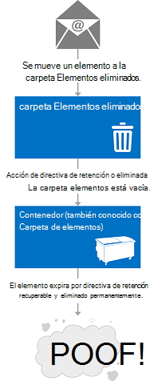

# Eliminación de elementos con EWS en ExchangeDeleting items by using EWS in Exchange

Descubra cómo puede usar la API administrada de EWS o EWS en Exchange para eliminar los elementos moviendo a la carpeta Elementos eliminados o al volcado de archivos.Find out how you can use the EWS Managed API or EWS in Exchange to delete items either by moving them to the Deleted Items folder or to the dumpster.
  
¿Nunca solicitaron usted mismo lo que es la diferencia entre mover los elementos a la carpeta Elementos eliminados y moverlos al volcado de archivos?Have you ever asked yourself what the difference is between moving items to the Deleted Items folder, and moving them to the dumpster? Es posible que tiene curiosidad acerca de las distintas opciones para los elementos eliminado de tratamiento y cómo implementar esas opciones en la aplicación.You might be curious about the different options for handling deleted items and how to implement those options in your application. Servicios Web de Exchange (EWS) incluye tres opciones para los elementos de tratamiento de eliminados.Exchange Web Services (EWS) includes three options for handling deleted items. En este artículo es de esperar que se borrará seguridad cualquier confusión es posible que deba acerca de las diferencias entre ellas.This article will hopefully clear up any confusion you might have about the differences between them.
  
## Eliminación de elementos - ¿cuáles son las opciones de mi?Deleting items - what are my options?

Antes de que pueda entender el panorama general de eliminación de elementos, es importante reconocer la diferencia entre lo siguiente:Before you can understand the overall landscape for deleting items, it's important to recognize the difference between the following:
  
- La carpeta Elementos eliminados - al eliminar los elementos de un buzón de correo, esto es donde vaya.The Deleted Items folder - When you delete items in a mailbox, this is where they go.
    
- El volcado de archivos (también conocido como la carpeta elementos recuperables) - cuando se quitan los elementos de un buzón de correo, esto es donde vaya.The dumpster (aka the Recoverable Items folder) - When you remove items from a mailbox, this is where they go.
    
Las figuras 1 y 2 muestra qué aspecto tiene el proceso de eliminación de elementos y carpetas en un buzón de correo.Figures 1 and 2 show what the deletion process looks like for items and folders in a mailbox. 

**En la figura 1. Proceso de eliminación de elementos de un buzón de correo****Figure 1. Process for deleting items from a mailbox**

 

**La figura 2. Proceso de eliminación de las carpetas de un buzón de correo****Figure 2. Process for deleting folders from a mailbox**

   
Puede eliminar los elementos y las carpetas de tres maneras diferentes, dependiendo de cómo "permanente" le gustaría que la eliminación sea.You can delete items and folders three different ways, depending on how "permanent" you would like the deletion to be.
  
**Tabla 1: Opciones de eliminación de elementos mediante el uso de EWS****Table 1: Options for deleting items by using EWS**

|**Opción****Option**|**¿Qué sucede****What happens**|
|:-----|:-----|
|Mover a la carpeta Elementos eliminadosMove to the Deleted Items folder    |Esta es la manera de permanent menos para eliminar los elementos.This is the least permanent way to delete items.  Esto es como colocar una hoja de papel en la Papelera de reciclaje por su escritorio.This is like putting a piece of paper in the recycle bin by your desk. Fácilmente puede obtener si lo necesita de nuevo.You can easily grab it if you need it again.  Puede usar cualquier [operación de eliminación](deleting-items-by-using-ews-in-exchange.md#bk_howdoIdeleteitems) que implementa el movimiento a la opción de la carpeta Elementos eliminados para realizar esta acción.You can use any [deletion operation](deleting-items-by-using-ews-in-exchange.md#bk_howdoIdeleteitems) that implements the move to the Deleted Items folder option to perform this action.  También puede usar la [operación MoveItem](http://msdn.microsoft.com/library/dcf40fa7-7796-4a5c-bf5b-7a509a18d208%28Office.15%29.aspx) ( [Item.Move()](http://msdn.microsoft.com/en-us/library/microsoft.exchange.webservices.data.item.move%28v=exchg.80%29.aspx)) o la [operación MoveFolder](http://msdn.microsoft.com/library/c7233966-6c87-4a14-8156-b1610760176d%28Office.15%29.aspx) ( [Folder.Move()](http://msdn.microsoft.com/en-us/library/microsoft.exchange.webservices.data.folder.move%28v=exchg.80%29.aspx)) para mover una carpeta o un elemento a la carpeta Elementos eliminados.You can also use the [MoveItem operation](http://msdn.microsoft.com/library/dcf40fa7-7796-4a5c-bf5b-7a509a18d208%28Office.15%29.aspx) ( [Item.Move()](http://msdn.microsoft.com/en-us/library/microsoft.exchange.webservices.data.item.move%28v=exchg.80%29.aspx)) or the [MoveFolder operation](http://msdn.microsoft.com/library/c7233966-6c87-4a14-8156-b1610760176d%28Office.15%29.aspx) ( [Folder.Move()](http://msdn.microsoft.com/en-us/library/microsoft.exchange.webservices.data.folder.move%28v=exchg.80%29.aspx)) to move an item or folder to the Deleted Items folder.    |
|Eliminar suave.Soft delete    |El elemento se mueve a la carpeta de eliminaciones en el volcado de archivos.The item is moved to the Deletions folder in the dumpster.  Esto equivale a vaciar la Papelera de reciclaje en el contenedor de calle.This is like emptying your recycle bin into your curbside container. Es posible tener acceso el elemento si es necesario, es simplemente un poco más difícil.You can still access the item if you need to, it's just a little harder.    Para obtener más información sobre el volcado de archivos (también denominado la carpeta elementos recuperables) y escenarios como suspensiones de exhibición de documentos electrónicos o litigio, vea [Carpeta elementos recuperables](http://technet.microsoft.com/en-us/library/ee364755%28v=exchg.150%29.aspx) en TechNet.For more about the dumpster (also called the Recoverable Items folder) and scenarios such as eDiscovery or litigation holds, see [Recoverable Items Folder](http://technet.microsoft.com/en-us/library/ee364755%28v=exchg.150%29.aspx) on TechNet.  Eliminaciones suave no se recomiendan para aplicaciones destinados a Exchange 2007.Soft deletions aren't recommended for applications that target Exchange 2007. En Exchange 2007, eliminaciones suaves se controlan mediante la configuración un poco en el elemento para indicar que se moverán al volcado de archivos en un momento no especificado.In Exchange 2007, soft deletions are handled by setting a bit on the item to indicate that it will be moved to the dumpster at an unspecified time.  Eliminar suave recorridos o las búsquedas de los elementos que han sido suaves eliminados a través de la [operación FindItem](http://msdn.microsoft.com/library/ebad6aae-16e7-44de-ae63-a95b24539729%28Office.15%29.aspx), no se admiten en Exchange Online, Exchange Online como parte de Office 365 y las versiones de Exchange a partir de Exchange 2010.Soft delete traversals, or searches of items that have been soft deleted via the [FindItem operation](http://msdn.microsoft.com/library/ebad6aae-16e7-44de-ae63-a95b24539729%28Office.15%29.aspx), are not supported in Exchange Online, Exchange Online as part of Office 365, and versions of Exchange starting with Exchange 2010.    **Nota**: las carpetas no se pueden eliminar suave.**NOTE**:  Folders cannot be soft deleted.           |
|Eliminar disco duroHard delete    |El elemento o la carpeta se elimina de manera permanente.The item or folder is permanently deleted.  Elementos eliminados disco duro se colocan en la carpeta de purga del volcado de archivos.Hard-deleted items are placed in the Purges folder of the dumpster. Esto es como cuando el reciclaje camiones vacía el contenedor de reciclaje calle.This is like when the recycling truck empties your curbside recycle container. No se puede tener acceso a los elementos desde un cliente de correo electrónico como Outlook o Outlook Web App y, a menos que haya una suspensión en el buzón, los elementos se eliminarán permanentemente después de un período de tiempo definido.The items cannot be accessed from an email client like Outlook or Outlook Web App, and, unless there is a hold set on the mailbox, the items will be permanently deleted after a set period of time.  Puede leer más información acerca de la retención de elementos en el artículo [Configurar retención de elementos eliminados y cuotas de los elementos recuperables](http://technet.microsoft.com/en-us/library/ee364752%28v=exchg.150%29.aspx).You can read more about item retention in the article [Configure Deleted Item Retention and Recoverable Items Quotas](http://technet.microsoft.com/en-us/library/ee364752%28v=exchg.150%29.aspx).  **Nota**: las carpetas no se colocan en la carpeta de purga al disco duro se eliminan.**NOTE**:  Folders are not placed in the Purges folder when they are hard deleted. Carpetas de disco duro eliminados se quitan desde el buzón de correo.Hard-deleted folders are removed from the mailbox.  |
   
El cambio a la carpeta Elementos eliminados y las opciones de eliminación de disco duro son transaccionales, lo que significa que en el momento en que finaliza la llamada al servicio web, el elemento se ha movido a la carpeta Elementos eliminados o el volcado de archivos.The move to the Deleted Items folder and the hard delete options are transactional, which means that by the time the web service call finishes, the item has been moved to the Deleted Items folder or the dumpster.
  
Para ayudarle a comprender mejor el ecosistema de carpetas que se usan para almacenar los elementos eliminados, en la siguiente ilustración se muestra la jerarquía de carpetas que puede contener elementos eliminados.To help you better understand the ecosystem of folders that are used to store deleted items, the following figure shows the hierarchy of folders that can contain deleted items. Los nombres de carpeta son tal como aparecen en el tipo de esquema de **DistinguishedFolderIdNameType** o la enumeración **WellKnownFolderName** en la API administrada de EWS.The folder names are as they appear in the **DistinguishedFolderIdNameType** schema type, or the **WellKnownFolderName** enumeration in the EWS Managed API. 
  
**La figura 3. Jerarquía de carpetas que contienen los elementos eliminados****Figure 3. Hierarchy of folders that contain deleted items**

  
**Tabla 2: Las carpetas que contienen los elementos eliminados****Table 2: Folders that contain deleted items**

|**Nombre de la carpeta****Folder name**|**Introducido en****Introduced in**|**Descripción****Description**|
|:-----|:-----|:-----|
|deleteditemsdeleteditems    |Exchange 2007Exchange 2007    |La carpeta de elementos eliminados de forma predeterminada.The default Deleted Items folder. Los elementos permanecen en esta carpeta hasta que estén o disco duro-eliminado temporalmente o hasta que se ha superado un período de retención.Items remain in this folder until they are soft- or hard-deleted or until a retention period has been exceeded. A continuación, se mueven a una carpeta en el volcado de archivos.Then they are moved to a folder in the dumpster. Las carpetas eliminadas se colocan en la carpeta Elementos eliminados, y cuando se inician o disco duro-eliminado temporalmente, se quitan de forma permanente desde el buzón de correo y que no son recuperables.Deleted folders are placed in the Deleted Items folder, and when they are soft- or hard-deleted, they are permanently removed from the mailbox and are not recoverable.    |
|recoverableitemsrootrecoverableitemsroot    |Exchange 2010Exchange 2010    |La raíz del volcado de archivos, o en la carpeta elementos recuperables.The root of the dumpster, or the Recoverable Items folder. Acceso de volcado de archivos se implementó en EWS en Exchange 2010.Dumpster access was implemented in EWS in Exchange 2010. El nombre para mostrar para esta carpeta es "Elementos recuperables".The display name for this folder is "Recoverable Items".    |
|recoverableitemsdeletionsrecoverableitemsdeletions    |Exchange 2010Exchange 2010    |El método main volcado de archivos carpeta para un buzón de correo.The main dumpster folder for a mailbox. Eliminado temporalmente los elementos y los elementos movidos desde la carpeta Elementos eliminados mediante una directiva de retención se colocan en esta carpeta.Soft-deleted items and items moved from the Deleted Items folder by a retention policy are placed in this folder. El nombre para mostrar para esta carpeta es "Eliminaciones".The display name for this folder is "Deletions".    |
|recoverableitemsversionsrecoverableitemsversions    |Exchange 2010Exchange 2010    |Dónde se almacenan las versiones anteriores de un elemento.Where older versions of an item are stored. Las versiones anteriores de un elemento se crean cuando se actualiza un elemento.Old versions of an item are created when an item is updated. Versiones de elemento de borrador no se guardan en esta carpeta.Draft item versions are not saved to this folder. El nombre para mostrar de esta carpeta es "Versiones".The display name of this folder is "Versions".    |
|recoverableitemspurgesrecoverableitemspurges    |Exchange 2010Exchange 2010    |Dónde se almacenan los elementos que se han quitado de la carpeta de eliminaciones.Where items that are removed from the Deletions folder are stored. Todos los elementos del almacén de disco duro eliminados se mueven a esta carpeta.All store hard-deleted items are moved to this folder. El nombre para mostrar para esta carpeta es "Purga".The display name for this folder is "Purges".    |
|archiveddeletedtitemsarchiveddeletedtitems    |Exchange 2010Exchange 2010    |La carpeta Elementos eliminados de forma predeterminada para un buzón de archivo.The default Deleted Items folder for an archive mailbox.    |
|archiverecoverablesitemsrootarchiverecoverablesitemsroot    |Exchange 2010Exchange 2010    |La raíz de volcado de archivos carpeta para un buzón de archivo.The root dumpster folder for an archive mailbox. Se mueven los elementos archivados que están eliminado temporalmente en una subcarpeta dentro de esta carpeta.Archived items that are soft-deleted are moved to a subfolder in this folder.    |
|archiverecoverableitemsdeletionsarchiverecoverableitemsdeletions    |Exchange 2010Exchange 2010    |El método main volcado de archivos carpeta para un buzón de archivo.The main dumpster folder for an archive mailbox. Archivar los elementos movidos al volcado de archivos se colocan aquí.Archived items moved to the dumpster are placed here.    |
|archiverecoverableitemsversionsarchiverecoverableitemsversions    |Exchange 2010Exchange 2010    |Dónde se almacenan las versiones anteriores de los elementos archivados.Where older versions of archived items are stored.    |
|archiverecoverableitemspurgesarchiverecoverableitemspurges    |Exchange 2010Exchange 2010    |Donde los elementos que son eliminados desde el archivo eliminaciones de carpeta en el volcado de archivos se almacenan.Where items that are hard-deleted from the archive Deletions folder in the dumpster are stored. Se mueven todos los elementos del almacén de disco duro eliminados archivada en esta carpeta.All store hard-deleted archived items are moved to this folder.    |
   
## ¿Cómo se puede eliminar elementos?How do I delete items?

Eliminar, utilice uno de los siguientes para indicar si desea mover un elemento a la carpeta Elementos eliminados o realizar una temporalmente o eliminación de un disco duro:Use one of the following to indicate whether to move an item to the Deleted Items folder or perform a soft delete or a hard delete:
  
- **DisposalType** tipo simple, si se utiliza EWS para tener acceso a Exchange.The **DisposalType** simple type, if you use EWS to access Exchange. 
    
- La [enumeración DeleteMode](http://msdn.microsoft.com/en-us/library/exchange/microsoft.exchange.webservices.data.deletemode%28v=exchg.80%29.aspx), si usa la API administrada de EWS.The [DeleteMode enumeration](http://msdn.microsoft.com/en-us/library/exchange/microsoft.exchange.webservices.data.deletemode%28v=exchg.80%29.aspx), if you use the EWS Managed API.
    
Puede usar un número de distintas operaciones de EWS o métodos de la API administrada de EWS para eliminar los elementos y carpetas de un buzón de correo.You can use a number of different EWS operations or EWS Managed API methods to delete items and folders from a mailbox.
  
**Tabla 3: Operaciones de EWS y métodos de la API administrada de EWS para eliminar elementos****Table 3: EWS operations and EWS Managed API methods for deleting items**

|**Operación de EWS****EWS operation**|**Método de la API administrada de EWS****EWS Managed API method**|**Introducido en****Introduced in**|**Para qué sirve****What it does**|
|:-----|:-----|:-----|:-----|
|[Operación DeleteFolderDeleteFolder operation](http://msdn.microsoft.com/library/b0f92682-4895-4bcf-a4a1-e4c2e8403979%28Office.15%29.aspx)   |[Folder.Delete (método)Folder.Delete method](http://msdn.microsoft.com/en-us/library/exchange/microsoft.exchange.webservices.data.folder.delete%28v=exchg.80%29.aspx)   |Exchange 2007Exchange 2007    |Elimina las carpetas de un buzón de correo.Deletes folders from a mailbox. Con EWS, puede procesar por lotes eliminar carpetas.With EWS, you can batch delete folders. Con la API administrada de EWS, sólo se puede eliminar una sola carpeta por llamada.With the EWS Managed API, you can only delete a single folder per call.    |
|[Operación DeleteItemDeleteItem operation](http://msdn.microsoft.com/library/3e26c416-fa12-476e-bfd2-5c1f4bb7b348%28Office.15%29.aspx)   |[Item.Delete (método)Item.Delete method](http://msdn.microsoft.com/en-us/library/exchange/microsoft.exchange.webservices.data.item.delete%28v=exchg.80%29.aspx)  [ExchangeService.DeleteItems (método)ExchangeService.DeleteItems method](http://msdn.microsoft.com/en-us/library/exchange/microsoft.exchange.webservices.data.exchangeservice.deleteitems%28v=exchg.80%29.aspx)   |Exchange 2007Exchange 2007    |Elimina los elementos de un buzón de correo.Deletes items from a mailbox.    |
|[Operación EmptyFolderEmptyFolder operation](http://msdn.microsoft.com/library/98161486-e2f2-480f-8d5d-708ba81b208a%28Office.15%29.aspx)   |[Folder.Empty (método)Folder.Empty method](http://msdn.microsoft.com/en-us/library/exchange/microsoft.exchange.webservices.data.folder.empty%28v=exchg.80%29.aspx)   |Exchange 2010Exchange 2010    |Elimina todos los elementos en una carpeta y, opcionalmente, elimina todas las subcarpetas de una carpeta.Deletes all the items in a folder, and, optionally, deletes all subfolders in a folder.    |
|[Operación ApplyConversationActionApplyConversationAction operation](http://msdn.microsoft.com/library/73d7943d-d361-4f8b-9948-d85f886efa1a%28Office.15%29.aspx)   |[Conversation.EnableAlwaysDeleteItems (método)Conversation.EnableAlwaysDeleteItems method](http://msdn.microsoft.com/en-us/library/exchange/microsoft.exchange.webservices.data.conversation.enablealwaysdeleteitems%28v=exchg.80%29.aspx)  [Conversation.DeleteItems (método)Conversation.DeleteItems method](http://msdn.microsoft.com/en-us/library/exchange/microsoft.exchange.webservices.data.conversation.deleteitems%28v=exchg.80%29.aspx)   |Exchange 2010Exchange 2010    |Establece una eliminación procesamiento acción en los mensajes de correo electrónico en una conversación para que se eliminan.Sets a delete processing action on email messages in a conversation so that they are deleted.    |
|[Operación DeleteUserConfigurationDeleteUserConfiguration operation](http://msdn.microsoft.com/library/93e44690-be2d-4fdb-96a8-4ded3c193aed%28Office.15%29.aspx)   |[UserConfiguration.Delete (método)UserConfiguration.Delete method](http://msdn.microsoft.com/en-us/library/exchange/microsoft.exchange.webservices.data.userconfiguration.delete%28v=exchg.80%29.aspx)   |Exchange 2010Exchange 2010    |Elimina una carpeta asociada de elemento y lo mueve al volcado de archivos.Deletes a folder associated item and moves it to the dumpster.    |
|[Operación CreateItemCreateItem operation](http://msdn.microsoft.com/library/78a52120-f1d0-4ed7-8748-436e554f75b6%28Office.15%29.aspx)   |[Appointment.Accept (método)Appointment.Accept method](http://msdn.microsoft.com/en-us/library/microsoft.exchange.webservices.data.appointment.accept%28v=exchg.80%29.aspx)   [Appointment.AcceptTentatively (método)Appointment.AcceptTentatively method](http://msdn.microsoft.com/en-us/library/microsoft.exchange.webservices.data.appointment.accepttentatively%28v=exchg.80%29.aspx)  [Appointment.CancelMeeting (método)Appointment.CancelMeeting method](http://msdn.microsoft.com/en-us/library/microsoft.exchange.webservices.data.appointment.cancelmeeting%28v=exchg.80%29.aspx)  [Appointment.DeclineAppointment.Decline](http://msdn.microsoft.com/en-us/library/microsoft.exchange.webservices.data.appointment.decline%28v=exchg.80%29.aspx)  [MeetingRequest.Accept (método)MeetingRequest.Accept method](http://msdn.microsoft.com/en-us/library/microsoft.exchange.webservices.data.meetingrequest.accept%28v=exchg.80%29.aspx)  [MeetingRequest.AcceptTentatively (método)MeetingRequest.AcceptTentatively method](http://msdn.microsoft.com/en-us/library/microsoft.exchange.webservices.data.meetingrequest.accepttentatively%28v=exchg.80%29.aspx)  [MeetingRequest.Decline (método)MeetingRequest.Decline method](http://msdn.microsoft.com/en-us/library/microsoft.exchange.webservices.data.meetingrequest.decline%28v=exchg.80%29.aspx)   |Exchange 2007Exchange 2007    |Indirectamente mueve un elemento a la carpeta Elementos eliminados cada vez que se envía una respuesta a una convocatoria de reunión o la respuesta se establece en la cita.Indirectly moves an item to the Deleted Items folder whenever a response to a meeting request is sent or the response is set on the appointment.  El tipo de eliminación no se establece en esta operación.The deletion type is not set on this operation. Los mensajes de reunión se mueven a la carpeta Elementos eliminados cuando un objeto de respuesta se procesa correctamente por el servicio.The meeting messages are moved to the Deleted Items folder when a response object is successfully processed by the service.    |
   
También puede mover elementos a la carpeta Elementos eliminados mediante el uso de reglas de bandeja de entrada.You can also move items to the Deleted Items folder by using Inbox rules. Por ejemplo, puede [crear reglas](inbox-management-and-ews-in-exchange.md) que tienen una acción de eliminar.For example, you can [create rules](inbox-management-and-ews-in-exchange.md) that have a delete action. 
  
Algunos puntos a tener en cuenta sobre la eliminación de elementos:Some points to note about deleting items:
  
- Eliminación de una ocurrencia de un elemento periódico no desencadenar un movimiento a la carpeta Elementos eliminados o el volcado de archivos.Deleting an occurrence of a recurring item does not trigger a move to the Deleted Items folder or the dumpster. Esto da como resultado una actualización para el elemento maestro periódico de la serie periódica.This results in an update to the recurring master item of the recurring series.
    
- No se puede eliminar carpetas predeterminadas del buzón de correo.You cannot delete default folders from the mailbox.
    
- Evitar la eliminación de las reuniones o los mensajes de reunión, como las convocatorias de reunión y o actualizaciones de la reunión.Avoid deleting meetings or meeting messages, such as meeting requests and or meeting updates. En su lugar, responder a estos elementos mediante el uso de objetos de respuesta.Instead, respond to these items by using response objects. De este modo, los elementos de calendario asociadas se actualizan para reflejar del Respondedor o del organizador de acciones.This way, the associated calendar items are updated to reflect the responder's or organizer's actions.
    
- Cambiar la clave de un elemento no se actualiza cuando el elemento se mueve a la carpeta Elementos eliminados o eliminaciones.An item's change key is not updated when the item is moved to the Deleted Items or Deletions folder.
    
- Si realiza un disco duro eliminar en un elemento y, a continuación, llamar a una [operación SyncFolderHierarchy](http://msdn.microsoft.com/library/b31916b1-bc6c-4451-a475-b7c5417f752d%28Office.15%29.aspx) o método de API administrada de EWS [SyncFolderHierarchy](http://msdn.microsoft.com/en-us/library/microsoft.exchange.webservices.data.exchangeservice.syncfolderhierarchy%28v=exchg.80%29.aspx) o una [operación SyncFolderItems](http://msdn.microsoft.com/library/7f0de089-8876-47ec-a871-df118ceae75d%28Office.15%29.aspx) o [SyncFolderItems](http://msdn.microsoft.com/en-us/library/microsoft.exchange.webservices.data.exchangeservice.syncfolderitems%28v=exchg.80%29.aspx) un método, un cambio de **Eliminar** se devolverá la entrada.If you perform a hard delete on an item and then call a [SyncFolderHierarchy operation](http://msdn.microsoft.com/library/b31916b1-bc6c-4451-a475-b7c5417f752d%28Office.15%29.aspx) or [SyncFolderHierarchy](http://msdn.microsoft.com/en-us/library/microsoft.exchange.webservices.data.exchangeservice.syncfolderhierarchy%28v=exchg.80%29.aspx) EWS Managed API method, or a [SyncFolderItems operation](http://msdn.microsoft.com/library/7f0de089-8876-47ec-a871-df118ceae75d%28Office.15%29.aspx) or [SyncFolderItems](http://msdn.microsoft.com/en-us/library/microsoft.exchange.webservices.data.exchangeservice.syncfolderitems%28v=exchg.80%29.aspx) method, a **Delete** change entry will be returned. Si mueve un elemento a la carpeta Elementos eliminados, se devuelve una entrada de cambio de la **actualización** .If you move an item to the Deleted Items folder, an **Update** change entry is returned. Esto es debido a que el elemento o la carpeta tiene un nuevo valor de la propiedad [ID](http://msdn.microsoft.com/library/258f4b1f-367e-4c7d-9c29-eb775a2398c7%28Office.15%29.aspx) .This is because the item or folder will have a new [ParentFolderId](http://msdn.microsoft.com/library/258f4b1f-367e-4c7d-9c29-eb775a2398c7%28Office.15%29.aspx) property value. [Más información acerca de la sincronización](mailbox-synchronization-and-ews-in-exchange.md) si sincronizar elementos eliminados es parte de su escenario.[Read more about synchronization](mailbox-synchronization-and-ews-in-exchange.md) if synchronizing deleted items is part of your scenario. 
    
## Obtenga más información acerca de cómo eliminar elementosFind out more about deleting items

- [Extraer las notificaciones de eventos de buzón de correo relacionados con la eliminación de EWS en ExchangePull notifications for EWS deletion-related mailbox events in Exchange](pull-notifications-for-ews-deletion-related-mailbox-events-in-exchange.md)
    
- [Tratamiento de errores relacionados con la eliminación de EWS en ExchangeHandling deletion-related errors in EWS in Exchange](handling-deletion-related-errors-in-ews-in-exchange.md)
    
## Ver tambiénSee also

- [Las carpetas y elementos de EWS en ExchangeFolders and items in EWS in Exchange](folders-and-items-in-ews-in-exchange.md)    
- [Desarrollo de clientes de servicios web de ExchangeDevelop web service clients for Exchange](develop-web-service-clients-for-exchange.md)    
- [Carpeta elementos recuperablesRecoverable Items Folder](http://technet.microsoft.com/en-us/library/ee364755.aspx)    
- [Recuperación de elemento único en Exchange Server 2010Single Item Recovery in Exchange Server 2010](http://blogs.technet.com/b/exchange/archive/2009/09/25/3408389.aspx#_Single_Item_Recovery)    
- [Exchange 2013: Eliminar una serie periódica mediante programación de los servidores de ExchangeExchange 2013: Delete a recurring series programmatically from Exchange servers](http://code.msdn.microsoft.com/exchange/Exchange-2013-Delete-a-e1c7b89d)    
- [Exchange 2013: Eliminar tareas de una cuenta en los servidores de Exchange mediante programaciónExchange 2013: Delete tasks from an account on Exchange servers programmatically](http://code.msdn.microsoft.com/exchange/Exchange-2013-Delete-tasks-13824637)    
- [Exchange 2013: Vaciar las carpetas en los servidores de Exchange mediante programaciónExchange 2013: Empty folders on Exchange servers programmatically](http://code.msdn.microsoft.com/exchange/Exchange-2013-Empty-6487df37)    
- [Exchange 2013: Eliminar las carpetas mediante programación de los servidores de ExchangeExchange 2013: Delete folders programmatically from Exchange servers](http://code.msdn.microsoft.com/exchange/Exchange-2013-Delete-aa1a5823)    
- [Exchange 2013: Eliminar muchos elementos mediante programación de los servidores de ExchangeExchange 2013: Delete many items programmatically from Exchange servers](http://code.msdn.microsoft.com/exchange/Exchange-2013-Delete-many-064f8760)    
- [Exchange 2013: Eliminar contactos mediante programación desde los servidores de ExchangeExchange 2013: Delete contacts programmatically from Exchange servers](http://code.msdn.microsoft.com/exchange/Exchange-2013-Delete-3b8b0640)    
- [Eliminar las citas y cancelar reuniones mediante el uso de EWS en ExchangeDelete appointments and cancel meetings by using EWS in Exchange](how-to-delete-appointments-and-cancel-meetings-by-using-ews-in-exchange.md)    
- [Administrar la configuración de aplicación persistente mediante el uso de EWS en ExchangeManage persistent application settings by using EWS in Exchange](how-to-manage-persistent-application-settings-by-using-ews-in-exchange.md)
    

