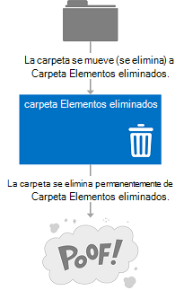
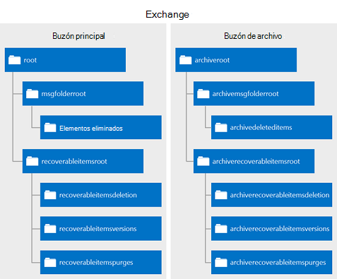

# Eliminación de elementos con EWS en Exchange

Descubra cómo puede usar la API administrada de EWS o EWS en Exchange para eliminar los elementos moviendo a la carpeta Elementos eliminados o al volcado de archivos.
  
¿Nunca solicitaron usted mismo lo que es la diferencia entre mover los elementos a la carpeta Elementos eliminados y moverlos al volcado de archivos? Es posible que tiene curiosidad acerca de las distintas opciones para los elementos eliminado de tratamiento y cómo implementar esas opciones en la aplicación. Servicios Web de Exchange (EWS) incluye tres opciones para los elementos de tratamiento de eliminados. En este artículo es de esperar que se borrará seguridad cualquier confusión es posible que deba acerca de las diferencias entre ellas.
  
## Eliminación de elementos - ¿cuáles son las opciones de mi?

Antes de que pueda entender el panorama general de eliminación de elementos, es importante reconocer la diferencia entre lo siguiente:
  
- La carpeta Elementos eliminados - al eliminar los elementos de un buzón de correo, esto es donde vaya.
    
- El volcado de archivos (también conocido como la carpeta elementos recuperables) - cuando se quitan los elementos de un buzón de correo, esto es donde vaya.
    
Las figuras 1 y 2 muestra qué aspecto tiene el proceso de eliminación de elementos y carpetas en un buzón de correo. 

**En la figura 1. Proceso de eliminación de elementos de un buzón de correo**

 

**La figura 2. Proceso de eliminación de las carpetas de un buzón de correo**

   
Puede eliminar los elementos y las carpetas de tres maneras diferentes, dependiendo de cómo "permanente" le gustaría que la eliminación sea.
  
**Tabla 1: Opciones de eliminación de elementos mediante el uso de EWS**

|**Opción**|**¿Qué sucede**|
|:-----|:-----|
|Mover a la carpeta Elementos eliminados    |Esta es la manera de permanent menos para eliminar los elementos.  Esto es como colocar una hoja de papel en la Papelera de reciclaje por su escritorio. Fácilmente puede obtener si lo necesita de nuevo.  Puede usar cualquier [operación de eliminación](deleting-items-by-using-ews-in-exchange.md#bk_howdoIdeleteitems) que implementa el movimiento a la opción de la carpeta Elementos eliminados para realizar esta acción.  También puede usar la [operación MoveItem](http://msdn.microsoft.com/library/dcf40fa7-7796-4a5c-bf5b-7a509a18d208%28Office.15%29.aspx) ( [Item.Move()](http://msdn.microsoft.com/en-us/library/microsoft.exchange.webservices.data.item.move%28v=exchg.80%29.aspx)) o la [operación MoveFolder](http://msdn.microsoft.com/library/c7233966-6c87-4a14-8156-b1610760176d%28Office.15%29.aspx) ( [Folder.Move()](http://msdn.microsoft.com/en-us/library/microsoft.exchange.webservices.data.folder.move%28v=exchg.80%29.aspx)) para mover una carpeta o un elemento a la carpeta Elementos eliminados.    |
|Eliminar suave.    |El elemento se mueve a la carpeta de eliminaciones en el volcado de archivos.  Esto equivale a vaciar la Papelera de reciclaje en el contenedor de calle. Es posible tener acceso el elemento si es necesario, es simplemente un poco más difícil.    Para obtener más información sobre el volcado de archivos (también denominado la carpeta elementos recuperables) y escenarios como suspensiones de exhibición de documentos electrónicos o litigio, vea [Carpeta elementos recuperables](http://technet.microsoft.com/en-us/library/ee364755%28v=exchg.150%29.aspx) en TechNet.  Eliminaciones suave no se recomiendan para aplicaciones destinados a Exchange 2007. En Exchange 2007, eliminaciones suaves se controlan mediante la configuración un poco en el elemento para indicar que se moverán al volcado de archivos en un momento no especificado.  Eliminar suave recorridos o las búsquedas de los elementos que han sido suaves eliminados a través de la [operación FindItem](http://msdn.microsoft.com/library/ebad6aae-16e7-44de-ae63-a95b24539729%28Office.15%29.aspx), no se admiten en Exchange Online, Exchange Online como parte de Office 365 y las versiones de Exchange a partir de Exchange 2010.    **Nota**: las carpetas no se pueden eliminar suave.           |
|Eliminar disco duro    |El elemento o la carpeta se elimina de manera permanente.  Elementos eliminados disco duro se colocan en la carpeta de purga del volcado de archivos. Esto es como cuando el reciclaje camiones vacía el contenedor de reciclaje calle. No se puede tener acceso a los elementos desde un cliente de correo electrónico como Outlook o Outlook Web App y, a menos que haya una suspensión en el buzón, los elementos se eliminarán permanentemente después de un período de tiempo definido.  Puede leer más información acerca de la retención de elementos en el artículo [Configurar retención de elementos eliminados y cuotas de los elementos recuperables](http://technet.microsoft.com/en-us/library/ee364752%28v=exchg.150%29.aspx).  **Nota**: las carpetas no se colocan en la carpeta de purga al disco duro se eliminan. Carpetas de disco duro eliminados se quitan desde el buzón de correo.  |
   
El cambio a la carpeta Elementos eliminados y las opciones de eliminación de disco duro son transaccionales, lo que significa que en el momento en que finaliza la llamada al servicio web, el elemento se ha movido a la carpeta Elementos eliminados o el volcado de archivos.
  
Para ayudarle a comprender mejor el ecosistema de carpetas que se usan para almacenar los elementos eliminados, en la siguiente ilustración se muestra la jerarquía de carpetas que puede contener elementos eliminados. Los nombres de carpeta son tal como aparecen en el tipo de esquema de **DistinguishedFolderIdNameType** o la enumeración **WellKnownFolderName** en la API administrada de EWS. 
  
**La figura 3. Jerarquía de carpetas que contienen los elementos eliminados**

  
**Tabla 2: Las carpetas que contienen los elementos eliminados**

|**Nombre de la carpeta**|**Introducido en**|**Descripción**|
|:-----|:-----|:-----|
|deleteditems    |Exchange 2007    |La carpeta de elementos eliminados de forma predeterminada. Los elementos permanecen en esta carpeta hasta que estén o disco duro-eliminado temporalmente o hasta que se ha superado un período de retención. A continuación, se mueven a una carpeta en el volcado de archivos. Las carpetas eliminadas se colocan en la carpeta Elementos eliminados, y cuando se inician o disco duro-eliminado temporalmente, se quitan de forma permanente desde el buzón de correo y que no son recuperables.    |
|recoverableitemsroot    |Exchange 2010    |La raíz del volcado de archivos, o en la carpeta elementos recuperables. Acceso de volcado de archivos se implementó en EWS en Exchange 2010. El nombre para mostrar para esta carpeta es "Elementos recuperables".    |
|recoverableitemsdeletions    |Exchange 2010    |El método main volcado de archivos carpeta para un buzón de correo. Eliminado temporalmente los elementos y los elementos movidos desde la carpeta Elementos eliminados mediante una directiva de retención se colocan en esta carpeta. El nombre para mostrar para esta carpeta es "Eliminaciones".    |
|recoverableitemsversions    |Exchange 2010    |Dónde se almacenan las versiones anteriores de un elemento. Las versiones anteriores de un elemento se crean cuando se actualiza un elemento. Versiones de elemento de borrador no se guardan en esta carpeta. El nombre para mostrar de esta carpeta es "Versiones".    |
|recoverableitemspurges    |Exchange 2010    |Dónde se almacenan los elementos que se han quitado de la carpeta de eliminaciones. Todos los elementos del almacén de disco duro eliminados se mueven a esta carpeta. El nombre para mostrar para esta carpeta es "Purga".    |
|archiveddeletedtitems    |Exchange 2010    |La carpeta Elementos eliminados de forma predeterminada para un buzón de archivo.    |
|archiverecoverablesitemsroot    |Exchange 2010    |La raíz de volcado de archivos carpeta para un buzón de archivo. Se mueven los elementos archivados que están eliminado temporalmente en una subcarpeta dentro de esta carpeta.    |
|archiverecoverableitemsdeletions    |Exchange 2010    |El método main volcado de archivos carpeta para un buzón de archivo. Archivar los elementos movidos al volcado de archivos se colocan aquí.    |
|archiverecoverableitemsversions    |Exchange 2010    |Dónde se almacenan las versiones anteriores de los elementos archivados.    |
|archiverecoverableitemspurges    |Exchange 2010    |Donde los elementos que son eliminados desde el archivo eliminaciones de carpeta en el volcado de archivos se almacenan. Se mueven todos los elementos del almacén de disco duro eliminados archivada en esta carpeta.    |
   
## ¿Cómo se puede eliminar elementos?

Eliminar, utilice uno de los siguientes para indicar si desea mover un elemento a la carpeta Elementos eliminados o realizar una temporalmente o eliminación de un disco duro:
  
- **DisposalType** tipo simple, si se utiliza EWS para tener acceso a Exchange. 
    
- La [enumeración DeleteMode](http://msdn.microsoft.com/en-us/library/exchange/microsoft.exchange.webservices.data.deletemode%28v=exchg.80%29.aspx), si usa la API administrada de EWS.
    
Puede usar un número de distintas operaciones de EWS o métodos de la API administrada de EWS para eliminar los elementos y carpetas de un buzón de correo.
  
**Tabla 3: Operaciones de EWS y métodos de la API administrada de EWS para eliminar elementos**

|**Operación de EWS**|**Método de la API administrada de EWS**|**Introducido en**|**Para qué sirve**|
|:-----|:-----|:-----|:-----|
|[Operación DeleteFolder](http://msdn.microsoft.com/library/b0f92682-4895-4bcf-a4a1-e4c2e8403979%28Office.15%29.aspx)   |[Folder.Delete (método)](http://msdn.microsoft.com/en-us/library/exchange/microsoft.exchange.webservices.data.folder.delete%28v=exchg.80%29.aspx)   |Exchange 2007    |Elimina las carpetas de un buzón de correo. Con EWS, puede procesar por lotes eliminar carpetas. Con la API administrada de EWS, sólo se puede eliminar una sola carpeta por llamada.    |
|[Operación DeleteItem](http://msdn.microsoft.com/library/3e26c416-fa12-476e-bfd2-5c1f4bb7b348%28Office.15%29.aspx)   |[Item.Delete (método)](http://msdn.microsoft.com/en-us/library/exchange/microsoft.exchange.webservices.data.item.delete%28v=exchg.80%29.aspx)  [ExchangeService.DeleteItems (método)](http://msdn.microsoft.com/en-us/library/exchange/microsoft.exchange.webservices.data.exchangeservice.deleteitems%28v=exchg.80%29.aspx)   |Exchange 2007    |Elimina los elementos de un buzón de correo.    |
|[Operación EmptyFolder](http://msdn.microsoft.com/library/98161486-e2f2-480f-8d5d-708ba81b208a%28Office.15%29.aspx)   |[Folder.Empty (método)](http://msdn.microsoft.com/en-us/library/exchange/microsoft.exchange.webservices.data.folder.empty%28v=exchg.80%29.aspx)   |Exchange 2010    |Elimina todos los elementos en una carpeta y, opcionalmente, elimina todas las subcarpetas de una carpeta.    |
|[Operación ApplyConversationAction](http://msdn.microsoft.com/library/73d7943d-d361-4f8b-9948-d85f886efa1a%28Office.15%29.aspx)   |[Conversation.EnableAlwaysDeleteItems (método)](http://msdn.microsoft.com/en-us/library/exchange/microsoft.exchange.webservices.data.conversation.enablealwaysdeleteitems%28v=exchg.80%29.aspx)  [Conversation.DeleteItems (método)](http://msdn.microsoft.com/en-us/library/exchange/microsoft.exchange.webservices.data.conversation.deleteitems%28v=exchg.80%29.aspx)   |Exchange 2010    |Establece una eliminación procesamiento acción en los mensajes de correo electrónico en una conversación para que se eliminan.    |
|[Operación DeleteUserConfiguration](http://msdn.microsoft.com/library/93e44690-be2d-4fdb-96a8-4ded3c193aed%28Office.15%29.aspx)   |[UserConfiguration.Delete (método)](http://msdn.microsoft.com/en-us/library/exchange/microsoft.exchange.webservices.data.userconfiguration.delete%28v=exchg.80%29.aspx)   |Exchange 2010    |Elimina una carpeta asociada de elemento y lo mueve al volcado de archivos.    |
|[Operación CreateItem](http://msdn.microsoft.com/library/78a52120-f1d0-4ed7-8748-436e554f75b6%28Office.15%29.aspx)   |[Appointment.Accept (método)](http://msdn.microsoft.com/en-us/library/microsoft.exchange.webservices.data.appointment.accept%28v=exchg.80%29.aspx)   [Appointment.AcceptTentatively (método)](http://msdn.microsoft.com/en-us/library/microsoft.exchange.webservices.data.appointment.accepttentatively%28v=exchg.80%29.aspx)  [Appointment.CancelMeeting (método)](http://msdn.microsoft.com/en-us/library/microsoft.exchange.webservices.data.appointment.cancelmeeting%28v=exchg.80%29.aspx)  [Appointment.Decline](http://msdn.microsoft.com/en-us/library/microsoft.exchange.webservices.data.appointment.decline%28v=exchg.80%29.aspx)  [MeetingRequest.Accept (método)](http://msdn.microsoft.com/en-us/library/microsoft.exchange.webservices.data.meetingrequest.accept%28v=exchg.80%29.aspx)  [MeetingRequest.AcceptTentatively (método)](http://msdn.microsoft.com/en-us/library/microsoft.exchange.webservices.data.meetingrequest.accepttentatively%28v=exchg.80%29.aspx)  [MeetingRequest.Decline (método)](http://msdn.microsoft.com/en-us/library/microsoft.exchange.webservices.data.meetingrequest.decline%28v=exchg.80%29.aspx)   |Exchange 2007    |Indirectamente mueve un elemento a la carpeta Elementos eliminados cada vez que se envía una respuesta a una convocatoria de reunión o la respuesta se establece en la cita.  El tipo de eliminación no se establece en esta operación. Los mensajes de reunión se mueven a la carpeta Elementos eliminados cuando un objeto de respuesta se procesa correctamente por el servicio.    |
   
También puede mover elementos a la carpeta Elementos eliminados mediante el uso de reglas de bandeja de entrada. Por ejemplo, puede [crear reglas](inbox-management-and-ews-in-exchange.md) que tienen una acción de eliminar. 
  
Algunos puntos a tener en cuenta sobre la eliminación de elementos:
  
- Eliminación de una ocurrencia de un elemento periódico no desencadenar un movimiento a la carpeta Elementos eliminados o el volcado de archivos. Esto da como resultado una actualización para el elemento maestro periódico de la serie periódica.
    
- No se puede eliminar carpetas predeterminadas del buzón de correo.
    
- Evitar la eliminación de las reuniones o los mensajes de reunión, como las convocatorias de reunión y o actualizaciones de la reunión. En su lugar, responder a estos elementos mediante el uso de objetos de respuesta. De este modo, los elementos de calendario asociadas se actualizan para reflejar del Respondedor o del organizador de acciones.
    
- Cambiar la clave de un elemento no se actualiza cuando el elemento se mueve a la carpeta Elementos eliminados o eliminaciones.
    
- Si realiza un disco duro eliminar en un elemento y, a continuación, llamar a una [operación SyncFolderHierarchy](http://msdn.microsoft.com/library/b31916b1-bc6c-4451-a475-b7c5417f752d%28Office.15%29.aspx) o método de API administrada de EWS [SyncFolderHierarchy](http://msdn.microsoft.com/en-us/library/microsoft.exchange.webservices.data.exchangeservice.syncfolderhierarchy%28v=exchg.80%29.aspx) o una [operación SyncFolderItems](http://msdn.microsoft.com/library/7f0de089-8876-47ec-a871-df118ceae75d%28Office.15%29.aspx) o [SyncFolderItems](http://msdn.microsoft.com/en-us/library/microsoft.exchange.webservices.data.exchangeservice.syncfolderitems%28v=exchg.80%29.aspx) un método, un cambio de **Eliminar** se devolverá la entrada. Si mueve un elemento a la carpeta Elementos eliminados, se devuelve una entrada de cambio de la **actualización** . Esto es debido a que el elemento o la carpeta tiene un nuevo valor de la propiedad [ID](http://msdn.microsoft.com/library/258f4b1f-367e-4c7d-9c29-eb775a2398c7%28Office.15%29.aspx) . [Más información acerca de la sincronización](mailbox-synchronization-and-ews-in-exchange.md) si sincronizar elementos eliminados es parte de su escenario. 
    
## Obtenga más información acerca de cómo eliminar elementos

- [Extraer las notificaciones de eventos de buzón de correo relacionados con la eliminación de EWS en Exchange](pull-notifications-for-ews-deletion-related-mailbox-events-in-exchange.md)
    
- [Tratamiento de errores relacionados con la eliminación de EWS en Exchange](handling-deletion-related-errors-in-ews-in-exchange.md)
    
## Ver también

- [Las carpetas y elementos de EWS en Exchange](folders-and-items-in-ews-in-exchange.md)    
- [Desarrollo de clientes de servicios web de Exchange](develop-web-service-clients-for-exchange.md)    
- [Carpeta elementos recuperables](http://technet.microsoft.com/en-us/library/ee364755.aspx)    
- [Recuperación de elemento único en Exchange Server 2010](http://blogs.technet.com/b/exchange/archive/2009/09/25/3408389.aspx#_Single_Item_Recovery)    
- [Exchange 2013: Eliminar una serie periódica mediante programación de los servidores de Exchange](http://code.msdn.microsoft.com/exchange/Exchange-2013-Delete-a-e1c7b89d)    
- [Exchange 2013: Eliminar tareas de una cuenta en los servidores de Exchange mediante programación](http://code.msdn.microsoft.com/exchange/Exchange-2013-Delete-tasks-13824637)    
- [Exchange 2013: Vaciar las carpetas en los servidores de Exchange mediante programación](http://code.msdn.microsoft.com/exchange/Exchange-2013-Empty-6487df37)    
- [Exchange 2013: Eliminar las carpetas mediante programación de los servidores de Exchange](http://code.msdn.microsoft.com/exchange/Exchange-2013-Delete-aa1a5823)    
- [Exchange 2013: Eliminar muchos elementos mediante programación de los servidores de Exchange](http://code.msdn.microsoft.com/exchange/Exchange-2013-Delete-many-064f8760)    
- [Exchange 2013: Eliminar contactos mediante programación desde los servidores de Exchange](http://code.msdn.microsoft.com/exchange/Exchange-2013-Delete-3b8b0640)    
- [Eliminar las citas y cancelar reuniones mediante el uso de EWS en Exchange](how-to-delete-appointments-and-cancel-meetings-by-using-ews-in-exchange.md)    
- [Administrar la configuración de aplicación persistente mediante el uso de EWS en Exchange](how-to-manage-persistent-application-settings-by-using-ews-in-exchange.md)
    

