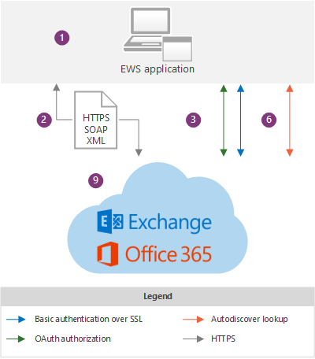

# Aplicaciones de EWS y la arquitectura de ExchangeEWS applications and the Exchange architecture

Obtenga información sobre cómo funciona EWS en la arquitectura de Exchange y conozca los protocolos en los que se basa EWS.Learn about how EWS works within the Exchange architecture, and find out which protocols EWS relies on.
  
Servicios web Exchange (EWS) es una API multiplataforma que permite a las aplicaciones tener acceso a elementos de buzón, como mensajes de correo electrónico, reuniones y contactos de Exchange Online, Exchange online como parte de Office 365 o versiones locales de Exchange a partir de Exchange Server 2007.Exchange Web Services (EWS) is a cross-platform API that enables applications to access mailbox items such as email messages, meetings, and contacts from Exchange Online, Exchange Online as part of Office 365, or on-premises versions of Exchange starting with Exchange Server 2007. [Las aplicaciones de EWS](ews-application-types.md) pueden tener acceso a elementos de buzón de correo de forma local o remota mediante el envío de una solicitud en un mensaje XML basado en SOAP.[EWS applications](ews-application-types.md) can access mailbox items locally or remotely by sending a request in a SOAP-based XML message. El mensaje SOAP se incrusta en un mensaje HTTP cuando se envía entre la aplicación y el servidor, lo que significa que, siempre que la aplicación pueda publicar XML a través de HTTP, puede usar EWS para tener acceso a Exchange.The SOAP message is embedded in an HTTP message when sent between the application and the server, which means that as long as your application can post XML through HTTP, it can use EWS to access Exchange. 
  
## Información general sobre la arquitectura de ExchangeExchange architecture overview

Los siguientes diagramas muestran los métodos de autenticación y las rutas de comunicación que usan las aplicaciones de EWS al comunicarse con Exchange 2013 y Exchange Online.The following diagrams show the authentication methods and communication paths used by EWS applications when communicating with Exchange 2013 and Exchange Online. Desde el punto de vista de la aplicación de EWS, las rutas de comunicación son idénticas y los métodos de autenticación solo varían ligeramente; la principal diferencia es la visibilidad que tiene en el back-end de Exchange.From the EWS application perspective, the communication paths are identical and the authentication methods only vary slightly; the main difference is the visibility you have into the Exchange backend.
  
**Figura 1. La aplicación EWS y la arquitectura local de Exchange****Figure 1. EWS application and the Exchange on-premises architecture**

  
En la figura 2, se muestran las mismas rutas de comunicación que se muestran en la figura 1, tal y como se usan en las aplicaciones de EWS al comunicarse con Exchange Online.Figure 2 shows the same communication paths shown in Figure 1, as used by EWS applications when communicating with Exchange Online.
  
**Figura 2. Aplicación EWS y la arquitectura de Exchange Online****Figure 2. EWS application and the Exchange Online architecture**

  
Los siguientes son los componentes que se muestran en los diagramas:The following are the components that are shown in the diagrams:
  
1. Aplicación de EWS: puede ser un [cliente, un portal o una aplicación de servicio](ews-application-types.md) , y se puede instalar en un cliente o en un servidor de acceso de cliente de Exchange local.EWS application — This can be a [client, portal, or service application](ews-application-types.md) and it can be installed on a client or on an Exchange on-premises Client Access server. Si usa la API administrada de EWS para desarrollar la aplicación de EWS, los ensamblados de la API administrada de EWS deben instalarse en el cliente y [redistribuirse mediante la aplicación](redistribution-requirements-for-the-ews-managed-api.md).If you use the EWS Managed API to develop the EWS application, the EWS Managed API assemblies have to be installed on the client and [redistributed by your application](redistribution-requirements-for-the-ews-managed-api.md).
    
2. El mensaje XML SOAP (un mensaje XML, en un envoltorio SOAP) incrustado en un mensaje HTTP/S que se ajusta al archivo Services. wsdl en el servidor de acceso de cliente.The SOAP XML message — An XML message, in a SOAP envelope, embedded in an HTTP/S message that conforms to the Services.wsdl file on the Client Access server. Se recomienda HTTPS para Exchange local y es necesario para Exchange Online.HTTPS is recommended for Exchange on-premises and is required for Exchange Online. 
    
3. Métodos de autenticación: los mensajes de EWS incluyen la información de autenticación básica, NTLM (autenticación de Windows integrada) o OAuth como parte de la carga HTTP.Authentication methods — EWS messages include basic, NTLM (Windows Integrated authentication), or OAuth authentication information as part of the HTTP payload. 
    
4. Equilibrador de carga: el equilibrador de carga distribuye el mensaje a un servidor de acceso de cliente en la matriz de servidores de acceso de cliente.Load balancer — The load balancer distributes the message to a Client Access server in the Client Access server array. Este componente solo es visible en la arquitectura local de Exchange.This component is only visible in the Exchange on-premises architecture.
    
5. Matriz de servidor de acceso de cliente: los servidores de acceso de cliente se organizan en un grupo de carga equilibrada denominado matriz de servidores de acceso de cliente.Client Access server array — Client Access servers are organized into a load-balanced group called a Client Access server array. Los servidores de acceso de cliente individuales proporcionan autenticación, redirección limitada y servicios proxy.Individual Client Access servers provide authentication, limited redirection, and proxy services. Los servidores de acceso de cliente por sí mismos no realizan ninguna representación de datos y los datos no se colocan en la cola ni se almacenan en un servidor de acceso de cliente: es delgado y sin estado; simplemente, autentica la solicitud, realiza una búsqueda de detección automática y, a continuación, envía la solicitud de proxy al servidor de buzones.The Client Access servers themselves don't do any data rendering, and no data is queued or stored on a Client Access server - it is thin and stateless; it simply authenticates the request, performs an Autodiscover lookup, and then proxies the request to the Mailbox server. El servidor de acceso de cliente mantiene una relación de 1:1 con el servidor de buzones de correo que hospeda los datos del usuario.The Client Access server does maintain a 1:1 relationship with the Mailbox server that hosts the user's data. El protocolo HTTP (protegido mediante SSL con un certificado autofirmado) se usa entre el servidor de acceso de cliente y el servidor de buzones de correo.The HTTP protocol (secured via SSL using a self-signed certificate) is used between the Client Access server and Mailbox server. Este componente solo es visible en la arquitectura local de Exchange.This component is only visible in the Exchange on-premises architecture.
    
6. Servicio Detección automática: el servicio de detección automática realiza una detección de servicios mediante el acceso a servicios de dominio de Active Directory (AD DS) para recuperar la versión del buzón y la ubicación del servidor de buzones de correo que hospeda la copia activa de los datos del usuario.Autodiscover service — The Autodiscover service performs a service discovery by accessing Active Directory Domain Services (AD DS) to retrieve the mailbox version and the location of the Mailbox server that is hosting the active copy of the user's data.
    
7. Servicio EWS: el servicio EWS se describe mediante tres archivos: Services. wsdl, messages. xsd y Types. xsd, así como los ensamblados de la API administrada de EWS.EWS service —The EWS service is described by three files: Services.wsdl, Messages.xsd, and Types.xsd, as well as the EWS Managed API assemblies. Services. wsdl describe el contrato entre el cliente y el servidor, messages. xsd define los mensajes SOAP de solicitud y respuesta, y Types. xsd define los elementos que se usan en los mensajes SOAP.Services.wsdl describes the contract between the client and server, Messages.xsd defines the request and response SOAP messages, and Types.xsd defines the elements used in the SOAP messages. Messages. xsd y Types. xsd siempre contienen las versiones más recientes del esquema, aunque existen versiones anteriores del esquema.Messages.xsd and Types.xsd always contain the latest versions of the schema, although earlier versions of the schema exist. Tenga en cuenta que Services. wsdl, messages. xsd y Types. xsd están disponibles en el servidor de acceso de cliente, pero en realidad no se usan para la validación de esquema; se proporcionan solo como referencia.Note that Services.wsdl, Messages.xsd, and Types.xsd are made available on the Client Access server, but are not actually used for schema validation — they are provided for reference only. Los ensamblados de la API administrada de EWS se proporcionan para las aplicaciones cliente de EWS del lado servidor y se implementan en todos los roles de servidor de Exchange, no solo en los servidores de acceso de cliente.The EWS Managed API assemblies are provided for server-side EWS client applications and are deployed on all Exchange Server roles, not just the Client Access servers. Este componente solo es visible en la arquitectura local de Exchange.This component is only visible in the Exchange on-premises architecture.
    
    La disponibilidad de la característica se basa en la versión del esquema EWS a la que se destina la aplicación.Feature availability is based on the EWS schema version that your application targets. Como los esquemas EWS son compatibles con versiones anteriores y posteriores, si se crea una aplicación destinada a una versión de esquema anterior, como Exchange 2007 SP1, la aplicación también funcionará con una versión de esquema posterior, como el servicio Exchange 2010 SP2, así como Exchange Online.Because EWS schemas are backward- and forward-compatible, if you create an application that targets an earlier schema version, such as Exchange 2007 SP1, your application will also work against a later schema version, such as the Exchange 2010 SP2 service, as well as Exchange Online. Debido a que el esquema controla las características y las actualizaciones de características, le recomendamos que use la base de código común más temprana que tenga como objetivo las características de EWS que desea implementar en la aplicación cliente.Because features and feature updates are driven by the schema, we recommend that you use the earliest common code base that targets the EWS features that you want to implement in your client application. Muchas aplicaciones pueden dirigirse a la versión Exchange2007_SP1, ya que el esquema de Exchange 2007 SP1 contiene casi todas las funciones principales de Exchange para trabajar con elementos y carpetas en el almacén de Exchange.Many applications can target the Exchange2007_SP1 version, because the Exchange 2007 SP1 schema contains almost all the core Exchange functionality for working with items and folders in the Exchange store. Para obtener más información, consulte [características de cliente de EWS](ews-client-design-overview-for-exchange.md#EWSFeatures).For more information, see [EWS client features](ews-client-design-overview-for-exchange.md#EWSFeatures).
    
8. Grupo de disponibilidad de base de datos (DAG): los servidores de buzones de correo se organizan en un DAG de alta disponibilidad, que se puede implementar en uno o varios centros de datos.Database Availability Group (DAG) — Mailbox servers are organized into a highly available DAG, which can be deployed in one or more datacenters. El servidor de buzones de correo contiene la base de datos de buzones y controla toda la actividad de los buzones activos de ese servidor.The Mailbox server contains the mailbox database and handles all activity for the active mailboxes on that server. Todos los componentes que procesan, procesan y almacenan datos se encuentran en el servidor de buzones de correo.All components that process, render, and store data are on the Mailbox server. Los clientes no se conectan directamente al servidor de buzones de correo; el servidor de acceso de cliente controla todas las conexiones.Clients do not connect directly to the Mailbox server; all connections are handled by the Client Access server. Este componente solo es visible en la arquitectura local de Exchange.This component is only visible in the Exchange on-premises architecture.
    
9. Exchange Online y Exchange online como parte de Office 365: la solución de mensajería hospedada que ofrece características de Exchange como servicio basado en la nube.Exchange Online and Exchange Online as part of Office 365 — The hosted messaging solution that delivers Exchange features as a cloud-based service.
    
Cuando una aplicación de EWS solicita información del almacén de Exchange, se crea un mensaje de solicitud XML que cumple con el estándar SOAP y se envía al servidor Exchange.When an EWS application requests information from the Exchange store, an XML request message that complies with the SOAP standard is created and sent to the Exchange server. Cuando el servidor Exchange recibe la solicitud, comprueba las credenciales proporcionadas por el cliente y analiza automáticamente el código XML de los datos solicitados.When the Exchange server receives the request, it verifies the credentials that are provided by the client and automatically parses the XML for the requested data. A continuación, el servidor crea una respuesta SOAP que contiene datos XML que representan los objetos con establecimiento inflexible de tipos solicitados y sus propiedades.The server then builds a SOAP response that contains XML data that represents the requested strongly typed objects and their properties. Los datos XML se envían de nuevo a la aplicación en una respuesta HTTP.The XML data is sent back to the application in an HTTP response. A continuación, la aplicación deserializa el XML y utiliza los datos para rereforma los objetos con establecimiento inflexible de tipos.The application then deserializes the XML and uses the data to reform the strongly typed objects.
  
## Protocolos y estándares que las aplicaciones EWS deben admitirProtocols and standards that EWS applications must support

Para comunicarse con un servidor de Exchange, las aplicaciones de EWS deben admitir los siguientes protocolos y estándares.To communicate with an Exchange server, EWS applications must support the following protocols and standards.
  
**Tabla 1. Protocolos****Table 1. Protocols**

|**Protocolo****Protocol**|**Cómo se usa****How it's used**|
|:-----|:-----|
|HTTP/SHTTP/S    |Permite a las aplicaciones de EWS el acceso a los datos de bases de datos de Exchange a través de la red, independientemente de si el cliente está en Internet o en una intranet.Enables EWS applications to access Exchange database data over the network, regardless of whether the client is on the Internet or intranet.    |
|SOAP 1,0SOAP 1.0    |Constituye un sobre en torno a la carga de mensajería.Forms an envelope around the messaging payload. EWS implementa el protocolo SOAP mediante el uso de diferentes partes del envoltorio SOAP para habilitar distintas funciones.EWS implements the SOAP protocol by using different parts of the SOAP envelope to enable different functionality. El encabezado SOAP se usa para la suplantación y para proporcionar datos de control de versiones.The SOAP header is used for impersonation and to provide versioning data. El cuerpo SOAP proporciona información sobre la operación que se va a ejecutar y los datos que se envían a la operación.The SOAP body provides information about the operation to run and the data that is submitted to the operation. SOAP se basa en WSDL para describir las operaciones que se deben llamar.SOAP relies on WSDL to describe the operations to call.    |
|WSDL 1,0WSDL 1.0    |Describe los enlaces, las operaciones y las propiedades que se usan para llamar a las operaciones de EWS en el archivo Services. wsdl.Describes the bindings, the operations, and the properties that are used to call EWS operations, in the Services.wsdl file. Este archivo, junto con los archivos de esquema a los que se hace referencia, incluye el contrato entre una aplicación de EWS y el servidor de Exchange, y a menudo se usa junto con herramientas específicas del proveedor para crear aplicaciones específicas para cada plataforma.This file, along with the referenced schema files, comprises the contract between an EWS application and the Exchange server, and is often used along with vendor-specific tools to create platform-specific applications. El archivo WSDL se encuentra en el directorio virtual EWS, que se encuentra en la raíz del sitio Web.The WSDL file is located in the EWS virtual directory, which is at the root of the website.    |
|Seguridad de la capa de transporte (TLS)/SSLTransport Layer Security (TLS)/SSL    |Proporciona comunicaciones web seguras en Internet o en la intranet.Provides secure web communications on the Internet or on intranet. TLS permite que las aplicaciones autentiquen servidores o, de manera opcional, que los servidores autentiquen las aplicaciones de EWS.TLS enables applications to authenticate servers or, optionally, servers to authenticate EWS applications. También proporciona un canal de seguridad mediante el cifrado de las comunicaciones.It also provides a security channel by encrypting communications. TLS is the latest version of the Secure Sockets Layer (SSL) protocol.TLS is the latest version of the Secure Sockets Layer (SSL) protocol.    |
|XML/XSDXML/XSD    |Proporciona un formato de mensaje universal para el intercambio de información entre el servidor de Exchange y el cliente.Provides a universal message format for the exchange of information between the Exchange server and the client. XML proporciona datos de bases de datos de Exchange complejos a las aplicaciones cliente, pero en una estructura definida.XML provides complex Exchange database data to client applications, but in a defined structure. La belleza de XML es que permite el intercambio de datos incluso cuando una aplicación y un servidor de EWS no comparten una plataforma común.The beauty of XML is that it allows for the exchange of data even when an EWS application and server do not share a common platform.    |
   
Además, las aplicaciones de EWS deben admitir los siguientes estándares de autenticación:In addition, EWS applications must support the following authentication standards:
  
- Autenticación básica sobre SSL, para aplicaciones dirigidas a Exchange online o Exchange local.Basic authentication over SSL, for applications that target Exchange Online or Exchange on-premises.
    
- Autenticación NTLM sobre SSL, para aplicaciones compatibles con Exchange local.NTLM authentication over SSL, for applications that support Exchange on-premises.
    
- Autenticación OAuth 2,0 token, para aplicaciones de asociados de confianza e interoperabilidad con Lync Server 2013 y SharePoint Server 2013.OAuth 2.0 token authentication, for trusted partner applications and interoperability with Lync Server 2013 and SharePoint Server 2013.
    
## Vea tambiénSee also

- [Empezar a usar los servicios web de ExchangeStart using web services in Exchange](start-using-web-services-in-exchange.md)
    
- [Tipos de aplicación de EWSEWS application types](ews-application-types.md)
    
- [Introducción al diseño de EWS cliente de ExchangeEWS client design overview for Exchange](ews-client-design-overview-for-exchange.md)
    

