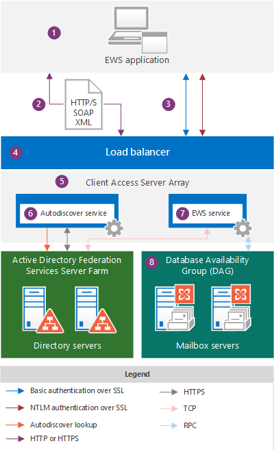

# Aplicaciones de EWS y la arquitectura de Exchange

Obtenga información sobre cómo funciona EWS en la arquitectura de Exchange y conozca los protocolos en los que se basa EWS.
  
Servicios web Exchange (EWS) es una API multiplataforma que permite a las aplicaciones tener acceso a elementos de buzón, como mensajes de correo electrónico, reuniones y contactos de Exchange Online, Exchange online como parte de Office 365 o versiones locales de Exchange a partir de Exchange Server 2007. [Las aplicaciones de EWS](ews-application-types.md) pueden tener acceso a elementos de buzón de correo de forma local o remota mediante el envío de una solicitud en un mensaje XML basado en SOAP. El mensaje SOAP se incrusta en un mensaje HTTP cuando se envía entre la aplicación y el servidor, lo que significa que, siempre que la aplicación pueda publicar XML a través de HTTP, puede usar EWS para tener acceso a Exchange. 
  
## Información general sobre la arquitectura de Exchange

Los siguientes diagramas muestran los métodos de autenticación y las rutas de comunicación que usan las aplicaciones de EWS al comunicarse con Exchange 2013 y Exchange Online. Desde el punto de vista de la aplicación de EWS, las rutas de comunicación son idénticas y los métodos de autenticación solo varían ligeramente; la principal diferencia es la visibilidad que tiene en el back-end de Exchange.
  
**Figura 1. La aplicación EWS y la arquitectura local de Exchange**

  
En la figura 2, se muestran las mismas rutas de comunicación que se muestran en la figura 1, tal y como se usan en las aplicaciones de EWS al comunicarse con Exchange Online.
  
**Figura 2. Aplicación EWS y la arquitectura de Exchange Online**

  
Los siguientes son los componentes que se muestran en los diagramas:
  
1. Aplicación de EWS: puede ser un [cliente, un portal o una aplicación de servicio](ews-application-types.md) , y se puede instalar en un cliente o en un servidor de acceso de cliente de Exchange local. Si usa la API administrada de EWS para desarrollar la aplicación de EWS, los ensamblados de la API administrada de EWS deben instalarse en el cliente y [redistribuirse mediante la aplicación](redistribution-requirements-for-the-ews-managed-api.md).
    
2. El mensaje XML SOAP (un mensaje XML, en un envoltorio SOAP) incrustado en un mensaje HTTP/S que se ajusta al archivo Services. wsdl en el servidor de acceso de cliente. Se recomienda HTTPS para Exchange local y es necesario para Exchange Online. 
    
3. Métodos de autenticación: los mensajes de EWS incluyen la información de autenticación básica, NTLM (autenticación de Windows integrada) o OAuth como parte de la carga HTTP. 
    
4. Equilibrador de carga: el equilibrador de carga distribuye el mensaje a un servidor de acceso de cliente en la matriz de servidores de acceso de cliente. Este componente solo es visible en la arquitectura local de Exchange.
    
5. Matriz de servidor de acceso de cliente: los servidores de acceso de cliente se organizan en un grupo de carga equilibrada denominado matriz de servidores de acceso de cliente. Los servidores de acceso de cliente individuales proporcionan autenticación, redirección limitada y servicios proxy. Los servidores de acceso de cliente por sí mismos no realizan ninguna representación de datos y los datos no se colocan en la cola ni se almacenan en un servidor de acceso de cliente: es delgado y sin estado; simplemente, autentica la solicitud, realiza una búsqueda de detección automática y, a continuación, envía la solicitud de proxy al servidor de buzones. El servidor de acceso de cliente mantiene una relación de 1:1 con el servidor de buzones de correo que hospeda los datos del usuario. El protocolo HTTP (protegido mediante SSL con un certificado autofirmado) se usa entre el servidor de acceso de cliente y el servidor de buzones de correo. Este componente solo es visible en la arquitectura local de Exchange.
    
6. Servicio Detección automática: el servicio de detección automática realiza una detección de servicios mediante el acceso a servicios de dominio de Active Directory (AD DS) para recuperar la versión del buzón y la ubicación del servidor de buzones de correo que hospeda la copia activa de los datos del usuario.
    
7. Servicio EWS: el servicio EWS se describe mediante tres archivos: Services. wsdl, messages. xsd y Types. xsd, así como los ensamblados de la API administrada de EWS. Services. wsdl describe el contrato entre el cliente y el servidor, messages. xsd define los mensajes SOAP de solicitud y respuesta, y Types. xsd define los elementos que se usan en los mensajes SOAP. Messages. xsd y Types. xsd siempre contienen las versiones más recientes del esquema, aunque existen versiones anteriores del esquema. Tenga en cuenta que Services. wsdl, messages. xsd y Types. xsd están disponibles en el servidor de acceso de cliente, pero en realidad no se usan para la validación de esquema; se proporcionan solo como referencia. Los ensamblados de la API administrada de EWS se proporcionan para las aplicaciones cliente de EWS del lado servidor y se implementan en todos los roles de servidor de Exchange, no solo en los servidores de acceso de cliente. Este componente solo es visible en la arquitectura local de Exchange.
    
    La disponibilidad de la característica se basa en la versión del esquema EWS a la que se destina la aplicación. Como los esquemas EWS son compatibles con versiones anteriores y posteriores, si se crea una aplicación destinada a una versión de esquema anterior, como Exchange 2007 SP1, la aplicación también funcionará con una versión de esquema posterior, como el servicio Exchange 2010 SP2, así como Exchange Online. Debido a que el esquema controla las características y las actualizaciones de características, le recomendamos que use la base de código común más temprana que tenga como objetivo las características de EWS que desea implementar en la aplicación cliente. Muchas aplicaciones pueden dirigirse a la versión Exchange2007_SP1, ya que el esquema de Exchange 2007 SP1 contiene casi todas las funciones principales de Exchange para trabajar con elementos y carpetas en el almacén de Exchange. Para obtener más información, consulte [características de cliente de EWS](ews-client-design-overview-for-exchange.md#EWSFeatures).
    
8. Grupo de disponibilidad de base de datos (DAG): los servidores de buzones de correo se organizan en un DAG de alta disponibilidad, que se puede implementar en uno o varios centros de datos. El servidor de buzones de correo contiene la base de datos de buzones y controla toda la actividad de los buzones activos de ese servidor. Todos los componentes que procesan, procesan y almacenan datos se encuentran en el servidor de buzones de correo. Los clientes no se conectan directamente al servidor de buzones de correo; el servidor de acceso de cliente controla todas las conexiones. Este componente solo es visible en la arquitectura local de Exchange.
    
9. Exchange Online y Exchange online como parte de Office 365: la solución de mensajería hospedada que ofrece características de Exchange como servicio basado en la nube.
    
Cuando una aplicación de EWS solicita información del almacén de Exchange, se crea un mensaje de solicitud XML que cumple con el estándar SOAP y se envía al servidor Exchange. Cuando el servidor Exchange recibe la solicitud, comprueba las credenciales proporcionadas por el cliente y analiza automáticamente el código XML de los datos solicitados. A continuación, el servidor crea una respuesta SOAP que contiene datos XML que representan los objetos con establecimiento inflexible de tipos solicitados y sus propiedades. Los datos XML se envían de nuevo a la aplicación en una respuesta HTTP. A continuación, la aplicación deserializa el XML y utiliza los datos para rereforma los objetos con establecimiento inflexible de tipos.
  
## Protocolos y estándares que las aplicaciones EWS deben admitir

Para comunicarse con un servidor de Exchange, las aplicaciones de EWS deben admitir los siguientes protocolos y estándares.
  
**Tabla 1. Protocolos**

|**Protocolo**|**Cómo se usa**|
|:-----|:-----|
|HTTP/S    |Permite a las aplicaciones de EWS el acceso a los datos de bases de datos de Exchange a través de la red, independientemente de si el cliente está en Internet o en una intranet.    |
|SOAP 1,0    |Constituye un sobre en torno a la carga de mensajería. EWS implementa el protocolo SOAP mediante el uso de diferentes partes del envoltorio SOAP para habilitar distintas funciones. El encabezado SOAP se usa para la suplantación y para proporcionar datos de control de versiones. El cuerpo SOAP proporciona información sobre la operación que se va a ejecutar y los datos que se envían a la operación. SOAP se basa en WSDL para describir las operaciones que se deben llamar.    |
|WSDL 1,0    |Describe los enlaces, las operaciones y las propiedades que se usan para llamar a las operaciones de EWS en el archivo Services. wsdl. Este archivo, junto con los archivos de esquema a los que se hace referencia, incluye el contrato entre una aplicación de EWS y el servidor de Exchange, y a menudo se usa junto con herramientas específicas del proveedor para crear aplicaciones específicas para cada plataforma. El archivo WSDL se encuentra en el directorio virtual EWS, que se encuentra en la raíz del sitio Web.    |
|Seguridad de la capa de transporte (TLS)/SSL    |Proporciona comunicaciones web seguras en Internet o en la intranet. TLS permite que las aplicaciones autentiquen servidores o, de manera opcional, que los servidores autentiquen las aplicaciones de EWS. También proporciona un canal de seguridad mediante el cifrado de las comunicaciones. TLS is the latest version of the Secure Sockets Layer (SSL) protocol.    |
|XML/XSD    |Proporciona un formato de mensaje universal para el intercambio de información entre el servidor de Exchange y el cliente. XML proporciona datos de bases de datos de Exchange complejos a las aplicaciones cliente, pero en una estructura definida. La belleza de XML es que permite el intercambio de datos incluso cuando una aplicación y un servidor de EWS no comparten una plataforma común.    |
   
Además, las aplicaciones de EWS deben admitir los siguientes estándares de autenticación:
  
- Autenticación básica sobre SSL, para aplicaciones dirigidas a Exchange online o Exchange local.
    
- Autenticación NTLM sobre SSL, para aplicaciones compatibles con Exchange local.
    
- Autenticación OAuth 2,0 token, para aplicaciones de asociados de confianza e interoperabilidad con Lync Server 2013 y SharePoint Server 2013.
    
## Vea también

- [Empezar a usar los servicios web de Exchange](start-using-web-services-in-exchange.md)
    
- [Tipos de aplicación de EWS](ews-application-types.md)
    
- [Introducción al diseño de EWS cliente de Exchange](ews-client-design-overview-for-exchange.md)
    

