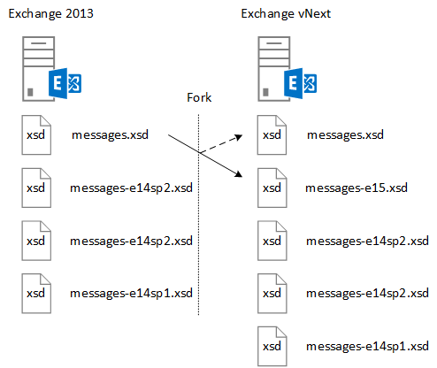

# <a name="ews-schema-versions-in-exchange"></a><span data-ttu-id="e94d2-103">Versiones de esquema EWS en Exchange</span><span class="sxs-lookup"><span data-stu-id="e94d2-103">EWS schema versions in Exchange</span></span>

<span data-ttu-id="e94d2-104">Obtenga información sobre la dirección URL de EWS esquema y el diseño de la aplicación para que funcione con él, así como las características que están disponibles con cada versión del esquema y cómo se relaciona con el esquema a la versión de servicio de Exchange.</span><span class="sxs-lookup"><span data-stu-id="e94d2-104">Learn about the EWS schema and how to design your application to work with it, as well as the features that are available with each schema version, and how the schema relates to the Exchange service version.</span></span>
  
<span data-ttu-id="e94d2-105">El esquema EWS define las estructuras de datos que se pueden enviar a y devueltas por Exchange.</span><span class="sxs-lookup"><span data-stu-id="e94d2-105">The EWS schema defines the data structures that can be sent to and returned by Exchange.</span></span> <span data-ttu-id="e94d2-106">Cada nueva versión de Exchange que contiene un cambio significativo a la funcionalidad EWS contendrá un nuevo esquema.</span><span class="sxs-lookup"><span data-stu-id="e94d2-106">Each new version of Exchange that contains a significant change to EWS functionality will contain a new schema.</span></span> <span data-ttu-id="e94d2-107">EWS y el esquema EWS son ambos con versiones anteriores y en algunos casos, compatible con el reenvío - aplicaciones diseñadas para versiones anteriores de EWS funcionará, en la mayoría de los casos, con las versiones posteriores de EWS, y las aplicaciones que estén destinados a versiones posteriores de EWS funcionará si el mismo la funcionalidad se ha incluido en una versión anterior.</span><span class="sxs-lookup"><span data-stu-id="e94d2-107">EWS and the EWS schema are both backward, and in some cases, forward compatible - applications designed against earlier versions of EWS will work, in most cases, with later versions of EWS, and applications that target later versions of EWS will work if the same functionality was included in an earlier version.</span></span> <span data-ttu-id="e94d2-108">En este artículo le ayudará a comprender la función del esquema EWS, cómo funciona el control de versiones de esquema, la relación entre la versión del esquema y la versión de servicio y el diseño de la aplicación para que funcione con el esquema EWS.</span><span class="sxs-lookup"><span data-stu-id="e94d2-108">This article will help you understand the role of the EWS schema, how schema versioning works, the relationship between the schema version and the service version, and how to design your application to work with the EWS schema.</span></span> 
  
## <a name="role-of-the-ews-schema"></a><span data-ttu-id="e94d2-109">Rol del esquema EWS</span><span class="sxs-lookup"><span data-stu-id="e94d2-109">Role of the EWS schema</span></span>

<span data-ttu-id="e94d2-110">El esquema EWS hace lo siguiente:</span><span class="sxs-lookup"><span data-stu-id="e94d2-110">The EWS schema does the following:</span></span>
  
- <span data-ttu-id="e94d2-111">Define el conjunto de características que está disponible para un cliente.</span><span class="sxs-lookup"><span data-stu-id="e94d2-111">Defines the feature set that is available to a client.</span></span> <span data-ttu-id="e94d2-112">Un cliente puede obtener la lista de las versiones de esquema compatibles con el [servicio de detección automática](autodiscover-for-exchange.md)SOAP.</span><span class="sxs-lookup"><span data-stu-id="e94d2-112">A client can get the list of the supported schema versions by using the SOAP [Autodiscover service](autodiscover-for-exchange.md).</span></span> <span data-ttu-id="e94d2-113">El cliente, a continuación, puede determinar las características que puede obtener acceso, ya que cada versión del esquema representa un [conjunto de características EWS](ews-schema-versions-in-exchange.md#bk_features).</span><span class="sxs-lookup"><span data-stu-id="e94d2-113">The client can then determine which features it can access, because each schema version represents an [EWS feature set](ews-schema-versions-in-exchange.md#bk_features).</span></span> <span data-ttu-id="e94d2-114">Cada nuevo esquema publicado para EWS contiene las entidades de esquema de la versión anterior además de las definiciones de esquema para cualquier nueva funcionalidad.</span><span class="sxs-lookup"><span data-stu-id="e94d2-114">Each new schema released for EWS contains of the schema entities from the previous version plus the schema definitions for any new functionality.</span></span> <span data-ttu-id="e94d2-115">De este modo, EWS es compatible con las aplicaciones que estén destinados a una versión anterior de EWS.</span><span class="sxs-lookup"><span data-stu-id="e94d2-115">This way, EWS supports applications that target an earlier version of EWS.</span></span>
    
- <span data-ttu-id="e94d2-116">Proporciona una descripción general del contrato de API.</span><span class="sxs-lookup"><span data-stu-id="e94d2-116">Provides a general description of the API contract.</span></span> <span data-ttu-id="e94d2-117">Puede usar este contrato para determinar las estructuras de datos que se pueden enviar a y recibidas de Exchange.</span><span class="sxs-lookup"><span data-stu-id="e94d2-117">You can use this contract to determine the data structures that can be sent to and received from Exchange.</span></span>
    
- <span data-ttu-id="e94d2-118">Proporciona un mecanismo de control de versiones para el envío de solicitudes.</span><span class="sxs-lookup"><span data-stu-id="e94d2-118">Provides a versioning mechanism for sending requests.</span></span> <span data-ttu-id="e94d2-119">El servidor de Exchange contiene todas las versiones de esquema EWS compatibles en su directorio virtual.</span><span class="sxs-lookup"><span data-stu-id="e94d2-119">The Exchange server contains all the supported EWS schema versions in its virtual directory.</span></span> 
    
## <a name="designing-your-application-with-schema-version-in-mind"></a><span data-ttu-id="e94d2-120">Diseño de la aplicación con la versión del esquema en mente</span><span class="sxs-lookup"><span data-stu-id="e94d2-120">Designing your application with schema version in mind</span></span>

<span data-ttu-id="e94d2-121">Al diseñar su aplicación para que funcione con distintas versiones del esquema EWS, tenga en cuenta los puntos siguientes:</span><span class="sxs-lookup"><span data-stu-id="e94d2-121">Keep the following points in mind as you design your application to work with different versions of the EWS schema:</span></span>
  
- <span data-ttu-id="e94d2-122">Activar o desactivar la funcionalidad basada en la versión del esquema.</span><span class="sxs-lookup"><span data-stu-id="e94d2-122">Turn on/off functionality based on the schema version.</span></span> <span data-ttu-id="e94d2-123">Desea asignar la funcionalidad de cliente a la versión del esquema y, en algunos casos, a la versión del servicio.</span><span class="sxs-lookup"><span data-stu-id="e94d2-123">You'll want to map client functionality to the schema version and, in some cases, to the version of the service.</span></span> <span data-ttu-id="e94d2-124">En el ejemplo siguiente, se devolverá que un [PropertySet](http://msdn.microsoft.com/en-us/library/office/microsoft.exchange.webservices.data.propertyset%28v=exchg.80%29.aspx) en función de la versión del esquema y de servicio.</span><span class="sxs-lookup"><span data-stu-id="e94d2-124">The following example will return a [PropertySet](http://msdn.microsoft.com/en-us/library/office/microsoft.exchange.webservices.data.propertyset%28v=exchg.80%29.aspx) based on the version of the schema and service.</span></span> 
    
  ```cs
  private static PropertySet InitPropertySetByVersion(ExchangeService service)
  {
      PropertySet props;
      // The schema version to target to access the NormalizedBody property 
      // is Exchange2013 or later. The server version to target to access the 
      // NormalizedBody property on an email is 15 or later, which 
      // equates to Exchange 2013.
      if (service.RequestedServerVersion >= ExchangeVersion.Exchange2013 &amp;&amp;
          service.ServerInfo.MajorVersion >= 15)
      {
          props = new PropertySet(EmailMessageSchema.NormalizedBody);
      }
      else
      {
          props = new PropertySet(EmailMessageSchema.Body);
      }
      return props;
  }
  ```

- <span data-ttu-id="e94d2-125">Versión de las solicitudes con la versión más antigua del esquema EWS que admite la funcionalidad que desea usar.</span><span class="sxs-lookup"><span data-stu-id="e94d2-125">Version your requests with the earliest version of the EWS schema that supports the functionality you want to use.</span></span> <span data-ttu-id="e94d2-126">Esto hará que el cliente aplicables a un número mayor de posibles servidores de Exchange.</span><span class="sxs-lookup"><span data-stu-id="e94d2-126">This will make your client applicable to a larger number of potential Exchange servers.</span></span> <span data-ttu-id="e94d2-127">Esto es menos importante si está desarrollando una aplicación de línea de negocio a sólo los servidores de la organización de destino, pero es muy importante si va a crear una aplicación para un público más amplio de Exchange.</span><span class="sxs-lookup"><span data-stu-id="e94d2-127">This is less important if you're developing a line-of-business application to target your organization's servers only, but is very important if you're building an application for a wider Exchange audience.</span></span>
    
## <a name="features-by-schema-version"></a><span data-ttu-id="e94d2-128">Características por versión del esquema</span><span class="sxs-lookup"><span data-stu-id="e94d2-128">Features by schema version</span></span>
<span data-ttu-id="e94d2-129"><a name="bk_features"> </a></span><span class="sxs-lookup"><span data-stu-id="e94d2-129"></span></span>

<span data-ttu-id="e94d2-130">Se identifican las versiones de esquema que están disponibles para un cliente en el tipo simple de **ExchangeVersionType** que se encuentra en el esquema de types.xsd.</span><span class="sxs-lookup"><span data-stu-id="e94d2-130">The schema versions that are available to a client are identified in the **ExchangeVersionType** simple type located in the types.xsd schema.</span></span> <span data-ttu-id="e94d2-131">El **ExchangeVersionType** se implementa mediante el elemento [RequestServerVersion](http://msdn.microsoft.com/library/af4032d5-42b3-463e-9d0a-8236d78e5b75%28Office.15%29.aspx) .</span><span class="sxs-lookup"><span data-stu-id="e94d2-131">The **ExchangeVersionType** is implemented by the [RequestServerVersion](http://msdn.microsoft.com/library/af4032d5-42b3-463e-9d0a-8236d78e5b75%28Office.15%29.aspx) element.</span></span> <span data-ttu-id="e94d2-132">El elemento **RequestServerVersion** se envía en todas las solicitudes EWS para indicar al servidor de la versión del esquema de los destinos de cliente.</span><span class="sxs-lookup"><span data-stu-id="e94d2-132">The **RequestServerVersion** element is sent in all EWS requests to indicate to the server which version of the schema the client targets.</span></span> <span data-ttu-id="e94d2-133">Esto identifica a su vez el conjunto de características que está disponible para el cliente.</span><span class="sxs-lookup"><span data-stu-id="e94d2-133">This in turn identifies the feature set that is available to the client.</span></span> 
  
<span data-ttu-id="e94d2-134">**Tabla 1: Características EWS por versión del producto y esquema**</span><span class="sxs-lookup"><span data-stu-id="e94d2-134">**Table 1: EWS features by product and schema version**</span></span>

|<span data-ttu-id="e94d2-135">**Versión del producto**</span><span class="sxs-lookup"><span data-stu-id="e94d2-135">**Product version**</span></span>|<span data-ttu-id="e94d2-136">**Versión del esquema asociado**</span><span class="sxs-lookup"><span data-stu-id="e94d2-136">**Associated schema version**</span></span>|<span data-ttu-id="e94d2-137">**Características**</span><span class="sxs-lookup"><span data-stu-id="e94d2-137">**Features**</span></span>|
|:-----|:-----|:-----|
|<span data-ttu-id="e94d2-138">Exchange Online</span><span class="sxs-lookup"><span data-stu-id="e94d2-138">Exchange Online</span></span>  |<span data-ttu-id="e94d2-139">La versión más reciente del esquema.</span><span class="sxs-lookup"><span data-stu-id="e94d2-139">The latest schema version.</span></span>  |<span data-ttu-id="e94d2-140">Incluye todas las características de la versión actual de Exchange, además de todas las características nuevas que se agregan para los clientes en línea.</span><span class="sxs-lookup"><span data-stu-id="e94d2-140">Includes all the features in the current version of Exchange in addition to any new features that are added for online clients.</span></span> |
|<span data-ttu-id="e94d2-141">Exchange 2013 SP1</span><span class="sxs-lookup"><span data-stu-id="e94d2-141">Exchange 2013 SP1</span></span> |<span data-ttu-id="e94d2-142">Exchange2013_SP1</span><span class="sxs-lookup"><span data-stu-id="e94d2-142">Exchange2013_SP1</span></span> | <span data-ttu-id="e94d2-143">Incluye todas las características de Exchange 2013.</span><span class="sxs-lookup"><span data-stu-id="e94d2-143">Includes all the features in Exchange 2013.</span></span><br/><br/><span data-ttu-id="e94d2-144">Las siguientes características se introdujeron en Exchange 2013 SP1:</span><span class="sxs-lookup"><span data-stu-id="e94d2-144">The following features were introduced in Exchange 2013 SP1:</span></span> <ul><li>[<span data-ttu-id="e94d2-145">Directiva de retención de buzón de correo</span><span class="sxs-lookup"><span data-stu-id="e94d2-145">Mailbox hold policy</span></span>](http://msdn.microsoft.com/en-us/library/office/microsoft.exchange.webservices.data.exchangeservice.setholdonmailboxes%28v=exchg.80%29.aspx) </li><li> [<span data-ttu-id="e94d2-146">Proponer una nueva hora</span><span class="sxs-lookup"><span data-stu-id="e94d2-146">Propose new time</span></span>](how-to-propose-a-new-meeting-time-by-using-ews-in-exchange.md) </li><li>  <span data-ttu-id="e94d2-147">Actualizaciones de confirmación de [actualización](http://msdn.microsoft.com/EN-US/library/office/dn600559%28v=exchg.80%29.aspx) y [eliminación de](http://msdn.microsoft.com/EN-US/library/office/dn600557%28v=exchg.80%29.aspx) elementos de lectura</span><span class="sxs-lookup"><span data-stu-id="e94d2-147">Read receipt updates for [updating](http://msdn.microsoft.com/EN-US/library/office/dn600559%28v=exchg.80%29.aspx) and [deleting](http://msdn.microsoft.com/EN-US/library/office/dn600557%28v=exchg.80%29.aspx) items</span></span>  </li><li> <span data-ttu-id="e94d2-148">Actualización de la [información de IRM](http://msdn.microsoft.com/EN-US/library/office/microsoft.exchange.webservices.data.conversation.hasirm%28v=exchg.80%29.aspx) para las conversaciones</span><span class="sxs-lookup"><span data-stu-id="e94d2-148">[IRM information](http://msdn.microsoft.com/EN-US/library/office/microsoft.exchange.webservices.data.conversation.hasirm%28v=exchg.80%29.aspx) update for conversations</span></span>  </li></ul> |
|<span data-ttu-id="e94d2-149">Exchange 2013</span><span class="sxs-lookup"><span data-stu-id="e94d2-149">Exchange 2013</span></span>   |<span data-ttu-id="e94d2-150">Exchange2013</span><span class="sxs-lookup"><span data-stu-id="e94d2-150">Exchange2013</span></span>   | <span data-ttu-id="e94d2-151">Incluye todas las características introducidas en Exchange 2007 y Exchange 2010.</span><span class="sxs-lookup"><span data-stu-id="e94d2-151">Includes all features introduced in Exchange 2007 and Exchange 2010.</span></span> <br/><br/><span data-ttu-id="e94d2-152">Las siguientes características se introdujeron en Exchange 2013:</span><span class="sxs-lookup"><span data-stu-id="e94d2-152">The following features were introduced in Exchange 2013:</span></span><ul><li><span data-ttu-id="e94d2-153">Archivado</span><span class="sxs-lookup"><span data-stu-id="e94d2-153">Archiving</span></span>  </li><li>  <span data-ttu-id="e94d2-154">eDiscovery</span><span class="sxs-lookup"><span data-stu-id="e94d2-154">eDiscovery</span></span>  </li><li>  <span data-ttu-id="e94d2-155">Personas</span><span class="sxs-lookup"><span data-stu-id="e94d2-155">Personas</span></span>  </li><li>  <span data-ttu-id="e94d2-156">Directivas de retención</span><span class="sxs-lookup"><span data-stu-id="e94d2-156">Retention policies</span></span>  </li><li>  <span data-ttu-id="e94d2-157">Almacén de contactos unificados</span><span class="sxs-lookup"><span data-stu-id="e94d2-157">Unified Contact Store</span></span>  </li><li>  <span data-ttu-id="e94d2-158">Fotos de usuario</span><span class="sxs-lookup"><span data-stu-id="e94d2-158">User photos</span></span>  </li></ul> |
|<span data-ttu-id="e94d2-159">Exchange 2010 SP2</span><span class="sxs-lookup"><span data-stu-id="e94d2-159">Exchange 2010 SP2</span></span>   |<span data-ttu-id="e94d2-160">Exchange2010_SP2</span><span class="sxs-lookup"><span data-stu-id="e94d2-160">Exchange2010_SP2</span></span> | <span data-ttu-id="e94d2-161">Incluye todas las características introducidas en Exchange 2010 SP1.</span><span class="sxs-lookup"><span data-stu-id="e94d2-161">Includes all the features introduced in Exchange 2010 SP1.</span></span> <br/><br/><span data-ttu-id="e94d2-162">Las siguientes características se introdujeron en Exchange 2010 SP2:</span><span class="sxs-lookup"><span data-stu-id="e94d2-162">The following features were introduced in Exchange 2010 SP2:</span></span><ul><li><span data-ttu-id="e94d2-163">Obtener la expiración de contraseña</span><span class="sxs-lookup"><span data-stu-id="e94d2-163">Get Password Expiration</span></span>  </li><li>  <span data-ttu-id="e94d2-164">Precisión de fecha y hora</span><span class="sxs-lookup"><span data-stu-id="e94d2-164">DateTime precision</span></span>  </li><li>  <span data-ttu-id="e94d2-165">Identificadores de propiedad actualizada para los contactos</span><span class="sxs-lookup"><span data-stu-id="e94d2-165">Updated property identifiers for contacts</span></span>  </li><li>  <span data-ttu-id="e94d2-166">Nuevos escenarios de suplantación</span><span class="sxs-lookup"><span data-stu-id="e94d2-166">New impersonation scenarios</span></span>  </li></ul> |
|<span data-ttu-id="e94d2-167">Exchange 2010 SP1</span><span class="sxs-lookup"><span data-stu-id="e94d2-167">Exchange 2010 SP1</span></span>  |<span data-ttu-id="e94d2-168">Exchange2010_SP1</span><span class="sxs-lookup"><span data-stu-id="e94d2-168">Exchange2010_SP1</span></span>   | <span data-ttu-id="e94d2-169">Incluye todas las características introducidas en Exchange 2010.</span><span class="sxs-lookup"><span data-stu-id="e94d2-169">Includes all the features introduced in Exchange 2010.</span></span> <br/><br/><span data-ttu-id="e94d2-170">Las siguientes características se introdujeron en Exchange 2010 SP1:</span><span class="sxs-lookup"><span data-stu-id="e94d2-170">The following features were introduced in Exchange 2010 SP1:</span></span><ul><li><span data-ttu-id="e94d2-171">Crear, recuperar y modificar las reglas de bandeja de entrada</span><span class="sxs-lookup"><span data-stu-id="e94d2-171">Create, retrieve and modify Inbox rules</span></span>  </li><li>  <span data-ttu-id="e94d2-172">Acceso mediante programación a buzón de archivo</span><span class="sxs-lookup"><span data-stu-id="e94d2-172">Programmatic access to Archive Mailbox</span></span>  </li><li>  <span data-ttu-id="e94d2-173">Acciones de conversaciones</span><span class="sxs-lookup"><span data-stu-id="e94d2-173">Conversations actions</span></span>  </li><li>  <span data-ttu-id="e94d2-174">Recorrido de las notificaciones del Firewall</span><span class="sxs-lookup"><span data-stu-id="e94d2-174">Firewall traversing notifications</span></span>  </li><li>  <span data-ttu-id="e94d2-175">Características de administración mejoradas</span><span class="sxs-lookup"><span data-stu-id="e94d2-175">Improved administration features</span></span>  </li><li>  <span data-ttu-id="e94d2-176">Compatibilidad de versión mixta mejorada</span><span class="sxs-lookup"><span data-stu-id="e94d2-176">Improved mixed version support</span></span>  </li><li>  <span data-ttu-id="e94d2-177">Limitación de peticiones de soporte técnico de protección</span><span class="sxs-lookup"><span data-stu-id="e94d2-177">Throttling protection support</span></span>  </li><li>  <span data-ttu-id="e94d2-178">Control de acceso de la aplicación a EWS</span><span class="sxs-lookup"><span data-stu-id="e94d2-178">Control of application access to EWS</span></span>  </li><li>  <span data-ttu-id="e94d2-179">Compatibilidad con la autenticación de certificado de cliente</span><span class="sxs-lookup"><span data-stu-id="e94d2-179">Client certificate authentication support</span></span>  </li></ul> |
|<span data-ttu-id="e94d2-180">Exchange 2010</span><span class="sxs-lookup"><span data-stu-id="e94d2-180">Exchange 2010</span></span>  |<span data-ttu-id="e94d2-181">Exchange2010</span><span class="sxs-lookup"><span data-stu-id="e94d2-181">Exchange2010</span></span>   | <span data-ttu-id="e94d2-182">Incluye todas las características introducidas en Exchange 2007 SP1.</span><span class="sxs-lookup"><span data-stu-id="e94d2-182">Includes all features introduced in Exchange 2007 SP1.</span></span> <br/><br/><span data-ttu-id="e94d2-183">Las siguientes características se introdujeron en la versión inicial de Exchange 2010:</span><span class="sxs-lookup"><span data-stu-id="e94d2-183">The following features were introduced in the initial release version of Exchange 2010:</span></span><ul><li><span data-ttu-id="e94d2-184">Lista de distribución privada completa</span><span class="sxs-lookup"><span data-stu-id="e94d2-184">Full Private Distribution List</span></span>  </li><li>  <span data-ttu-id="e94d2-185">Objetos de configuración de usuario</span><span class="sxs-lookup"><span data-stu-id="e94d2-185">User Configuration Objects</span></span>  </li><li>  <span data-ttu-id="e94d2-186">Carpeta elementos asociados</span><span class="sxs-lookup"><span data-stu-id="e94d2-186">Folder Associated Items</span></span>  </li><li>  <span data-ttu-id="e94d2-187">Seguimiento de mensajes</span><span class="sxs-lookup"><span data-stu-id="e94d2-187">Message tracking</span></span>  </li><li>  <span data-ttu-id="e94d2-188">Mensajería unificada</span><span class="sxs-lookup"><span data-stu-id="e94d2-188">Unified Messaging</span></span>  </li><li>  <span data-ttu-id="e94d2-189">Detección automática de SOAP</span><span class="sxs-lookup"><span data-stu-id="e94d2-189">SOAP Autodiscover</span></span>  </li><li>  <span data-ttu-id="e94d2-190">Compatibilidad mejorada con la zona horaria</span><span class="sxs-lookup"><span data-stu-id="e94d2-190">Enhanced Time Zone support</span></span>  </li><li>  <span data-ttu-id="e94d2-191">Información de disponibilidad de recursos de sala</span><span class="sxs-lookup"><span data-stu-id="e94d2-191">Room resource availability information</span></span>  </li><li>  <span data-ttu-id="e94d2-192">Búsqueda indizado</span><span class="sxs-lookup"><span data-stu-id="e94d2-192">Indexed search</span></span>  </li><li>  <span data-ttu-id="e94d2-193">Acceso de volcado de archivos</span><span class="sxs-lookup"><span data-stu-id="e94d2-193">Dumpster access</span></span>  </li><li>  <span data-ttu-id="e94d2-194">Información de sugerencias de correo electrónico</span><span class="sxs-lookup"><span data-stu-id="e94d2-194">MailTips information</span></span>  </li></ul> |
|<span data-ttu-id="e94d2-195">Exchange 2007 SP1</span><span class="sxs-lookup"><span data-stu-id="e94d2-195">Exchange 2007 SP1</span></span>   |<span data-ttu-id="e94d2-196">Exchange2007_SP1</span><span class="sxs-lookup"><span data-stu-id="e94d2-196">Exchange2007_SP1</span></span>  | <span data-ttu-id="e94d2-197">Incluye todas las características introducidas en Exchange 2007.</span><span class="sxs-lookup"><span data-stu-id="e94d2-197">Includes all the features introduced in Exchange 2007.</span></span> <br/><br/><span data-ttu-id="e94d2-198">Las siguientes características se introdujeron en Exchange 2007 SP1:</span><span class="sxs-lookup"><span data-stu-id="e94d2-198">The following features were introduced in Exchange 2007 SP1:</span></span><ul><li><span data-ttu-id="e94d2-199">Delegar la administración</span><span class="sxs-lookup"><span data-stu-id="e94d2-199">Delegate management</span></span>  </li><li>  <span data-ttu-id="e94d2-200">Permisos de carpeta</span><span class="sxs-lookup"><span data-stu-id="e94d2-200">Folder permissions</span></span>  </li><li>  <span data-ttu-id="e94d2-201">Carpetas públicas</span><span class="sxs-lookup"><span data-stu-id="e94d2-201">Public folders</span></span>  </li><li>  <span data-ttu-id="e94d2-202">Elementos para exponer</span><span class="sxs-lookup"><span data-stu-id="e94d2-202">Post items</span></span>  </li><li>  <span data-ttu-id="e94d2-203">Conversión de Id.</span><span class="sxs-lookup"><span data-stu-id="e94d2-203">ID conversion</span></span>  </li></ul>|
|<span data-ttu-id="e94d2-204">Exchange 2007</span><span class="sxs-lookup"><span data-stu-id="e94d2-204">Exchange 2007</span></span>  |<span data-ttu-id="e94d2-205">Exchange2007</span><span class="sxs-lookup"><span data-stu-id="e94d2-205">Exchange2007</span></span> | <span data-ttu-id="e94d2-206">Las siguientes características se introdujeron en la versión inicial de Exchange 2007:</span><span class="sxs-lookup"><span data-stu-id="e94d2-206">The following features were introduced in the initial release version of Exchange 2007:</span></span><ul><li><span data-ttu-id="e94d2-207">Acceso total a los elementos, carpetas y datos adjuntos (crear, Get, Update, Delete)</span><span class="sxs-lookup"><span data-stu-id="e94d2-207">Full access to items, folders, and attachments (Create, Get, Update, Delete)</span></span>  </li><li>  <span data-ttu-id="e94d2-208">Disponibilidad</span><span class="sxs-lookup"><span data-stu-id="e94d2-208">Availability</span></span>  </li><li>  <span data-ttu-id="e94d2-209">Fuera de la configuración de Office</span><span class="sxs-lookup"><span data-stu-id="e94d2-209">Out of Office settings</span></span>  </li><li>  <span data-ttu-id="e94d2-210">Notificaciones</span><span class="sxs-lookup"><span data-stu-id="e94d2-210">Notifications</span></span>  </li><li>  <span data-ttu-id="e94d2-211">Sincronización</span><span class="sxs-lookup"><span data-stu-id="e94d2-211">Synchronization</span></span>  </li><li>  <span data-ttu-id="e94d2-212">Resolución de nombres</span><span class="sxs-lookup"><span data-stu-id="e94d2-212">Name resolution</span></span>  </li><li>  <span data-ttu-id="e94d2-213">Expansión de distribución (DL) de la lista</span><span class="sxs-lookup"><span data-stu-id="e94d2-213">Distribution list (DL) expansion</span></span>  </li><li>  <span data-ttu-id="e94d2-214">B?squeda</span><span class="sxs-lookup"><span data-stu-id="e94d2-214">Search</span></span>  </li></ul> |
   
## <a name="relationship-between-the-ews-schema-and-the-service-version"></a><span data-ttu-id="e94d2-215">Relación entre el esquema de EWS y la versión de servicio</span><span class="sxs-lookup"><span data-stu-id="e94d2-215">Relationship between the EWS schema and the service version</span></span>
<span data-ttu-id="e94d2-216"><a name="bk_features"> </a></span><span class="sxs-lookup"><span data-stu-id="e94d2-216"></span></span>

<span data-ttu-id="e94d2-217">La versión del esquema EWS está relacionada con la versión del servicio de EWS que ejecuta el servidor.</span><span class="sxs-lookup"><span data-stu-id="e94d2-217">The EWS schema version is related to the version of the EWS service that the server is running.</span></span> <span data-ttu-id="e94d2-218">El modelo de nomenclatura para el esquema EWS está relacionada con las versiones locales de Exchange.</span><span class="sxs-lookup"><span data-stu-id="e94d2-218">The naming pattern for the EWS schema is related to the on-premises versions of Exchange.</span></span> <span data-ttu-id="e94d2-219">Por ejemplo, la versión inicial de Exchange 2013 tiene una versión de servicio de 15.00.0516.032 y el nombre de esquema **Exchange2013**.</span><span class="sxs-lookup"><span data-stu-id="e94d2-219">For example, the initial release of Exchange 2013 has a service version of 15.00.0516.032 and the schema name **Exchange2013**.</span></span> <span data-ttu-id="e94d2-220">Debido a que el esquema se ha actualizado para Exchange 2013, Exchange 2013 y Exchange Online con una versión de servicio de 15.00.0516.032 y versiones posteriores tienen el mismo nombre de la versión para el esquema más reciente.</span><span class="sxs-lookup"><span data-stu-id="e94d2-220">Because the schema was updated for Exchange 2013, both Exchange 2013 and Exchange Online with a service version of 15.00.0516.032 and later have the same version name for the latest schema.</span></span> <span data-ttu-id="e94d2-221">En versiones anteriores de Exchange, el esquema EWS no se actualizó con actualizaciones acumulativas (anteriormente denominado paquetes acumulativos de actualizaciones).</span><span class="sxs-lookup"><span data-stu-id="e94d2-221">In earlier versions of Exchange, the EWS schema was not updated with cumulative updates (formerly called rollups).</span></span> <span data-ttu-id="e94d2-222">Pero, debido a que Exchange se actualiza con más frecuencia para admitir Exchange Online, actualizaciones acumulativas ahora contienen las actualizaciones del esquema de EWS.</span><span class="sxs-lookup"><span data-stu-id="e94d2-222">But because Exchange is updated more frequently to support Exchange Online, cumulative updates now contain schema updates for EWS.</span></span> <span data-ttu-id="e94d2-223">Los nombres de archivo de esquema y el nombre de la versión de esquema asociado, sólo se actualizan con service Pack o las versiones principales de Exchange local.</span><span class="sxs-lookup"><span data-stu-id="e94d2-223">The schema file names, and the associated schema version name, are only updated with service packs or major releases of Exchange on-premises.</span></span>
  
<span data-ttu-id="e94d2-224">Mientras que el esquema EWS define el contrato, en algunos casos, la versión de servicio es la única forma para que un cliente determinar cómo debe para interactuar con el servicio.</span><span class="sxs-lookup"><span data-stu-id="e94d2-224">While the EWS schema defines the contract, in some scenarios, the service version is the only way for a client to determine how it is supposed to interact with the service.</span></span> <span data-ttu-id="e94d2-225">Sólo se pueden determinar los cambios de comportamiento de servicio que no se reflejen en el esquema de la versión de servicio devuelto en todas las respuestas EWS.</span><span class="sxs-lookup"><span data-stu-id="e94d2-225">Service behavior changes that aren't reflected in the schema can only be determined by the service version returned in all EWS responses.</span></span> <span data-ttu-id="e94d2-226">Por ejemplo, cuando se han vuelto a diseñar [las carpetas públicas](public-folder-access-with-ews-in-exchange.md) en Exchange 2013, las operaciones que se usan para mover y copiar carpetas públicas ha cambiado.</span><span class="sxs-lookup"><span data-stu-id="e94d2-226">For example, when [public folders](public-folder-access-with-ews-in-exchange.md) were redesigned in Exchange 2013, the operations that are used to move and copy public folders changed.</span></span> <span data-ttu-id="e94d2-227">Si ha diseñado un cliente para copiar las carpetas públicas en Exchange 2010, necesitará actualizar para usar diferentes operaciones para obtener el mismo resultado en Exchange 2013.</span><span class="sxs-lookup"><span data-stu-id="e94d2-227">If you designed a client to copy public folders in Exchange 2010, you would need to update it to use different operations to get the same result in Exchange 2013.</span></span> 
  
## <a name="how-the-ews-schema-is-updated"></a><span data-ttu-id="e94d2-228">¿Cómo se actualiza el esquema EWS</span><span class="sxs-lookup"><span data-stu-id="e94d2-228">How the EWS schema is updated</span></span>
<span data-ttu-id="e94d2-229"><a name="bk_features"> </a></span><span class="sxs-lookup"><span data-stu-id="e94d2-229"></span></span>

<span data-ttu-id="e94d2-230">Servidores de Exchange que ejecutan versiones de Exchange 2007 a partir de Exchange incluyen el esquema EWS en el directorio virtual que hospeda el servicio EWS.</span><span class="sxs-lookup"><span data-stu-id="e94d2-230">Exchange servers running versions of Exchange starting with Exchange 2007 include the EWS schema in the virtual directory that hosts the EWS service.</span></span> <span data-ttu-id="e94d2-231">La versión actual del esquema siempre está representada por los archivos types.xsd y messages.xsd.</span><span class="sxs-lookup"><span data-stu-id="e94d2-231">The current schema version is always represented by the types.xsd and messages.xsd files.</span></span> <span data-ttu-id="e94d2-232">La figura 1 muestra cómo se bifurca el esquema messages.xsd cuando se ha desarrollado una nueva versión del esquema.</span><span class="sxs-lookup"><span data-stu-id="e94d2-232">Figure 1 shows how the messages.xsd schema is forked when a new version of the schema is developed.</span></span> <span data-ttu-id="e94d2-233">Antes de agrega la nueva funcionalidad, una copia del esquema messages.xsd original se incluyen y nombre se ha cambiado para representar la versión anterior del esquema.</span><span class="sxs-lookup"><span data-stu-id="e94d2-233">Before new functionality is added, a copy of the original messages.xsd schema is included and renamed to represent the previous version of the schema.</span></span> <span data-ttu-id="e94d2-234">El archivo messages.xsd, a continuación, se actualiza con la descripción del servicio para la nueva versión.</span><span class="sxs-lookup"><span data-stu-id="e94d2-234">The messages.xsd file is then updated with the service description for the new version.</span></span>
  
<span data-ttu-id="e94d2-235">**En la figura 1. ¿Cómo se actualiza el esquema EWS**</span><span class="sxs-lookup"><span data-stu-id="e94d2-235">**Figure 1. How the EWS schema is updated**</span></span>


  
<span data-ttu-id="e94d2-238">Antes de actualiza el esquema EWS para una nueva versión, la versión actual del esquema se bifurca y nombre se ha cambiado con la siguiente convención:</span><span class="sxs-lookup"><span data-stu-id="e94d2-238">Before the EWS schema is updated for a new version, the current version of the schema is forked and renamed using the following convention:</span></span>
  
`<schemaname>-<majorserverversion><servicepack>.xsd`
  
<span data-ttu-id="e94d2-239">El nombre del archivo original, a continuación, representa el esquema más reciente.</span><span class="sxs-lookup"><span data-stu-id="e94d2-239">The original file name then represents the latest schema.</span></span> <span data-ttu-id="e94d2-240">Todas las características nuevas se agregan al esquema más reciente, con la excepción de las actualizaciones y revisiones a las versiones anteriores del esquema.</span><span class="sxs-lookup"><span data-stu-id="e94d2-240">All new features are added to the latest schema, with the exception of updates and fixes to the earlier versions of the schema.</span></span> 
  
## <a name="see-also"></a><span data-ttu-id="e94d2-241">Ver también</span><span class="sxs-lookup"><span data-stu-id="e94d2-241">See also</span></span>

- [<span data-ttu-id="e94d2-242">Versiones de esquema EWS en Exchange</span><span class="sxs-lookup"><span data-stu-id="e94d2-242">EWS schema versions in Exchange</span></span>](ews-schema-versions-in-exchange.md) 
- [<span data-ttu-id="e94d2-243">Detección automática de Exchange</span><span class="sxs-lookup"><span data-stu-id="e94d2-243">Autodiscover for Exchange</span></span>](autodiscover-for-exchange.md) 
- [<span data-ttu-id="e94d2-244">Desarrollo de clientes de servicios web de Exchange</span><span class="sxs-lookup"><span data-stu-id="e94d2-244">Develop web service clients for Exchange</span></span>](develop-web-service-clients-for-exchange.md)
    

