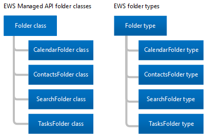

# Las carpetas y elementos de EWS en ExchangeFolders and items in EWS in Exchange

Obtenga información sobre las carpetas y los elementos del buzón y cómo la API administrada de EWS o el cliente EWS representa ellos.Learn about folders and mailbox items and how your EWS Managed API or EWS client represents them.
  
Las carpetas son el elemento de organización de un buzón de Exchange.Folders are the organizing element of an Exchange mailbox. Las carpetas pueden contener elementos de buzón de correo, como mensajes de correo electrónico, contactos, citas, reuniones y tareas, o que pueden contener otras carpetas.Folders can contain mailbox items, such as email messages, contacts, appointments, meetings, and tasks, or they can contain other folders. Exchange incluye tipos diferentes de las carpetas, pero los tipos de carpeta son similares a los otros.Exchange includes different types of folders, but the folder types are similar to each other. La diferencia principal entre ellas es el tipo de elemento que contienen.The main difference between them is the type of item they contain.
  
Elementos, sin embargo, tengan tipos únicos.Items, however, have unique types. Cada tipo de elemento tiene un conjunto diferente de propiedades o esquema para definirlo.Each item type has a different set of properties or schema to define it. En este artículo, analizaremos los tipos de carpetas y elementos que están disponibles y las diferencias entre ellos.In this article, we'll discuss the types of folders and items that are available and the differences between them.

## CarpetasFolders

Todas las carpetas se derivan de la misma clase base o tipo base, la clase de la [carpeta](http://msdn.microsoft.com/es-es/library/microsoft.exchange.webservices.data.folder%28v=EXCHG.80%29.aspx) en la API administrada de EWS, o el tipo de [carpeta](http://msdn.microsoft.com/library/812948d8-c7db-45ce-bb3a-77233a53a974%28Office.15%29.aspx) de EWS.Folders all derive from the same base class or base type, the [Folder](http://msdn.microsoft.com/es-es/library/microsoft.exchange.webservices.data.folder%28v=EXCHG.80%29.aspx) class in the EWS Managed API, or the [Folder](http://msdn.microsoft.com/library/812948d8-c7db-45ce-bb3a-77233a53a974%28Office.15%29.aspx) type in EWS. La siguiente ilustración muestra las clases de API administrada de EWS y tipos de EWS.The following figure shows the EWS Managed API classes and EWS types. 
  
**En la figura 1. Clases de la carpeta de API administrada de EWS y tipos de carpeta EWS****Figure 1. EWS Managed API folder classes and EWS folder types**

  
La diferencia principal entre los tipos de carpeta y cada una de las clases de la carpeta es que sólo se puede crear un tipo determinado de elemento en cada tipo de carpeta.The primary difference between each of the folder classes and folder types is that you can only create a certain type of item in each type of folder. Otra diferencia está en modo en que el cliente muestra información en una carpeta.One other difference is in how the client displays information in a folder. Por ejemplo, Exchange permite crear citas en la carpeta Calendario.For example, Exchange allows you to create appointments in the Calendar folder. Puede mover otros tipos de elementos en la carpeta del calendario después de que se crean, pero Outlook no mostrarlos.You can move other types of items into the Calendar folder after you create them, but Outlook won't display them. Outlook muestra sólo los elementos del calendario, como las citas y reuniones en la carpeta del calendario, [incluso si existe otro tipo de elemento en la carpeta](folders-and-items-in-ews-in-exchange.md#bk_item).Outlook only displays calendar items such as appointments and meetings in the Calendar folder, [even if another type of item exists in the folder](folders-and-items-in-ews-in-exchange.md#bk_item). 
  
**La tabla 1. Clases de la carpeta de API administrada de EWS y tipos de carpeta EWS****Table 1. EWS Managed API folder classes and EWS folder types**

|**Clase de la API administrada de EWS****EWS Managed API class**|**Tipo EWS****EWS type**|**Valor de FolderClass****FolderClass value**|**Incluye****Contains**|**Notas****Notes**|
|:-----|:-----|:-----|:-----|:-----|
|[FolderFolder](http://msdn.microsoft.com/es-es/library/microsoft.exchange.webservices.data.folder%28v=exchg.80%29.aspx)   |[FolderFolder](http://msdn.microsoft.com/library/812948d8-c7db-45ce-bb3a-77233a53a974%28Office.15%29.aspx)   |IPF. NotaIPF.Note    |Mensajes de correo electrónico o las carpetas.Email messages or folders.    | Esta es la clase genérica de carpeta o tipo de las siguientes carpetas de API administrada de EWS [WellKnownFolderName](http://msdn.microsoft.com/es-es/library/microsoft.exchange.webservices.data.wellknownfoldername%28v=exchg.80%29.aspx) y carpetas EWS [DistinguishedFolderId](http://msdn.microsoft.com/library/50018162-2941-4227-8a5b-d6b4686bb32f%28Office.15%29.aspx) :This is the generic folder class or type for the following EWS Managed API [WellKnownFolderName](http://msdn.microsoft.com/es-es/library/microsoft.exchange.webservices.data.wellknownfoldername%28v=exchg.80%29.aspx) folders and EWS [DistinguishedFolderId](http://msdn.microsoft.com/library/50018162-2941-4227-8a5b-d6b4686bb32f%28Office.15%29.aspx) folders: <ul><li>  Raíz (subárbol IPM)Root (IPM subtree)</li><li>NonIpmSubtreeNonIpmSubtree</li><li>Bandeja de entradaInbox</li><li>Elementos eliminadosDeleted Items</li><li>DraftsDrafts</li><li>JournalJournal</li><li>NotasNotes  </li><li>Bandeja de salidaOutbox</li><li>Elementos enviadosSent Items</li><li>Carpeta de mensajesMessage Folder</li><li>Correo electrónico no deseadoJunk Email</li><li>correo de vozVoice Mail</li></ul> |
|[CalendarFolderCalendarFolder](http://msdn.microsoft.com/es-es/library/microsoft.exchange.webservices.data.calendarfolder%28v=exchg.80%29.aspx)   |[CalendarFolderCalendarFolder](http://msdn.microsoft.com/library/48687a78-e757-4c04-9641-bf4302c6b565%28Office.15%29.aspx)   |IPF. CitaIPF.Appointment    |Las citas y reuniones.Appointments and meetings.    |Cuando un usuario responde a una convocatoria de reunión, la cita se agrega a la API administrada de EWS [WellKnownFolderName.Calendar](http://msdn.microsoft.com/es-es/library/microsoft.exchange.webservices.data.wellknownfoldername%28v=exchg.80%29.aspx) o sólo el EWS [DistinguishedFolderId.CalendarFolder](http://msdn.microsoft.com/library/50018162-2941-4227-8a5b-d6b4686bb32f%28Office.15%29.aspx) .When a user responds to a meeting request, the appointment is added to the EWS Managed API [WellKnownFolderName.Calendar](http://msdn.microsoft.com/es-es/library/microsoft.exchange.webservices.data.wellknownfoldername%28v=exchg.80%29.aspx) or the EWS [DistinguishedFolderId.CalendarFolder](http://msdn.microsoft.com/library/50018162-2941-4227-8a5b-d6b4686bb32f%28Office.15%29.aspx) only. Estos son las únicas carpetas que admiten la interacción automática con las convocatorias de reunión y las respuestas.These are the only folders that support automatic interaction with meeting requests and responses.    Esta clase de carpeta o el tipo de carpeta admite el uso de vistas del calendario para devolver las citas y reuniones en función de una fecha de inicio y una fecha de finalización mediante el método de la API administrada de EWS [Folder.FindItem](http://msdn.microsoft.com/es-es/library/microsoft.exchange.webservices.data.folder.finditems%28v=EXCHG.80%29.aspx) y la clase [CalendarView](http://msdn.microsoft.com/es-es/library/microsoft.exchange.webservices.data.calendarview%28v=exchg.80%29.aspx) o la dirección URL de EWS [FindItem ](http://msdn.microsoft.com/library/ebad6aae-16e7-44de-ae63-a95b24539729%28Office.15%29.aspx)operación y el elemento [CalendarView](http://msdn.microsoft.com/library/a4a953b8-0710-416c-95ef-59e51eba9982%28Office.15%29.aspx) .This folder class or folder type supports the use of calendar views to return appointments and meetings based on a start date and an end date by using the EWS Managed API [Folder.FindItem](http://msdn.microsoft.com/es-es/library/microsoft.exchange.webservices.data.folder.finditems%28v=EXCHG.80%29.aspx) method and the [CalendarView](http://msdn.microsoft.com/es-es/library/microsoft.exchange.webservices.data.calendarview%28v=exchg.80%29.aspx) class, or the EWS [FindItem](http://msdn.microsoft.com/library/ebad6aae-16e7-44de-ae63-a95b24539729%28Office.15%29.aspx) operation and the [CalendarView](http://msdn.microsoft.com/library/a4a953b8-0710-416c-95ef-59e51eba9982%28Office.15%29.aspx) element.    |
|[ContactsFolderContactsFolder](http://msdn.microsoft.com/es-es/library/microsoft.exchange.webservices.data.contactsfolder%28v=exchg.80%29.aspx)   |[ContactsFolderContactsFolder](http://msdn.microsoft.com/library/6c299de8-2087-4aeb-8e66-2bc7586509a6%28Office.15%29.aspx)   |IPF. ContactoIPF.Contact    |Listas de distribución y contactos.Contacts and distribution lists.    |Ninguno.None.    |
|[SearchFolderSearchFolder](http://msdn.microsoft.com/es-es/library/microsoft.exchange.webservices.data.searchfolder%28v=exchg.80%29.aspx)   |[SearchFolderSearchFolder](http://msdn.microsoft.com/library/1a7d408b-2e98-4391-8834-085ed6d5757c%28Office.15%29.aspx)   |IPF. NotaIPF.Note    |Contenido está determinado por una restricción o un filtro.Contents are determined by a restriction or filter. Las carpetas de búsqueda no tienen las subcarpetas.Search folders do not have subfolders.    |Los elementos que cumplen los criterios de búsqueda no se encuentran realmente en la carpeta de búsqueda; en su lugar, estén ubicados en otro lugar en el buzón de correo.The items that meet the search criteria are not actually contained in the search folder; instead, they are located elsewhere in the mailbox.    Para asegurarse de que las carpetas de búsqueda están disponibles en Outlook, crear en la carpeta del Finder.To ensure that Search folders are available in Outlook, create them in the Finder folder.    |
|[TasksFolderTasksFolder](http://msdn.microsoft.com/es-es/library/microsoft.exchange.webservices.data.tasksfolder%28v=exchg.80%29.aspx)   |[TasksFolderTasksFolder](http://msdn.microsoft.com/library/5a9a4612-8064-4986-b467-c44f268c64df%28Office.15%29.aspx)   |IPF. TareaIPF.Task    |Contiene los elementos de trabajo para llevar a cabo.Contains work items to complete.    |Ninguno.None.    |
   
### Estructura de carpetasFolder structure

Carpetas proporcionan una estructura de buzón de correo.Folders provide a mailbox structure. Esto incluye el subárbol IPM, conocido como el principio del almacén de información de EWS, donde la mayoría de los usuarios interactuar con su buzón, así como las carpetas del sistema que nunca ve la mayoría de los usuarios, que están en el subárbol no IPM o raíz en EWS.This includes the IPM Subtree, known as the Top of Information Store in EWS, where most users interact with their mailbox, as well as system folders that most users never see, which are in the Non-IPM Subtree or Root in EWS. En la siguiente ilustración muestra la estructura de carpetas de un usuario e indica que las carpetas son para los elementos del usuario y cuáles son las carpetas del sistema.The following figure shows the folder structure for a user and indicates which folders are for the user's items and which are system folders.
  
**La figura 2. Carpetas de elemento y el sistema en un buzón de correo****Figure 2. Item and system folders in a mailbox**

  
### Carpetas conocidasWell-known folders

Las carpetas de un buzón de correo, algunas son carpetas especiales.Of the folders in a mailbox, some are special folders. Éstas equivalen a carpetas conocidas en la API administrada de EWS, o distintivo en EWS.These equate to well-known folders in the EWS Managed API, or distinguished folders in EWS. Algunas de estas carpetas tienen restricciones en el nombre de la carpeta, dónde se encuentran en la estructura de carpetas, y si se pueden eliminar.Some of these folders have restrictions on the folder name, where they are located in the folder structure, and whether they can be deleted. Otras carpetas (no especial) "genéricos" no tienen las mismas restricciones.Other "generic" (non-special) folders do not have the same restrictions. Es importante estar familiarizado con las siguientes carpetas conocidas o distintivos debido a que son el sistema de raíz, usuario y las carpetas de búsqueda y son aplicables a la mayoría de las implementaciones.It is important for you to be familiar with the following well-known or distinguished folders because they are the root system, user, and search folders, and are applicable to most implementations. 
  
**Tabla 2. Carpetas conocidas y distintivos principales****Table 2. Primary well-known and distinguished folders**

|**Nombre descriptivo****Friendly name**|**Valores de **WellKnownFolderName** de API administrada de EWS****EWS Managed API **WellKnownFolderName** values**|**Valores de **DistinguishedFolderId** EWS****EWS **DistinguishedFolderId** values**|**Descripción****Description**|
|:-----|:-----|:-----|:-----|
|Raíz (subárbol no IPM)Root (Non-IPM Subtree)    |WellKnownFolderName.RootWellKnownFolderName.Root    |DistinguishedFolderId.rootDistinguishedFolderId.root    |Contiene la carpeta raíz de un buzón de correo, también conocido como el subárbol no IPM.Contains the root folder of a mailbox, also known as the Non-IPM Subtree. Esta carpeta no tiene ningún elemento primario, y no se puede mover, copiar, cambiar el nombre o eliminarla.This folder has no parent, and you cannot move, copy, rename, or delete it. Cada almacén de mensajes contiene sólo una carpeta raíz.Each message store contains only one root folder.    |
|Parte superior del almacén de información (subárbol IPM)Top of Information Store (IPM Subtree)    |WellKnownFolderName.MsgFolderRootWellKnownFolderName.MsgFolderRoot    |DistinguishedFolderId.msgfolderrootDistinguishedFolderId.msgfolderroot    |Contiene la Bandeja de entrada y otras carpetas de usuario.Contains the Inbox and other user folders.    |
|Finder (las carpetas de búsqueda)Finder (Search folders)    |WellKnownFolderName.SearchFoldersWellKnownFolderName.SearchFolders    |DistinguishedFolderId.searchfolders.DistinguishedFolderId.searchfolders.    |Contiene las carpetas de búsqueda que están visibles en Outlook.Contains search folders that are visible in Outlook.    |
   
Para obtener una lista completa de los valores de propiedad de la API administrada de EWS [WellKnownFolderName](http://msdn.microsoft.com/es-es/library/microsoft.exchange.webservices.data.folder.wellknownfoldername%28v=exchg.80%29.aspx) , vea la enumeración [WellKnownFolderName](http://msdn.microsoft.com/es-es/library/microsoft.exchange.webservices.data.wellknownfoldername%28v=EXCHG.80%29.aspx) .For a complete list of the EWS Managed API [WellKnownFolderName](http://msdn.microsoft.com/es-es/library/microsoft.exchange.webservices.data.folder.wellknownfoldername%28v=exchg.80%29.aspx) property values, see the [WellKnownFolderName](http://msdn.microsoft.com/es-es/library/microsoft.exchange.webservices.data.wellknownfoldername%28v=EXCHG.80%29.aspx) enumeration. Para obtener una lista completa de los valores EWS **DistinguishedFolderId** , vea [DistinguishedFolderId](http://msdn.microsoft.com/library/50018162-2941-4227-8a5b-d6b4686bb32f%28Office.15%29.aspx).For a complete list of the EWS **DistinguishedFolderId** values, see [DistinguishedFolderId](http://msdn.microsoft.com/library/50018162-2941-4227-8a5b-d6b4686bb32f%28Office.15%29.aspx).
  
### Propiedades de carpetaFolder properties

En la API administrada de EWS, las [Propiedades de la carpeta](http://msdn.microsoft.com/es-es/library/microsoft.exchange.webservices.data.folder_properties%28v=exchg.80%29.aspx) se derivan de la clase base de la [carpeta](http://msdn.microsoft.com/es-es/library/microsoft.exchange.webservices.data.folder%28v=EXCHG.80%29.aspx) .In the EWS Managed API, the [folder properties](http://msdn.microsoft.com/es-es/library/microsoft.exchange.webservices.data.folder_properties%28v=exchg.80%29.aspx) are all derived from the base [Folder](http://msdn.microsoft.com/es-es/library/microsoft.exchange.webservices.data.folder%28v=EXCHG.80%29.aspx) class. Y en EWS, todas las carpetas de usar los elementos de carpeta que están disponibles en el tipo de [carpeta](http://msdn.microsoft.com/library/812948d8-c7db-45ce-bb3a-77233a53a974%28Office.15%29.aspx) .And in EWS, all folders use the folder elements that are available on the [Folder](http://msdn.microsoft.com/library/812948d8-c7db-45ce-bb3a-77233a53a974%28Office.15%29.aspx) type. La mayoría de las propiedades relacionadas con la carpeta y los elementos son un proceso sencillo (primario carpeta identificador, nombre para mostrar etc.), pero algunos requieren una mayor explicación.Most of the folder-related properties and elements are straightforward (parent folder ID, display name, and so on), but a few require a little more explanation. 
  
Las advertencias siguientes se aplican a la propiedad de la API administrada de EWS [Folder.FolderClass](http://msdn.microsoft.com/es-es/library/microsoft.exchange.webservices.data.folder.folderclass%28v=EXCHG.80%29.aspx) o el elemento EWS [FolderClass](http://msdn.microsoft.com/library/0041d135-2869-4612-89a5-d1aa86aa1093%28Office.15%29.aspx) :The following caveats apply to the EWS Managed API [Folder.FolderClass](http://msdn.microsoft.com/es-es/library/microsoft.exchange.webservices.data.folder.folderclass%28v=EXCHG.80%29.aspx) property or the EWS [FolderClass](http://msdn.microsoft.com/library/0041d135-2869-4612-89a5-d1aa86aa1093%28Office.15%29.aspx) element: 
  
- Si set, el valor de la propiedad o el elemento debe coincidir con la clase derivada o el tipo de la carpeta.If set, the value of the property or element must agree with the derived class or type of the folder. Por ejemplo, la propiedad **FolderClass** o el elemento no se puede indicar que la carpeta es una carpeta de contactos mientras que la clase o tipo de la carpeta indica que la carpeta es una carpeta de calendario.For example, the **FolderClass** property or element can't indicate that the folder is a Contacts folder while the class or type of the folder indicates the folder is a Calendar folder. 
    
- Puede puede ser [crear carpetas](how-to-work-with-folders-by-using-ews-in-exchange.md#bk_createfolderewsma) de un tipo específico sin establecer la propiedad **FolderClass** o elemento, o puede crear una carpeta con el tipo de carpeta genérico y especifique la propiedad **FolderClass** o el elemento.You can either [create folders](how-to-work-with-folders-by-using-ews-in-exchange.md#bk_createfolderewsma) of a specific type without setting the **FolderClass** property or element, or you can create a folder with the generic folder type and specify the **FolderClass** property or element. Ambas opciones crean el mismo resultado.Both options create the same result. 
    
- Después de establecer el valor de **FolderClass** mediante la creación de un tipo específico de carpeta o estableciendo la propiedad de **FolderClass** o el propio elemento, no se puede cambiar.After you set the **FolderClass** value by creating a specific type of folder or by setting the **FolderClass** property or element itself, you cannot change it. Por ejemplo, no se puede cambiar un error IPF. Carpeta de nota a un error IPF. Carpeta de contactos.For example, you cannot change an IPF.Note folder to an IPF.Contact folder. Sin embargo, puede cambiar a un error IPF. Carpeta Note.Contoso.You can, however, change it to an IPF.Note.Contoso folder. 
    
- Cualquier valor de **FolderClass** que no use uno de los prefijos predefinidos se trata como un error IPF. Carpeta de nota.Any **FolderClass** value that does not use one of the predefined prefixes is treated as an IPF.Note folder. Por ejemplo, un valor de **FolderClass** de IAmAFolderClass se trata como un error IPF. Carpeta de nota.For example, a **FolderClass** value of IAmAFolderClass is treated as an IPF.Note folder. 
    
El valor de la clase de carpeta es extensible.The folder class value is extensible. Esto significa que los valores de **FolderClass** predeterminados que aparecen en la tabla 1 se tratan como prefijos y puede agregar valores personalizados.This means that the default **FolderClass** values listed in Table 1 are treated as prefixes and you can add custom values. Por ejemplo, puede crear una carpeta con un valor de **FolderClass** de IPF. Contact.Contoso y se trata como una carpeta de contactos.For example, you can create a folder with a **FolderClass** value of IPF.Contact.Contoso, and it is treated as a Contacts folder. 
  
Puede determinar qué permisos que tiene el cliente en las carpetas, como eliminan, leerán y modificación, mediante el uso de la propiedad de la API administrada de EWS [Folder.EffectiveRights](http://msdn.microsoft.com/es-es/library/microsoft.exchange.webservices.data.folder.effectiverights%28v=EXCHG.80%29.aspx) o el elemento EWS [EffectiveRights](http://msdn.microsoft.com/library/bf5278eb-3a1a-4d27-9d16-b8be043bb023%28Office.15%29.aspx) .You can determine what permissions the client has on the folders, such as delete, read, and modify, by using the EWS Managed API [Folder.EffectiveRights](http://msdn.microsoft.com/es-es/library/microsoft.exchange.webservices.data.folder.effectiverights%28v=EXCHG.80%29.aspx) property or the EWS [EffectiveRights](http://msdn.microsoft.com/library/bf5278eb-3a1a-4d27-9d16-b8be043bb023%28Office.15%29.aspx) element. 
  
### Carpetas públicasPublic folders

Las carpetas públicas están diseñadas para el acceso compartido y proporcionan una forma fácil y efectiva de recopilar, organizar y compartir información con otras personas de su grupo de trabajo u organización.Public folders are designed for shared access and provide an easy and effective way to collect, organize, and share information with other people in your workgroup or organization. También puede utilizar las carpetas públicas para archivar el contenido de grupo de distribución.You can also use public folders to archive distribution group content. Para obtener información detallada acerca de las carpetas públicas, vea la [carpeta pública access con EWS en Exchange](public-folder-access-with-ews-in-exchange.md).For in-depth information about public folders, see [Public folder access with EWS in Exchange](public-folder-access-with-ews-in-exchange.md).

### Carpetas ocultasHidden folders

Se ocultan todas las carpetas que Exchange se crea en la raíz del buzón, y puede usar la API administrada de EWS o EWS para ocultar las carpetas adicionales en la parte superior del almacén de información.All the folders that Exchange creates at the root of the mailbox are hidden, and you can use the EWS Managed API or EWS to hide additional folders under the Top of Information Store. Para obtener más información acerca de las carpetas ocultas, vea [trabajar con carpetas ocultas mediante el uso de EWS en Exchange](how-to-work-with-hidden-folders-by-using-ews-in-exchange.md).For more information about hidden folders, see [Work with hidden folders by using EWS in Exchange](how-to-work-with-hidden-folders-by-using-ews-in-exchange.md). 

### Carpetas de búsquedaSearch folders

Las carpetas de búsqueda son iguales que las carpetas normales, excepto en que tienen una propiedad o un elemento que define el filtro de búsqueda.Search folders are just like regular folders, except that they have a property or element that defines the search filter. Puede crear carpetas de búsqueda en cualquier carpeta de un buzón de Exchange y crear de la misma manera que se crea cualquier otra carpeta.You can create search folders in any folder in an Exchange mailbox, and you create them in the same way that you create any other folder. Sin embargo, para que una carpeta de búsqueda que aparezca en Outlook, Outlook Web App o Outlook Live, objetos [SearchFolder](http://msdn.microsoft.com/es-es/library/microsoft.exchange.webservices.data.searchfolder%28v=exchg.80%29.aspx) que cree mediante el uso de la API administrada de EWS deben estar ubicados en la carpeta [WellKnownFolderName.SearchFolders](http://msdn.microsoft.com/es-es/library/microsoft.exchange.webservices.data.wellknownfoldername%28v=exchg.80%29.aspx) y [SearchFolder](http://msdn.microsoft.com/library/1a7d408b-2e98-4391-8834-085ed6d5757c%28Office.15%29.aspx) tipos que se crean mediante el uso de EWS deben estar ubicados en la carpeta [DistinguishedFolderId.SearchFolders](http://msdn.microsoft.com/library/50018162-2941-4227-8a5b-d6b4686bb32f%28Office.15%29.aspx) .However, for a search folder to appear in Outlook, Outlook Web App, or Outlook Live, [SearchFolder](http://msdn.microsoft.com/es-es/library/microsoft.exchange.webservices.data.searchfolder%28v=exchg.80%29.aspx) objects that you create by using the EWS Managed API must be located in the [WellKnownFolderName.SearchFolders](http://msdn.microsoft.com/es-es/library/microsoft.exchange.webservices.data.wellknownfoldername%28v=exchg.80%29.aspx) folder, and [SearchFolder](http://msdn.microsoft.com/library/1a7d408b-2e98-4391-8834-085ed6d5757c%28Office.15%29.aspx) types that you create by using EWS must be located in the [DistinguishedFolderId.SearchFolders](http://msdn.microsoft.com/library/50018162-2941-4227-8a5b-d6b4686bb32f%28Office.15%29.aspx) folder. Si la carpeta de búsqueda se crea en una ubicación diferente, sigue estando disponible y puede verlo en aplicaciones de cliente personalizadas.If the search folder is created in a different location, it is still available and you can view it in custom client applications. 

## ElementosItems

EWS en Exchange usa **los elementos** para representar los mensajes de correo electrónico individuales, las citas, reuniones, contactos, listas de distribución, tareas, entradas y otros elementos en un buzón de correo.EWS in Exchange uses **Items** to represent individual email messages, appointments, meetings, contacts, distribution lists, tasks, posts, and other items, in a mailbox. Los elementos son que cualquiera establecimiento inflexible de tipos, lo que significa que disponen de una clase específica asociada o esquema o elementos no fuertemente tipados, también conocido como genéricos.Items are either strongly typed, which means that they have a specific associated class or schema, or not strongly typed, also known as generic items. Los elementos genéricos son objetos de [elemento](http://msdn.microsoft.com/es-es/library/microsoft.exchange.webservices.data.item%28v=exchg.80%29.aspx) en los tipos de API administrada de EWS y [elemento](http://msdn.microsoft.com/library/4dfe8f48-e7b4-444d-bdf9-a34e180f598b%28Office.15%29.aspx) de EWS.Generic items are [Item](http://msdn.microsoft.com/es-es/library/microsoft.exchange.webservices.data.item%28v=exchg.80%29.aspx) objects in the EWS Managed API and [Item](http://msdn.microsoft.com/library/4dfe8f48-e7b4-444d-bdf9-a34e180f598b%28Office.15%29.aspx) types in EWS. Elementos comunes, como mensajes de correo electrónico, contactos, listas de distribución, entradas y tareas están fuertemente tipadas y se puede establecer propiedades específicas de esquematizado o elementos en ellos.Common items like email messages, contacts, distribution lists, posts, and tasks are strongly typed, and you can set specific schematized properties or elements on them. 
  
**Tabla 3. Elementos fuertemente tipados****Table 3. Strongly typed items**

|**Tipo de elemento de la API administrada de EWS****EWS Managed API item type**|**Elemento de EWS****EWS item element**|
|:-----|:-----|
|[AppointmentAppointment](http://msdn.microsoft.com/es-es/library/microsoft.exchange.webservices.data.appointment%28v=exchg.80%29.aspx)   |[CalendarItemCalendarItem](http://msdn.microsoft.com/library/b0c1fd27-b6da-46e5-88b8-88f00c71ba80%28Office.15%29.aspx)   |
|[ContactContact](http://msdn.microsoft.com/es-es/library/microsoft.exchange.webservices.data.contact%28v=exchg.80%29.aspx)   |[ContactContact](http://msdn.microsoft.com/library/66bfff50-7a91-4d81-b6a0-610b9962f677%28Office.15%29.aspx)   |
|[ContactGroupContactGroup](http://msdn.microsoft.com/es-es/library/microsoft.exchange.webservices.data.contactgroup%28v=exchg.80%29.aspx)   |[DistributionListDistributionList](http://msdn.microsoft.com/library/f65aea01-e870-44a2-8571-fa6c001341cc%28Office.15%29.aspx)   |
|[EmailMessageEmailMessage](http://msdn.microsoft.com/es-es/library/microsoft.exchange.webservices.data.emailmessage%28v=exchg.80%29.aspx)   |[MessageMessage](http://msdn.microsoft.com/library/2400b33c-43b2-4fc2-b6fb-275a99e0e810%28Office.15%29.aspx)   |
|[Objeto postItemPostItem](http://msdn.microsoft.com/es-es/library/microsoft.exchange.webservices.data.postitem%28v=exchg.80%29.aspx)   |[Objeto postItemPostItem](http://msdn.microsoft.com/library/7727ed84-9591-4a1c-bb04-12129926499b%28Office.15%29.aspx)   |
|[TareaTask](http://msdn.microsoft.com/es-es/library/microsoft.exchange.webservices.data.task%28v=exchg.80%29.aspx)   |[TareaTask](http://msdn.microsoft.com/library/7c84927e-db28-4c5d-b0b5-cbcc2b88d869%28Office.15%29.aspx)   |
   
API administrada de EWS fuertemente tipado elementos derivar de la clase de [elemento](http://msdn.microsoft.com/es-es/library/microsoft.exchange.webservices.data.item%28v=EXCHG.80%29.aspx) base.EWS Managed API strongly typed items derive from the base [Item](http://msdn.microsoft.com/es-es/library/microsoft.exchange.webservices.data.item%28v=EXCHG.80%29.aspx) class. Sin embargo, se suele trabajar con uno de los tipos derivados que aparecen en la tabla 3 y no con la clase de **elemento** directamente.However, you usually work with one of the derived types listed in Table 3, and not with the **Item** class directly. Cuando se trabaja con la clase [ItemCollection](http://msdn.microsoft.com/es-es/library/dd634001%28v=EXCHG.80%29.aspx) , sin embargo, es posible que trabajar directamente con instancias de la clase de **elemento** .When you work with the [ItemCollection](http://msdn.microsoft.com/es-es/library/dd634001%28v=EXCHG.80%29.aspx) class, however, you might work directly with instances of the **Item** class. En ese caso, debe implementar la lógica que determina el tipo de elemento en el almacén que representa la instancia de la clase de **elemento** .In that case, you should implement logic that determines the type of item in the store that the instance of the **Item** class represents. Para que funcione con ese elemento, se debe enlazar al elemento mediante el uso de una instancia de la clase que representa el elemento.To work with that item, you should bind to the item by using an instance of the class that represents the item. 
  
### Elementos de las carpetasItems in folders

Algunas carpetas tienen restricciones sobre los tipos de elementos que pueden contener.Some folders have restrictions about the types of items that they can contain. Estos son las restricciones de la base de datos de buzón de correo de Exchange se aplica a las carpetas, no las limitaciones de vista del cliente.These are restrictions that the Exchange mailbox database applies to folders, not client view limitations. 
  
**Tabla 4. Restricciones de elemento para carpetas****Table 4. Item restrictions for folders**

|**Clase de carpeta de API administrada de EWS****EWS Managed API Folder class**|**Tipo de carpeta de EWS****EWS Folder type**|**Restriction****Restriction**|
|:-----|:-----|:-----|
|[Clase base de carpetaBase Folder class](http://msdn.microsoft.com/es-es/library/microsoft.exchange.webservices.data.folder%28v=exchg.80%29.aspx)   |[FolderFolder](http://msdn.microsoft.com/library/812948d8-c7db-45ce-bb3a-77233a53a974%28Office.15%29.aspx)   |Sólo se pueden crear nuevos objetos de la API administrada de EWS [EmailMessage](http://msdn.microsoft.com/es-es/library/microsoft.exchange.webservices.data.emailmessage%28v=exchg.80%29.aspx) y objetos [PostItem](http://msdn.microsoft.com/es-es/library/microsoft.exchange.webservices.data.postitem%28v=exchg.80%29.aspx) , o EWS [mensaje](http://msdn.microsoft.com/library/2400b33c-43b2-4fc2-b6fb-275a99e0e810%28Office.15%29.aspx) tipos o **PostItem** , en las carpetas genéricas.You can only create new EWS Managed API [EmailMessage](http://msdn.microsoft.com/es-es/library/microsoft.exchange.webservices.data.emailmessage%28v=exchg.80%29.aspx) objects and [PostItem](http://msdn.microsoft.com/es-es/library/microsoft.exchange.webservices.data.postitem%28v=exchg.80%29.aspx) objects, or EWS [Message](http://msdn.microsoft.com/library/2400b33c-43b2-4fc2-b6fb-275a99e0e810%28Office.15%29.aspx) types or **PostItem** types, in the generic folders. Puede mover otros tipos de elementos en carpetas genéricas, pero el cliente no puede mostrarlos.You can move other item types into generic folders, but the client might not display them.    |
|[CalendarFolderCalendarFolder](http://msdn.microsoft.com/es-es/library/microsoft.exchange.webservices.data.calendarfolder%28v=exchg.80%29.aspx)   |[CalendarFolderCalendarFolder](http://msdn.microsoft.com/library/48687a78-e757-4c04-9641-bf4302c6b565%28Office.15%29.aspx)   |Sólo se pueden crear nuevos objetos de la API administrada de EWS [cita](http://msdn.microsoft.com/es-es/library/microsoft.exchange.webservices.data.appointment%28v=exchg.80%29.aspx) y tipos de EWS [CalendarItem](http://msdn.microsoft.com/library/b0c1fd27-b6da-46e5-88b8-88f00c71ba80%28Office.15%29.aspx) en la carpeta Calendario.You can only create new EWS Managed API [Appointment](http://msdn.microsoft.com/es-es/library/microsoft.exchange.webservices.data.appointment%28v=exchg.80%29.aspx) objects and EWS [CalendarItem](http://msdn.microsoft.com/library/b0c1fd27-b6da-46e5-88b8-88f00c71ba80%28Office.15%29.aspx) types in the Calendar folder. Puede mover otros tipos de elementos en la carpeta del calendario, pero el cliente no puede mostrarlos.You can move other item types into the Calendar folder, but the client might not display them.    |
|[ContactsFolderContactsFolder](http://msdn.microsoft.com/es-es/library/microsoft.exchange.webservices.data.contactsfolder%28v=exchg.80%29.aspx)   |[ContactsFolderContactsFolder](http://msdn.microsoft.com/library/6c299de8-2087-4aeb-8e66-2bc7586509a6%28Office.15%29.aspx)   |Sólo se pueden crear nuevos objetos de [contacto](http://msdn.microsoft.com/es-es/library/microsoft.exchange.webservices.data.contact%28v=exchg.80%29.aspx) de API administrada de EWS y [ContactGroup](http://msdn.microsoft.com/es-es/library/microsoft.exchange.webservices.data.contactgroup%28v=exchg.80%29.aspx) , o tipos de EWS [contacto](http://msdn.microsoft.com/library/66bfff50-7a91-4d81-b6a0-610b9962f677%28Office.15%29.aspx) o [DistributionList](http://msdn.microsoft.com/library/f65aea01-e870-44a2-8571-fa6c001341cc%28Office.15%29.aspx) tipos en la carpeta Contactos.You can only create new EWS Managed API [Contact](http://msdn.microsoft.com/es-es/library/microsoft.exchange.webservices.data.contact%28v=exchg.80%29.aspx) and [ContactGroup](http://msdn.microsoft.com/es-es/library/microsoft.exchange.webservices.data.contactgroup%28v=exchg.80%29.aspx) objects, or EWS [Contact](http://msdn.microsoft.com/library/66bfff50-7a91-4d81-b6a0-610b9962f677%28Office.15%29.aspx) types or [DistributionList](http://msdn.microsoft.com/library/f65aea01-e870-44a2-8571-fa6c001341cc%28Office.15%29.aspx) types in the Contacts folder. Puede mover otros tipos de elementos en la carpeta de contactos, pero el cliente no puede mostrar ellosYou can move other item types into the Contacts folder, but the client might not display them    |
|[SearchFolderSearchFolder](http://msdn.microsoft.com/es-es/library/microsoft.exchange.webservices.data.searchfolder%28v=exchg.80%29.aspx)   |[SearchFolderSearchFolder](http://msdn.microsoft.com/library/1a7d408b-2e98-4391-8834-085ed6d5757c%28Office.15%29.aspx)   |No hay restricciones.No restrictions. Los elementos no se encuentran en realidad en la carpeta de búsqueda; se encuentran en cualquier parte del buzón de correo.Items are not actually located in the Search folder; they are located elsewhere in the mailbox.    |
|[TasksFolderTasksFolder](http://msdn.microsoft.com/es-es/library/microsoft.exchange.webservices.data.tasksfolder%28v=exchg.80%29.aspx)   |[TasksFolderTasksFolder](http://msdn.microsoft.com/library/5a9a4612-8064-4986-b467-c44f268c64df%28Office.15%29.aspx)   |Sólo se pueden crear nuevos objetos de la API administrada de EWS [tarea](http://msdn.microsoft.com/es-es/library/microsoft.exchange.webservices.data.task%28v=exchg.80%29.aspx) o tipos de EWS [tarea](http://msdn.microsoft.com/library/7c84927e-db28-4c5d-b0b5-cbcc2b88d869%28Office.15%29.aspx) en la carpeta tareas.You can only create new EWS Managed API [Task](http://msdn.microsoft.com/es-es/library/microsoft.exchange.webservices.data.task%28v=exchg.80%29.aspx) objects or EWS [Task](http://msdn.microsoft.com/library/7c84927e-db28-4c5d-b0b5-cbcc2b88d869%28Office.15%29.aspx) types in the Tasks folder. Puede mover otros tipos de elementos en la carpeta de tareas, pero el cliente no puede mostrar ellosYou can move other item types into the Tasks folder, but the client might not display them    |

## Actualizar desde versiones anteriores del productoUpgrading from earlier product versions

Las carpetas para la mayor parte han cambiado en las versiones anteriores y actual del producto.Folders have for the most part remained unchanged in earlier and current product versions. Sin embargo, tenga en cuenta que las versiones anteriores de Exchange utilizan las carpetas administradas para llevar a cabo la administración de registros de mensajería (MRM).Note, however, that earlier versions of Exchange use managed folders to perform messaging records management (MRM). Exchange Online, Exchange Online como parte de Office 365 y las versiones de Exchange a partir de Exchange 2013 usar directivas de retención para MRM.Exchange Online, Exchange Online as part of Office 365, and versions of Exchange starting with Exchange 2013 use retention policies for MRM. Puede que la [actualización carpetas administradas en el uso de directivas de retención](http://technet.microsoft.com/es-es/library/dd298032%28v=exchg.150%29.aspx).You can [upgrade managed folders to use retention policies](http://technet.microsoft.com/es-es/library/dd298032%28v=exchg.150%29.aspx). 
  
Los elementos no han cambiado en las versiones anteriores y actual del producto.Items have not changed in earlier and current product versions.

## En esta secciónIn this section

- [Trabajar con carpetas mediante EWS en ExchangeWork with folders by using EWS in Exchange](how-to-work-with-folders-by-using-ews-in-exchange.md)
    
- [Trabajar con carpetas ocultas con EWS en ExchangeWork with hidden folders by using EWS in Exchange](how-to-work-with-hidden-folders-by-using-ews-in-exchange.md)
    
- [Trabajar con los elementos del buzón de Exchange mediante EWS en ExchangeWork with Exchange mailbox items by using EWS in Exchange](how-to-work-with-exchange-mailbox-items-by-using-ews-in-exchange.md)
    
- [Eliminar elementos mediante el uso de EWS en ExchangeDelete items by using EWS in Exchange](deleting-items-by-using-ews-in-exchange.md)
    
- [Exportar e importar elementos mediante el uso de EWS en ExchangeExport and import items by using EWS in Exchange](exporting-and-importing-items-by-using-ews-in-exchange.md)
    
## Vea tambiénSee also

- [Desarrollo de clientes de servicios web de ExchangeDevelop web service clients for Exchange](develop-web-service-clients-for-exchange.md)   
- [Empezar a utilizar servicios web de ExchangeStart using web services in Exchange](start-using-web-services-in-exchange.md)   
- [Introducción al diseño de EWS cliente de ExchangeEWS client design overview for Exchange](ews-client-design-overview-for-exchange.md)
    

