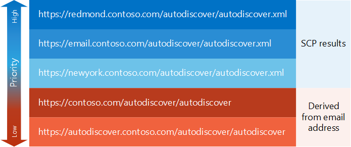

# Generar una lista de extremos de detección automática

Descubra cómo generar una lista de puntos de conexión de detección automática con prioridad.
  
La primera tarea del [proceso de detección automática](autodiscover-for-exchange.md) es generar una lista de extremos de detección automática para que la aplicación lo intente. Estos puntos de conexión de detección automática pueden proceder de una [búsqueda de SCP](how-to-find-autodiscover-endpoints-by-using-scp-lookup-in-exchange.md) o pueden derivarse de la dirección de correo electrónico del usuario. Al final, puede acabar con un gran número de puntos de conexión. Echemos un vistazo a cómo puede organizarlos por prioridad. 
  
## Comenzar con búsqueda SCP

Los extremos de detección automática que provienen de una [búsqueda de SCP](how-to-find-autodiscover-endpoints-by-using-scp-lookup-in-exchange.md) deben tener la máxima prioridad en la lista. Los administradores pueden configurar objetos SCP para que enruten el cliente al punto de conexión de detección automática más cercano o más eficaz, por lo que es una buena idea empezar con estos puntos de conexión. Dado que el proceso de búsqueda de SCP tiene su propio esquema de priorización, los resultados de una búsqueda de SCP ya tienen prioridad, como se indica a continuación: 
  
1. Detección automática de extremos de objetos SCP en el ámbito del sitio de Active Directory al que pertenece el equipo cliente.
    
2. Detección automática de extremos de objetos SCP que no estén en el ámbito de ningún sitio de Active Directory.
    
3. Detección automática de extremos de objetos SCP en el ámbito de un sitio de Active Directory diferente del sitio al que pertenece el equipo cliente.
    
Una vez que tenga los resultados del proceso de búsqueda de SCP, puede Agregar extremos que se deriven de la dirección de correo electrónico del usuario. Estos pueden funcionar como un conjunto de puntos de conexión predeterminados y un retroceso en caso de que no haya resultados de SCP o los puntos de conexión devueltos desde la búsqueda de SCP no son suficientes.
  
## Agregar puntos de conexión derivados de la dirección de correo electrónico del usuario

Cuando la búsqueda de SCP no funciona o los puntos de conexión devueltos por la búsqueda SCP no devuelven una respuesta correcta, puede derivar un conjunto de puntos de conexión de detección automática predeterminados de la dirección de correo electrónico del usuario. Estos puntos de conexión deben tener una prioridad más baja que los procedentes de una búsqueda SCP, pero es posible que los necesite si la búsqueda de SCP no se realizó correctamente.
  
### Para derivar los extremos de detección automática

1. Extraiga el nombre de dominio de la dirección de correo electrónico del usuario. Por ejemplo, si la dirección de correo electrónico del usuario es Sadie.Daniels@contoso.com, el nombre de dominio sería contoso.com.
    
2. Construya direcciones URL de punto de conexión sin extensiones de archivo en los siguientes formatos:
    
  - "https://" + dominio + "/Autodiscover/Autodiscover"
    
  - "https://autodiscover." + dominio + "/Autodiscover/Autodiscover"
    
Después de compilar la lista de direcciones URL de punto de conexión que derivan de la búsqueda de SCP y la dirección de correo del usuario, es posible que deba revisar las extensiones de nombre de archivo en esas direcciones URL, en función de si usa el [servicio Web de detección automática de SOAP](https://msdn.microsoft.com/library/61c21ea9-7fea-4f56-8ada-bf80e1e6b074%28Office.15%29.aspx) o el [servicio Web de detección automática de POX](https://msdn.microsoft.com/library/877152f0-f4b1-4f63-b2ce-924f4bdf2d20%28Office.15%29.aspx).
  
## Agregar o reemplazar extensiones de nombre de archivo en direcciones URL de punto de conexión

Puede acceder al servicio Detección automática mediante el servicio Web de detección automática de SOAP o el servicio Web de detección automática de POX. Cada servicio usa direcciones URL de punto de conexión similares, con la única diferencia de la extensión de nombre de archivo. El servicio Web de detección automática de SOAP usa la extensión de nombre de archivo ". SVC" y el servicio Web detección automática de POX usa la extensión de nombre de archivo ". xml".
  
De forma predeterminada, las direcciones URL de punto de conexión de detección automática devueltas desde una búsqueda SCP son direcciones URL de POX. Sin embargo, si usa la detección automática de SOAP, simplemente puede cambiar la extensión del nombre de archivo de ". xml" a ". SVC" y probar una solicitud SOAP.
  
Para las direcciones URL de punto de conexión de detección automática derivadas, se omite la extensión de archivo. Agregue la extensión de archivo adecuada para el servicio Web de detección automática que está usando antes de probar la dirección URL.
  
## Ejemplo: generación de una lista de extremos de detección automática

Echemos un vistazo a un ejemplo. Sadie Daniels (Sadie.Daniels@contoso.com) usa una aplicación de servicios web Exchange (EWS) por primera vez. La aplicación usa la detección automática para configurarse a sí misma. El equipo de Sadie se une al dominio de contoso.com y se encuentra en el sitio de Active Directory de Redmond. La aplicación genera la lista de extremos de detección automática que se muestran en la figura 1.
  
**Figura 1: lista de ejemplos de puntos de conexión de detección automática**

  
La aplicación EWS de este ejemplo prefiere el servicio Web de detección automática de SOAP, por lo que cambia la extensión del nombre de archivo para los resultados de SCP a ". SVC" antes de enviarles solicitudes de SOAP a ellos.
  
## Siguientes pasos

Después de generar una lista de extremos de detección automática, pruébelos [enviando solicitudes a dichos puntos de conexión](how-to-get-user-settings-from-exchange-by-using-autodiscover.md).
  
## Vea también

- [Detección automática en Exchange](autodiscover-for-exchange.md)
    
- [Buscar Autodisover extremos mediante el uso de búsqueda de SCP en Exchange](how-to-find-autodiscover-endpoints-by-using-scp-lookup-in-exchange.md)
    
- [Administrar los mensajes de error de detección automática](handling-autodiscover-error-messages.md)
    

