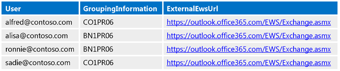
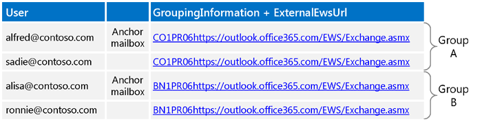
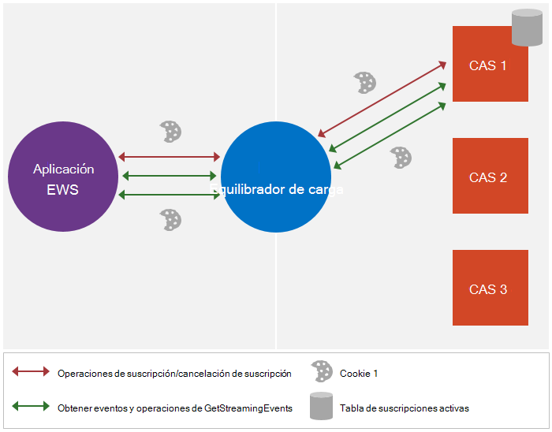
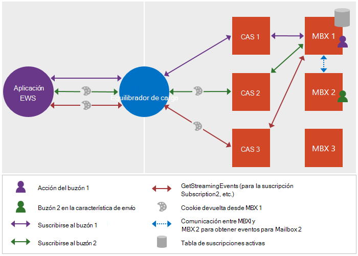

# <a name="maintain-affinity-between-a-group-of-subscriptions-and-the-mailbox-server-in-exchange"></a>Mantener la afinidad entre un grupo de suscripciones y el servidor de buzones de correo de Exchange

Obtenga información acerca de cómo mantener la afinidad entre un grupo de suscripciones y el servidor de buzones de correo.
  
Affinity es la Asociación de una secuencia de mensajes de solicitud y respuesta con un servidor de buzones de correo determinado. Para la mayoría de las funciones de Exchange, la afinidad la administra el servidor. Las notificaciones, sin embargo, son una excepción. El cliente es responsable de mantener la afinidad con el servidor de buzones de correo para las suscripciones de notificación. Esta afinidad permite que el equilibrador de carga y los servidores de acceso de cliente entre el cliente y el servidor enruten las suscripciones de notificación y las solicitudes relacionadas al servidor de buzones de correo que mantiene la suscripción. Sin afinidad, la solicitud se puede enrutar a un servidor de buzones de correo diferente que no incluye las suscripciones del cliente, lo que puede provocar que se devuelva un error [ErrorSubscriptionNotFound](https://msdn.microsoft.com/library/4b84d670-74c9-4d6d-84e7-f0a9f76f0d93%28Office.15%29.aspx) . 
  
## <a name="how-is-affinity-maintained"></a>¿Cómo se mantiene la afinidad?
<a name="bk_howmaintained"> </a>

La afinidad de Exchange se basa en cookies. El cliente desencadena la creación de la cookie mediante la inclusión de encabezados específicos en la solicitud de suscripción y, a continuación, la respuesta de la suscripción contiene la cookie. A continuación, el cliente envía esa cookie en solicitudes posteriores para asegurarse de que la solicitud se enruta al servidor de buzones de correo correcto.
  
Más concretamente, la afinidad de Exchange se controla mediante lo siguiente: 
  
- X-AnchorMailbox: un encabezado HTTP que se incluye en la solicitud de suscripción inicial. Identifica el primer buzón de un grupo de buzones que comparten la afinidad con el mismo servidor de buzones de correo.
    
- X-PreferServerAffinity: un encabezado HTTP que se incluye en la solicitud de suscripción inicial con el encabezado X-AnchorMailbox y se establece en true para indicar que el cliente está solicitando que se mantenga la afinidad con el servidor de buzones de correo.
    
- X-BackEndOverrideCookie: una cookie que se incluye en la respuesta de suscripción inicial y contiene una cookie que el equilibrador de carga y el servidor de acceso de cliente usan para redirigir las solicitudes posteriores al mismo servidor de buzones de correo.
    
## <a name="how-do-i-maintain-affinity-by-using-the-ews-managed-api-or-ews"></a>¿Cómo puedo mantener la afinidad mediante la API administrada de EWS o EWS?
<a name="bk_howdoimaintain"> </a>

Puede usar los mismos pasos para mantener la afinidad para varias suscripciones de buzones y sus servidores de buzones de correo, independientemente de si usa las notificaciones de streaming, pull o Push, y de si su objetivo es un servidor local de Exchange o Exchange Online.
  
1. Para cada buzón, [llame a detección automática](how-to-get-user-settings-from-exchange-by-using-autodiscover.md) y obtenga la configuración de usuario de GroupingInformation y ExternalEwsUrl. Para la detección automática de SOAP, use el elemento [Setting](https://msdn.microsoft.com/library/43db26e1-f7be-49fd-b26b-fc1b10bd3458%28Office.15%29.aspx) y, para la detección automática de Pox, use el elemento [GroupingInformation](https://msdn.microsoft.com/library/2d8a007f-d79c-43c8-90e3-2c6d883f3a7c%28Office.15%29.aspx) . 
    
2. Mediante la configuración GroupingInformation y ExternalEwsUrl de las respuestas de detección automática, ubique los buzones con el mismo valor concatenado de ExternalEwsUrl y GroupingInformation en el mismo grupo. Si algún grupo tiene más de 200 buzones, separe los grupos más para que cada grupo no tenga más de 200 buzones.
    
3. Cree y use un objeto [ExchangeService](https://msdn.microsoft.com/library/microsoft.exchange.webservices.data.exchangeservice%28v=EXCHG.80%29.aspx) para el resto del procedimiento. Cuando se usa el mismo objeto **ExchangeService** , las cookies y los encabezados (cuando se establecen) se mantienen automáticamente. Tenga en cuenta que si no desea agrupar las suscripciones de transmisión en una sola conexión, puede crear un objeto **ExchangeService** diferente para cada usuario suplantado. 
    
4. [Envíe una](notification-subscriptions-mailbox-events-and-ews-in-exchange.md) solicitud de suscripción para el usuario cuyo nombre de usuario aparezca primero cuando todos los usuarios del grupo estén ordenados alfabéticamente (nos referiremos a este usuario como el usuario de buzón de correo anclado). Haga lo siguiente: 
    
  - Incluya el encabezado X-AnchorMailbox con un valor establecido en la dirección SMTP del usuario buzón de correo anclado.
    
  - Incluya el encabezado X-PreferServerAffinity con un valor establecido en true.
    
  - Use el rol [ApplicationImpersonation](https://technet.microsoft.com/library/dd776119%28v=exchg.150%29.aspx) (el tipo [ExchangeImpersonation](https://msdn.microsoft.com/library/d8cbac49-47d0-4745-a2a7-545d33f8da93%28Office.15%29.aspx) ). 
    
5. En la respuesta de la suscripción, obtenga el valor X-BackEndOverrideCookie. Incluya este valor en cada una de las siguientes solicitudes de suscripción para los usuarios de este grupo.
    
6. Para cada usuario adicional del grupo, envíe una solicitud de suscripción y haga lo siguiente:
    
  - Incluya el encabezado X-AnchorMailbox con un valor establecido en la dirección SMTP del usuario buzón de correo de delimitador para el grupo.
    
  - Incluya el encabezado X-PreferServerAffinity con un valor establecido en true.
    
  - Incluya el X-BackEndOverrideCookie que se devolvió en la respuesta de la suscripción del usuario del buzón de correo anclado.
    
  - Use el rol [ApplicationImpersonation](https://technet.microsoft.com/library/dd776119%28v=exchg.150%29.aspx) (el tipo [ExchangeImpersonation](https://msdn.microsoft.com/library/d8cbac49-47d0-4745-a2a7-545d33f8da93%28Office.15%29.aspx) ). 
    
    Tenga en cuenta que el servidor usa los valores X-PreferServerAffinity y X-BackendOverrideCookie para realizar el enrutamiento al servidor de buzones de correo. El encabezado X-AnchorMailbox también es necesario, pero el servidor lo omite si los dos valores son válidos. Si X-AnchorMailbox y X-PreferServerAffinity están en una solicitud y no se incluye X-BackendOverrideCookie, el valor X-AnchorMailbox se usa para enrutar las solicitudes.
    
    Debido a que los valores X-PreferServerAffinity y X-BackendOverrideCookie realizan el enrutamiento, si el buzón de correo del delimitador se mueve alguna vez a otro grupo o servidor, la lógica no cambia porque el BackendOverrideCookie X redirige la solicitud al servidor correcto para el grupo.
    
7. Envíe una sola solicitud [GetStreamingEvents](https://msdn.microsoft.com/library/dbe83857-c4f8-4d98-813f-e03c289697a1%28Office.15%29.aspx) o [GetEvents](https://msdn.microsoft.com/library/22d4da6b-d8a8-484f-82c4-3e4b8f5431cd%28Office.15%29.aspx) para el grupo y haga lo siguiente: 
    
  - Incluya los valores de [SubscriptionId](https://msdn.microsoft.com/library/3f86c178-2311-4844-82db-c2a0e469d116%28Office.15%29.aspx) devueltos en cada una de las respuestas de suscripción individuales para los buzones del grupo. 
    
  - Si hay más de 200 suscripciones para el grupo, cree varias solicitudes. El número máximo de valores de [SubscriptionId](https://msdn.microsoft.com/library/3f86c178-2311-4844-82db-c2a0e469d116%28Office.15%29.aspx) que se deben incluir en una solicitud es de 200. 
    
  - Si necesita más conexiones de las que hay disponibles para el buzón de correo de destino, use la cuenta de servicio para suplantar el buzón de correo de delimitador del grupo; de lo contrario, no use la suplantación. Lo ideal es que desee suplantar un buzón de correo único por cada solicitud [GetStreamingEvents](https://msdn.microsoft.com/library/dbe83857-c4f8-4d98-813f-e03c289697a1%28Office.15%29.aspx) o [GetEvents](https://msdn.microsoft.com/library/22d4da6b-d8a8-484f-82c4-3e4b8f5431cd%28Office.15%29.aspx) , de modo que nunca se detecten límites de limitación. 
    
  - Use ApplicationImpersonation si necesita [más conexiones de las que hay disponibles para el buzón de correo de destino](how-to-maintain-affinity-between-group-of-subscriptions-and-mailbox-server.md#bk_throttling); de lo contrario, no use ApplicationImpersonation.
    
  - Incluya el encabezado X-PreferServerAffinity y establézcalo en true. Este valor se incluye automáticamente si usa el objeto **ExchangeService** que creó en el paso 2. 
    
  - Incluya el X-BackEndOverrideCookie para el grupo (el BackEndOverrideCookie que se ha devuelto en la respuesta de suscripción del usuario del buzón de correo anclado). Este valor se incluye automáticamente si usa el objeto **ExchangeService** que creó en el paso 2. 
    
8. Pasar los eventos devueltos a un subproceso independiente para su procesamiento.
    
## <a name="what-throttling-values-do-i-need-to-take-into-consideration"></a>¿Qué valores de limitación se deben tener en cuenta?
<a name="bk_throttling"> </a>

Al planear la implementación de la notificación, querrá tener en cuenta dos valores: el número de conexiones y el número de suscripciones. En la siguiente tabla se enumeran los valores predeterminados para cada configuración de [limitación](ews-throttling-in-exchange.md) y cómo se usa la configuración. Para cada valor, el presupuesto se asigna al buzón de correo de destino. Por este motivo, el uso de la suplantación para obtener conexiones adicionales es un paso necesario en muchos escenarios. 
  
**Tabla 1. Valores de limitación predeterminados**

|**Área de consideración**|**Configuración de limitación**|**Valor predeterminado**|**Descripción**|
|:-----|:-----|:-----|:-----|
|Conexiones de transmisión  <br/> |Límite predeterminado de conexiones francesas  <br/> |10 para Exchange Online  <br/> 3 para Exchange 2013  <br/> |Número máximo de conexiones simultáneas de transmisión por secuencias que una cuenta puede tener abiertas en el servidor al mismo tiempo. Para trabajar dentro de este límite, use una cuenta de servicio con el rol ApplicationImpersonation asignado para los buzones de correo de destino y suplante el primer usuario de cada grupo de identificador de suscripción al obtener eventos transmitidos.  <br/> |
|Conexiones de inserción o extracción  <br/> |EWSMaxConcurrency  <br/> |,27  <br/> |Número máximo de conexiones de extracción o inserción simultáneas (solicitudes que se han recibido pero que todavía no se han respondido) que una cuenta puede tener abierta en el servidor al mismo tiempo.  <br/> |
|Suscripciones  <br/> |EWSMaxSubscriptions  <br/> |20 para Exchange Online  <br/> 5000 para Exchange 2013  <br/> |El número máximo de suscripciones no expiradas que puede tener una cuenta al mismo tiempo. Este valor se reduce cuando se crea la suscripción en el servidor.  <br/> |
   
En el siguiente ejemplo se muestra cómo se administran los presupuestos entre cualquier buzón de correo de destino y la cuenta de servicio que tiene asignada la función [ApplicationImpersonation](https://technet.microsoft.com/library/dd776119%28v=exchg.150%29.aspx) para los buzones de correo de destino. 
  
- ServiceAccount1 (SA1) suplanta a muchos usuarios (M1, m2, m3, etc.) y crea suscripciones para cada buzón. Tenga en cuenta que, al crear las suscripciones, el propietario de la suscripción es SA1, por lo que cuando SA1 abre una conexión con las suscripciones, EWS exige que las suscripciones sean propiedad de SA1.
    
- SA1 puede abrir la conexión de las maneras siguientes:
    
1. Sin suplantación, de modo que la conexión se carga contra SA1.
    
2. Mediante la suplantación de cualquiera de los usuarios (M1 por ejemplo) para que la conexión se cargue con una copia del presupuesto de m1's. (M1 puede abrir diez conexiones mediante Exchange Online y todas las cuentas de servicio que suplantan a M1 pueden abrir diez conexiones mediante el presupuesto copiado).
    
- Si se alcanza el límite de conexión, estarán disponibles las siguientes soluciones:
    
  - Si se usa la opción 1, el administrador puede crear varias cuentas de servicio para suplantar a otros usuarios.
    
  - Si se usa la opción 2, el código puede suplantar a otro usuario, por ejemplo, m2.
    
## <a name="example-maintaining-affinity-between-a-group-of-subscriptions-and-the-mailbox-server"></a>Ejemplo: mantener la afinidad entre un grupo de suscripciones y el servidor de buzones de correo
<a name="bk_ce"> </a>

Bien, vamos a verlo en acción. El siguiente ejemplo de código muestra cómo agrupar usuarios y usar los encabezados X-AnchorMailbox y X-PreferServerAffinity y la cookie X-BackendOverrideCookie para mantener la afinidad con el servidor de buzones de correo. Como los encabezados y la cookie son de importancia primordial en el artículo de afinidad, este ejemplo se centra en las solicitudes y respuestas XML de EWS. Para usar la API administrada de EWS para crear el cuerpo de las solicitudes y respuestas de suscripción, consulte [transmisiones por secuencias sobre eventos de buzón de correo con EWS en Exchange](how-to-stream-notifications-about-mailbox-events-by-using-ews-in-exchange.md) y [extraer notificaciones sobre eventos de buzón de correo mediante EWS en Exchange](how-to-pull-notifications-about-mailbox-events-by-using-ews-in-exchange.md). En esta sección se incluyen pasos adicionales específicos para mantener la afinidad y agregar los encabezados a las solicitudes.
  
Este ejemplo tiene cuatro usuarios: alfred@contoso.com, alisa@contoso.com, ronnie@contoso.com y sadie@contoso.com. La siguiente figura muestra la [configuración de detección automática](how-to-get-user-settings-from-exchange-by-using-autodiscover.md) de GroupingInformation y ExternalEwsUrl para los usuarios. 
  
**Figura 1. Configuración de detección automática usada para agrupar buzones**


  
Mediante la configuración de las respuestas de detección automática, los buzones se agrupan por el valor concatenado de la configuración GroupingInformation y ExternalEwsUrl. En este ejemplo, Alfred y Sadie tienen los mismos valores, por lo que se encuentran en un grupo y alisa y Ronnie comparten los mismos valores, por lo que se encuentran en otro grupo.
  
**Figura 2. Creación de grupos de buzones**


  
A efectos de este ejemplo, nos centraremos en el grupo A. Usaría los mismos pasos para el grupo B, pero usaré un valor X-AnchorMailbox diferente para ese grupo.
  
Con [ApplicationImpersonation](https://technet.microsoft.com/library/dd776119%28v=exchg.150%29.aspx), cree la solicitud de suscripción para el buzón delimitado (Alfred@contoso.com), con el encabezado x-AnchorMailbox establecido en su dirección de correo electrónico y un valor de encabezado x-PreferServerAffinity de true. Si se establecen estos dos valores de encabezado, se activará el servidor para crear un X-BackEndOverrideCookie para la respuesta.
  
Si está usando la API administrada de EWS, use el método [HttpHeaders](https://msdn.microsoft.com/library/microsoft.exchange.webservices.data.exchangeservice_members%28v=exchg.80%29.aspx)[para agregar los](https://msdn.microsoft.com/library/cy7xta5e) dos encabezados a la solicitud de suscripción, como se muestra a continuación. 
  
```cs
service.HttpHeaders.Add("X-AnchorMailbox", Mailbox.SMTPAddress);
service.HttpHeaders.Add("X-PreferServerAffinity", "true");
```

Por lo tanto, la solicitud de suscripción de Alfred tiene este aspecto.
  
```XML
POST https://outlook.office365.com/EWS/Exchange.asmx HTTP/1.1
Content-Type: text/xml; charset=utf-8
Accept: text/xml
User-Agent: ExchangeServicesClient/15.00.0516.014
X-AnchorMailbox: alfred@contoso.com
X-PreferServerAffinity: true
Host: outlook.office365.com
<?xml version="1.0" encoding="utf-8"?>
<soap:Envelope xmlns:xsi="http://www.w3.org/2001/XMLSchema-instance" xmlns:m="https://schemas.microsoft.com/exchange/services/2006/messages" xmlns:t="https://schemas.microsoft.com/exchange/services/2006/types" xmlns:soap="https://schemas.xmlsoap.org/soap/envelope/">
  <soap:Header>
    <t:RequestServerVersion Version="Exchange2013" />
    <t:ExchangeImpersonation>
      <t:ConnectingSID>
        <t:SmtpAddress>alfred@contoso.com</t:SmtpAddress>
      </t:ConnectingSID>
    </t:ExchangeImpersonation>
  </soap:Header>
  <soap:Body>
    <m:Subscribe>
      <m:StreamingSubscriptionRequest>
        <t:FolderIds>
          <t:DistinguishedFolderId Id="inbox" />
        </t:FolderIds>
        <t:EventTypes>
          <t:EventType>NewMailEvent</t:EventType>
        </t:EventTypes>
      </m:StreamingSubscriptionRequest>
    </m:Subscribe>
  </soap:Body>
</soap:Envelope>
```

El siguiente mensaje XML es la respuesta a la solicitud de suscripción de Alfred e incluye la X-BackEndOverrideCookie. Vuelva a enviar esta cookie para todas las solicitudes posteriores para los usuarios de este grupo. Observe que la respuesta también contiene cookies adicionales, como la cookie exchangecookie usada por Exchange 2010. Exchange Online, Exchange online como parte de Office 365 y las versiones de Exchange a partir de Exchange 2013, ignore exchangecookie si se incluye en solicitudes de suscripción posteriores.
  
```XML
HTTP/1.1 200 OK
Content-Type: text/xml; charset=utf-8
Set-Cookie: exchangecookie=ddb8c383aef34c7694132aa679744feb; expires=Thu, 25-Sep-2014 18:42:45 GMT; path=/;
    HttpOnly
Set-Cookie: X-BackEndOverrideCookie=CO1PR06MB222.namprd06.prod.outlook.com~1941996295; path=/; secure; HttpOnly
Set-Cookie: X-BackEndCookie=alfred@contoso.com=Ox8XKzcXLxg==; 
    expires=Wed, 25-Sep-2013 18:52:49 GMT; path=/EWS; secure; HttpOnly
<?xml version="1.0" encoding="utf-8"?>
<s:Envelope xmlns:s="https://schemas.xmlsoap.org/soap/envelope/">
  <s:Header>
    <h:ServerVersionInfo MajorVersion="15"
                         MinorVersion="0"
                         MajorBuildNumber="775"
                         MinorBuildNumber="7"
                         Version="V2_4"
                         xmlns:h="https://schemas.microsoft.com/exchange/services/2006/types"
                         xmlns="https://schemas.microsoft.com/exchange/services/2006/types"
                         xmlns:xsd="http://www.w3.org/2001/XMLSchema"
                         xmlns:xsi="http://www.w3.org/2001/XMLSchema-instance"/>
  </s:Header>
  <s:Body xmlns:xsi="http://www.w3.org/2001/XMLSchema-instance"
          xmlns:xsd="http://www.w3.org/2001/XMLSchema">
    <m:SubscribeResponse xmlns:m="https://schemas.microsoft.com/exchange/services/2006/messages"
                         xmlns:t="https://schemas.microsoft.com/exchange/services/2006/types">
      <m:ResponseMessages>
        <m:SubscribeResponseMessage ResponseClass="Success">
          <m:ResponseCode>NoError</m:ResponseCode>
          <m:SubscriptionId>JgBjbzFwcjA2bWIyMjIubmFtcHJkMDYucHJvZC5vdXRsb29rLmNvbRAAAAAUeGk+7JFdSaFM8/NI/gQQpVdgZX6H0Ag=</m:SubscriptionId>
        </m:SubscribeResponseMessage>
      </m:ResponseMessages>
    </m:SubscribeResponse>
  </s:Body>
</s:Envelope>
```

Si se usa el X-BackEndOverrideCookie de la respuesta de Alfred y el encabezado X-AnchorMailbox, se crea la solicitud de suscripción para Sadie, el otro miembro de la solicitud de suscripción del grupo A. Sadie tiene este aspecto.
  
```XML
POST https://outlook.office365.com/EWS/Exchange.asmx HTTP/1.1
Content-Type: text/xml; charset=utf-8
Accept: text/xml
User-Agent: ExchangeServicesClient/15.00.0516.014
X-AnchorMailbox: alfred@contoso.com
X-PreferServerAffinity: true
Host: outlook.office365.com
Cookie: X-BackEndOverrideCookie=CO1PR06MB222.namprd06.prod.outlook.com~1941996295
<?xml version="1.0" encoding="utf-8"?>
<soap:Envelope xmlns:xsi="http://www.w3.org/2001/XMLSchema-instance" xmlns:m="https://schemas.microsoft.com/exchange/services/2006/messages" xmlns:t="https://schemas.microsoft.com/exchange/services/2006/types" xmlns:soap="https://schemas.xmlsoap.org/soap/envelope/">
  <soap:Header>
    <t:RequestServerVersion Version="Exchange2013" />
    <t:ExchangeImpersonation>
      <t:ConnectingSID>
        <t:SmtpAddress>sadie@contoso.com </t:SmtpAddress>
      </t:ConnectingSID>
    </t:ExchangeImpersonation>
  </soap:Header>
  <soap:Body>
    <m:Subscribe>
      <m:StreamingSubscriptionRequest>
        <t:FolderIds>
          <t:DistinguishedFolderId Id="inbox" />
        </t:FolderIds>
        <t:EventTypes>
          <t:EventType>NewMailEvent</t:EventType>
        </t:EventTypes>
      </m:StreamingSubscriptionRequest>
    </m:Subscribe>
  </soap:Body>
</soap:Envelope>

```

La respuesta de la suscripción de Sadie tiene este aspecto. Tenga en cuenta que no incluye el X-BackEndOverrideCookie. El cliente es responsable de almacenar en caché ese valor para las solicitudes futuras.
  
```XML
HTTP/1.1 200 OK
Content-Type: text/xml; charset=utf-8
Set-Cookie: exchangecookie=640ea858f69d47ff8cce8b44c337f6d9; path=/
Set-Cookie: X-BackEndCookie=alfred@contoso.com=Ox8XKzcXLxg==; 
   expires= Wed, 25-Sep-2013 18:53:06 GMT; path=/EWS; secure; HttpOnly
<?xml version="1.0" encoding="utf-8"?>
<s:Envelope xmlns:s="https://schemas.xmlsoap.org/soap/envelope/">
  <s:Header>
    <h:ServerVersionInfo MajorVersion="15"
                         MinorVersion="0"
                         MajorBuildNumber="775"
                         MinorBuildNumber="7"
                         Version="V2_4"
                         xmlns:h="https://schemas.microsoft.com/exchange/services/2006/types"
                         xmlns="https://schemas.microsoft.com/exchange/services/2006/types"
                         xmlns:xsd="http://www.w3.org/2001/XMLSchema"
                         xmlns:xsi="http://www.w3.org/2001/XMLSchema-instance"/>
  </s:Header>
  <s:Body xmlns:xsi="http://www.w3.org/2001/XMLSchema-instance"
          xmlns:xsd="http://www.w3.org/2001/XMLSchema">
    <m:SubscribeResponse xmlns:m="https://schemas.microsoft.com/exchange/services/2006/messages"
                         xmlns:t="https://schemas.microsoft.com/exchange/services/2006/types">
      <m:ResponseMessages>
        <m:SubscribeResponseMessage ResponseClass="Success">
          <m:ResponseCode>NoError</m:ResponseCode>
          <m:SubscriptionId>JgBjbzFwcjA2bWIyMjIubmFtcHJkMDYucHJvZC5vdXRsb29rLmNvbRAAAAB4EQOy2pfrQJfM3hzs/nZJIZssan6H0Ag=</m:SubscriptionId>
        </m:SubscribeResponseMessage>
      </m:ResponseMessages>
    </m:SubscribeResponse>
  </s:Body>
</s:Envelope>
```

Mediante el uso de los valores de [SubscriptionId](https://msdn.microsoft.com/library/3f86c178-2311-4844-82db-c2a0e469d116%28Office.15%29.aspx) de las respuestas de suscripción, se ha creado una solicitud de operación [GetStreamingEvents](https://msdn.microsoft.com/library/dbe83857-c4f8-4d98-813f-e03c289697a1%28Office.15%29.aspx) para todas las suscripciones del grupo. Como hay menos de 200 suscripciones en este grupo, todas se envían en una solicitud. El encabezado X-PreferServerAffinity se establece en true y se incluye el X-BackEndOverrideCookie. 
  
```XML
POST https://outlook.office365.com/EWS/Exchange.asmx HTTP/1.1
Content-Type: text/xml; charset=utf-8
Accept: text/xml
User-Agent: ExchangeServicesClient/15.00.0516.014
X-AnchorMailbox: alfred@contoso.com
X-PreferServerAffinity: true
Host: outlook.office365.com
Cookie: X-BackEndOverrideCookie=CO1PR06MB222.namprd06.prod.outlook.com~1941996295
<?xml version="1.0" encoding="utf-8"?>
<soap:Envelope xmlns:xsi="http://www.w3.org/2001/XMLSchema-instance" xmlns:m="https://schemas.microsoft.com/exchange/services/2006/messages" xmlns:t="https://schemas.microsoft.com/exchange/services/2006/types" xmlns:soap="https://schemas.xmlsoap.org/soap/envelope/">
  <soap:Header>
    <t:RequestServerVersion Version="Exchange2013" />
    <t:ExchangeImpersonation>
      <t:ConnectingSID>
        <t:SmtpAddress>sadie@contoso.com</t:SmtpAddress>
      </t:ConnectingSID>
    </t:ExchangeImpersonation>
  </soap:Header>
  <soap:Body>
    <m:GetStreamingEvents>
      <m:SubscriptionIds>
        <t:SubscriptionId>JgBjbzFwcjA2bWIyMjIubmFtcHJkMDYucHJvZC5vdXRsb29rLmNvbRAAAAB4EQOy2pfrQJfM3hzs/nZJIZssan6H0Ag=</t:SubscriptionId>
        <t:SubscriptionId>JgBjbzFwcjA2bWIyMjIubmFtcHJkMDYucHJvZC5vdXRsb29rLmNvbRAAAAAUeGk+7JFdSaFM8/NI/gQQpVdgZX6H0Ag=</t:SubscriptionId>
      </m:SubscriptionIds>
      <m:ConnectionTimeout>10</m:ConnectionTimeout>
    </m:GetStreamingEvents>
  </soap:Body>
</soap:Envelope>
```

A continuación, los eventos devueltos se pasan a un subproceso independiente para su procesamiento.
  
## <a name="how-has-affinity-changed"></a>¿Cómo ha cambiado la afinidad?
<a name="bk_howchanged"> </a>

En Exchange 2010, las suscripciones se mantienen en el servidor de acceso de cliente, tal como se muestra en la figura 3. En versiones de Exchange posteriores a Exchange 2010, las suscripciones se mantienen en el servidor de buzones de correo, tal como se muestra en la figura 4.
  
**Figura 3. Proceso para mantener la afinidad en Exchange 2010**


  
**Figura 4. Proceso para mantener la afinidad en Exchange Online y Exchange 2013**


  
En Exchange 2010, el cliente solo conoce la dirección del equilibrador de carga y el exchangecookie devuelto por el servidor asegura que la solicitud se enruta al servidor de acceso de cliente correcto. Sin embargo, en versiones posteriores, el equilibrador de carga y los roles de servidor acceso de clientes tienen que enrutar las solicitudes adecuadamente antes de que lleguen al servidor de buzones de correo. Para ello, se necesita información adicional, que es la razón por la que se introdujeron los nuevos encabezados y la cookie. Las [suscripciones de notificación de artículo, los eventos de buzón y EWS en Exchange](notification-subscriptions-mailbox-events-and-ews-in-exchange.md) explican cómo se mantienen las suscripciones en Exchange 2013. 
  
Es posible que observe que el exchangecookie que usa Exchange 2010 sigue devuelto por versiones posteriores. No hay ningún daño en incluir esta cookie en las solicitudes, pero las versiones más recientes de Exchange la omiten.
  
## <a name="see-also"></a>Vea también

- [Suscripciones de notificación, eventos de buzón y EWS en Exchange](notification-subscriptions-mailbox-events-and-ews-in-exchange.md)
- [Notificaciones de secuencia sobre eventos de buzón de correo mediante EWS en Exchange](how-to-stream-notifications-about-mailbox-events-by-using-ews-in-exchange.md)
- [Extraer notificaciones sobre eventos de buzón de correo mediante EWS en Exchange](how-to-pull-notifications-about-mailbox-events-by-using-ews-in-exchange.md)
- [Control de errores relacionados con la notificación en EWS en Exchange](handling-notification-related-errors-in-ews-in-exchange.md)
- [Cambios en la administración de la afinidad de las suscripciones de EWS...](https://blogs.msdn.com/b/mstehle/archive/2013/04/17/changes-in-managing-affinity-for-ews-subscriptions.aspx)
- [Limitación de EWS en Exchange](ews-throttling-in-exchange.md)
    

