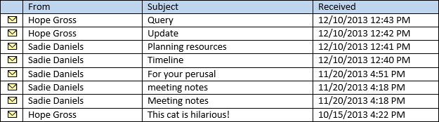
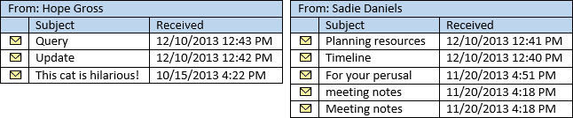
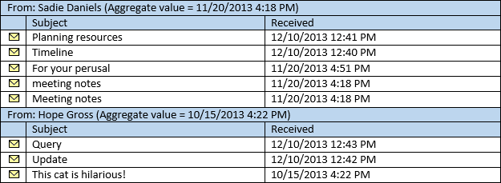

# <a name="perform-grouped-searches-by-using-ews-in-exchange"></a>Realizar búsquedas agrupadas mediante EWS en Exchange

Encuentre información acerca de cómo realizar búsquedas agrupadas en la API administrada de EWS o la aplicación de EWS dirigido a Exchange.
  
Las búsquedas agrupadas son útiles en que permite controlar cómo los resultados de búsqueda están organizados. Los resultados de búsqueda organizado pueden facilitar a su aplicación procesar los resultados o mostrar a un usuario final de una manera fácil de administrar.
  
Esta opción funciona al colocar todos los elementos dentro del conjunto de resultados que tienen el mismo valor de un campo específico en un grupo. Por ejemplo, puede agrupar los resultados por el remitente y todos los elementos de la misma persona estará en un grupo independiente y los elementos dentro de cada grupo se ordenarán según el orden que especifique en la vista. Los grupos se ordenan por un valor agregado basado en un campo que elija.
  
**La tabla 1. Métodos de la API administrada de EWS y las operaciones de EWS para organizar los resultados de búsqueda**

|**Si quiere...**|**En la API administrada de EWS, use...**|**En EWS, use...**|
|:-----|:-----|:-----|
|Organizar los elementos con el mismo valor en una propiedad concreta en los resultados en grupos  <br/> |[Grouping.GroupOn](http://msdn.microsoft.com/en-us/library/microsoft.exchange.webservices.data.grouping.groupon%28v=exchg.80%29.aspx) <br/> |Elemento [FieldURI](http://msdn.microsoft.com/library/24af8e3b-3074-4c8c-8d0a-52446508d044%28Office.15%29.aspx) como un elemento secundario del elemento [GroupBy](http://msdn.microsoft.com/library/9728619b-4674-4b9d-9f6c-e75c6165966c%28Office.15%29.aspx)  <br/> |
|Ordenar los elementos dentro de cada grupo en el valor de una propiedad concreta  <br/> |[ItemView.OrderBy](http://msdn.microsoft.com/en-us/library/microsoft.exchange.webservices.data.itemview.orderby%28v=exchg.80%29.aspx) <br/> |Elemento [SortOrder](http://msdn.microsoft.com/library/c2413f0b-8c03-46ae-9990-13338b3c53a6%28Office.15%29.aspx)  <br/> |
|Ordenar los grupos  <br/> |[Grouping.AggregateOn](http://msdn.microsoft.com/en-us/library/microsoft.exchange.webservices.data.grouping.aggregateon%28v=exchg.80%29.aspx) <br/><br/> [Grouping.AggregateType](http://msdn.microsoft.com/en-us/library/microsoft.exchange.webservices.data.grouping.aggregatetype%28v=exchg.80%29.aspx) <br/><br/> [Grouping.SortDirection](http://msdn.microsoft.com/en-us/library/microsoft.exchange.webservices.data.grouping.sortdirection%28v=exchg.80%29.aspx) <br/> |Elemento **FieldURI** como un elemento secundario del elemento [AggregateOn](http://msdn.microsoft.com/library/9b0a03f2-3282-46e1-b1a0-cbb9a0fbe9bb%28Office.15%29.aspx)<br/><br/> Atributo de **agregado** en el elemento **AggregateOn**<br/><br/>Atributo de **orden** en el elemento **GroupBy**  <br/> |
   
Vamos a echarlo paso a paso.
  
## <a name="group-results-by-a-specific-property"></a>Resultados de grupo por una propiedad concreta
<a name="bk_GroupResults"> </a>

Seleccione una propiedad o atributo en los elementos en el almacén de Exchange, que se agrupa es el primer paso para utilizar agrupación. La API administrada de EWS expone estos elementos como propiedades de la clase en las clases correspondientes, mientras EWS expone como elementos XML. Puede elegir cualquier propiedad, incluidas las propiedades extendidas o personalizadas, pero es útil comprender cómo se agrupan los elementos en función del valor de la propiedad que elija. 

Todos los elementos que tienen el mismo valor de la propiedad por que optar por agrupar se agrupan. Esto puede parecer obvio, pero es un detalle importante. Tenga en cuenta lo que sucede si agrupa por una propiedad de fecha y hora, como [Item.DateTimeReceived](http://msdn.microsoft.com/en-us/library/microsoft.exchange.webservices.data.item.datetimereceived%28v=exchg.80%29.aspx) en la API administrada de EWS, o el elemento de [DateTimeReceived](http://msdn.microsoft.com/library/8f489bd4-2434-4d0a-91fe-1b5ba7eb5765%28Office.15%29.aspx) de EWS. La intención es posible organizar los resultados en grupos, con cada grupo que contiene los elementos desde el mismo día. Sin embargo, agrupación examina el valor completo, que incluye la hora. 

El resultado final es que se va a agrupar los elementos para que los elementos recibidos al mismo tiempo, hacia abajo hasta la segunda, estén en sus propios grupos. Los resultados se ordenarán más probable es que en un gran número de grupos con un pequeño número de elementos de cada grupo. 
  
Para obtener un conjunto con un menor número de grupos y un número mayor de elementos de cada grupo de resultados, elija una propiedad que es probable que tenga una cantidad más pequeña de valores, como [EmailMessage.From](http://msdn.microsoft.com/en-us/library/microsoft.exchange.webservices.data.emailmessage.from%28v=exchg.80%29.aspx) o [Item.Categories](http://msdn.microsoft.com/en-us/library/microsoft.exchange.webservices.data.item.categories%28v=exchg.80%29.aspx) en la API administrada de EWS, o [desde](http://msdn.microsoft.com/library/5a52d644-3677-4049-874c-12bd5c3080dc%28Office.15%29.aspx) o de [categorías](http://msdn.microsoft.com/library/d84d4927-b524-4e62-bf3d-1f12fec8c21a%28Office.15%29.aspx) de EWS. En la siguiente figura se muestra una lista de mensajes de correo electrónico que aparecen en una bandeja de entrada. 
  
**En la figura 1. Mensajes en una bandeja de entrada**


  
Si agrupa los elementos en la figura 1 por la propiedad **EmailMessage.From** , el resultado será dos grupos, uno para los mensajes enviados por espero bruto y otro para los mensajes enviados por Sadie Daniels. 
  
**La figura 2. Los mensajes se dividen en grupos basados en la propiedad From**


  
## <a name="sort-the-items-within-groups"></a>Ordenar los elementos dentro de los grupos
<a name="bk_SortItems"> </a>

Puede controlar cómo se ordenan los elementos dentro de cada grupo mediante el uso de la propiedad [ItemView.OrderBy](http://msdn.microsoft.com/en-us/library/microsoft.exchange.webservices.data.itemview.orderby%28v=exchg.80%29.aspx) en la API administrada de EWS, o el elemento de [SortOrder](http://msdn.microsoft.com/library/c2413f0b-8c03-46ae-9990-13338b3c53a6%28Office.15%29.aspx) de EWS. El mismo orden se aplica a cada grupo. Por ejemplo, si ordena los elementos de la figura 1 por la propiedad **Item.DateTimeReceived** , en orden descendente, el elemento recibido más recientemente de espero bruto será la primero en el grupo de salto bruto y será el elemento recibido más recientemente de Sadie Daniels en primer lugar en el grupo Sadie Daniels. Para su comodidad, los grupos en la figura 2 ya están ordenados de esta forma. 
  
## <a name="sort-the-groups"></a>Ordenar los grupos
<a name="bk_SortGroups"> </a>

Ahora que tiene los grupos que establecen, el último paso es ordenar los propios grupos. Debido a que los propios grupos no tienen ningún valores específicos, el proceso de agrupación tiene que asignar un valor de ordenación a cada grupo. Esto se realiza mediante la agregación de los valores de una propiedad concreta dentro de cada grupo, especificado por la propiedad [Grouping.AggregateOn](http://msdn.microsoft.com/en-us/library/microsoft.exchange.webservices.data.grouping.aggregateon%28v=exchg.80%29.aspx) en la API administrada de EWS, o el elemento [FieldURI](http://msdn.microsoft.com/library/24af8e3b-3074-4c8c-8d0a-52446508d044%28Office.15%29.aspx) como un elemento secundario del elemento [AggregateOn](http://msdn.microsoft.com/library/9b0a03f2-3282-46e1-b1a0-cbb9a0fbe9bb%28Office.15%29.aspx) en EWS. La propiedad [Grouping.AggregateType](http://msdn.microsoft.com/en-us/library/microsoft.exchange.webservices.data.grouping.aggregatetype%28v=exchg.80%29.aspx) en la API administrada de EWS (o el atributo **agregado** en el elemento **AggregateOn** en EWS) especifica qué valor de los elementos dentro de cada grupo se asigna al valor de ordenación para el grupo, puede ser el mayor valor o el valor más pequeño. Por último, el criterio de ordenación (ascendente o descendente) se especifica mediante la propiedad [Grouping.SortDirection](http://msdn.microsoft.com/en-us/library/microsoft.exchange.webservices.data.grouping.sortdirection%28v=exchg.80%29.aspx) en la API administrada de EWS, o el atributo de **orden** en el elemento [GroupBy](http://msdn.microsoft.com/library/9728619b-4674-4b9d-9f6c-e75c6165966c%28Office.15%29.aspx) EWS. 
  
Por ejemplo, si se ordenan los grupos de la figura 2 agregando en la propiedad **Item.DateTimeReceived** , utilizando el valor más pequeño y ordenar en orden descendente, los elementos se devuelven en el orden en que se muestra en la figura 3. 
  
**La figura 3. Resultados de búsqueda agrupados con los grupos ordenados por la propiedad DateTimeReceived**


  
Las secciones siguientes muestran cómo es posible que extraen de agrupación y ordenación juntos en el código.
  
## <a name="example-perform-a-grouped-search-by-using-the-ews-managed-api"></a>Ejemplo: Realizar una búsqueda agrupada mediante el uso de la API administrada de EWS
<a name="bk_GroupSearchEWSMA"> </a>

Pueden utilizar la agrupación de los siguientes métodos de la API administrada de EWS:
  
- [ExchangeService.FindItems](http://msdn.microsoft.com/en-us/library/microsoft.exchange.webservices.data.exchangeservice.finditems%28v=exchg.80%29.aspx)
    
- [Folder.FindItems](http://msdn.microsoft.com/en-us/library/microsoft.exchange.webservices.data.folder.finditems%28v=exchg.80%29.aspx)
    
En el ejemplo siguiente se utiliza el método **ExchangeService.FindItems** ; Sin embargo, las mismas reglas y los conceptos se aplican al método **Folder.FindItems** . En este ejemplo, se define un método denominado **GroupItemsByFrom** . Toma un objeto [ExchangeService](http://msdn.microsoft.com/en-us/library/microsoft.exchange.webservices.data.exchangeservice%28v=exchg.80%29.aspx) y un objeto [WellKnownFolderName](http://msdn.microsoft.com/en-us/library/microsoft.exchange.webservices.data.wellknownfoldername%28v=exchg.80%29.aspx) como parámetros. Solicita los 50 primeros elementos en la carpeta, agrupadas por la propiedad **EmailMessage.From** , ordenada por la propiedad **Item.DateTimeReceived** en orden descendente. Los grupos se ordenan por el menor valor de la propiedad **Item.DateTimeReceived** en sus elementos, en orden descendente. 
  
En este ejemplo se da por supuesto que se ha inicializado el objeto **ExchangeService** con valores válidos en las propiedades de [las credenciales](http://msdn.microsoft.com/en-us/library/microsoft.exchange.webservices.data.exchangeservicebase.credentials%28v=exchg.80%29.aspx) y [dirección Url](http://msdn.microsoft.com/en-us/library/microsoft.exchange.webservices.data.exchangeservice.url%28v=exchg.80%29.aspx) . 
  
```cs
static void GroupItemsByFrom(ExchangeService service, WellKnownFolderName folder)
{
    // Limit the result set to 50 items.
    ItemView view = new ItemView(50);
    view.PropertySet = new PropertySet(ItemSchema.Subject,
                                       ItemSchema.DateTimeReceived,
                                       EmailMessageSchema.From,
                                       ItemSchema.Categories);
    // Item searches do not support Deep traversal.
    view.Traversal = ItemTraversal.Shallow;
    // Specify the sorting done within the groups.
    view.OrderBy.Add(ItemSchema.DateTimeReceived, SortDirection.Descending);
    // Configure grouping.
    Grouping groupByFrom = new Grouping();
    groupByFrom.GroupOn = EmailMessageSchema.From;
    groupByFrom.AggregateOn = ItemSchema.DateTimeReceived;
    groupByFrom.AggregateType = AggregateType.Minimum;
    groupByFrom.SortDirection = SortDirection.Descending;
    try
    {
        GroupedFindItemsResults<Item> results = service.FindItems(folder,
            view, groupByFrom);
        foreach (ItemGroup<Item> group in results.ItemGroups)
        {
            Console.WriteLine("Group: {0}", group.GroupIndex);
            foreach (Item item in group.Items)
            {
                if (item is EmailMessage)
                {
                    EmailMessage message = item as EmailMessage;
                    Console.WriteLine("From: {0}", message.From);
                    Console.WriteLine("Subject: {0}", message.Subject);
                    Console.WriteLine("Id: {0}\n", message.Id.ToString());
                }
            }
        }
    }
    catch (Exception ex)
    {
        Console.WriteLine("Exception while enumerating results: {0}", ex.Message);
    }
}
```

## <a name="example-perform-a-grouped-search-by-using-ews"></a>Ejemplo: Realizar una búsqueda agrupada mediante el uso de EWS
<a name="bk_GroupSearchEWS"> </a>

El siguiente ejemplo de solicitud muestra una solicitud de [operación FindItem](http://msdn.microsoft.com/library/ebad6aae-16e7-44de-ae63-a95b24539729%28Office.15%29.aspx) para los 50 primeros elementos en la carpeta, agrupada por el elemento **desde** , ordenado por el elemento **DateTimeReceived** en orden descendente. Los grupos se ordenan por el valor más pequeño del elemento **DateTimeReceived** en sus elementos, en orden descendente. 
  
```XML
<?xml version="1.0" encoding="utf-8"?>
<soap:Envelope xmlns:xsi="http://www.w3.org/2001/XMLSchema-instance" 
    xmlns:m="http://schemas.microsoft.com/exchange/services/2006/messages" 
    xmlns:t="http://schemas.microsoft.com/exchange/services/2006/types" 
    xmlns:soap="http://schemas.xmlsoap.org/soap/envelope/">
  <soap:Header>
    <t:RequestServerVersion Version="Exchange2007_SP1" />
    <t:TimeZoneContext>
      <t:TimeZoneDefinition Id="Eastern Standard Time" />
    </t:TimeZoneContext>
  </soap:Header>
  <soap:Body>
    <m:FindItem Traversal="Shallow">
      <m:ItemShape>
        <t:BaseShape>IdOnly</t:BaseShape>
        <t:AdditionalProperties>
          <t:FieldURI FieldURI="item:Subject" />
          <t:FieldURI FieldURI="item:DateTimeReceived" />
          <t:FieldURI FieldURI="message:From" />
          <t:FieldURI FieldURI="item:Categories" />
        </t:AdditionalProperties>
      </m:ItemShape>
      <m:IndexedPageItemView MaxEntriesReturned="50" Offset="0" BasePoint="Beginning" />
      <m:GroupBy Order="Descending">
        <t:FieldURI FieldURI="message:From" />
        <t:AggregateOn Aggregate="Minimum">
          <t:FieldURI FieldURI="item:DateTimeReceived" />
        </t:AggregateOn>
      </m:GroupBy>
      <m:SortOrder>
        <t:FieldOrder Order="Descending">
          <t:FieldURI FieldURI="item:DateTimeReceived" />
        </t:FieldOrder>
      </m:SortOrder>
      <m:ParentFolderIds>
        <t:DistinguishedFolderId Id="inbox" />
      </m:ParentFolderIds>
    </m:FindItem>
  </soap:Body>
</soap:Envelope>
```

El servidor devuelve la respuesta siguiente.
  
```XML
<?xml version="1.0" encoding="utf-8"?>
<s:Envelope xmlns:s="http://schemas.xmlsoap.org/soap/envelope/">
  <s:Header>
    <h:ServerVersionInfo MajorVersion="15" MinorVersion="0" MajorBuildNumber="712" MinorBuildNumber="22" Version="V2_3" 
        xmlns:h="http://schemas.microsoft.com/exchange/services/2006/types" 
        xmlns="http://schemas.microsoft.com/exchange/services/2006/types" 
        xmlns:xsd="http://www.w3.org/2001/XMLSchema" 
        xmlns:xsi="http://www.w3.org/2001/XMLSchema-instance" />
  </s:Header>
  <s:Body xmlns:xsi="http://www.w3.org/2001/XMLSchema-instance" xmlns:xsd="http://www.w3.org/2001/XMLSchema">
    <m:FindItemResponse xmlns:m="http://schemas.microsoft.com/exchange/services/2006/messages" 
      xmlns:t="http://schemas.microsoft.com/exchange/services/2006/types">
      <m:ResponseMessages>
        <m:FindItemResponseMessage ResponseClass="Success">
          <m:ResponseCode>NoError</m:ResponseCode>
          <m:RootFolder IndexedPagingOffset="10" TotalItemsInView="8" IncludesLastItemInRange="true">
            <t:Groups>
              <t:GroupedItems>
                <t:GroupIndex>0</t:GroupIndex>
                <t:Items>
                  <t:Message>
                    <t:ItemId Id="AAMkAGM2..." ChangeKey="CQAAABYA..." />
                    <t:Subject>Planning resources</t:Subject>
                    <t:DateTimeReceived>2013-12-10T17:41:05Z</t:DateTimeReceived>
                    <t:From>
                      <t:Mailbox>
                        <t:Name>Sadie Daniels</t:Name>
                        <t:EmailAddress>/O=FIRST ORGANIZATION/OU=EXCHANGE ADMINISTRATIVE GROUP (FYDIBOHF23SPDLT)/CN=RECIPIENTS/CN=8D84A3F4CBB34D48838A3AECF99795C0-SADIE</t:EmailAddress>
                        <t:RoutingType>EX</t:RoutingType>
                      </t:Mailbox>
                    </t:From>
                  </t:Message>
                  <t:Message>
                    <t:ItemId Id="AAMkAGM2..." ChangeKey="CQAAABYA..." />
                    <t:Subject>Timeline</t:Subject>
                    <t:DateTimeReceived>2013-12-10T17:40:37Z</t:DateTimeReceived>
                    <t:Categories>
                      <t:String>Project</t:String>
                    </t:Categories>
                    <t:From>
                      <t:Mailbox>
                        <t:Name>Sadie Daniels</t:Name>
                        <t:EmailAddress>/O=FIRST ORGANIZATION/OU=EXCHANGE ADMINISTRATIVE GROUP (FYDIBOHF23SPDLT)/CN=RECIPIENTS/CN=8D84A3F4CBB34D48838A3AECF99795C0-SADIE</t:EmailAddress>
                        <t:RoutingType>EX</t:RoutingType>
                      </t:Mailbox>
                    </t:From>
                  </t:Message>
                  <t:Message>
                    <t:ItemId Id="AAMkAGM2..." ChangeKey="CQAAABYA..." />
                    <t:Subject>For your perusal</t:Subject>
                    <t:DateTimeReceived>2013-11-20T21:51:16Z</t:DateTimeReceived>
                    <t:From>
                      <t:Mailbox>
                        <t:Name>Sadie Daniels</t:Name>
                        <t:EmailAddress>/O=FIRST ORGANIZATION/OU=EXCHANGE ADMINISTRATIVE GROUP (FYDIBOHF23SPDLT)/CN=RECIPIENTS/CN=8D84A3F4CBB34D48838A3AECF99795C0-SADIE</t:EmailAddress>
                        <t:RoutingType>EX</t:RoutingType>
                      </t:Mailbox>
                    </t:From>
                  </t:Message>
                  <t:Message>
                    <t:ItemId Id="AAMkAGM2..." ChangeKey="CQAAABYA..." />
                    <t:Subject>meeting notes</t:Subject>
                    <t:DateTimeReceived>2013-11-20T21:18:51Z</t:DateTimeReceived>
                    <t:Categories>
                      <t:String>Blue category</t:String>
                    </t:Categories>
                    <t:From>
                      <t:Mailbox>
                        <t:Name>Sadie Daniels</t:Name>
                        <t:EmailAddress>/O=FIRST ORGANIZATION/OU=EXCHANGE ADMINISTRATIVE GROUP (FYDIBOHF23SPDLT)/CN=RECIPIENTS/CN=8D84A3F4CBB34D48838A3AECF99795C0-SADIE</t:EmailAddress>
                        <t:RoutingType>EX</t:RoutingType>
                      </t:Mailbox>
                    </t:From>
                  </t:Message>
                  <t:Message>
                    <t:ItemId Id="AAMkAGM2..." ChangeKey="CQAAABYA..." />
                    <t:Subject>Meeting notes</t:Subject>
                    <t:DateTimeReceived>2013-11-20T21:18:51Z</t:DateTimeReceived>
                    <t:From>
                      <t:Mailbox>
                        <t:Name>Sadie Daniels</t:Name>
                        <t:EmailAddress>/O=FIRST ORGANIZATION/OU=EXCHANGE ADMINISTRATIVE GROUP (FYDIBOHF23SPDLT)/CN=RECIPIENTS/CN=8D84A3F4CBB34D48838A3AECF99795C0-SADIE</t:EmailAddress>
                        <t:RoutingType>EX</t:RoutingType>
                      </t:Mailbox>
                    </t:From>
                  </t:Message>
                </t:Items>
              </t:GroupedItems>
              <t:GroupedItems>
                <t:GroupIndex>1</t:GroupIndex>
                <t:Items>
                  <t:Message>
                    <t:ItemId Id="AAMkAGM2..." ChangeKey="CQAAABYA..." />
                    <t:Subject>Query</t:Subject>
                    <t:DateTimeReceived>2013-12-10T17:43:15Z</t:DateTimeReceived>
                    <t:From>
                      <t:Mailbox>
                        <t:Name>Hope Gross</t:Name>
                        <t:EmailAddress>/O=FIRST ORGANIZATION/OU=EXCHANGE ADMINISTRATIVE GROUP (FYDIBOHF23SPDLT)/CN=RECIPIENTS/CN=9B55E4100C064D9D8C5F72FF36802ED3-HOPE</t:EmailAddress>
                        <t:RoutingType>EX</t:RoutingType>
                      </t:Mailbox>
                    </t:From>
                  </t:Message>
                  <t:Message>
                    <t:ItemId Id="AAMkAGM2..." ChangeKey="CQAAABYA..." />
                    <t:Subject>Update</t:Subject>
                    <t:DateTimeReceived>2013-12-10T17:42:33Z</t:DateTimeReceived>
                    <t:Categories>
                      <t:String>Project</t:String>
                      <t:String>Blue category</t:String>
                    </t:Categories>
                    <t:From>
                      <t:Mailbox>
                        <t:Name>Hope Gross</t:Name>
                        <t:EmailAddress>/O=FIRST ORGANIZATION/OU=EXCHANGE ADMINISTRATIVE GROUP (FYDIBOHF23SPDLT)/CN=RECIPIENTS/CN=9B55E4100C064D9D8C5F72FF36802ED3-HOPE</t:EmailAddress>
                        <t:RoutingType>EX</t:RoutingType>
                      </t:Mailbox>
                    </t:From>
                  </t:Message>
                  <t:Message>
                    <t:ItemId Id="AAMkAGM2..." ChangeKey="CQAAABYA..." />
                    <t:Subject>This cat is hilarious!</t:Subject>
                    <t:DateTimeReceived>2013-10-15T20:22:12Z</t:DateTimeReceived>
                    <t:From>
                      <t:Mailbox>
                        <t:Name>Hope Gross</t:Name>
                        <t:EmailAddress>/O=FIRST ORGANIZATION/OU=EXCHANGE ADMINISTRATIVE GROUP (FYDIBOHF23SPDLT)/CN=RECIPIENTS/CN=9B55E4100C064D9D8C5F72FF36802ED3-HOPE</t:EmailAddress>
                        <t:RoutingType>EX</t:RoutingType>
                      </t:Mailbox>
                    </t:From>
                  </t:Message>
                </t:Items>
              </t:GroupedItems>
            </t:Groups>
          </m:RootFolder>
        </m:FindItemResponseMessage>
      </m:ResponseMessages>
    </m:FindItemResponse>
  </s:Body>
</s:Envelope>
```

## <a name="version-differences"></a>Diferencias de versión
<a name="bk_VersionDiffs"> </a>

Versiones de Exchange con la versión principal 15 iniciales y finales con compilación 15.0.775.38 **grupo de** elementos devueltos (de tipo **GroupedItemsType**) en lugar de [GroupedItems](http://msdn.microsoft.com/library/53170df4-4272-4b37-b23f-cd8e2d4a7396%28Office.15%29.aspx) elementos en la respuesta SOAP. Si está utilizando la API administrada de EWS, esto hará que la colección [GroupedFindItemsResults.ItemGroups](http://msdn.microsoft.com/en-us/library/office/dd633961%28v=exchg.80%29.aspx) que se va a contener objetos 0. Si usa EWS, elementos de **grupo** deben controlarse como elementos de **GroupedItems** . 
  
Las versiones de Exchange a partir de la versión principal 15 devuelven elementos de **grupo** o **GroupedItems** adicionales con el atributo **xsi: nil** establecido en **true** en la respuesta SOAP. Si está utilizando la API administrada de EWS, estos elementos adicionales provocará un [ServiceXmlDeserializationException](http://msdn.microsoft.com/en-us/library/microsoft.exchange.webservices.data.servicexmldeserializationexception%28v=exchg.80%29.aspx) que se inicie. Si usa EWS, se deben omitir estos elementos adicionales. 
  
## <a name="see-also"></a>Ver también

- [Búsqueda y EWS en Exchange](search-and-ews-in-exchange.md)    
- [ExchangeService.FindItems](http://msdn.microsoft.com/en-us/library/microsoft.exchange.webservices.data.exchangeservice.finditems%28v=exchg.80%29.aspx)    
- [Folder.FindItems](http://msdn.microsoft.com/en-us/library/microsoft.exchange.webservices.data.folder.finditems%28v=exchg.80%29.aspx)   
- [Clase de agrupación](http://msdn.microsoft.com/en-us/library/microsoft.exchange.webservices.data.grouping%28v=exchg.80%29.aspx)    
- [Operación FindItem](http://msdn.microsoft.com/library/ebad6aae-16e7-44de-ae63-a95b24539729%28Office.15%29.aspx)
    

