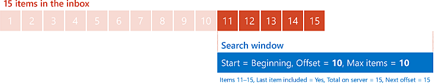
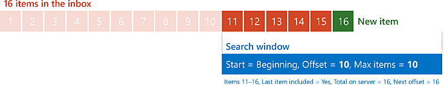
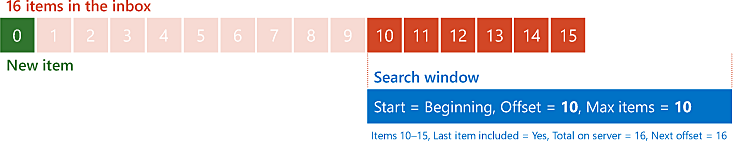

# <a name="perform-paged-searches-by-using-ews-in-exchange"></a>Realizar búsquedas paginadas utilizando EWS en Exchange

Descubra cómo realizar búsquedas paginadas en su API administrada de EWS o en la aplicación EWS destinada a Exchange.
  
La paginación es una función de EWS que le permite controlar el tamaño de los resultados de una búsqueda. En lugar de recuperar el conjunto de resultados completo en una respuesta de EWS, puede recuperar conjuntos más pequeños en varias respuestas de EWS. Por ejemplo, imagine que un usuario tiene 10 000 mensajes de correo electrónico en su bandeja de entrada. Hipotéticamente, podría recuperar los 10 000 mensajes de correo electrónico en una respuesta muy grande, pero es posible que desee dividir los resultados en partes más manejables por razones de ancho de banda o rendimiento. La paginación proporciona las herramientas necesarias para hacer precisamente eso.
  
> [!NOTE]
> Si bien hipotéticamente puede recuperar 10 000 elementos en una solicitud, en realidad, esto es poco probable debido a la limitación de EWS. Para obtener más información, consulte [Limitación de EWS en Exchange](ews-throttling-in-exchange.md). 
  
**Tabla 1. Parámetros de paginación en la API administrada de EWS y EWS**

|**Para configurar o recuperar el…**|**En la API administrada de EWS, use…**|**En EWS, use…**|
|:-----|:-----|:-----|
|Número máximo de elementos o carpetas en una respuesta  <br/> |Parámetro **pageSize** para el [constructor ItemView](https://msdn.microsoft.com/library/microsoft.exchange.webservices.data.itemview.itemview%28v=exchg.80%29.aspx) o el [constructor FolderView](https://msdn.microsoft.com/library/microsoft.exchange.webservices.data.folderview.folderview%28v=exchg.80%29.aspx) <br/> O bien  <br/> Propiedad [PagedView.PageSize](https://msdn.microsoft.com/library/microsoft.exchange.webservices.data.pagedview.pagesize%28v=exchg.80%29.aspx)  <br/> |Atributo **MaxEntriesReturned** en el elemento [IndexedPageItemView](https://msdn.microsoft.com/library/6d1b0b04-cc35-4a57-bd7a-824136d14fda%28Office.15%29.aspx) o el elemento [IndexedPageFolderView](https://msdn.microsoft.com/library/c6dac232-244b-4db0-9a15-5e01b8aa7a7d%28Office.15%29.aspx)  <br/> |
|Punto de partida en la lista de elementos o carpetas  <br/> |Parámetro **offsetBasePoint** para el constructor **ItemView** o el constructor **FolderView**  <br/> O bien  <br/> Propiedad [PagedView.OffsetBasePoint](https://msdn.microsoft.com/library/microsoft.exchange.webservices.data.pagedview.offsetbasepoint%28v=exchg.80%29.aspx)  <br/> |Atributo **BasePoint** en el elemento **IndexedPageItemView** o el elemento **IndexedPageFolderView**  <br/> |
|Desplazamiento desde el punto de partida  <br/> |Parámetro **offset** para el constructor **ItemView** o el constructor **FolderView**  <br/> O bien  <br/> Propiedad [PagedView.Offset](https://msdn.microsoft.com/library/microsoft.exchange.webservices.data.pagedview.offset%28v=exchg.80%29.aspx)  <br/> |Atributo **Offset** en el elemento **IndexedPageItemView** o el elemento **IndexedPageFolderView**  <br/> |
|Número total de resultados en el servidor  <br/> |Propiedad [FindItemsResults.TotalCount](https://msdn.microsoft.com/library/dd635348%28v=exchg.80%29.aspx) o propiedad [FindFoldersResults.TotalCount](https://msdn.microsoft.com/library/microsoft.exchange.webservices.data.findfoldersresults.totalcount%28v=exchg.80%29.aspx)  <br/> |Atributo **TotalItemsInView** en el elemento [RootFolder (FindItemResponseMessage)](https://msdn.microsoft.com/library/187e009f-efaa-42a8-8962-329a645213ab%28Office.15%29.aspx) o el elemento [RootFolder (FindFolderResponseMessage)](https://msdn.microsoft.com/library/5089c815-663f-46be-bc59-aed9ee20f94a%28Office.15%29.aspx)  <br/> |
|Desplazamiento del primer elemento o carpeta no incluidos en la respuesta actual  <br/> |Propiedad [FindItemsResults.NextPageOffset](https://msdn.microsoft.com/library/ee693014%28v=exchg.80%29.aspx) o propiedad [FindFoldersResults.NextPageOffset](https://msdn.microsoft.com/library/microsoft.exchange.webservices.data.findfoldersresults.nextpageoffset%28v=exchg.80%29.aspx)  <br/> |Atributo **IndexedPagingOffset** en el elemento **RootFolder**  <br/> |
|Indicador de que la respuesta incluye el último elemento o carpeta de la lista  <br/> |Propiedad [FindItemsResults.MoreAvailable](https://msdn.microsoft.com/library/dd635477%28v=exchg.80%29.aspx) o propiedad [FindFoldersResults.MoreAvailable](https://msdn.microsoft.com/library/microsoft.exchange.webservices.data.findfoldersresults.moreavailable%28v=exchg.80%29.aspx)  <br/> |Atributo **IncludesLastItemInRange** en el elemento **RootFolder**  <br/> |
   
## <a name="how-paging-works"></a>Cómo funciona la paginación
<a name="bk_HowPagingWorks"> </a>

Para comprender cómo funciona la paginación, es útil visualizar los mensajes en una carpeta como vallas publicitarias alineadas una al lado de la otra en una explanada. Imagine que puede ver algunas de estas vallas publicitarias a través de una ventana mágica. Puede cambiar el tamaño de la ventana (para ver más o menos vallas publicitarias a la vez) y mover la ventana (para controlar qué vallas publicitarias puede ver). Esta manipulación de la ventana es como la paginación. 
  
Cuando envía su solicitud al servidor Exchange, especifica el tamaño de su ventana indicando cuántos artículos quiere que se devuelvan. La posición de la ventana se establece especificando un punto de inicio (ya sea el comienzo de la línea o el final de la línea) y un desplazamiento desde ese punto de inicio, que se expresa como número de elementos. El comienzo de la ventana es el número de elementos que especifica el desplazamiento desde el punto de inicio.
  
Donde la paginación se vuelve un poco más interesante es en la respuesta del servidor y en la manera en la que su aplicación puede usar esa respuesta para dar forma a su próxima solicitud. El servidor le proporciona tres datos que puede utilizar para determinar cómo configurar su "ventana" para su próxima solicitud: 
  
- Si los resultados de la respuesta incluyen o no el último elemento del conjunto de resultados general en el servidor.
    
- El número total de elementos del conjunto de resultados en el servidor.
    
- Cuál debería ser el siguiente valor del desplazamiento, si desea avanzar su ventana al siguiente elemento del conjunto de resultados que no se incluya en la respuesta actual.
    
Veamos un ejemplo sencillo. Imagine una bandeja de entrada con 15 mensajes. Su aplicación envía una solicitud inicial para recuperar un máximo de 10 elementos, comenzando por el principio de la lista de mensajes (por lo que el desplazamiento es cero). El servidor responde con los primeros 10 mensajes e indica que la respuesta no incluye el último elemento, que hay un total de 15 elementos y que el próximo desplazamiento debe ser 10.
  
**Ilustración 1. Solicitud de 10 elementos en el desplazamiento 0 del comienzo de una lista de 15 elementos**


  
Luego, su aplicación reenvía la misma solicitud al servidor, con la única diferencia de que el desplazamiento es ahora 10. El servidor devuelve los últimos cinco elementos e indica que la respuesta incluye el último elemento, que hay un total de 15 elementos y que el próximo desplazamiento debe ser 15 (aunque, obviamente, como ha llegado al final, no habrá un próximo desplazamiento).
  
**Ilustración 2. Solicitud de 10 elementos en el desplazamiento 10 del principio de una lista de 15 elementos**


  
## <a name="design-considerations-for-paging"></a>Consideraciones de diseño para la paginación
<a name="bk_DesignConsiderations"> </a>

Aprovechar al máximo la paginación en su aplicación requiere tener en cuenta ciertos aspectos. Por ejemplo, ¿cuál será el tamaño de su "ventana"? ¿Qué hará si los resultados en el servidor cambian mientras mueve su "ventana"?
  
### <a name="determine-the-size-of-your-window"></a>Determinar el tamaño de su ventana

No existe un número máximo de entradas "único" que todas las aplicaciones deban utilizar. Determinar el número adecuado para su aplicación depende de varios factores. Sin embargo, es útil tener en cuenta las siguientes pautas:
  
- De forma predeterminada, Exchange establece que el número máximo de artículos que se pueden devolver en una sola solicitud sea 1000.
    
- Establecer el número máximo de entradas en un número mayor da como resultado tener que enviar menos solicitudes para obtener todos los elementos, pero se deberá esperar más tiempo para obtener respuestas.
    
- Establecer el número máximo de entradas en un número menor da como resultado tiempos de respuesta más rápidos, pero implica enviar más solicitudes para obtener todos los elementos.
    
### <a name="handling-changes-to-the-result-set"></a>Gestionar cambios en el conjunto de resultados

En el ejemplo simple de este artículo, el número de elementos en la bandeja de entrada del usuario se mantuvo constante. Sin embargo, en realidad, la cantidad de elementos de una bandeja de entrada puede cambiar con frecuencia. Pueden llegar nuevos mensajes y los elementos se pueden eliminar o mover en cualquier momento. Pero, ¿cómo afecta esto a la paginación? Modifiquemos el escenario de ejemplo anterior para averiguarlo.
  
Comenzaremos de nuevo con los 15 elementos de la bandeja de entrada del usuario y enviaremos la misma solicitud inicial. Como antes, el servidor responde con los primeros 10 mensajes e indica que la respuesta no incluye el último elemento, que hay un total de 15 elementos y que el siguiente desplazamiento debe ser 10, como se muestra en la ilustración 1.
  
Ahora, mientras su aplicación procesa esos 10 elementos, llega un nuevo mensaje a la bandeja de entrada y se agrega al conjunto de resultados en el servidor. Su aplicación reenvía la misma solicitud al servidor (solo con el desplazamiento establecido en 10). Esta vez, el servidor recupera 6 elementos e indica que hay un total de 16 elementos en el conjunto de resultados.
  
En este punto, es posible que se pregunte si esto es un problema. Después de todo, obtuvo 16 elementos en las dos respuestas, así que ¿por qué podría ser esto un problema? La respuesta depende de en qué lugar de la lista se coloque el nuevo elemento. Si la lista está ordenada de modo que los elementos más antiguos (por fecha/hora de recepción) sean los primeros, no hay motivo de preocupación en este escenario. El nuevo elemento se colocará al final de la lista y se incluirá en la segunda respuesta.
  
**Ilustración 3. Solicitud de 10 elementos en el desplazamiento 10 desde el principio de una lista de 16 elementos, siendo nuevo el elemento 16 de la lista**


  
Si la lista está ordenada para que los elementos más nuevos sean los primeros, cambia la historia. En este caso, el primer elemento de la segunda solicitud sería el último elemento de la solicitud anterior más los cinco elementos restantes de los 15 originales. Para decirlo en términos de nuestra ventana mágica imaginaria, cambió su ventana 10 posiciones, pero las vallas publicitarias también avanzaron una posición.
  
**Ilustración 4. Solicitud de 10 elementos en el desplazamiento 10 desde el principio de una lista de 16 elementos, siendo nuevo el primer elemento de la lista**


  
Una forma de detectar un cambio en los resultados en el servidor es utilizar el concepto de elemento delimitador. Un elemento delimitador es un elemento adicional en su respuesta que no se procesa junto con el resto de los resultados, pero se utiliza para realizar una comparación con los siguientes resultados para ver si los elementos han cambiado. Volviendo a nuestro ejemplo simple, si su aplicación utiliza un tamaño de "ventana" de 10, en realidad establece que el número máximo de elementos que se pueda devolver sea 11. Su aplicación procesa los primeros 10 elementos de la respuesta como de costumbre. Para el último elemento, guarde el identificador del elemento como delimitador y, luego, emita la siguiente solicitud con un desplazamiento de 10. Si los datos no han cambiado, el primer elemento de la segunda respuesta deberá tener un identificador de elemento que coincida con el delimitador. Si los identificadores de elemento no coinciden, sabrá que los datos se han eliminado o insertado en las partes de la lista en las que ya ha aplicado la paginación.
  
Incluso aunque sepa que los datos han cambiado, deberá decidir cómo actuar en consecuencia. Tampoco existe una respuesta única a esta pregunta. Sus acciones dependerán de su tipo de aplicación y de lo importante que sea capturar todos los elementos. Puede ignorar los cambios por completo, reiniciar el proceso desde el principio o retroceder e intentar detectar dónde se produjo el cambio.
  
## <a name="example-perform-a-paged-search-by-using-the-ews-managed-api"></a>Ejemplo: realizar una búsqueda paginada mediante la API administrada de EWS
<a name="bk_PagedSearchEWSMA"> </a>

La paginación es compatible con los siguientes métodos de API administrada de EWS:
  
- [ExchangeService.FindFolders](https://msdn.microsoft.com/library/microsoft.exchange.webservices.data.exchangeservice.findfolders%28v=exchg.80%29.aspx)
    
- [ExchangeService.FindItems](https://msdn.microsoft.com/library/microsoft.exchange.webservices.data.exchangeservice.finditems%28v=exchg.80%29.aspx)
    
- [Folder.FindFolders](https://msdn.microsoft.com/library/microsoft.exchange.webservices.data.folder.findfolders%28v=exchg.80%29.aspx)
    
- [Folder.FindFolders](https://msdn.microsoft.com/library/microsoft.exchange.webservices.data.folder.finditems%28v=exchg.80%29.aspx)
    
Si utiliza la API administrada de EWS, su aplicación configurará la paginación con la clase [ItemView](https://msdn.microsoft.com/library/microsoft.exchange.webservices.data.itemview%28v=exchg.80%29.aspx) o [FolderView](https://msdn.microsoft.com/library/microsoft.exchange.webservices.data.folderview%28v=exchg.80%29.aspx) y recibirá información del servidor con respecto a la paginación de la clase [FindItemsResults](https://msdn.microsoft.com/library/dd635381%28v=exchg.80%29.aspx) o [FindFoldersResults](https://msdn.microsoft.com/library/microsoft.exchange.webservices.data.findfoldersresults%28v=exchg.80%29.aspx). 
  
En el siguiente ejemplo se recuperan todos los elementos de una carpeta mediante una búsqueda paginada que devuelve cinco elementos en cada respuesta. También se recupera un elemento adicional que sirve como delimitador para detectar cambios en los resultados en el servidor. 
  
En este ejemplo se asume que el objeto **ExchangeService** se ha inicializado con valores válidos en las propiedades [Credentials](https://msdn.microsoft.com/library/microsoft.exchange.webservices.data.exchangeservicebase.credentials%28v=exchg.80%29.aspx) y [Url](https://msdn.microsoft.com/library/microsoft.exchange.webservices.data.exchangeservice.url%28v=exchg.80%29.aspx). 
  
```cs
using Microsoft.Exchange.WebServices.Data;
static void PageSearchItems(ExchangeService service, WellKnownFolderName folder)
{
    int pageSize = 5;
    int offset = 0;
    // Request one more item than your actual pageSize.
    // This will be used to detect a change to the result
    // set while paging.
    ItemView view = new ItemView(pageSize + 1, offset);
    view.PropertySet = new PropertySet(ItemSchema.Subject);
    view.OrderBy.Add(ItemSchema.DateTimeReceived, SortDirection.Descending);
    view.Traversal = ItemTraversal.Shallow;
    bool moreItems = true;
    ItemId anchorId = null;
    while (moreItems)
    {
        try
        {
            FindItemsResults<Item> results = service.FindItems(folder, view);
            moreItems = results.MoreAvailable;
            if (moreItems && anchorId != null)
            {
                // Check the first result to make sure it matches
                // the last result (anchor) from the previous page.
                // If it doesn't, that means that something was added
                // or deleted since you started the search.
                if (results.Items.First<Item>().Id != anchorId)
                {
                    Console.WriteLine("The collection has changed while paging. Some results may be missed.");
                }
            }
            if (moreItems)
                view.Offset += pageSize;
                
            anchorId = results.Items.Last<Item>().Id;
            
            // Because you're including an additional item on the end of your results
            // as an anchor, you don't want to display it.
            // Set the number to loop as the smaller value between
            // the number of items in the collection and the page size.
            int displayCount = 0;
            if ((results.MoreAvailable == false && results.Items.Count > pageSize) || (results.Items.Count < pageSize))
            {
                displayCount = results.Items.Count;
            }
            else
            {
                displayCount = pageSize;
            }
            
            for (int i = 0; i < displayCount; i++)
            {
                Item item = results.Items[i];
                Console.WriteLine("Subject: {0}", item.Subject);
                Console.WriteLine("Id: {0}\n", item.Id.ToString());
            }
        }
        catch (Exception ex)
        {
            Console.WriteLine("Exception while paging results: {0}", ex.Message);
        }
    }
}
```

## <a name="example-perform-a-paged-search-by-using-ews"></a>Ejemplo: realizar una búsqueda paginada mediante EWS
<a name="bk_PagedSearchEWS"> </a>

La paginación es compatible con las siguientes operaciones de EWS:
  
- [FindFolder](https://msdn.microsoft.com/library/7a9855aa-06cc-45ba-ad2a-645c15b7d031%28Office.15%29.aspx)
    
- [FindItem](https://msdn.microsoft.com/library/ebad6aae-16e7-44de-ae63-a95b24539729%28Office.15%29.aspx)
    
Si utiliza EWS, su aplicación configurará la paginación con el elemento [IndexedPageItemView](https://msdn.microsoft.com/library/6d1b0b04-cc35-4a57-bd7a-824136d14fda%28Office.15%29.aspx) o el elemento [IndexedPageFolderView](https://msdn.microsoft.com/library/c6dac232-244b-4db0-9a15-5e01b8aa7a7d%28Office.15%29.aspx) y recibirá información del servidor con respecto a la paginación del elemento [RootFolder (FindItemResponseMessage)](https://msdn.microsoft.com/library/187e009f-efaa-42a8-8962-329a645213ab%28Office.15%29.aspx) o del elemento [RootFolder (FindFolderResponseMessage)](https://msdn.microsoft.com/library/5089c815-663f-46be-bc59-aed9ee20f94a%28Office.15%29.aspx). 
  
En este ejemplo de solicitud, se enviará una solicitud **FindItem** para un máximo de seis elementos, comenzando con un desplazamiento de cero desde el comienzo de la lista de elementos en la bandeja de entrada del usuario. 
  
```XML
<?xml version="1.0" encoding="utf-8"?>
<soap:Envelope xmlns:xsi="http://www.w3.org/2001/XMLSchema-instance" 
    xmlns:m="https://schemas.microsoft.com/exchange/services/2006/messages" 
    xmlns:t="https://schemas.microsoft.com/exchange/services/2006/types" 
    xmlns:soap="https://schemas.xmlsoap.org/soap/envelope/">
  <soap:Header>
    <t:RequestServerVersion Version="Exchange2007_SP1" />
    <t:TimeZoneContext>
      <t:TimeZoneDefinition Id="Eastern Standard Time" />
    </t:TimeZoneContext>
  </soap:Header>
  <soap:Body>
    <m:FindItem Traversal="Shallow">
      <m:ItemShape>
        <t:BaseShape>IdOnly</t:BaseShape>
        <t:AdditionalProperties>
          <t:FieldURI FieldURI="item:Subject" />
        </t:AdditionalProperties>
      </m:ItemShape>
      <m:IndexedPageItemView MaxEntriesReturned="6" Offset="0" BasePoint="Beginning" />
      <m:ParentFolderIds>
        <t:DistinguishedFolderId Id="inbox" />
      </m:ParentFolderIds>
    </m:FindItem>
  </soap:Body>
</soap:Envelope>
```

El servidor devuelve la siguiente respuesta, que contiene seis elementos. La respuesta también indica que hay un total de ocho elementos en los resultados del servidor y que el último elemento de la lista de resultados no está presente en esta respuesta.
  
```XML
<?xml version="1.0" encoding="utf-8"?>
<s:Envelope xmlns:s="https://schemas.xmlsoap.org/soap/envelope/">
  <s:Header>
    <h:ServerVersionInfo MajorVersion="15" MinorVersion="0" MajorBuildNumber="775" MinorBuildNumber="35" Version="V2_4" 
        xmlns:h="https://schemas.microsoft.com/exchange/services/2006/types" 
        xmlns="https://schemas.microsoft.com/exchange/services/2006/types" 
        xmlns:xsd="http://www.w3.org/2001/XMLSchema" 
        xmlns:xsi="http://www.w3.org/2001/XMLSchema-instance" />
  </s:Header>
  <s:Body xmlns:xsi="http://www.w3.org/2001/XMLSchema-instance" xmlns:xsd="http://www.w3.org/2001/XMLSchema">
    <m:FindItemResponse xmlns:m="https://schemas.microsoft.com/exchange/services/2006/messages" 
        xmlns:t="https://schemas.microsoft.com/exchange/services/2006/types">
      <m:ResponseMessages>
        <m:FindItemResponseMessage ResponseClass="Success">
          <m:ResponseCode>NoError</m:ResponseCode>
          <m:RootFolder IndexedPagingOffset="6" TotalItemsInView="8" IncludesLastItemInRange="false">
            <t:Items>
              <t:Message>
                <t:ItemId Id="AAMkAGM2..." ChangeKey="CQAAABYA..." />
                <t:Subject>Query</t:Subject>
              </t:Message>
              <t:Message>
                <t:ItemId Id="AAMkAGM2..." ChangeKey="CQAAABYA..." />
                <t:Subject>Update</t:Subject>
              </t:Message>
              <t:Message>
                <t:ItemId Id="AAMkAGM2..." ChangeKey="CQAAABYA..." />
                <t:Subject>Planning resources</t:Subject>
              </t:Message>
              <t:Message>
                <t:ItemId Id="AAMkAGM2..." ChangeKey="CQAAABYA..." />
                <t:Subject>Timeline</t:Subject>
              </t:Message>
              <t:Message>
                <t:ItemId Id="AAMkAGM2..." ChangeKey="CQAAABYA..." />
                <t:Subject>For your perusal</t:Subject>
              </t:Message>
              <t:Message>
                <t:ItemId Id="AAMkAGM2..." ChangeKey="CQAAABYA..." />
                <t:Subject>meeting notes</t:Subject>
              </t:Message>
            </t:Items>
          </m:RootFolder>
        </m:FindItemResponseMessage>
      </m:ResponseMessages>
    </m:FindItemResponse>
  </s:Body>
</s:Envelope>
```

En este ejemplo, se envía la misma solicitud, pero esta vez, el atributo **Offset** se cambia a cinco, lo que indica que el servidor debe devolver como máximo seis elementos comenzando en el desplazamiento cinco desde el principio. 
  
```XML
<?xml version="1.0" encoding="utf-8"?>
<soap:Envelope xmlns:xsi="http://www.w3.org/2001/XMLSchema-instance" 
    xmlns:m="https://schemas.microsoft.com/exchange/services/2006/messages" 
    xmlns:t="https://schemas.microsoft.com/exchange/services/2006/types" 
    xmlns:soap="https://schemas.xmlsoap.org/soap/envelope/">
  <soap:Header>
    <t:RequestServerVersion Version="Exchange2007_SP1" />
    <t:TimeZoneContext>
      <t:TimeZoneDefinition Id="Eastern Standard Time" />
    </t:TimeZoneContext>
  </soap:Header>
  <soap:Body>
    <m:FindItem Traversal="Shallow">
      <m:ItemShape>
        <t:BaseShape>IdOnly</t:BaseShape>
        <t:AdditionalProperties>
          <t:FieldURI FieldURI="item:Subject" />
        </t:AdditionalProperties>
      </m:ItemShape>
      <m:IndexedPageItemView MaxEntriesReturned="6" Offset="5" BasePoint="Beginning" />
      <m:ParentFolderIds>
        <t:DistinguishedFolderId Id="inbox" />
      </m:ParentFolderIds>
    </m:FindItem>
  </soap:Body>
</soap:Envelope>
```

El servidor envía la siguiente respuesta, que contiene tres elementos. La respuesta también indica que el número total de elementos de los resultados en el servidor sigue siendo ocho y que el último elemento de la lista de resultados se incluye en esta respuesta.
  
```XML
<?xml version="1.0" encoding="utf-8"?>
<s:Envelope xmlns:s="https://schemas.xmlsoap.org/soap/envelope/">
  <s:Header>
    <h:ServerVersionInfo MajorVersion="15" MinorVersion="0" MajorBuildNumber="775" MinorBuildNumber="35" Version="V2_4" 
        xmlns:h="https://schemas.microsoft.com/exchange/services/2006/types" 
        xmlns="https://schemas.microsoft.com/exchange/services/2006/types" 
        xmlns:xsd="http://www.w3.org/2001/XMLSchema" 
        xmlns:xsi="http://www.w3.org/2001/XMLSchema-instance" />
  </s:Header>
  <s:Body xmlns:xsi="http://www.w3.org/2001/XMLSchema-instance" xmlns:xsd="http://www.w3.org/2001/XMLSchema">
    <m:FindItemResponse xmlns:m="https://schemas.microsoft.com/exchange/services/2006/messages" 
    xmlns:t="https://schemas.microsoft.com/exchange/services/2006/types">
      <m:ResponseMessages>
        <m:FindItemResponseMessage ResponseClass="Success">
          <m:ResponseCode>NoError</m:ResponseCode>
          <m:RootFolder IndexedPagingOffset="8" TotalItemsInView="8" IncludesLastItemInRange="true">
            <t:Items>
              <t:Message>
                <t:ItemId Id="AAMkAGM2..." ChangeKey="CQAAABYA..." />
                <t:Subject>meeting notes</t:Subject>
              </t:Message>
              <t:Message>
                <t:ItemId Id="AAMkAGM2..." ChangeKey="CQAAABYA..." />
                <t:Subject>Meeting notes</t:Subject>
              </t:Message>
              <t:Message>
                <t:ItemId Id="AAMkAGM2..." ChangeKey="CQAAABYA..." />
                <t:Subject>This cat is hilarious!</t:Subject>
              </t:Message>
            </t:Items>
          </m:RootFolder>
        </m:FindItemResponseMessage>
      </m:ResponseMessages>
    </m:FindItemResponse>
  </s:Body>
</s:Envelope>
```

## <a name="see-also"></a>Vea también


- [Búsqueda y EWS en Exchange](search-and-ews-in-exchange.md)
    
- [Método ExchangeService.FindFolders](https://msdn.microsoft.com/library/microsoft.exchange.webservices.data.exchangeservice.findfolders%28v=exchg.80%29.aspx)
    
- [Método ExchangeService.FindItems](https://msdn.microsoft.com/library/microsoft.exchange.webservices.data.exchangeservice.finditems%28v=exchg.80%29.aspx)
    
- [Método Folder.FindFolders](https://msdn.microsoft.com/library/microsoft.exchange.webservices.data.folder.findfolders%28v=exchg.80%29.aspx)
    
- [Método Folder.FindFolders](https://msdn.microsoft.com/library/microsoft.exchange.webservices.data.folder.finditems%28v=exchg.80%29.aspx)
    
- [Operación FindFolder](https://msdn.microsoft.com/library/7a9855aa-06cc-45ba-ad2a-645c15b7d031%28Office.15%29.aspx)
    
- [Operación FindItem](https://msdn.microsoft.com/library/ebad6aae-16e7-44de-ae63-a95b24539729%28Office.15%29.aspx)
    
- [Limitación de EWS en Exchange](ews-throttling-in-exchange.md)
    

