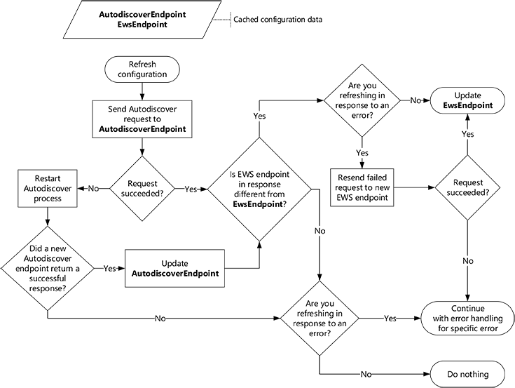

# Actualizar la información de configuración mediante la detección automática

Obtenga información sobre cómo y cuándo para actualizar la información de configuración de la conexión de Exchange mediante el uso de detección automática.
  
Cuando se ejecuta la aplicación de EWS por primera vez, detección automática proporciona un método excelente para recopilar la información que necesita para poder conectarse al buzón de Exchange del usuario. Pero detección automática no es sólo para el primer uso. Uso de detección automática de forma regular puede ayudar a mantener la aplicación conectada mediante la habilitación de él para responder a los cambios en la implementación de Exchange.
  
## Extremo de detección automática y la configuración de EWS la memoria caché

Mientras se recomendable que utilice detección automática con regularidad, cómo regularmente utiliza requiere atención especial. Lo ideal es que se puede equilibrar responder rápidamente a los cambios en el entorno frente a generar demasiado tráfico de red innecesarios. Cuando la aplicación obtiene una respuesta correcta de detección automática por primera vez, debe guardar la siguiente información para que no es necesario repetir el proceso de detección automática cada vez que envía una solicitud de EWS.
  
**La tabla 1. Información en memoria caché para las solicitudes de detección automática**

|**Si se establece en memoria caché**|**Válido para...**|**Detalles**|
|:-----|:-----|:-----|
|Extremo de detección automática    |Como funciona    |Cuando guarda el extremo de detección automática que devuelven una respuesta correcta, no es necesario repetir el proceso de [generación de una lista de extremos de detección automática](how-to-generate-a-list-of-autodiscover-endpoints.md) y tratando de hasta que obtenga una respuesta correcta.   **Nota**: la API administrada de EWS no admite el almacenamiento en memoria caché el extremo de detección automática.           |
|Dirección URL de EWS y cualquier otra configuración recuperados de la respuesta de detección automática    |24 horas    |Guardando la dirección URL de EWS y otras relacionadas con la configuración, no es necesario para [Enviar una nueva solicitud de detección automática](how-to-get-user-settings-from-exchange-by-using-autodiscover.md) para cada solicitud EWS o si se reinicia la aplicación. Sin embargo, incluso si una dirección URL de EWS funciona para el usuario, un servidor podría estar disponible es decir más óptima.   Por ejemplo, es posible que movió el buzón del usuario a un nuevo servidor de buzón de correo, lo que resulta en un nuevo extremo EWS preferido. Se recomienda que actualice a su configuración de usuario mediante el envío de una nueva solicitud de detección automática después de 24 horas han pasado desde la última solicitud de detección automática. Este tiempo se puede ajustar para satisfacer los requisitos de la aplicación.    |
   
## Actualizar la información de configuración almacenada en caché

Ahora que tiene la información almacenada en caché, veamos cómo puede conservar esa memoria caché actualizados. Se recomienda que actualizar la información almacenada en caché cuando:
  
- Expira el período de validez de la información.
    
- Se produce un [errores relacionados con la conexión](#bk_ConnectionErrors) . 
    
Para actualizar la información almacenada en caché, enviar una solicitud de detección automática a un extremo de detección automática en caché y haga lo siguiente:
  
- Si la solicitud se realiza correctamente, compare el extremo EWS en la respuesta con el extremo EWS en caché y haga lo siguiente:
    
  - Si son diferentes, use el nuevo extremo EWS. Si está actualizando para recuperarse de un error, vuelva a intentar la solicitud con errores con el extremo de nuevo.
    
  - Si son las mismas, seguir usando el extremo EWS original. Si está actualizando para recuperarse de un error, controlar el error según corresponda.
    
- Si se produce un error en la solicitud, iniciar el [proceso de detección automática](autodiscover-for-exchange.md) desde el principio. Después de obtener una respuesta correcta, reemplace el extremo de detección automática en caché con el extremo de detección automática que se ha realizado correctamente y seguir usando el nuevo extremo EWS. Si no recibe una respuesta correcta, seguir usando el extremo de detección automática original y el extremo EWS. Si está actualizando para recuperarse de un error, controlar el error según corresponda. 
    
La ilustración siguiente proporciona una representación visual de este proceso.
  
**En la figura 1. Proceso para actualizar la información de configuración mediante el uso de detección automática**

  
### Errores relacionados con la conexión

Actualizar la información de configuración almacenada en caché puede ayudar con algunos errores, pero no todas. 
  
**Tabla 2. Errores dirigidos al actualizar la memoria caché**

|**Error**|**Implementación de la API administrada de EWS**|**Notas**|
|:-----|:-----|:-----|
|Errores de red o DNS   Ejemplo: No se pudo encontrar el nombre de Host.    |[ServiceRemoteException](https://msdn.microsoft.com/library/Microsoft.Exchange.WebServices.Data.ServiceRemoteException.aspx)   |Es posible que se puede resolver cualquier error que indica que el servidor no se pudo encontrar o no se pudo tener acceso al tratar de detección automática.    El extremo EWS en caché es posible que ya no sea válido y es posible que pueda detección automática para apunte al nuevo servidor.    |
|Errores de estado HTTP   Ejemplo: 503 Servicio no disponible    |[ServiceRemoteException](https://msdn.microsoft.com/library/Microsoft.Exchange.WebServices.Data.ServiceRemoteException.aspx)   |Errores de estado HTTP pueden ocurrir por muchas razones diferentes.   Sin embargo, es una buena idea para probar la detección automática para ver si un nuevo extremo EWS está disponible para el usuario.    |
|Códigos de error EWS    Ejemplo: ErrorConnectionFailed   |[ResponseCodeType](../web-service-reference/responsecode.md)   | La mayoría de los códigos de error EWS no requieran actualizar la información de configuración.   Sin embargo, el siguiente específicamente indica que debe actualizarse la información de configuración: - **ErrorConnectionFailed**  - **ErrorMailboxMoveInProgress**   |
   
## Vea también

- [Detección automática de Exchange](autodiscover-for-exchange.md)  
- [Generar una lista de extremos de detección automática](how-to-generate-a-list-of-autodiscover-endpoints.md)   
- [Obtener la configuración de usuario de Exchange mediante el uso de detección automática](how-to-get-user-settings-from-exchange-by-using-autodiscover.md)
    

