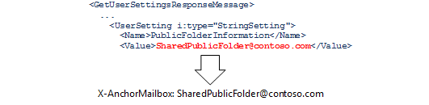
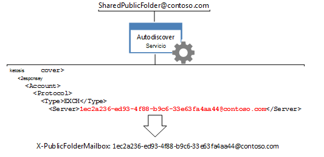

# <a name="route-public-folder-hierarchy-requests"></a><span data-ttu-id="76962-104">Enrutar las solicitudes de jerarquía de carpetas públicas</span><span class="sxs-lookup"><span data-stu-id="76962-104">Route public folder hierarchy requests</span></span>

<span data-ttu-id="76962-105">Todas las solicitudes de información de carpetas públicas que requieren conocimientos de la jerarquía de carpetas públicas, como mover, actualizar, eliminar o buscar carpetas públicas, es necesario distribuir para el buzón de jerarquía de carpetas públicas predeterminado para el usuario determinado.</span><span class="sxs-lookup"><span data-stu-id="76962-105">All requests for public folder information that require knowledge of the public folder hierarchy, such as moving, updating, deleting, or finding public folders, need to be routed to the default public folder hierarchy mailbox for the given user.</span></span> <span data-ttu-id="76962-106">Para enrutar las solicitudes a ese buzón, debe establecer los encabezados **X-AnchorMailbox** y **X-PublicFolderMailbox** a determinados valores devueltos por el servicio Detección automática.</span><span class="sxs-lookup"><span data-stu-id="76962-106">To route the requests to that mailbox, you need to set the **X-AnchorMailbox** and **X-PublicFolderMailbox** headers to specific values returned by the Autodiscover service.</span></span> 
  
<span data-ttu-id="76962-107">**Información general de las carpetas públicas**</span><span class="sxs-lookup"><span data-stu-id="76962-107">**Overview of public folders**</span></span>

|<span data-ttu-id="76962-108">Encabezado</span><span class="sxs-lookup"><span data-stu-id="76962-108">Header</span></span>|<span data-ttu-id="76962-109">¿Qué es necesario?</span><span class="sxs-lookup"><span data-stu-id="76962-109">What do I need?</span></span>|<span data-ttu-id="76962-110">¿Cómo se puede obtener?</span><span class="sxs-lookup"><span data-stu-id="76962-110">How do I get it?</span></span>|
|:-----|:-----|:-----|
|<span data-ttu-id="76962-111">**X-AnchorMailbox**</span><span class="sxs-lookup"><span data-stu-id="76962-111">**X-AnchorMailbox**</span></span> <br/> |<span data-ttu-id="76962-112">El valor [PublicFolderInformation](http://msdn.microsoft.com/en-us/library/dn751006%28v=exchg.150%29.aspx) desde una respuesta SOAP de detección automática, [GetUserSettings](http://msdn.microsoft.com/en-us/library/office/dd877096%28v=exchg.150%29.aspx) , que se convierte en el valor del encabezado **X-AnchorMailbox** .</span><span class="sxs-lookup"><span data-stu-id="76962-112">The [PublicFolderInformation](http://msdn.microsoft.com/en-us/library/dn751006%28v=exchg.150%29.aspx) value from a [GetUserSettings](http://msdn.microsoft.com/en-us/library/office/dd877096%28v=exchg.150%29.aspx) Autodiscover SOAP response, which becomes the value of the **X-AnchorMailbox** header.</span></span><br/><br/> <span data-ttu-id="76962-113"></span><span class="sxs-lookup"><span data-stu-id="76962-113"></span></span>| <span data-ttu-id="76962-114">1. enviar una solicitud de **GetUserSetting** con la dirección SMTP para el buzón del usuario.</span><span class="sxs-lookup"><span data-stu-id="76962-114">1. Send a **GetUserSetting** request with the SMTP address for the user's mailbox.</span></span><br/><br/><span data-ttu-id="76962-115">2. el valor del elemento **PublicFolderInformation** que devuelve el servicio Detección automática de la memoria caché.</span><span class="sxs-lookup"><span data-stu-id="76962-115">2. Cache the value of the **PublicFolderInformation** element that the Autodiscover service returns.</span></span> <span data-ttu-id="76962-116">Esto puede ser una caché desde una llamada de detección automática existente en su código, o una nueva [llamada API GetUserSettings administrada de EWS](#bk_getpfinfoewsma) o una [solicitud SOAP GetUserSettings](#bk_getpfinfoews).</span><span class="sxs-lookup"><span data-stu-id="76962-116">This can be a cached from an existing Autodiscover call in your code, or a new [EWS Managed API GetUserSettings call](#bk_getpfinfoewsma) or a [GetUserSettings SOAP request](#bk_getpfinfoews).</span></span>  <br/><br/><span data-ttu-id="76962-117">3. use el elemento **PublicFolderInformation** para rellenar el valor del encabezado **X-AnchorMailbox** .</span><span class="sxs-lookup"><span data-stu-id="76962-117">3. Use the **PublicFolderInformation** element to populate the value of the **X-AnchorMailbox** header.</span></span> <span data-ttu-id="76962-118">El valor del elemento **PublicFolderInformation** es una dirección SMTP.</span><span class="sxs-lookup"><span data-stu-id="76962-118">The value of the **PublicFolderInformation** element is an SMTP address.</span></span>  <br/> |
|<span data-ttu-id="76962-119">**X-PublicFolderMailbox**</span><span class="sxs-lookup"><span data-stu-id="76962-119">**X-PublicFolderMailbox**</span></span> <br/> |<span data-ttu-id="76962-120">El valor de [servidor](http://msdn.microsoft.com/en-us/library/bb204084%28v=exchg.150%29.aspx) desde una [respuesta de detección automática de POX](http://msdn.microsoft.com/en-us/library/bb204082%28v=exchg.150%29.aspx), que se convierte en el valor del encabezado **X-PublicFolderMailbox** .</span><span class="sxs-lookup"><span data-stu-id="76962-120">The [Server](http://msdn.microsoft.com/en-us/library/bb204084%28v=exchg.150%29.aspx) value from a [POX Autodiscover response](http://msdn.microsoft.com/en-us/library/bb204082%28v=exchg.150%29.aspx), which becomes the value of the **X-PublicFolderMailbox** header.</span></span><br/><br/> <span data-ttu-id="76962-121"></span><span class="sxs-lookup"><span data-stu-id="76962-121"></span></span>|<span data-ttu-id="76962-122">1. el servicio de [llamada a la detección automática POX](#bk_makeautodrequest) utilizando la dirección de correo electrónico **X-AnchorMailbox** .</span><span class="sxs-lookup"><span data-stu-id="76962-122">1. [Call the POX Autodiscover](#bk_makeautodrequest) service using the **X-AnchorMailbox** email address.</span></span>  <br/><br/><span data-ttu-id="76962-123">2. Utilice el elemento de **servidor** devuelto por el servicio de detección automática para rellenar el valor del encabezado **X-PublicFolderMailbox** .</span><span class="sxs-lookup"><span data-stu-id="76962-123">2. Use the **Server** element returned by the Autodiscover service to populate the value of the **X-PublicFolderMailbox** header.</span></span> <span data-ttu-id="76962-124">El valor de la **X-PublicFolderMailbox** es una dirección SMTP donde el nombre de usuario es un GUID.</span><span class="sxs-lookup"><span data-stu-id="76962-124">The value of the **X-PublicFolderMailbox** is an SMTP address where the username is a GUID.</span></span>  <br/> |

<br/>

<span data-ttu-id="76962-125">Una vez que haya determinado los valores de encabezado, incluirlos [cuando realiza las solicitudes de jerarquía de carpetas públicas](#bk_setheadervalues).</span><span class="sxs-lookup"><span data-stu-id="76962-125">After you have determined the header values, include them [when you make public folder hierarchy requests](#bk_setheadervalues).</span></span>
  
<span data-ttu-id="76962-126">Los pasos descritos en este artículo son específicos de las solicitudes de jerarquía de carpetas públicas.</span><span class="sxs-lookup"><span data-stu-id="76962-126">The steps in this article are specific to public folder hierarchy requests.</span></span> <span data-ttu-id="76962-127">Para determinar si la solicitud es una solicitud de contenido o la jerarquía de carpetas públicas, vea [las solicitudes de carpetas públicas de enrutamiento](public-folder-access-with-ews-in-exchange.md#bk_routing).</span><span class="sxs-lookup"><span data-stu-id="76962-127">To determine whether your request is a public folder hierarchy or content request, see [Routing public folder requests](public-folder-access-with-ews-in-exchange.md#bk_routing).</span></span>
  
## <a name="determine-the-value-of-the-x-anchormailbox-header-by-using-the-ews-managed-api"></a><span data-ttu-id="76962-128">Determinar el valor del encabezado X-AnchorMailbox mediante el uso de la API administrada de EWS</span><span class="sxs-lookup"><span data-stu-id="76962-128">Determine the value of the X-AnchorMailbox header by using the EWS Managed API</span></span>
<span data-ttu-id="76962-129"><a name="bk_getpfinfoewsma"> </a></span><span class="sxs-lookup"><span data-stu-id="76962-129"></span></span>

<span data-ttu-id="76962-130">Para recuperar el valor de [PublicFolderInformation (POX)](http://msdn.microsoft.com/library/a221aa9e-b4ac-4ec5-aa42-7e2a69e8eaa6%28Office.15%29.aspx) mediante el uso de la API administrada de EWS, puede almacenar en caché el valor del elemento **PublicFolderInformation** que devuelve una llamada existente para el servicio Detección automática, o realizar una nueva llamada.</span><span class="sxs-lookup"><span data-stu-id="76962-130">To retrieve the [PublicFolderInformation (POX)](http://msdn.microsoft.com/library/a221aa9e-b4ac-4ec5-aa42-7e2a69e8eaa6%28Office.15%29.aspx) value by using the EWS Managed API, you can either cache the value of the **PublicFolderInformation** element that an existing call to the Autodiscover service returns, or make a new call.</span></span> 
  
<span data-ttu-id="76962-131">Si está realizando una llamada nueva, se puede [obtener la configuración de usuario mediante el uso de la API administrada de EWS](how-to-get-user-settings-from-exchange-by-using-autodiscover.md#bk_Managed)[obtener la configuración de usuario mediante el uso de la API administrada de EWS](how-to-get-user-settings-from-exchange-by-using-autodiscover.md#bk_Managed) para el código y, a continuación, llame el **GetUserSettings** de ejemplo (método) mediante el código siguiente, que recupera el valor del elemento **PublicFolderInformation** .</span><span class="sxs-lookup"><span data-stu-id="76962-131">If you're making a new call, you can [Get user settings by using the EWS Managed API](how-to-get-user-settings-from-exchange-by-using-autodiscover.md#bk_Managed)[Get user settings by using the EWS Managed API](how-to-get-user-settings-from-exchange-by-using-autodiscover.md#bk_Managed) to your code, and then call the **GetUserSettings** sample method by using the following code, which retrieves only the value of the **PublicFolderInformation** element.</span></span> <span data-ttu-id="76962-132">Incluir la dirección SMTP del usuario de buzón de correo como un parámetro de entrada.</span><span class="sxs-lookup"><span data-stu-id="76962-132">Include the SMTP address of the mailbox user as an input parameter.</span></span> 
  
```cs
GetUserSettingsResponse userResponse = GetUserSettings(adservice, "sonyaf@contoso.com", 3, UserSettingName.PublicFolderInformation);
Console.WriteLine("X-AnchorMailbox value for public folder hierarchy requests: {0}", userResponse.Settings[UserSettingName.PublicFolderInformation]);
```

<span data-ttu-id="76962-133">Después de ejecutar el código, se muestra la siguiente información en la consola:</span><span class="sxs-lookup"><span data-stu-id="76962-133">After running the code, the following information is displayed on the console:</span></span>
  
`X-AnchorMailbox for public folder hierarchy requests: SharedPublicFolder@contoso.com`

<span data-ttu-id="76962-134">Ahora que tiene el valor **PublicFolderInformation** , incluir como el valor para el encabezado X-AnchorMailbox en todas las solicitudes de jerarquía de carpetas públicas.</span><span class="sxs-lookup"><span data-stu-id="76962-134">Now that you have the **PublicFolderInformation** value, include it as the value for the X-AnchorMailbox header in all public folder hierarchy requests.</span></span> 
  
`X-AnchorMailbox: SharedPublicFolder@contoso.com`

## <a name="determine-the-value-of-the-x-anchormailbox-header-using-soap"></a><span data-ttu-id="76962-135">Determinar el valor del encabezado X-AnchorMailbox usa SOAP</span><span class="sxs-lookup"><span data-stu-id="76962-135">Determine the value of the X-AnchorMailbox header using SOAP</span></span>
<span data-ttu-id="76962-136"><a name="bk_getpfinfoews"> </a></span><span class="sxs-lookup"><span data-stu-id="76962-136"></span></span>

<span data-ttu-id="76962-137">En el ejemplo de código siguiente se muestra cómo recuperar el valor de **PublicFolderInformation** mediante el uso de la operación de SOAP [GetUserSettings](http://msdn.microsoft.com/en-us/library/dd877096%28v=exchg.150%29.aspx) .</span><span class="sxs-lookup"><span data-stu-id="76962-137">The following code example shows how to retrieve the **PublicFolderInformation** value by using the [GetUserSettings](http://msdn.microsoft.com/en-us/library/dd877096%28v=exchg.150%29.aspx) SOAP operation.</span></span> <span data-ttu-id="76962-138">El usuario del buzón está especificado en el elemento de [buzón de correo](http://msdn.microsoft.com/en-us/library/dd877076%28v=exchg.150%29.aspx) , y el elemento [RequestedSettings](http://msdn.microsoft.com/en-us/library/office/dd877107%28v=exchg.150%29.aspx) limita la respuesta en el valor de [PublicFolderInformation](http://msdn.microsoft.com/en-us/library/dn751006%28v=exchg.150%29.aspx) .</span><span class="sxs-lookup"><span data-stu-id="76962-138">The mailbox user is specified in the [Mailbox](http://msdn.microsoft.com/en-us/library/dd877076%28v=exchg.150%29.aspx) element, and the [RequestedSettings](http://msdn.microsoft.com/en-us/library/office/dd877107%28v=exchg.150%29.aspx) element limits the response to the [PublicFolderInformation](http://msdn.microsoft.com/en-us/library/dn751006%28v=exchg.150%29.aspx) value.</span></span> 
  
```XML
<?xml version="1.0" encoding="utf-8"?>
<soap:Envelope xmlns:a="http://schemas.microsoft.com/exchange/2010/Autodiscover"
               xmlns:wsa="http://www.w3.org/2005/08/addressing"
               xmlns:xsi="http://www.w3.org/2001/XMLSchema-instance"
               xmlns:soap="http://schemas.xmlsoap.org/soap/envelope/">
  <soap:Header>
    <a:RequestedServerVersion>Exchange2007_SP1</a:RequestedServerVersion>
    <wsa:Action>http://schemas.microsoft.com/exchange/2010/Autodiscover/Autodiscover/GetUserSettings</wsa:Action>
    <wsa:To>https://pod51042.outlook.com/autodiscover/autodiscover.svc</wsa:To>
  </soap:Header>
  <soap:Body>
    <a:GetUserSettingsRequestMessage xmlns:a="http://schemas.microsoft.com/exchange/2010/Autodiscover">
      <a:Request>
        <a:Users>
          <a:User>
            <a:Mailbox>sonyaf@contoso.com</a:Mailbox>
          </a:User>
        </a:Users>
        <a:RequestedSettings>
          <a:Setting>PublicFolderInformation</a:Setting>
        </a:RequestedSettings>
      </a:Request>
    </a:GetUserSettingsRequestMessage>
  </soap:Body>
</soap:Envelope>
```

<span data-ttu-id="76962-139">La respuesta incluye el valor de **PublicFolderInformation** .</span><span class="sxs-lookup"><span data-stu-id="76962-139">The response includes the **PublicFolderInformation** value.</span></span> 
  
```XML
<UserSetting i:type="StringSetting">
    <Name>PublicFolderInformation</Name>
    <Value>SharedPublicFolder@contoso.com</Value>
</UserSetting>
```

<span data-ttu-id="76962-140">Ahora que tiene el valor **PublicFolderInformation** , incluir como el valor para el encabezado X-AnchorMailbox en todas las solicitudes de jerarquía de carpetas públicas.</span><span class="sxs-lookup"><span data-stu-id="76962-140">Now that you have the **PublicFolderInformation** value, include it as the value for the X-AnchorMailbox header in all public folder hierarchy requests.</span></span> 
  
`X-AnchorMailbox: SharedPublicFolder@contoso.com`

## <a name="make-an-autodiscover-request-to-determine-the-x-publicfolderinformation-value"></a><span data-ttu-id="76962-141">Para realizar una solicitud de detección automática para determinar el valor de X-PublicFolderInformation</span><span class="sxs-lookup"><span data-stu-id="76962-141">Make an Autodiscover request to determine the X-PublicFolderInformation value</span></span>
<span data-ttu-id="76962-142"><a name="bk_makeautodrequest"> </a></span><span class="sxs-lookup"><span data-stu-id="76962-142"></span></span>

<span data-ttu-id="76962-143">Realizar una solicitud de detección automática mediante el uso de la dirección SMTP de **PublicFolderInformation** , que ahora se utiliza como el valor de **X-AnchorMailbox** .</span><span class="sxs-lookup"><span data-stu-id="76962-143">Make an Autodiscover request by using the **PublicFolderInformation** SMTP address, which is now being used as the **X-AnchorMailbox** value.</span></span> <span data-ttu-id="76962-144">Usar el [Exchange 2013: obtener la configuración de usuario con detección automática](http://code.msdn.microsoft.com/exchange/Exchange-2013-Get-user-7e22c86e) ejemplo de código para llamar al servicio de detección automática debido a que optimiza el proceso de detección automática para usted.</span><span class="sxs-lookup"><span data-stu-id="76962-144">Use the [Exchange 2013: Get user settings with Autodiscover](http://code.msdn.microsoft.com/exchange/Exchange-2013-Get-user-7e22c86e) code sample to call the Autodiscover service because it streamlines the Autodiscover process for you.</span></span> <span data-ttu-id="76962-145">Este ejemplo de código usa los argumentos de línea de comandos que aparecen en la tabla siguiente para llamar al servicio de detección automática de POX en la dirección SMTP de **PublicFolderInformation** .</span><span class="sxs-lookup"><span data-stu-id="76962-145">This code sample uses the command line arguments listed in the following table to call the POX Autodiscover service on the **PublicFolderInformation** SMTP address.</span></span> 
  
|<span data-ttu-id="76962-146">**Argumento de línea de comandos**</span><span class="sxs-lookup"><span data-stu-id="76962-146">**Command-line argument**</span></span>|<span data-ttu-id="76962-147">**Descripción**</span><span class="sxs-lookup"><span data-stu-id="76962-147">**Description**</span></span>|
|:-----|:-----|
|<span data-ttu-id="76962-148">emailAddress</span><span class="sxs-lookup"><span data-stu-id="76962-148">emailAddress</span></span>  <br/> |<span data-ttu-id="76962-149">La dirección **PublicFolderInformation** SMTP.</span><span class="sxs-lookup"><span data-stu-id="76962-149">The **PublicFolderInformation** SMTP address.</span></span>  <br/> |
|<span data-ttu-id="76962-150">-skipSOAP</span><span class="sxs-lookup"><span data-stu-id="76962-150">-skipSOAP</span></span>  <br/> | <span data-ttu-id="76962-151">Usar solicitudes de detección automática de POX para este escenario.</span><span class="sxs-lookup"><span data-stu-id="76962-151">Use POX Autodiscover requests for this scenario.</span></span>  <br/> |
|<span data-ttu-id="76962-152">authEmailAddress - auth</span><span class="sxs-lookup"><span data-stu-id="76962-152">-auth authEmailAddress</span></span>  <br/> |<span data-ttu-id="76962-153">Dirección de correo electrónico del usuario de buzón de correo, que se usa para la autenticación.</span><span class="sxs-lookup"><span data-stu-id="76962-153">The mailbox user's email address, which is used for authentication.</span></span> <span data-ttu-id="76962-154">Se le pedirá para escribir la contraseña del usuario de buzón de correo al ejecutar el ejemplo.</span><span class="sxs-lookup"><span data-stu-id="76962-154">You will be prompted to enter the mailbox user's password when you run the sample.</span></span>  <br/> |
   
<span data-ttu-id="76962-155">Por ejemplo, cuando SharedPublicFolder@contoso.com es la dirección SMTP del elemento **PublicFolderInformation** y sonyaf@contoso.com es el usuario de buzón de correo, los argumentos de línea de comandos deben tener un aspecto similar.</span><span class="sxs-lookup"><span data-stu-id="76962-155">For example, when SharedPublicFolder@contoso.com is the SMTP address of the **PublicFolderInformation** element, and sonyaf@contoso.com is the mailbox user, the command-line arguments should look like this.</span></span> 
  
`SharedPublicFolder@contoso.com -skipSOAP -auth sonyaf@contoso.com`

<span data-ttu-id="76962-156">Al ejecutar el **Exchange 2013: obtener la configuración de usuario con detección automática** ejemplo, la última respuesta de detección automática debe ser correcta e incluir todos los la configuración del usuario asociada con el GUID de buzón.</span><span class="sxs-lookup"><span data-stu-id="76962-156">When you run the **Exchange 2013: Get user settings with Autodiscover** sample, the last Autodiscover response should be successful and include all the user settings associated with the mailbox GUID.</span></span> <span data-ttu-id="76962-157">El valor de [servidor](http://msdn.microsoft.com/en-us/library/bb204084%28v=exchg.150%29.aspx) asociado con el elemento de [protocolo](http://msdn.microsoft.com/en-us/library/bb204278%28v=exchg.150%29.aspx)EXCH[tipo](http://msdn.microsoft.com/en-us/library/office/bb204223%28v=exchg.150%29.aspx) es el valor de encabezado **X-PublicFolderInformation** .</span><span class="sxs-lookup"><span data-stu-id="76962-157">The [Server](http://msdn.microsoft.com/en-us/library/bb204084%28v=exchg.150%29.aspx) value associated with the EXCH [Protocol](http://msdn.microsoft.com/en-us/library/bb204278%28v=exchg.150%29.aspx)[Type](http://msdn.microsoft.com/en-us/library/office/bb204223%28v=exchg.150%29.aspx) element is the **X-PublicFolderInformation** header value.</span></span> 
  
```XML
<Autodiscover xmlns="http://schemas.microsoft.com/exchange/autodiscover/responseschema/2006">
  <Response xmlns="http://schemas.microsoft.com/exchange/autodiscover/outlook/responseschema/2006a">
    …
    <Account>
      <AccountType>email</AccountType>
      <Action>settings</Action>
      <Protocol>
        <Type>EXCH</Type>
        <Server>1ec2a236-ed93-4f88-b9c6-33e63fa4aa44@contoso.com</Server>

```

<span data-ttu-id="76962-158">Como alternativa, si no desea usar el **Exchange 2013: obtener la configuración de usuario con detección automática** ejemplo, puede obtener el valor de **servidor de** [generación de una lista de extremos de detección automática](how-to-generate-a-list-of-autodiscover-endpoints.md)y, a continuación, enviando la detección automática POX siguiente solicitar a cada dirección URL hasta que recibe una respuesta correcta.</span><span class="sxs-lookup"><span data-stu-id="76962-158">Alternatively, if you do not want to use the **Exchange 2013: Get user settings with Autodiscover** sample, you can get the **Server** value by [generating a list of Autodiscover endpoints](how-to-generate-a-list-of-autodiscover-endpoints.md), and then sending the following POX Autodiscover request to each URL until you receive a successful response.</span></span> <span data-ttu-id="76962-159">SharedPublicFolder@contoso.com es el valor del encabezado **X-PublicFolderMailbox** .</span><span class="sxs-lookup"><span data-stu-id="76962-159">SharedPublicFolder@contoso.com is the value of the **X-PublicFolderMailbox** header.</span></span> 
  
```XML
<?xml version="1.0" encoding="utf-8"?>
<Autodiscover xmlns="http://schemas.microsoft.com/exchange/autodiscover/outlook/requestschema/2006">
  <Request>
    <EMailAddress>SharedPublicFolder@contoso.com</EMailAddress>
    <AcceptableResponseSchema>http://schemas.microsoft.com/exchange/autodiscover/outlook/responseschema/2006a</AcceptableResponseSchema>
  </Request>
</Autodiscover>
```

<span data-ttu-id="76962-160">Para obtener más información acerca del proceso de detección automática, vea [detección automática de Exchange](autodiscover-for-exchange.md), [generar una lista de extremos de detección automática](how-to-generate-a-list-of-autodiscover-endpoints.md)y [obtener la configuración de usuario de Exchange mediante el uso de detección automática](how-to-get-user-settings-from-exchange-by-using-autodiscover.md).</span><span class="sxs-lookup"><span data-stu-id="76962-160">For more information about the Autodiscover process, see [Autodiscover for Exchange](autodiscover-for-exchange.md), [Generate a list of Autodiscover endpoints](how-to-generate-a-list-of-autodiscover-endpoints.md), and [Get user settings from Exchange by using Autodiscover](how-to-get-user-settings-from-exchange-by-using-autodiscover.md).</span></span>
  
## <a name="set-the-values-of-the-x-anchormailbox-and-x-publicfoldermailbox-headers"></a><span data-ttu-id="76962-161">Establezca los valores de los encabezados X-AnchorMailbox y X-PublicFolderMailbox</span><span class="sxs-lookup"><span data-stu-id="76962-161">Set the values of the X-AnchorMailbox and X-PublicFolderMailbox headers</span></span>
<span data-ttu-id="76962-162"><a name="bk_setheadervalues"> </a></span><span class="sxs-lookup"><span data-stu-id="76962-162"></span></span>

<span data-ttu-id="76962-163">Con el valor de la dirección de **PublicFolderInformation** SMTP adquirido en [determinar el valor del encabezado X-AnchorMailbox mediante el uso de la API administrada de EWS](#bk_getpfinfoewsma) o [determinar el valor del encabezado X-AnchorMailbox mediante SOAP](#bk_getpfinfoews) y el servidor de ** **valor adquirido en [realizar una solicitud de detección automática para determinar el valor de X-PublicFolderInformation](#bk_makeautodrequest), establezca los valores de los encabezados **X-AnchorMailbox** y **X-PublicFolderMailbox** en su solicitud de contenido de carpetas públicas.</span><span class="sxs-lookup"><span data-stu-id="76962-163">Using the value of the **PublicFolderInformation** SMTP address acquired in [Determine the value of the X-AnchorMailbox header by using the EWS Managed API](#bk_getpfinfoewsma) or [Determine the value of the X-AnchorMailbox header using SOAP](#bk_getpfinfoews) and the **Server** value acquired in [Make an Autodiscover request to determine the X-PublicFolderInformation value](#bk_makeautodrequest), set the values of **X-AnchorMailbox** and **X-PublicFolderMailbox** headers in your public folder content request.</span></span> 
  
<span data-ttu-id="76962-164">Por ejemplo, dada una dirección de **PublicFolderInformation** SMTP de SharedPublicFolder@contoso.com y el valor de un **servidor** de 1ec2a236-ed93-4f88-b9c6-33e63fa4aa44@contoso.com, incluir los encabezados siguientes al realizar llamadas a la siguiente los métodos u operaciones.</span><span class="sxs-lookup"><span data-stu-id="76962-164">For example, given a **PublicFolderInformation** SMTP address of SharedPublicFolder@contoso.com and a **Server** value of 1ec2a236-ed93-4f88-b9c6-33e63fa4aa44@contoso.com, include the following headers when making calls to the following methods or operations.</span></span> 
  
`X-AnchorMailbox: SharedPublicFolder@contoso.com` <br/>
`X-PublicFolderMailbox: 1ec2a236-ed93-4f88-b9c6-33e63fa4aa44@contoso.com`

<span data-ttu-id="76962-165">**Llamadas de carpeta pública que requieren los encabezados X-AnchorMailbox y X-PublicFolder**</span><span class="sxs-lookup"><span data-stu-id="76962-165">**Public folder calls that require the X-AnchorMailbox and X-PublicFolder headers**</span></span>

|<span data-ttu-id="76962-166">**Métodos de la API administrada de EWS**</span><span class="sxs-lookup"><span data-stu-id="76962-166">**EWS Managed API methods**</span></span>|<span data-ttu-id="76962-167">**Operaciones de EWS**</span><span class="sxs-lookup"><span data-stu-id="76962-167">**EWS operations**</span></span>|
|:-----|:-----|
|[<span data-ttu-id="76962-168">Folder.FindFolders</span><span class="sxs-lookup"><span data-stu-id="76962-168">Folder.FindFolders</span></span>](http://msdn.microsoft.com/en-us/library/microsoft.exchange.webservices.data.folder.findfolders%28v=exchg.80%29.aspx) <br/> [<span data-ttu-id="76962-169">Folder.Delete</span><span class="sxs-lookup"><span data-stu-id="76962-169">Folder.Delete</span></span>](http://msdn.microsoft.com/en-us/library/microsoft.exchange.webservices.data.folder.delete%28v=exchg.80%29.aspx) <br/> [<span data-ttu-id="76962-170">Folder.Update</span><span class="sxs-lookup"><span data-stu-id="76962-170">Folder.Update</span></span>](http://msdn.microsoft.com/en-us/library/microsoft.exchange.webservices.data.folder.update%28v=exchg.80%29.aspx) <br/> [<span data-ttu-id="76962-171">Folder.Move</span><span class="sxs-lookup"><span data-stu-id="76962-171">Folder.Move</span></span>](http://msdn.microsoft.com/en-us/library/microsoft.exchange.webservices.data.folder.move%28v=exchg.80%29.aspx) <br/> |[<span data-ttu-id="76962-172">CreateFolder</span><span class="sxs-lookup"><span data-stu-id="76962-172">CreateFolder</span></span>](http://msdn.microsoft.com/library/6f6c334c-b190-4e55-8f0a-38f2a018d1b3%28Office.15%29.aspx) <br/> [<span data-ttu-id="76962-173">FindFolder</span><span class="sxs-lookup"><span data-stu-id="76962-173">FindFolder</span></span>](http://msdn.microsoft.com/library/7a9855aa-06cc-45ba-ad2a-645c15b7d031%28Office.15%29.aspx) <br/> [<span data-ttu-id="76962-174">DeleteFolder</span><span class="sxs-lookup"><span data-stu-id="76962-174">DeleteFolder</span></span>](http://msdn.microsoft.com/library/b0f92682-4895-4bcf-a4a1-e4c2e8403979%28Office.15%29.aspx) <br/> [<span data-ttu-id="76962-175">UpdateFolder</span><span class="sxs-lookup"><span data-stu-id="76962-175">UpdateFolder</span></span>](http://msdn.microsoft.com/library/3494c996-b834-4813-b1ca-d99642d8b4e7%28Office.15%29.aspx) <br/> [<span data-ttu-id="76962-176">MoveFolder</span><span class="sxs-lookup"><span data-stu-id="76962-176">MoveFolder</span></span>](http://msdn.microsoft.com/library/c7233966-6c87-4a14-8156-b1610760176d%28Office.15%29.aspx) <br/> |
   
<span data-ttu-id="76962-177">Para agregar estos encabezados mediante el uso de la API administrada de EWS, use el método [HttpHeaders.Add](http://msdn.microsoft.com/en-us/library/system.net.http.headers.httpheaders.add%28v=vs.118%29.aspx) .</span><span class="sxs-lookup"><span data-stu-id="76962-177">To add these headers by using the EWS Managed API, use the [HttpHeaders.Add](http://msdn.microsoft.com/en-us/library/system.net.http.headers.httpheaders.add%28v=vs.118%29.aspx) method.</span></span> 
  
```cs
service.HttpHeaders.Add("X-AnchorMailbox", "SharedPublicFolder@contoso.com");service.HttpHeaders.Add("X-PublicFolderMailbox", "1ec2a236-ed93-4f88-b9c6-33e63fa4aa44@contoso.com");
```

<span data-ttu-id="76962-178">Por ejemplo, el código siguiente muestra una solicitud [FindFolder](http://msdn.microsoft.com/library/7a9855aa-06cc-45ba-ad2a-645c15b7d031%28Office.15%29.aspx) con el encabezado **X-AnchorMailbox** y **X-PublicFolderMailbox** establecido en los valores recuperados en los ejemplos de este artículo.</span><span class="sxs-lookup"><span data-stu-id="76962-178">For example, the following code shows a [FindFolder](http://msdn.microsoft.com/library/7a9855aa-06cc-45ba-ad2a-645c15b7d031%28Office.15%29.aspx) request with the **X-AnchorMailbox** and **X-PublicFolderMailbox** header set to the values retrieved in the examples in this article.</span></span> 
  
```XML
POST https://outlook.office365.com/EWS/Exchange.asmx HTTP/1.1
Content-Type: text/xml; charset=utf-8
User-Agent: SoapSender1.0
X-AnchorMailbox: SharedPublicFolder@contoso.com
X-PublicFolderMailbox: 1ec2a236-ed93-4f88-b9c6-33e63fa4aa44@contoso.com
Host: outlook.office365.com
Content-Length: 1174
Expect: 100-continue
Connection: Keep-Alive
<?xml version="1.0" encoding="utf-8"?>
<soap:Envelope xmlns:xsi="http://www.w3.org/2001/XMLSchema-instance" xmlns:m="http://schemas.microsoft.com/exchange/services/2006/messages" xmlns:t="http://schemas.microsoft.com/exchange/services/2006/types" xmlns:soap="http://schemas.xmlsoap.org/soap/envelope/">
  <soap:Header>
    <t:RequestServerVersion Version="Exchange2013_SP1" />
  </soap:Header>
  <soap:Body>
    <m:FindFolder Traversal="Shallow">
      <m:FolderShape>
        <t:BaseShape>AllProperties</t:BaseShape>
      </m:FolderShape>
      <m:IndexedPageFolderView MaxEntriesReturned="1" Offset="0" BasePoint="Beginning" />
      <m:Restriction>
        <t:IsEqualTo>
          <t:FieldURI FieldURI="folder:DisplayName" />
          <t:FieldURIOrConstant>
            <t:Constant Value="My Public Contacts" />
          </t:FieldURIOrConstant>
        </t:IsEqualTo>
      </m:Restriction>
      <m:ParentFolderIds>
        <t:FolderId Id="AQEuAAADy/LIWjRCp0GFb0W6aGPbwwEARg5aCLUc8k6wLfl1c0a/2AAAAwIAAAA=" ChangeKey="AQAAABYAAABGDloItRzyTrAt+XVzRr/YAABdo/XB" />
      </m:ParentFolderIds>
    </m:FindFolder>
  </soap:Body>
</soap:Envelope>
```

## <a name="see-also"></a><span data-ttu-id="76962-179">Vea también</span><span class="sxs-lookup"><span data-stu-id="76962-179">See also</span></span>

- [<span data-ttu-id="76962-180">Carpetas públicas en Exchange obtener acceso con EWS</span><span class="sxs-lookup"><span data-stu-id="76962-180">Public folder access with EWS in Exchange</span></span>](public-folder-access-with-ews-in-exchange.md)    
- [<span data-ttu-id="76962-181">Enrutar las solicitudes de contenido de carpetas públicas</span><span class="sxs-lookup"><span data-stu-id="76962-181">Route public folder content requests</span></span>](how-to-route-public-folder-content-requests.md)    
- [<span data-ttu-id="76962-182">Obtener la configuración de usuario mediante el uso de la API administrada de EWS</span><span class="sxs-lookup"><span data-stu-id="76962-182">Get user settings by using the EWS Managed API</span></span>](how-to-get-user-settings-from-exchange-by-using-autodiscover.md#bk_Managed)
    

