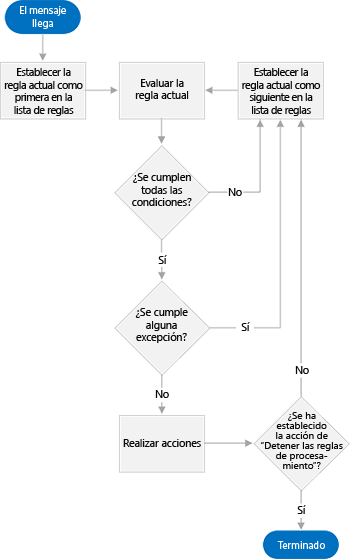
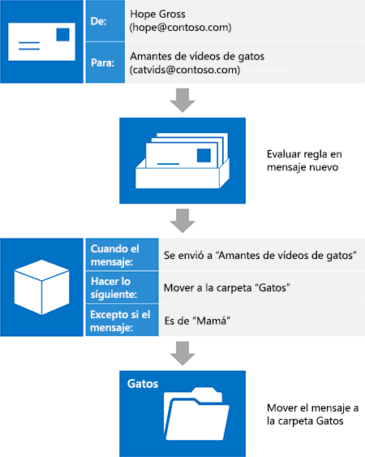

# Administración de la Bandeja de entrada y EWS en Exchange

Este documento puede incluir contenido relacionado con funciones o productos preliminares que pueden cambiar mucho antes del lanzamiento comercial final. Este documento se proporciona "tal cual" solamente con fines informativos y Microsoft no realiza ninguna garantía, explícita ni implícita, en el documento. Descubra cómo administrar su bandeja de entrada en la API administrada EWS o aplicación EWS por medio de reglas de bandeja de entrada y de la lista de remitentes bloqueados.
  
Los buzones de Exchange están equipados con características que ayudan a los usuarios a organizar automáticamente el correo entrante. Todas ellas funcionan en el servidor sin intervención del usuario, pero atienden a distintas necesidades. La API administrada EWS y EWS proporcionan acceso a estas características, lo que permite a los usuarios administrar sus bandejas de entrada.
  
**Tabla 1. Características de administración de la bandeja de entrada**

|**Si quiere...**|**Use…**|
|:-----|:-----|
|Realizar acciones con los mensajes entrantes (como moverlos a otra carpeta o eliminarlos) basándose en criterios específicos (por ejemplo, el remitente, el asunto o los datos adjuntos)    |Reglas de la Bandeja de entrada    |
|Eliminar todo el correo entrante de un remitente determinado    |Lista de remitentes bloqueados    |
   
## Reglas de la Bandeja de entrada

Hay que reconocerlo: no todos los mensajes de correo electrónico son iguales. Por cada correo electrónico que el usuario recibe de su jefe, hay otro de una lista de distribución de vídeos de gatos a la que se suscribió hace años y de la que no ha sabido cómo salir. Aunque los vídeos de gatos son entretenidos, la cantidad de tráfico que genera la lista de distribución se puede ir de las manos, y es fácil que los mensajes importantes se pierdan en el mar de correo de la lista de distribución en esa bandeja de entrada. Muchos usuarios recurren a reglas de la Bandeja de entrada para ayudar a reducir esos mensajes y tener una Bandeja de entrada mucho más agradable. Con Exchange Web Services (EWS), su aplicación puede poner en práctica toda la potencia de las reglas.
  
La API administrada EWS ofrece los métodos [ExchangeService.GetInboxRules](http://msdn.microsoft.com/en-us/library/microsoft.exchange.webservices.data.exchangeservice.getinboxrules%28v=exchg.80%29.aspx) y [ExchangeService.UpdateInboxRules](http://msdn.microsoft.com/en-us/library/microsoft.exchange.webservices.data.exchangeservice.updateinboxrules%28v=exchg.80%29.aspx) para trabajar con reglas. EWS proporciona las operaciones [GetInboxRules](http://msdn.microsoft.com/library/b4b2701a-4a23-4acc-8c75-19f7955ad7ae%28Office.15%29.aspx) y [UpdateInboxRules](http://msdn.microsoft.com/library/f982a237-471e-45c5-a2b5-468cfc53150b%28Office.15%29.aspx) para trabajar con reglas. Pero tenga en cuenta que la API administrada EWS y EWS tienen las siguientes limitaciones cuando trabajan con reglas de la Bandeja de entrada: 
  
- EWS no puede tener acceso ni crear reglas de "solo cliente" o reglas que se establezcan en Outlook para ejecutarlas "solo en este equipo".
    
- Para cambiar el conjunto actual de reglas mediante EWS, deberá quitar el BLOB de las reglas de Outlook, si está presente. Es decir, al usar EWS para modificar las reglas se eliminan todas las reglas que se hubieran desactivado (deshabilitado) anteriormente mediante Outlook. 
    
### ¿Cómo funcionan las reglas?

El motor de reglas actúa como un guardián del buzón del usuario. Cuando llega un mensaje al buzón del usuario, y antes de presentarlo en la Bandeja de entrada, el mensaje se evalúa con una lista ordenada de reglas. Tenga en cuenta que esto solo ocurre en el momento de su llegada y solo en la Bandeja de entrada. Estas reglas se componen de tres partes: [Condiciones](#bk_Conditions), [Acciones](#bk_Actions) y [Excepciones](#bk_Exceptions).
  
Empezando por la regla de la parte superior de la lista, el motor de reglas realiza los pasos siguientes hasta que llega al final de la lista de reglas:
  
1. Comprueba el mensaje para determinar si cumple todas las condiciones especificadas en la regla.
    
1. Si cumple todas las condiciones, la evaluación continúa con el paso 2.
    
2. Si no cumple todas las condiciones, el motor de reglas carga la siguiente regla de la lista y comienza de nuevo en el paso 1.
    
2. Comprueba el mensaje para determinar si cumple alguna de las excepciones especificadas en la regla.
    
1. Si cumple alguna de las excepciones, el motor de reglas carga la siguiente regla de la lista y comienza de nuevo en el paso 1.
    
2. Si no cumple ninguna de las excepciones, la evaluación continúa con el paso 3.
    
3. Aplica al mensaje las acciones que especifica la regla.
    
1. Si se especifica la acción "detener el procesamiento de más reglas", el motor de reglas aplica todas las acciones al mensaje y después sale sin evaluarlo con ninguna de las demás reglas.
    
2. Si no se especifica la acción "detener el procesamiento de más reglas", el motor de reglas carga la siguiente regla de la lista y comienza de nuevo en el paso 1.
    
La siguiente figura muestra el proceso que sigue el motor de reglas.
  
**Figura 1: Vista general del motor de reglas**

  
### Ensamblaje de piezas: partes de una regla

Las partes de una regla se pueden visualizar como instrucciones que se le dan a alguien que se encarga de organizar el correo electrónico entrante. A esta persona le diríamos: "Cuando llegue un mensaje que \<aquí se insertan las condiciones\>, haga lo siguiente: \<aquí se insertan las acciones\>, a menos que el mensaje \<aquí se insertan las excepciones\>. Veamos cada parte con más detalle.
  
#### Condiciones

[Condiciones](http://msdn.microsoft.com/library/f049a48c-9585-43f7-8549-0b8cb19a5eea%28Office.15%29.aspx) describe cuándo se debe aplicar una regla. Aunque puede omitir las condiciones de una regla (creando así una regla que se aplica a cada mensaje recibido), es mucho más frecuente que las reglas tengan condiciones que se aplican a un subconjunto de los mensajes entrantes. Algunos ejemplos serían "cuando el mensaje procede de Sadie" o "cuando el mensaje se ha enviado a la lista de distribución 'Amantes de los vídeos de gatos'". Una regla puede tener varias condiciones. Si la regla tiene más de una condición, se deben cumplir todas las condiciones, una tras otra, para que el motor de reglas realice la acción especificada. 
  
#### Acciones

[Acciones](http://msdn.microsoft.com/library/c5aa96b1-2d8b-422f-8c2f-f118572ab23f%28Office.15%29.aspx) describe lo que ocurre cuando se aplica una regla. Algunos ejemplos serían "mover el mensaje a la carpeta 'Gatos'" o "marcar el mensaje con importancia 'Baja'". Una regla puede tener varias acciones. Si se especifican varias acciones en una regla, se realizan todas ellas cuando se aplica la regla. 
  
#### Excepciones

[Excepciones](http://msdn.microsoft.com/library/7cd63ac2-3441-4ed4-915b-6f90af4b28fc%28Office.15%29.aspx) describe cuándo no debe aplicarse una regla, incluso aunque se cumplen los criterios especificados en las condiciones. Algunos ejemplos son "excepto si el mensaje se envía solo a mí" o "excepto si el mensaje es de mamá". Una regla puede tener varias excepciones. Si la regla tiene más de una excepción y se cumple alguna de las excepciones, no se aplica la regla. 
  
### Ejemplo: Ahuyentar los gatos

Veamos cómo los usuarios pueden usar reglas para eliminar el tráfico de esa lista de distribución de vídeos de gatos. Vamos a dar por hecho lo siguiente:
  
- Estos mensajes se envían a una lista de distribución denominada "Entusiastas de los vídeos de gatos".
    
- Los usuarios desean leer estos mensajes en algún momento, pero no quieren que abarroten su Bandeja de entrada. Prefieren guardarlos en una carpeta llamada "Gatos".
    
- Los usuarios desean leer inmediatamente los mensajes que envía su madre a esta lista de distribución, porque mamá envía los vídeos más divertidos.
    
Las indicaciones para el motor de reglas son las siguientes: "Cuando llegue un mensaje que se ha enviado a la lista de distribución 'Entusiastas de los vídeos de gatos', moverlo a la carpeta 'Gatos', a menos que el mensaje proceda de mamá." 
  
**Tabla 2. Definición de la regla**

|**Parte de la regla**|**Valor**|
|:-----|:-----|
|Condiciones    |Enviado a la lista de distribución 'Entusiastas de los vídeo de gatos'    |
|Acciones    |Mover el mensaje a la carpeta 'Gatos'    Y detener el procesamiento de más reglas    |
|Excepciones    |De "Mamá"    |
   
> [!NOTE]
> [!NOTA] Observe que una de las acciones de la regla resultante es "detener el procesamiento de más reglas". En general, es buena idea incluir esta acción para evitar confusiones sobre las reglas que actúan en un mensaje dado. Pero si omite esta acción y ordena correctamente las reglas, puede obtener un procesamiento más avanzado de su correo entrante. En este caso, podemos contar con que los mensajes de vídeos de gatos no necesitan un procesamiento demasiado avanzado. 
  
Poco después de crear esta regla, llega un nuevo mensaje. Hope, una compañera de trabajo, envía un mensaje a la lista de distribución. Si realizamos mentalmente el trabajo del motor de reglas, el mensaje cumple todas las condiciones (se ha enviado a 'Entusiastas de los vídeos de gatos') y no cumple con ninguna de las excepciones (no es de 'Mamá'), por lo que se aplica la regla y el mensaje se mueve a la carpeta 'Gatos'.
  
La figura siguiente muestra cómo se aplica la regla a un mensaje de correo entrante.
  
**Figura 2. Un mensaje entrante se procesa mediante una regla**

  
## Bloquear remitentes

Aunque puede crear una regla que mueva todo el correo de un remitente específico a la carpeta de correo no deseado, también puede hacerlo mediante la lista de remitentes bloqueados en las opciones de correo electrónico no deseado. Como la cantidad de reglas que puede tener un usuario está limitada, es mejor usar la lista de remitentes bloqueados. Puede [agregar o quitar direcciones de correo electrónico específicas de la lista de remitentes bloqueados](how-to-add-and-remove-email-addresses-from-blocked-senders-list-by-using-ews.md) usando el método [ExchangeService.MarkAsJunk](http://msdn.microsoft.com/en-us/library/microsoft.exchange.webservices.data.exchangeservice.markasjunk%28v=exchg.80%29.aspx) de la API administrada EWS o la operación [MarkAsJunk](http://msdn.microsoft.com/library/1f71f04d-56a9-4fee-a4e7-d1034438329e%28Office.15%29.aspx) de EWS. Tenga en cuenta que, para que EWS pueda tener acceso a la lista de remitentes bloqueados, el buzón del usuario debe contener un mensaje de correo electrónico enviado desde la dirección de correo electrónico que desea agregar o quitar. 
  
## En esta sección

- [Administrar reglas de bandeja de entrada mediante el uso de EWS en Exchange](how-to-manage-inbox-rules-by-using-ews-in-exchange.md)
    
- [Agregar y quitar direcciones de correo electrónico de la lista de remitentes bloqueados mediante el uso de EWS en Exchange](how-to-add-and-remove-email-addresses-from-blocked-senders-list-by-using-ews.md)
    
## Ver también

- [Desarrollo de clientes de servicios web de Exchange](develop-web-service-clients-for-exchange.md)
    
- [Operación de GetInboxRules](http://msdn.microsoft.com/library/b4b2701a-4a23-4acc-8c75-19f7955ad7ae%28Office.15%29.aspx)
    
- [Operación de UpdateInboxRules](http://msdn.microsoft.com/library/f982a237-471e-45c5-a2b5-468cfc53150b%28Office.15%29.aspx)
    
- [MarkAsJunk Operation](http://msdn.microsoft.com/library/1f71f04d-56a9-4fee-a4e7-d1034438329e%28Office.15%29.aspx)
    

