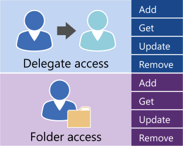

# Administrar el acceso de usuario mediante el uso de EWS en Exchange

Averigüe cuáles son las opciones para administrar el acceso de la cuenta de usuario a su servidor de Exchange.
  
API administrada de servicios de Web Exchange (EWS) y la dirección URL de EWS proporcionar un número limitado de operaciones que puede usar para administrar las cuentas de Exchange Online, Exchange Online como parte de Office 365 o una versión de Exchange a partir de Exchange 2013. Puede usar las operaciones que se muestra en la ilustración siguiente para administrar los delegados y para establecer permisos de acceso de carpeta para otras cuentas. 
  
**Operaciones de EWS para el acceso de delegado y carpeta**

  
Si la aplicación necesita un control adicional sobre las cuentas en un servidor de Exchange, puede usar los cmdlets del Shell de administración de Exchange para administrar las cuentas. Puede llamar a los cmdlets del Shell de administración de Exchange, realice una de las siguientes opciones:
  
- Escribir una aplicación con C# o Visual Basic que llama a los cmdlets del Shell de administración de Exchange. Puede buscar en el código de ejemplo en la [documentación de la API de Shell de administración de Exchange](../management/exchange-management-shell.md) para obtener información sobre cómo llamar a un cmdlet. 
    
- Uso de Windows PowerShell y scripts de Windows PowerShell para llamar a los cmdlets del Shell de administración de Exchange. Puede encontrar una lista completa de la [Exchange Server PowerShell (Shell de administración de Exchange)](https://docs.microsoft.com/en-us/powershell/exchange/exchange-server/exchange-management-shell?view=exchange-ps), junto con ejemplos que muestran cómo usarlas. 
    
## Vea también

- [Configurar una aplicación de EWS](setting-up-your-ews-application.md)   
- [Cmdlets de Exchange 2013](https://docs.microsoft.com/en-us/powershell/exchange/?view=exchange-ps)  
    

