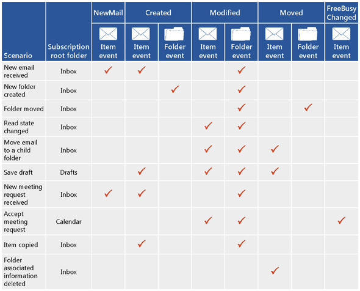

# Suscripciones de notificación, eventos de buzón y EWS en Exchange

Obtenga información sobre las suscripciones de notificación y el evento de buzón en EWS en Exchange.
  
Puede usar la API administrada de EWS y los servicios Web de Exchange (EWS) para suscribirse y recibir notificaciones cuando se produzcan eventos en un buzón o en una o varias de las carpetas de un buzón. Hay tres tipos de suscripción disponibles: notificaciones de streaming, notificaciones de extracción y notificaciones de inserción. Cada uno de estos tipos de suscripción usa distintas técnicas para recibir o recuperar las notificaciones.
  
## Obtener notificaciones: ¿Cuáles son mis opciones?

EWS incluye tres tipos de suscripción que funcionan independientemente para notificar al cliente los cambios en el servidor. Independientemente del tipo de suscripción que elija, tendrá acceso a todos los eventos de notificación en el final, solo cuestión de cómo obtenerlas.
  
**Tabla 1. Tipos de suscripción**

|**Opción**|**Descripción**|**¿Es adecuado para mí?**|
|:-----|:-----|:-----|
|Notificaciones de streaming    |Notificaciones que el servidor envía a través de una conexión que permanece abierta durante un período de tiempo especificado.    |Generalmente, se recomiendan las notificaciones de streaming para la mayoría de las aplicaciones. Son similares a las notificaciones de inserción y extracción, y ofrecen lo mejor de ambos mundos. Después de establecer la suscripción de notificación, la conexión permanece abierta hasta 30 minutos para permitir que el servidor vuelva a enviar notificaciones al cliente. No es necesario solicitar actualizaciones, como lo haría con una suscripción de extracción y no tiene que crear una aplicación de escucha de servicio web como lo haría con una suscripción de inserción.    |
|Notificaciones de extracción    |Notificaciones que el cliente ha solicitado (o extraído).    |Las notificaciones de extracción son, en general, más apropiadas para los clientes acoplados de manera imprecisa, donde el cliente no está conectado de forma segura a la red. Las notificaciones de extracción pueden crear un exceso de tráfico entre el cliente y el servidor porque el cliente envía solicitudes frecuentes al servidor para recuperar notificaciones y no todas las solicitudes producen notificaciones recuperadas.    |
|Notificaciones de inserción    |Notificaciones enviadas (o impulsadas) por el servidor a un servicio Web del lado cliente a través de una dirección de devolución de llamada.    |Por lo general, las notificaciones de inserción proporcionan latencia de notificación más reducida que las notificaciones de extracción y son adecuadas para clientes estrechamente acoplados a los que el servidor tiene acceso confiable y el cliente es direccionable por IP. Sin embargo, las notificaciones de inserción se han caído de favor desde la llegada de las notificaciones de streaming en Exchange 2010. Si es posible, se recomienda usar las notificaciones de streaming en lugar de las notificaciones de inserción en el futuro. Las notificaciones de inserción requieren que se escriba una aplicación de escucha, que es donde se insertan las notificaciones. Esto tiene una ligera ventaja con respecto a las notificaciones de extracción en cuanto a que reduce el tráfico en el cable, pero agrega sobrecarga al requerir una aplicación independiente.    |
   
## ¿A qué eventos EWS puedo suscribirme?

Los tipos de eventos EWS a los que se suscriben los clientes los define la enumeración [EventType](https://msdn.microsoft.com/library/microsoft.exchange.webservices.data.eventtype%28v=exchg.80%29.aspx) para la API administrada EWS o el elemento [EventType](https://msdn.microsoft.com/library/04b70f9e-c226-4130-958e-0db0275cf58b%28Office.15%29.aspx) para EWS. Los siguientes eventos de EWS están disponibles para la suscripción: 
  
- NewMail: se ha recibido un nuevo mensaje en la bandeja de entrada.
    
- Deleted: se ha eliminado un mensaje de forma permanente de la bandeja de entrada. Para obtener más información sobre las notificaciones de elementos eliminados, vea [eliminar elementos mediante EWS en Exchange](deleting-items-by-using-ews-in-exchange.md) y [notificaciones de extracción para eventos de buzón relacionados con la eliminación de EWS en Exchange](pull-notifications-for-ews-deletion-related-mailbox-events-in-exchange.md).
    
- Modified: se ha cambiado un elemento o una carpeta.
    
- Moved: se movió un elemento o una carpeta. 
    
- Copiado: se ha copiado un elemento o una carpeta.
    
- Creado: se ha creado un elemento o una carpeta. 
    
- FreeBusyChanged: se ha cambiado la información de disponibilidad de un usuario.
    
Otro tipo de evento de EWS, el evento de estado, se define mediante el elemento [EventType](https://msdn.microsoft.com/library/microsoft.exchange.webservices.data.eventtype%28v=exchg.80%29.aspx) , pero no se suscribe a este evento. En su lugar, lo envía el servidor para comprobar el estado del cliente solo para las notificaciones de inserción y de transmisión. El cliente debe responder a las necesidades de este evento o el cliente agotará el tiempo de espera. 
  
Una sola acción del usuario suele tener como resultado la creación de varias notificaciones. Para ilustrarlo, en la siguiente figura se muestran algunos escenarios comunes y las notificaciones creadas para cada uno de ellos. La configuración del cliente tiene un impacto en las notificaciones recibidas, por lo que no se trata de una lista exhaustiva de todas las opciones de configuración y las notificaciones resultantes.
  
**Figura 1. Tipos de eventos devueltos por suscripciones de notificación**

  
La figura 1 simplifica el proceso de notificación. En realidad, se pueden crear varias notificaciones (incluso varias notificaciones del mismo tipo) para una sola acción del usuario. Por ejemplo, en el caso de una operación de movimiento de carpetas, se crean tres eventos de carpeta: uno para la carpeta que se está modificando, otro para la carpeta primaria antigua y otro para la nueva carpeta principal. Como se pueden desencadenar varios eventos para una sola operación, se recomienda [crear un tiempo de espera de unos segundos en las operaciones de sincronización](mailbox-synchronization-and-ews-in-exchange.md#bk_bestpractices)para que solo se sincronice cuando se complete la acción, en lugar de parcialmente a través de la operación.
  
También es importante tener en cuenta que las opciones de configuración que elija cada usuario afectarán a las notificaciones que se creen. Por ejemplo, algunos datos de disponibilidad de los usuarios se actualizan automáticamente y el evento FreeBusyChanged se crea cuando se recibe una nueva convocatoria de reunión, incluso antes de que haya leído el elemento. Para otros usuarios, los datos de disponibilidad no se actualizan y el evento FreeBusyChanged no se crea hasta que se ha aceptado la reunión. Esta configuración puede tener un impacto considerable en las notificaciones creadas por el servidor.
  
## ¿Cómo funcionan las notificaciones de EWS?

Las notificaciones EWS se controlan en base a una suscripción. Por lo general, hay una suscripción por buzón y, en la suscripción a buzones, puede suscribirse a algunas o a todas las carpetas. Usted decide a qué tipo de notificación debe suscribirse (transmitir, extraer o insertar) y qué tipo de eventos desea recibir (NewMail, creado, eliminado, modificado, etc.) y, a continuación, crea una suscripción. A continuación, los eventos EWS se envían asincrónicamente desde el servidor de buzones de correo al cliente. (History lección: los eventos son sincrónicos en Exchange 2007-y los eventos se almacenan en el servidor de acceso de cliente en Exchange 2010, pero no más).
  
Según el tipo de suscripción que tenga, las formas en que se envían las notificaciones al cliente varían. En esta sección se describe cómo funciona con más detalle cada tipo de suscripción.
  
### Notificaciones de transmisión de EWS

Las notificaciones de transmisión por secuencias dependen de una solicitud GET colgada en el servidor para mantener abierta una conexión de suscripción de transmisión, de modo que los eventos que se produzcan mientras la conexión esté activa se transmitan al cliente de inmediato. Se pueden enviar varias notificaciones a través del curso de una única conexión y la conexión permanece abierta hasta que expire el intervalo o durante un máximo de 30 minutos. Una vez expirada la conexión, el cliente envía de nuevo la solicitud GET de bloqueo. En la figura 2 se muestra cómo funcionan las suscripciones y las notificaciones de transmisión por secuencias.
  
**Figura 2. Información general sobre la notificación por secuencias**

  
Para obtener información sobre la creación de notificaciones de streaming, consulte [notificaciones de transmisiones sobre eventos de buzón de correo mediante EWS en Exchange](how-to-stream-notifications-about-mailbox-events-by-using-ews-in-exchange.md).
  
### Notificaciones de extracción de EWS

Las notificaciones de extracción dependen del cliente que solicita las notificaciones en un intervalo que administra el cliente. Esto puede dar como resultado respuestas GetEvents sin notificaciones. En la figura 3 se muestra cómo funcionan las suscripciones de extracción y las notificaciones de extracción.
  
**Figura 3. Introducción a la notificación de extracción**

  
Para obtener información acerca de la creación de notificaciones de extracción, consulte [notificaciones de extracción sobre eventos de buzón de correo mediante EWS en Exchange](how-to-pull-notifications-about-mailbox-events-by-using-ews-in-exchange.md).
  
### Notificaciones push de EWS

Las notificaciones de inserción dependen de que el servidor Presione las notificaciones de vuelta al cliente. Solo hay tráfico si hay una notificación. La figura 4 muestra cómo funcionan las suscripciones de inserción y las notificaciones de inserción.
  
**Figura 4. Introducción a la notificación de inserción**

Si usa [notificaciones de inserción con Exchange 2010](https://msdn.microsoft.com/library/db1f8523-fa44-483f-bdb6-ab5939b52eee%28Office.15%29.aspx), considere la posibilidad de actualizar la aplicación para que [use notificaciones de transmisión por secuencias](https://code.msdn.microsoft.com/exchange/Exchange-2013-Set-push-82738cc5), de modo que no necesite una aplicación independiente para recibir los eventos.

  
## ¿Cómo me suscribio a las notificaciones?

En función del tipo de suscripción que quiera crear, tiene varias opciones que puede elegir para suscribirse a las notificaciones.
  
**Tabla 2. Operaciones y métodos para suscribirse a notificaciones**

|**Tipo de suscripción**|**Operación de EWS**|**Métodos de la API administrada de EWS**|**Qué hace**|
|:-----|:-----|:-----|:-----|
|Origen    |[Operación subscribe](https://msdn.microsoft.com/library/f17c3d08-c79e-41f1-ba31-6e41e7aafd87%28Office.15%29.aspx)   |[Método ExchangeService. BeginSubscribeToStreamingNotifications](https://msdn.microsoft.com/library/microsoft.exchange.webservices.data.exchangeservice.beginsubscribetostreamingnotifications%28v=exchg.80%29.aspx)   [Método ExchangeService. BeginSubscribeToStreamingNotificationsOnAllFolders](https://msdn.microsoft.com/library/microsoft.exchange.webservices.data.exchangeservice.beginsubscribetostreamingnotificationsonallfolders%28v=exchg.80%29.aspx)   [Método ExchangeService. SubscribeToStreamingNotificationsOnAllFolders](https://msdn.microsoft.com/library/microsoft.exchange.webservices.data.exchangeservice.subscribetostreamingnotifications%28v=exchg.80%29.aspx)   |Crea una solicitud para suscribirse a las notificaciones de transmisión por secuencias.    |
|Presionar    |[Operación subscribe](https://msdn.microsoft.com/library/f17c3d08-c79e-41f1-ba31-6e41e7aafd87%28Office.15%29.aspx)   |[Método ExchangeService. BeginSubscribeToPullNotifications](https://msdn.microsoft.com/library/microsoft.exchange.webservices.data.exchangeservice.beginsubscribetopullnotifications%28v=exchg.80%29.aspx)   [Método ExchangeService. BeginSubscribeToPullNotificationsOnAllFolders](https://msdn.microsoft.com/library/microsoft.exchange.webservices.data.exchangeservice.beginsubscribetopullnotificationsonallfolders%28v=exchg.80%29.aspx)   [Método ExchangeService. SubscribeToPullNotifications](https://msdn.microsoft.com/library/microsoft.exchange.webservices.data.exchangeservice.subscribetopullnotifications%28v=exchg.80%29.aspx)   [Método ExchangeService. SubscribeToPullNotificationsOnAllFolders](https://msdn.microsoft.com/library/microsoft.exchange.webservices.data.exchangeservice.subscribetopullnotificationsonallfolders%28v=exchg.80%29.aspx)   |Crea una solicitud para suscribirse a las notificaciones de extracción.    |
|Ingrese    |[Operación subscribe](https://msdn.microsoft.com/library/f17c3d08-c79e-41f1-ba31-6e41e7aafd87%28Office.15%29.aspx)   |[Método sobrecargado ExchangeService. BeginSubscribeToPushNotifications](https://msdn.microsoft.com/library/microsoft.exchange.webservices.data.exchangeservice.beginsubscribetopushnotifications%28v=exchg.80%29.aspx)   [Método Overload ExchangeService. BeginSubscribeToPushNotificationsOnAllFolders](https://msdn.microsoft.com/library/microsoft.exchange.webservices.data.exchangeservice.beginsubscribetopushnotificationsonallfolders%28v=exchg.80%29.aspx)   [Método sobrecargado ExchangeService. SubscribeToPushNotifications](https://msdn.microsoft.com/library/microsoft.exchange.webservices.data.exchangeservice.subscribetopushnotifications%28v=exchg.80%29.aspx)   [Método sobrecargado ExchangeService. SubscribeToPushNotificationsOnAllFolders](https://msdn.microsoft.com/library/microsoft.exchange.webservices.data.exchangeservice.subscribetopushnotificationsonallfolders%28v=exchg.80%29.aspx)   |Crea una solicitud para suscribirse a las notificaciones de inserción.    |
   
## ¿Cómo obtengo los eventos EWS?

Una vez creada la suscripción, la forma en que los eventos reales se envían al cliente depende del tipo de suscripción. 
  
Para las notificaciones de transmisión por secuencias, se debe crear una conexión de suscripción de transmisión por secuencias y, a continuación, se agrega la suscripción a la conexión. Puede obtener más información sobre este proceso en las [notificaciones de flujo sobre los eventos de buzón de correo mediante EWS en Exchange](how-to-stream-notifications-about-mailbox-events-by-using-ews-in-exchange.md). 
  
Para las notificaciones de extracción, el objeto de suscripción se inicializó cuando se creó la suscripción, por lo que solo tiene que llamar al método **GetEvent** o a la operación para recuperar los eventos del servidor. Puede obtener más información sobre esto en las [notificaciones de extracción sobre los eventos de buzón de correo mediante EWS en Exchange](how-to-pull-notifications-about-mailbox-events-by-using-ews-in-exchange.md). 
  
En la siguiente tabla se enumeran las operaciones y las clases necesarias para recuperar eventos. 
  
**Tabla 3. Elementos y clases para crear una conexión y obtener eventos**

|**Tipo de suscripción**|**Operación de EWS**|**Método de la API administrada de EWS**|**Qué hace**|
|:-----|:-----|:-----|:-----|
|Origen    |[Operación GetStreamingEvents](https://msdn.microsoft.com/library/8da95423-72bc-4034-90a8-162eedcd059b%28Office.15%29.aspx)   |[Método StreamingSubscriptionConnection. AddSubscription](https://msdn.microsoft.com/library/microsoft.exchange.webservices.data.streamingsubscriptionconnection.addsubscription%28v=exchg.80%29.aspx)   |Crea una solicitud GET de bloqueo en el servidor, que se responde cuando se producen eventos.    |
|Presionar    |[Operación GetEvents](https://msdn.microsoft.com/library/f268efe5-9a1a-41a2-b6a6-51fcde7720a1%28Office.15%29.aspx)   |[Método PullSubscription. GetEvents](https://msdn.microsoft.com/library/microsoft.exchange.webservices.data.pullsubscription.getevents%28v=exchg.80%29.aspx)   |Obtiene los eventos de notificación de extracción del servidor.    |
|Ingrese    |No procede.    |No procede.    |Las notificaciones de inserción se envían automáticamente al agente de escucha del servicio Web (la dirección URL de devolución de llamada especificada en la solicitud de suscripción). No es necesario llamar a métodos ni operaciones adicionales.    |
   
## ¿Cómo puedo cancelar la suscripción a las notificaciones?

En la siguiente tabla se enumeran las formas en que puede cancelar la suscripción a cada tipo de suscripción.
  
**Tabla 4. Operaciones y métodos para anular la suscripción a notificaciones**

|**Tipo de suscripción**|**EWS**|**API administrada EWS**||
|:-----|:-----|:-----|:-----|
|Origen    |[Operación unsubscribe](https://msdn.microsoft.com/library/994a9d2b-1501-4804-90f0-12bd914496ec%28Office.15%29.aspx)   |[Método StreamingSubscription. BeginUnsubscribe](https://msdn.microsoft.com/library/microsoft.exchange.webservices.data.streamingsubscription.beginunsubscribe%28v=exchg.80%29.aspx)   [Método StreamingSubscription. EndUnsubscribe](https://msdn.microsoft.com/library/microsoft.exchange.webservices.data.streamingsubscription.endunsubscribe%28v=exchg.80%29.aspx)   [Método StreamingSubscription. unsubscribe](https://msdn.microsoft.com/library/microsoft.exchange.webservices.data.streamingsubscription.unsubscribe%28v=exchg.80%29.aspx)   ||
|Presionar    |[Operación unsubscribe](https://msdn.microsoft.com/library/994a9d2b-1501-4804-90f0-12bd914496ec%28Office.15%29.aspx)   |[Método PullSubscription. BeginUnsubscribe](https://msdn.microsoft.com/library/microsoft.exchange.webservices.data.pullsubscription.beginunsubscribe%28v=exchg.80%29.aspx)   [Método PullSubscription. EndUnsubscribe](https://msdn.microsoft.com/library/microsoft.exchange.webservices.data.pullsubscription.endunsubscribe%28v=exchg.80%29.aspx)   [Método PullSubscription. unsubscribe](https://msdn.microsoft.com/library/microsoft.exchange.webservices.data.pullsubscription.unsubscribe%28v=exchg.80%29.aspx)   ||
|Ingrese    |Devuelve **unsubscribe** en el elemento [StatusFrequency](https://msdn.microsoft.com/library/917474e2-a426-4166-b825-53783a41dad4%28Office.15%29.aspx) de la [SendNotificationResponseMessage](https://msdn.microsoft.com/library/2c6d681b-67ac-4331-bc6b-a2e709b638e3%28Office.15%29.aspx)   |No procede. En su lugar, deje el tiempo de espera de la suscripción.    ||
   
Como alternativa, puede permitir que cada una de las suscripciones agote el tiempo de espera. 
  
**Tabla 5. Tiempos de espera de suscripción**

|**Tipo de suscripción**|**Valor de tiempo de espera en EWS**|**Valor de tiempo de espera en la API administrada de EWS**|**Control de tiempo de espera**|
|:-----|:-----|:-----|:-----|
|Origen    |Elemento [ConnectionTimeout](https://msdn.microsoft.com/library/14da68a0-bcca-4281-a774-47644baa4ee9%28Office.15%29.aspx)    | parámetro *Lifetime* del constructor [StreamingSubscriptionConnection](https://msdn.microsoft.com/library/microsoft.exchange.webservices.data.streamingsubscriptionconnection.streamingsubscriptionconnection%28v=exchg.80%29.aspx)    |Para la API administrada de EWS, una vez transcurrido el valor de tiempo de espera, se produce el evento [OnDisconnect](https://msdn.microsoft.com/library/microsoft.exchange.webservices.data.streamingsubscriptionconnection.ondisconnect%28v=exchg.80%29.aspx) . Si no se llama al método [StreamingSubscriptionConnection. Open](https://msdn.microsoft.com/library/microsoft.exchange.webservices.data.streamingsubscriptionconnection.open%28v=exchg.80%29.aspx) , se cierra la conexión.    Para EWS, una vez transcurrido el valor de tiempo de espera, el mensaje [GetUserConfigurationResponse](https://msdn.microsoft.com/library/5e418c91-c836-4de0-a80d-f0dad0c684d7%28Office.15%29.aspx) devuelve un valor [ConnectionStatus](https://msdn.microsoft.com/library/4300f9d6-8bf9-48c2-9f07-d80197864e17%28Office.15%29.aspx) de closed.    |
|Presionar    |Elemento [timeout](https://msdn.microsoft.com/library/c2e1ca5a-6667-4f6f-aac4-89de33bddc54%28Office.15%29.aspx)    | parámetro *timeout* del método [SubscribeToPullNotification](https://msdn.microsoft.com/library/microsoft.exchange.webservices.data.exchangeservice.subscribetopullnotifications%28v=exchg.80%29.aspx)    |Una vez transcurrido el valor de tiempo de espera, el servidor elimina la suscripción.    |
|Ingrese    |Elemento [StatusFrequency](https://msdn.microsoft.com/library/917474e2-a426-4166-b825-53783a41dad4%28Office.15%29.aspx)    | parámetro *Frequency* del método [SubscribeToPushNotification](https://msdn.microsoft.com/library/microsoft.exchange.webservices.data.exchangeservice.subscribetopushnotifications%28v=exchg.80%29.aspx)    |Si el servidor no recibe una respuesta a una notificación de inserción o ping de estado, vuelve a intentar enviar la notificación varias veces antes de dejar de enviar las notificaciones. Para obtener más información, vea [StatusFrequency](https://msdn.microsoft.com/library/917474e2-a426-4166-b825-53783a41dad4%28Office.15%29.aspx).    |
   
## ¿Puedo limitar las suscripciones?

En una implementación local, puede limitar el número de suscripciones por usuario con el [parámetro de limitación EwsMaxSubscriptions](ews-throttling-in-exchange.md) de la Directiva de limitación. Esa Directiva se puede aplicar a todos los usuarios o solo a usuarios específicos. La Directiva de limitación de **EwsMaxSubscriptions** no se puede configurar para Exchange Online. 
  
## En esta sección

- [Notificaciones de secuencia sobre eventos de buzón de correo mediante EWS en Exchange](how-to-stream-notifications-about-mailbox-events-by-using-ews-in-exchange.md)
    
- [Extraer notificaciones sobre eventos de buzón de correo mediante EWS en Exchange](how-to-pull-notifications-about-mailbox-events-by-using-ews-in-exchange.md)
    
- [Mantener la afinidad entre un grupo de suscripciones y el servidor de buzones de correo de Exchange](how-to-maintain-affinity-between-group-of-subscriptions-and-mailbox-server.md)
    
- [Control de errores relacionados con la notificación en EWS en Exchange](handling-notification-related-errors-in-ews-in-exchange.md)
    
## Vea también

- [Desarrollar clientes de servicios web de Exchange](develop-web-service-clients-for-exchange.md)
- [Referencia de servicios web para Exchange](../web-service-reference/web-services-reference-for-exchange.md)
- [Empezar a usar los servicios web de Exchange](start-using-web-services-in-exchange.md)
- [Sincronización de buzones de correo y EWS en Exchange](mailbox-synchronization-and-ews-in-exchange.md)
- [Aplicación de ejemplo de notificación de inserción](https://msdn.microsoft.com/library/db1f8523-fa44-483f-bdb6-ab5939b52eee%28Office.15%29.aspx)
    

