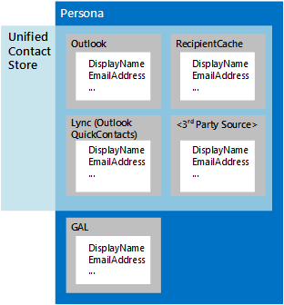

# Las personas y los contactos de EWS en Exchange

Obtenga información sobre cómo trabajar con los contactos mediante el uso de la API administrada de EWS o EWS en Exchange, el almacén de contactos unificados y roles. 
  
Los contactos son elementos de Exchange que almacenan información acerca de un individuo, grupo u organización. Contactos pueden incluir nombres y direcciones de correo electrónico y otra información, incluidas las direcciones de mensajería instantánea, direcciones físicas, cumpleaños, información de la familia y una foto o imagen que representa el contacto.
  
Información de contacto se almacena en uno de estos dos lugares:
  
- Los servicios de dominio de Active Directory (AD DS), si el contacto está dentro de la organización.
    
- La carpeta de contactos o en otra carpeta en el buzón del usuario, si el contacto está fuera de la organización.
    
Varios elementos de contacto pueden representar a una sola persona. Exchange utiliza roles para ayudar a reunir estos diferentes elementos de contacto. Un *rol* es una agregación de información de contacto de la misma persona de diferentes orígenes. Además para información de contacto en Exchange, roles también se pueden agregar de información en la memoria caché de destinatario para el buzón de correo, una carpeta oculta para contactos de mensajería instantánea denominado QuickContacts y de orígenes de datos de terceros. El almacén de contactos unificados en Exchange permite a los clientes de mensajería instantánea usar esta agregación; la única diferencia es que el almacén de contactos unificados no agrega información de AD DS, tal como se muestra en la figura 1. 
  
**En la figura 1. Orígenes de información de contacto para personas y para el almacén de contactos unificados**

  
**La tabla 1. Métodos de la API administrada de EWS y las operaciones de EWS para trabajar con contactos**

|**Si quiere...**|**Use este método de la API administrada de EWS**|**Use esta operación de EWS**|
|:-----|:-----|:-----|
|Crear un nuevo contacto    |Crear una instancia de un nuevo objeto de [contacto](http://msdn.microsoft.com/en-us/library/office/microsoft.exchange.webservices.data.contact%28v=exchg.80%29.aspx) y utilizar [Contact.Save](http://msdn.microsoft.com/en-us/library/office/microsoft.exchange.webservices.data.contact.save%28v=exchg.80%29.aspx)   |[CreateItem](http://msdn.microsoft.com/library/417e994b-0a17-4c24-9527-04796b80b029%28Office.15%29.aspx)   |
|Copiar un contacto    |[Contact.Copy](http://msdn.microsoft.com/en-us/library/office/microsoft.exchange.webservices.data.contact.copy%28v=exchg.80%29.aspx)   |[CopyItem](http://msdn.microsoft.com/library/bcc68f9e-d511-4c29-bba6-ed535524624a%28Office.15%29.aspx)   |
|Mover un contacto    |[Contact.Move](http://msdn.microsoft.com/en-us/library/office/microsoft.exchange.webservices.data.contact.move%28v=exchg.80%29.aspx)   |[MoveItem](http://msdn.microsoft.com/library/dcf40fa7-7796-4a5c-bf5b-7a509a18d208%28Office.15%29.aspx)   |
|Actualizar un contacto existente    |[Contact.Bind](http://msdn.microsoft.com/en-us/library/office/microsoft.exchange.webservices.data.contact.bind%28v=exchg.80%29.aspx) y [Contact.Update](http://msdn.microsoft.com/en-us/library/office/microsoft.exchange.webservices.data.contact.update%28v=exchg.80%29.aspx)   |[UpdateItem](http://msdn.microsoft.com/library/298fdd71-a83d-4407-9728-4f0a8e2d857c%28Office.15%29.aspx)   |
|Eliminar un contacto    |[Contact.Bind](http://msdn.microsoft.com/en-us/library/office/microsoft.exchange.webservices.data.contact.bind%28v=exchg.80%29.aspx) y [Contact.Delete](http://msdn.microsoft.com/en-us/library/office/microsoft.exchange.webservices.data.contact.delete%28v=exchg.80%29.aspx)   |[DeleteItem](../web-service-reference/deleteitem-operation.md)   |
|Buscar un contacto    |[ExchangeService.FindItems](http://msdn.microsoft.com/en-us/library/office/microsoft.exchange.webservices.data.exchangeservice.finditems%28v=exchg.80%29.aspx)   |[FindItem](http://msdn.microsoft.com/library/ebad6aae-16e7-44de-ae63-a95b24539729%28Office.15%29.aspx)   |
|Búsqueda de personas    |N/D    |[FindPeople](http://msdn.microsoft.com/library/446106b7-ff2d-4107-90c1-29f4d38ba128%28Office.15%29.aspx)   |
|Expanda un grupo de distribución    |[ExchangeService.ExpandGroup](http://msdn.microsoft.com/en-us/library/office/microsoft.exchange.webservices.data.exchangeservice.expandgroup%28v=exchg.80%29.aspx)   |[ExpandDL](http://msdn.microsoft.com/library/1f7837e7-9eff-4e10-9577-c40f7ed6af94%28Office.15%29.aspx)   |
|Resolver un nombre ambiguo    |[ExchangeService.ResolveName](http://msdn.microsoft.com/en-us/library/office/microsoft.exchange.webservices.data.exchangeservice.resolvename%28v=exchg.80%29.aspx)   |[ResolveNames](http://msdn.microsoft.com/library/6b4eb4b3-9ad6-4804-a09f-7e20cfea4dbb%28Office.15%29.aspx)   |
|Obtener un rol    |N/D    |[GetPersona](http://msdn.microsoft.com/library/e2146df0-53d0-4caf-9758-b600bbc14b6a%28Office.15%29.aspx)   |
|Trabajar con fotos de contactos    |[Contact.SetContactPicture](http://msdn.microsoft.com/en-us/library/office/microsoft.exchange.webservices.data.contact.setcontactpicture%28v=exchg.80%29.aspx), [Contact.GetContactPictureAttachment](http://msdn.microsoft.com/en-us/library/office/microsoft.exchange.webservices.data.contact.getcontactpictureattachment%28v=exchg.80%29.aspx)o [Contact.RemoveContactPicture](http://msdn.microsoft.com/en-us/library/office/microsoft.exchange.webservices.data.contact.setcontactpicture%28v=exchg.80%29.aspx)   |[GetUserPhoto](http://msdn.microsoft.com/library/f6e8143d-4235-428e-8f9c-ab6e9b1cfa6e%28Office.15%29.aspx) o [GetAttachment](http://msdn.microsoft.com/library/24d10a15-b942-415e-9024-a6375708f326%28Office.15%29.aspx)   |
   
## Personas

Hasta hace poco, los contactos con frecuencia se almacenaban en una única ubicación — por lo general, en un cliente de correo electrónico. En la actualidad, se está convirtiendo en más comunes para almacenar los contactos en muchas ubicaciones diferentes, como en un teléfono, en un sitio de red social, en una carpeta de contactos en un buzón de Exchange, o en el servicio de directorio de la organización. Con la proliferación de la información de contacto, es posible que varios contactos que representan a la misma persona contienen distinta información; Por ejemplo, un contacto puede incluir un número de teléfono profesional y otro un número de teléfono personal o un contacto almacenado en una carpeta de contactos podría tener un nombre diferente que el contacto de la misma persona a la que se almacena en el teléfono.
  
En Exchange Online, Exchange Online como parte de Office 365 y las versiones locales de Exchange a partir de Exchange 2013, contactos de orígenes diferentes que representan la misma persona están asociados entre sí, similar a la forma en que los mensajes de correo electrónico son agregados a las conversaciones, por medio de un identificador de vínculo comunes. Cuando se devuelve información de contacto agregado por un servidor de Exchange, incluye un conjunto de atributos para cada contacto, como una carpeta de origen, un nombre para mostrar, un identificador y un identificador de origen. La suma de las propiedades y los atributos devueltos se conoce como un rol, y el conjunto de propiedades devuelto se conoce como la [forma del rol](http://msdn.microsoft.com/library/61d87cd5-3270-40d1-bab7-d0d5bf938607%28Office.15%29.aspx).
  
Dado que no se almacena la información que conforma un rol en una única ubicación y debido a que esa información puede cambiar en cualquier momento, se crea un rol sólo cuando se realiza una solicitud a un servidor de Exchange. Use la operación de EWS [FindPeople](http://msdn.microsoft.com/library/446106b7-ff2d-4107-90c1-29f4d38ba128%28Office.15%29.aspx) para realizar una solicitud de búsqueda de rol. La solicitud puede incluir un criterio de ordenación y se puede filtrar según una cadena de consulta que le ayudarán a encontrar la persona correcta de ordenación y filtrado de los resultados. Por ejemplo, puede recuperar el nombre para mostrar y un conjunto de todas las direcciones de correo electrónico que están asociados con un contacto específico desde la carpeta de contactos, una cuenta de Hotmail, una cuenta de LinkedIn y servicio de directorio de la empresa, o bien puede recuperar un conjunto de todos los roles que tener direcciones de mensajería instantánea. La vinculación de contactos en roles es automática en función de un algoritmo que reconoce una relación entre los contactos almacenados en diversos dispositivos. 
  
> [!NOTE]
> La API administrada de EWS no implementa esta funcionalidad. 
  
**Tabla 2. Operaciones de EWS para trabajar con roles**

|**Nombre de la operación**|**Descripción**|
|:-----|:-----|
|[FindPeople](http://msdn.microsoft.com/library/446106b7-ff2d-4107-90c1-29f4d38ba128%28Office.15%29.aspx)   |Devuelve todos los roles disponibles de una carpeta de contactos especificado o recupera los contactos que coinciden con una cadena de consulta especificada.    |
|[GetPersona](http://msdn.microsoft.com/library/e2146df0-53d0-4caf-9758-b600bbc14b6a%28Office.15%29.aspx)   |Devuelve un conjunto de propiedades asociadas con un rol específico, como el de mensajería instantánea direcciones o nombres para mostrar para un identificador de rol especificado.    |
   
Puede utilizar las operaciones **GetPersona** y **FindPeople** para recuperar eficazmente información de contacto de varios orígenes. Debido a que todos los elementos relacionados con un rol están asociados con un identificador de vínculo, puede usar estas operaciones en una amplia variedad de aplicaciones que usan datos de contacto. Los siguientes son algunos ejemplos: 
  
- Una aplicación de teléfono móvil que utiliza la operación **GetPersona** cuando un usuario llama a un contacto y, a continuación, ofrece otros números de teléfono para llamar a si nadie atiende. 
    
- Una aplicación que utiliza la operación **FindPeople** para analizar los mensajes de la Bandeja de entrada de direcciones de correo electrónico determinar si se encuentran en un rol ya existente. Las direcciones que ya no están asociadas con un rol pueden usarse para crear responsables de ventas o una lista de todas las comunicaciones recientes con la persona representada por esa persona. 
    
- [Una aplicación de correo para Outlook](mail-apps-for-outlook-and-ews-in-exchange.md) que ofrece saludos diferentes en función de si correspondencia es formal o informal. Saludos formales son proporcionados por los nombres para mostrar del servicio de directorio y saludos informales proceden del nombre para mostrar que se origina en los contactos de redes sociales. 
    
## Almacén de contactos unificados

Roles no se limita a un cliente de correo electrónico. Si está desarrollando a un cliente de mensajería instantánea, es posible que Hágase cualquiera o todas las opciones siguientes:
  
- ¿Cómo se pueden aprovisionar las aplicaciones de cliente de Lync con un conjunto predeterminado de elementos de contacto de mensajería instantánea?
    
- ¿Cómo administrar los contactos de mensajería instantánea y las listas de grupo?
    
- ¿Cómo se puede administrar el acceso de cliente de Lync personalizado a contactos de mensajería instantánea y los grupos de mensajería instantánea?
    
El almacén de contactos unificados funciona en segundo plano en Exchange para agregar datos de contacto de Exchange y de otros orígenes en una sola entidad o persona. Aunque las operaciones de EWS que usar para obtener acceso al almacén de contactos unificados son específicas para los contactos de mensajería instantánea, puede usar el almacén de contactos unificados en Exchange para trabajar con roles en todos los tipos de aplicaciones. Tenga en cuenta que el almacén de contactos unificados no se puede obtener acceso a datos de contacto de AD DS.
  
Contactos de mensajería instantánea se almacenan en una carpeta oculta denominada QuickContacts. Puede usar las operaciones de **AddNewImContactToGroup** y **AddImContactToGroup** para agregar contactos a los grupos que se almacenan en esta carpeta oculta. Y debido a que puede usar el almacén de contactos unificados para los contactos de mensajería instantánea de grupo, puede tener acceso y actualizar grupos de contactos más fácilmente. 
  
> [!NOTE]
> La API administrada de EWS no implementa esta funcionalidad. 
  
**Tabla 3. Operaciones de EWS para obtener acceso al almacén de contactos unificados**

|**Nombre de la operación**|**Descripción**|
|:-----|:-----|
|[AddNewImContactToGroup](http://msdn.microsoft.com/library/0cb5525f-faa3-48f1-9551-df55ffc26f46%28Office.15%29.aspx)   |Agrega un nuevo contacto de mensajería instantánea a un grupo de mensajería instantánea, hasta un máximo de 1000 contactos.    |
|[AddImContactToGroup](http://msdn.microsoft.com/library/376acc42-2684-4596-aca1-82a4a10865c9%28Office.15%29.aspx)   |Agrega un contacto de mensajería instantánea existente a un grupo de mensajería instantánea, hasta un máximo de 1000 contactos.    |
|[AddImGroup](http://msdn.microsoft.com/library/6df6e504-b7c8-4773-b10f-ffa5defac229%28Office.15%29.aspx)   |Agrega un nuevo grupo de mensajería instantánea, hasta un máximo de 64 grupos.    |
|[AddDistributionGroupToImList](http://msdn.microsoft.com/library/5aa9bec8-71cf-4a6e-8ec8-b4965b40fd4a%28Office.15%29.aspx)   |Agrega un nuevo grupo de distribución a un grupo de mensajería instantánea, hasta un máximo de 64 grupos.    |
|[GetImItemList](http://msdn.microsoft.com/library/e31d14e1-0c1f-4b69-98b7-157d59c13698%28Office.15%29.aspx)   |Recupera una lista de grupos de mensajería instantánea y personas de contacto de mensajería instantánea.    |
|[GetImItems](http://msdn.microsoft.com/library/51186691-46d2-4d5c-b8bc-4ee2bb20fbe7%28Office.15%29.aspx)   |Recupera información sobre grupos específicos de mensajería instantánea y mensajería instantánea, póngase en contacto con los roles.    |
|[RemoveContactFromImList](http://msdn.microsoft.com/library/28ec96c3-45af-48ff-9f17-718a527dc0ad%28Office.15%29.aspx)   |Quita un contacto de un grupo de mensajería instantánea.    |
|[RemoveImContactFromGroup](http://msdn.microsoft.com/library/a190bbec-c71b-4e6a-880b-55854c724d8c%28Office.15%29.aspx)   |Quita un contacto de mensajería instantánea de un grupo de mensajería instantánea.    |
|[RemoveDistributionGroupFromImList](http://msdn.microsoft.com/library/252bddf2-98b6-4824-b548-2fba2bda5384%28Office.15%29.aspx)   |Quita un grupo de distribución de un grupo de mensajería instantánea.    |
|[RemoveImGroup](http://msdn.microsoft.com/library/5e788016-68e0-4a3f-9243-03f6b6c6b389%28Office.15%29.aspx)   |Quita un grupo de mensajería instantánea.    |
|[SetImGroup](http://msdn.microsoft.com/library/2d48aa07-8152-4c3d-a519-061253e80174%28Office.15%29.aspx)   |Cambia el nombre para mostrar de un grupo de mensajería instantánea.    |
   
## En esta sección

- [Contactos de proceso por lotes mediante EWS en Exchange](how-to-process-contacts-in-batches-by-using-ews-in-exchange.md)
    
- [Resolver nombres ambiguos mediante el uso de EWS en Exchange 2013](how-to-resolve-ambiguous-names-by-using-ews-in-exchange-2013.md)
    
- [Obtener fotografías de usuario mediante el uso de EWS en Exchange](how-to-get-user-photos-by-using-ews-in-exchange.md)
    
## Vea también

- [Desarrollo de clientes de servicios web de Exchange](develop-web-service-clients-for-exchange.md)
    
- [Empezar a utilizar servicios web de Exchange](start-using-web-services-in-exchange.md)
    
- [Introducción al diseño de EWS cliente de Exchange](ews-client-design-overview-for-exchange.md)
    

