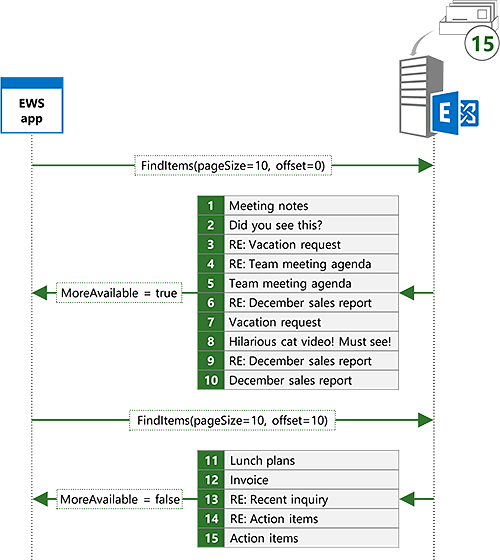
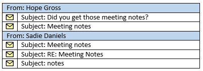

# <a name="search-and-ews-in-exchange"></a>Búsqueda y EWS en Exchange

Averigüe cómo buscar elementos en Exchange mediante el uso de la API administrada de EWS o EWS.
  
¿Hace a esto les resulta familiar? Por último comienza dicho proyecto que ha colocando para semanas y necesita información acerca del proyecto que su jefe le ha enviado en hace semanas de correo electrónico. La Bandeja de entrada tiene cientos o quizá miles de mensajes en ella. ¿A qué te dedicas? ¿Se desplaza a través de su correo electrónico hasta que encuentre el examen cada asunto y el remitente? O bien, ¿usa la característica de búsqueda en el cliente de correo electrónico favorito para centrarse rápidamente en lo que necesita?
  
Búsqueda es, posiblemente, una característica debe tener para cualquier cliente de correo electrónico. Pero la búsqueda puede usarse para mucho más que sólo lo que permite a los usuarios buscar su buzón. ¿La aplicación necesita procesar las citas que hay dentro de las ventanas de tiempo específico? Es posible que necesite un informe sobre todos los elementos de tarea con un estado específico o mover todos los contactos con un nombre de empresa específico a una carpeta diferente. Búsqueda puede ayudar con todos estos requisitos.
  
## <a name="search-basics"></a>Conceptos básicos de búsqueda
<a name="bk_SearchBasics"> </a>

La API administrada de EWS y EWS ofrecen dos métodos básicos para especificar una búsqueda. Puede usar un [filtro de búsqueda](how-to-use-search-filters-with-ews-in-exchange.md) o una [cadena de consulta](how-to-perform-an-aqs-search-by-using-ews-in-exchange.md). El método que utilice depende de la intención detrás de la búsqueda.
  
**La tabla 1. Escenarios de filtros de búsqueda y las consultas de búsqueda**

|**Si quiere...**|**Use un...**|**Notas**|
|:-----|:-----|:-----|
|Limitar la búsqueda a una propiedad concreta o un conjunto de propiedades  <br/> |Filtro de búsqueda  <br/> |Filtros de búsqueda proporcionan el mejor nivel de control sobre el que se buscan las propiedades. Aunque las cadenas de consulta pueden dirigir un conjunto limitado de propiedades mediante el uso de sintaxis de consulta avanzada (AQS), los filtros de búsqueda pueden dirigir cualquier propiedad.  <br/> |
|Crear búsquedas con varios criterios  <br/> |Filtro de búsqueda  <br/> |Con los filtros de búsqueda, se pueden combinar varios criterios de búsqueda junto con la lógica de los operadores and u OR, lo que permite búsquedas como "asunto contiene notas de la reunión y remitente es igual a 'Sadie Daniels'". Aunque las cadenas de consulta también pueden unirse a varios criterios de búsqueda, están limitadas al conjunto de propiedades compatibles con cadenas de consulta.  <br/> |
|Propiedades personalizadas de búsqueda  <br/> |Filtro de búsqueda  <br/> |Filtros de búsqueda pueden dirigir las propiedades personalizadas. Cadenas de consulta no realice búsquedas en las propiedades personalizadas.  <br/> |
|Realizar una búsqueda de mayúsculas y minúsculas de propiedades de cadena  <br/> |Filtro de búsqueda  <br/> |Las búsquedas de cadena de consulta no distinguen mayúsculas de minúsculas.  <br/> |
|Controlar el modo de contención al buscar propiedades de cadena  <br/> |Filtro de búsqueda  <br/> |Búsquedas de cadenas de consulta siempre son búsquedas de subcadenas. Si necesita buscar prefijos específicos o requieren a coincidencias exactas, un filtro de búsqueda es la mejor opción.  <br/> |
|Búsqueda de carpetas  <br/> |Filtro de búsqueda  <br/> |EWS no es compatible con la búsqueda de las carpetas con una cadena de consulta.  <br/> |
|Crear una carpeta de búsqueda  <br/> |Filtro de búsqueda  <br/> |EWS no es compatible con la creación de las carpetas de búsqueda con una cadena de consulta.  <br/> |
|Búsqueda en todos los usados con frecuencia a las propiedades  <br/> |Cadena de consulta  <br/> |Cadenas de consulta que no contienen AQS va a buscar en todas las propiedades usadas con más frecuencia. Por ejemplo, un valor de cadena de consulta de "Mack Chaves" devolverá todos los mensajes enviados por Mack Chaves, así como todos los mensajes que tienen "Mack Chaves" en el asunto o el cuerpo.  <br/> |
|Construir una búsqueda basada en la entrada de usuario sencilla  <br/> |Cadena de consulta  <br/> |Una cadena de consulta es una excelente opción para permitir que un usuario final para realizar una búsqueda rápida escribiendo en una cadena simple. Dado que una búsqueda de cadena de consulta incluye todas las propiedades usadas con más frecuencia, los resultados contendrá los elementos que contienen los términos de búsqueda del usuario.  <br/> |
   
### <a name="using-a-search-filter"></a>Uso de un filtro de búsqueda

Filtros de búsqueda proporcionan una amplia gama de opciones de búsqueda y el mayor grado de control sobre cómo se realiza la búsqueda. Puede usar filtros de búsqueda para llevar a cabo básicos de igualdad y las búsquedas de comparación, pero también puede buscar en el contenido de las propiedades de cadena o hacer comparaciones de máscara de bits.
  
Por ejemplo, puede buscar el contenido del asunto de los elementos mediante el uso de la clase [SearchFilter.ContainsSubstring](http://msdn.microsoft.com/en-us/library/microsoft.exchange.webservices.data.searchfilter.containssubstring%28v=exchg.80%29.aspx) en la API administrada de EWS. En este ejemplo, se crea un filtro de búsqueda para buscar al asunto de la subcadena "notas de la reunión," mayúsculas de minúsculas. 
  
```cs
SearchFilter.ContainsSubstring subjectFilter = new SearchFilter.ContainsSubstring(ItemSchema.Subject,
    "meeting notes", ContainmentMode.Substring, ComparisonMode.IgnoreCase);
```

También puede buscar en las propiedades personalizadas. En este ejemplo, se busca en la propiedad personalizada **ItemIndex** para valores superiores a 3. 
  
```cs
Guid MyAppGuid = new Guid("{AA3DF801-4FC7-401F-BBC1-7C93D6498C2E}");
ExtendedPropertyDefinition customPropDefinition =
    new ExtendedPropertyDefinition(MyAppGuid, "ItemIndex", MapiPropertyType.Integer); 
SearchFilter.IsGreaterThan customPropFilter =
    new SearchFilter.IsGreaterThan(customPropDefinition, 3);
```

También puede combinar varios filtros de búsqueda para crear búsquedas más complejas. Por ejemplo, puede combinar los dos filtros anteriores con un AND lógico mediante el uso de la clase [SearchFilter.SearchFilterCollection](http://msdn.microsoft.com/en-us/library/microsoft.exchange.webservices.data.searchfilter.searchfiltercollection%28v=exchg.80%29.aspx) . 
  
```cs
SearchFilter.SearchFilterCollection compoundFilter =
    new SearchFilter.SearchFilterCollection(LogicalOperator.And, subjectFilter, customPropFilter);
```

### <a name="using-a-query-string"></a>Uso de una cadena de consulta

Las cadenas de consulta proporcionan un enfoque diferente para buscar. Tener menos control sobre los campos que se buscan y cómo se realiza la búsqueda cuando se usa una búsqueda de cadena de consulta. No que es mala! En algunos casos, es posible que desee convertir una red más amplia, por así decirlo.
  
Por ejemplo, puede buscar "notas de la reunión" mediante el método de la API administrada de EWS [ExchangeService.FindItems](http://msdn.microsoft.com/en-us/library/jj223808%28v=exchg.80%29.aspx) . 
  
```cs
FindItemsResults<Item> results = service.FindItems(folder, "meeting notes", view);
```

Si compara los resultados de esta búsqueda a los resultados del ejemplo búsqueda **SearchFilter.ContainsSubstring** anteriormente, esta búsqueda va a contener más resultados. La búsqueda de filtro de búsqueda devolverá sólo los elementos que tienen "notas de la reunión" en el asunto, mientras que la búsqueda devolverá los elementos que tienen "notas de la reunión" en el asunto, el cuerpo y el resto de los campos. 
  
Vamos a echar un vistazo a cómo puede restringir la cadena de consulta para obtener más cerca de los resultados que se vea desde el filtro de búsqueda. Uso de AQS, puede limitar la búsqueda al asunto.
  
```cs
FindItemsResults<Item> results = service.FindItems(folder, "subject:meeting notes", view);
```

Esto es más cerca, pero los resultados son aún no es exactamente el mismo. Cuando se utiliza una cadena de consulta con varias palabras, obtendrá a las coincidencias de incluso si las palabras no están en el orden que especifique, o incluso aunque no estén adyacentes entre sí. Con la cadena de consulta "notas de la reunión: asunto", va a obtener a coincidencias para "notas de la reunión", "notas de la reunión" y así sucesivamente. Para depurar aún más, puede ajustar los términos de búsqueda en comillas dobles para indicar que desea que sólo esa frase.
  
```cs
FindItemsResults<Item> results = service.FindItems(folder, "subject:\"meeting notes\"", view);
```

## <a name="requesting-specific-properties-in-search-results"></a>Solicitar propiedades específicas en los resultados de búsqueda
<a name="bk_RequestSpecific"> </a>

De forma predeterminada, los resultados de búsqueda va a contener todas las propiedades en los elementos que coinciden con la búsqueda. En algunos casos, esto podría ser lo que desea, pero en la mayoría de los casos, la aplicación sólo requiere un conjunto discreto de propiedades. En este caso, debería limitar el conjunto de propiedades que se devuelven a las propiedades de la aplicación necesita. En el siguiente ejemplo, se usa la clase [artículoVer](http://msdn.microsoft.com/en-us/library/microsoft.exchange.webservices.data.itemview%28v=exchg.80%29.aspx) para limitar las propiedades devueltas al asunto, fecha y hora de recepción y el identificador de los elementos. 
  
```cs
ItemView view = new ItemView(10);
// Creating a new PropertySet with this constructor includes 
// ItemSchema.Id.
view.PropertySet = new PropertySet(ItemSchema.Subject, ItemSchema.DateTimeReceived);
```

## <a name="controlling-search-depth"></a>Controlar la profundidad de búsqueda
<a name="bk_SearchDepth"> </a>

Establecer el recorrido en la vista controla la profundidad y el ámbito de la búsqueda. 
  
**Tabla 2. Búsqueda cruce seguro de los valores**

|**Valor recorrido**|**Se aplica a**|**Descripción**|
|:-----|:-----|:-----|
|Superficial  <br/> |Los elementos y carpetas  <br/> |Realizar búsquedas superficiales están limitadas a elementos secundarios directos de la carpeta que se está buscando.  <br/> |
|Profunda  <br/> |Elementos (sólo con las carpetas de búsqueda) y carpetas  <br/> |Búsquedas en profundidad recursivamente buscar la carpeta que se buscan y subcarpetas.  <br/> |
|Asociado  <br/> |Items  <br/> |Búsquedas asociadas sólo incluyen elementos asociados de la carpeta que se está buscando. Elementos asociados son elementos ocultos dentro de la carpeta.  <br/> |
|SoftDeleted  <br/> |Los elementos y carpetas  <br/> |Este tipo de cruce seguro de los está en desuso. Las búsquedas de SoftDeleted incluyan solo los elementos que se encuentran en el volcado de archivos. El volcado de archivos ha sido reemplazada por la [carpeta elementos recuperables](https://docs.microsoft.com/en-us/exchange/policy-and-compliance/recoverable-items-folder/recoverable-items-folder) en Exchange Online, Exchange Online como parte de Office 365 y las versiones de Exchange a partir de Exchange 2010.  <br/> |
   
## <a name="managing-search-results"></a>Administración de los resultados de búsqueda
<a name="bk_ManageSearchResults"> </a>

La API administrada de EWS y EWS también permiten cambiar cómo se devuelven los resultados de búsqueda. Puede usar vistas para especificar qué propiedades se incluyen en los resultados, ordenar los resultados y los resultados para sólo obtener un número de conjunto de resultados por respuesta de página. También puede agrupar los resultados por los valores de campo específico y control de la profundidad de una búsqueda mediante la especificación de un tipo de recorrido. Por último, puede usar las carpetas de búsqueda para crear búsquedas persistentes que se actualizan dinámicamente a medida que llegan nuevos elementos.
  
### <a name="sorting"></a>Ordenación

Puede obtener el servidor para devolver resultados ordenados, lo que pueden hacer es más fácil mostrar o procesar los elementos de orden. En este ejemplo, los resultados se ordenarán por la fecha y hora recibida, con los elementos más recientes que se va a primera.
  
```cs
view.OrderBy.Add(ItemSchema.DateTimeReceived, SortDirection.Descending);
```

### <a name="paging"></a>Paging

Cuando envíe una solicitud de búsqueda mediante el uso de la API administrada de EWS o EWS, especifique un tamaño de vista, que controla el número máximo de elementos devueltos. Sin embargo, el número de elementos en el servidor que coinciden con la búsqueda puede ser mayor que el tamaño de la vista. En este caso, el servidor indica que hay disponibles más elementos. Puede [utilizar la paginación para repetir la búsqueda](how-to-perform-paged-searches-by-using-ews-in-exchange.md) y obtener el siguiente conjunto de resultados. 
  
Por ejemplo, puede enviar una solicitud de búsqueda con un tamaño de vista de 10. Puede haber 15 elementos en el servidor que coinciden con la búsqueda, pero sólo obtendrá los primeros 10, junto con un indicador (la [FindItemsResults\<TItem\>. MoreAvailable](http://msdn.microsoft.com/en-us/library/dd635477%28v=exchg.80%29.aspx) (propiedad) si se usa la API administrada de EWS) que no hay más resultados en el servidor. A continuación, puede enviar la misma búsqueda con un desplazamiento de 10 para solicitar la siguiente 10 elementos que coinciden con la búsqueda. El servidor devolverá los elementos de cinco restantes. 
  
**En la figura 1. Ejemplo de búsqueda paginada**


  
### <a name="grouping"></a>Agrupación

 Exchange permite a los resultados de búsqueda de grupo por un campo específico. Esto puede ayudar a dividir los resultados de búsqueda en conjuntos más fácil de administrar. Por ejemplo, puede buscar "notas de la reunión" y agrupar los resultados por remitente. Como se muestra en la siguiente ilustración, los elementos devueltos se dividirá en grupos, con todos los elementos que coinciden con los criterios del mismo remitente en uno de grupo, todos los elementos coincidentes de otro remitente en otro grupo y así sucesivamente. 
  
**La figura 2. Resultados de la búsqueda agrupados por remitente**


  
## <a name="search-folders"></a>Carpetas de búsqueda
<a name="bk_SearchFolders"> </a>

Con una búsqueda normal, se ejecuta la búsqueda, los resultados se devuelven a la aplicación para el procesamiento y la búsqueda deja de existir. Las carpetas de búsqueda proporcionan una forma de realizar una búsqueda persistente. Ésta es una buena opción para las búsquedas que sabe que desea ejecutar varias veces. En lugar de ejecutar la misma búsqueda repetidas veces, lo que provoca que el servidor evaluar la búsqueda desde el principio cada vez, una carpeta de búsqueda realiza una búsqueda siempre en, lo que permite el servidor actualizar el resultado existente establecer como elementos se agregan a o eliminado del ámbito de búsqueda. Acto de carpetas de búsqueda, como las carpetas normales, en que aparecen como las carpetas que contienen elementos. La diferencia es que los únicos elementos incluidos en la carpeta son aquellos que coincidan con los criterios de búsqueda que están asociados con la carpeta. Una vez creada una carpeta de búsqueda, la aplicación puede obtener resultados actualizados de la búsqueda comprobando el contenido de la carpeta.
  
Creación de una carpeta de búsqueda es sencillo cuando ha aprendido a crear filtros de búsqueda. En el siguiente ejemplo, se crea una carpeta de búsqueda para mostrar todo el correo electrónico con un asunto que contiene "notas de la reunión".
  
```cs
static void CreateSearchFolder(ExchangeService service)
{
    SearchFilter.ContainsSubstring subjectFilter = new SearchFilter.ContainsSubstring(ItemSchema.Subject,
        "meeting notes", ContainmentMode.Substring, ComparisonMode.IgnoreCase);
    SearchFolder searchFolder = new SearchFolder(service);
    searchFolder.DisplayName = "Meeting Notes";
    searchFolder.SearchParameters.RootFolderIds.Add(WellKnownFolderName.Inbox);
    searchFolder.SearchParameters.Traversal = SearchFolderTraversal.Deep;
    searchFolder.SearchParameters.SearchFilter = subjectFilter;
    searchFolder.Save(WellKnownFolderName.SearchFolders);
}
```

## <a name="in-this-section"></a>En esta sección
<a name="bk_InThisSection"> </a>

- [Use los filtros de búsqueda con EWS en Exchange](how-to-use-search-filters-with-ews-in-exchange.md)
    
- [Realizar una búsqueda AQS mediante EWS en Exchange](how-to-perform-an-aqs-search-by-using-ews-in-exchange.md)
    
- [Realizar búsquedas paginadas mediante EWS en Exchange](how-to-perform-paged-searches-by-using-ews-in-exchange.md)
    
- [Realizar búsquedas agrupadas mediante EWS en Exchange](how-to-perform-grouped-searches-by-using-ews-in-exchange.md)
    
- [Trabajar con las carpetas de búsqueda con EWS en Exchange](how-to-work-with-search-folders-by-using-ews-in-exchange.md)
    
## <a name="see-also"></a>Vea también


- [Desarrollo de clientes de servicios web de Exchange](develop-web-service-clients-for-exchange.md)
    
- [Carpeta elementos recuperables](https://docs.microsoft.com/en-us/exchange/policy-and-compliance/recoverable-items-folder/recoverable-items-folder)
    
- [ExchangeService.FindItems](http://msdn.microsoft.com/en-us/library/microsoft.exchange.webservices.data.exchangeservice.finditems%28v=exchg.80%29.aspx)
    
- [Operaciones de búsqueda de la limitación de los parámetros de directiva que afectan a EWS](ews-throttling-in-exchange.md#bk_ThrottlingSearch)
    

