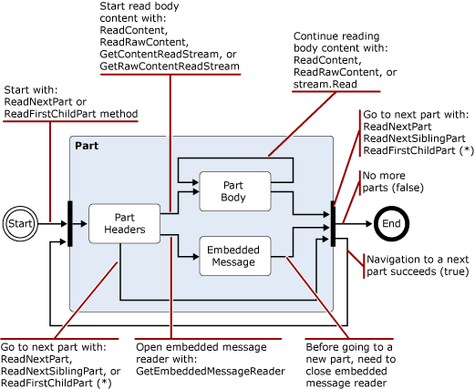
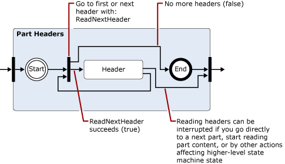
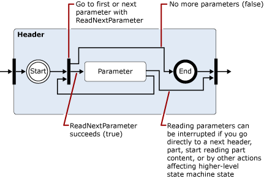
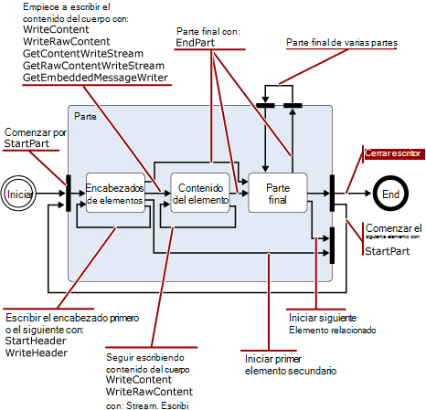
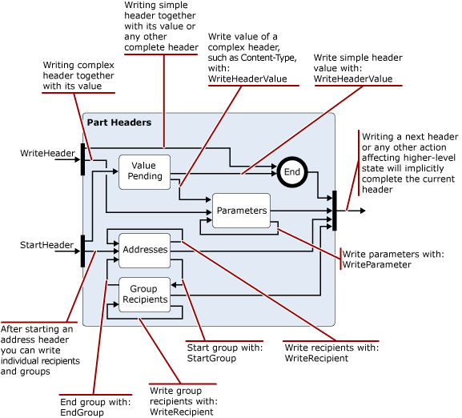

# Leer y modificar los mensajes en la canalización de transporte de Exchange 2013

Obtenga información acerca de las clases de .NET Framework que puede usar en su Exchange 2013 agentes de transporte para leer, escribir y modificar los mensajes.
  
**Se aplica a:** Exchange Server 2013
  
- Clases que se usan para leer, escribir o modificar los mensajes
- Espacio de nombres de codificadores
- espacio de nombres de iCalendar
- Espacio de nombres MIME
- Espacio de nombres TextConverters
- Espacio de nombres de TNEF
- espacio de nombres de vCard
  
Como los mensajes pasan por la canalización de transporte, el agente de transporte puede leer, escribir y convertir el contenido de los mensajes entre los formatos de datos diferentes. Por ejemplo, puede leer y escribir datos MIME, identificar los mensajes entrantes que se encuentran en formato UUENCODE o formato Entrecomillado imprimible (Entrecomillado imprimible) y, a continuación, convert ellos a un estándar usadas por su organización, o de lectura y, a continuación, guardar información de calendario o contacto asociado mensajes entrantes. 
  
También puede identificar el contenido que supone una amenaza de seguridad y mover o eliminar el contenido o los mensajes que contienen; Por ejemplo, mediante la eliminación de vínculos en un mensaje HTML.
  
En este artículo se proporciona información acerca de las clases de .NET Framework que pueden usar para leer, escribir y modificar los mensajes.
  
> [!CAUTION]
> Muchos de los parámetros en la API de conversión de contenido y las propiedades permiten valores suficientemente grandes como para causar problemas de rendimiento, incluidos los ataques por denegación de servicio. Cuando se usa la API de la conversión de contenido en un agente de transporte, debe implementar los límites en los tamaños de valor de propiedad y el parámetro que admitir al leer o escribir con el fin de limitar el consumo de recursos por el agente. 

## Clases que se usan para leer, escribir o modificar los mensajes

En la siguiente tabla se enumera las clases de .NET Framework que puede usar para leer, escribir y modificar los mensajes de correo electrónico.
  
**Espacios de nombres de procesamiento de mensaje de .NET framework**

|**Espacio de nombres de .NET framework**|**Clases**|
|:-----|:-----|
|[Microsoft.Exchange.Data.Mime.Encoders](https://msdn.microsoft.com/library/Microsoft.Exchange.Data.Mime.Encoders.aspx)   |Contiene clases para la codificación y descodificación en memoria, una clase de secuencia del codificador que acepta una de las clases de codificador o del descodificador contenidas en una enumeración asociada, y la clase base [ByteEncoder](https://msdn.microsoft.com/library/Microsoft.Exchange.Data.Mime.Encoders.ByteEncoder.aspx) y [ByteEncoderException](https://msdn.microsoft.com/library/Microsoft.Exchange.Data.Mime.Encoders.ByteEncoderException.aspx) exception (clase) para los codificadores y descodificadores.    |
|[Microsoft.Exchange.Data.ContentTypes.iCalendar](https://msdn.microsoft.com/library/Microsoft.Exchange.Data.ContentTypes.iCalendar.aspx)   |Contiene tipos que permiten leer y escribir las secuencias de datos que contienen información de calendario. Incluye un calendario de lector y escritor, un objeto exception, un objeto de periodicidad y estructuras y enumeraciones que le ayudarán a devuelven información de propiedad acerca de los elementos del calendario.    |
|[Microsoft.Exchange.Data.Mime](https://msdn.microsoft.com/library/Microsoft.Exchange.Data.Mime.aspx)   |Contiene las clases, estructuras, enumeraciones y delegados que puede usar para crear, leer, escribir, atravesar, codificar y descodificar datos MIME. Incluye un lector de secuencias y sistema de escritura que proporciona sólo avance acceso de lectura y escritura a las secuencias de datos MIME, así como los métodos basados en el DOM y clases que se pueden utilizar en los documentos MIME.    |
|[Microsoft.Exchange.Data.TextConverters](https://msdn.microsoft.com/library/Microsoft.Exchange.Data.TextConverters.aspx)   |Contiene las clases, estructuras, enumeraciones y delegados que permiten leer y escribir una secuencia de datos y realizar las conversiones entre tipos de datos específicos; Por ejemplo, HTML a formato de texto enriquecido (RTF). Convertidores de texto permiten cambiar el formato de un flujo de documento de un formulario a otro, así como eliminar de forma selectiva elementos de un documento que podría suponer un riesgo para la seguridad.    |
|[Microsoft.Exchange.Data.ContentTypes.Tnef](https://msdn.microsoft.com/library/Microsoft.Exchange.Data.ContentTypes.Tnef.aspx)   |Contiene un lector de secuencias de sólo avance y escritor, una clase de excepción y estructuras y enumeraciones que facilitan la lectura y escritura de datos de formato de encapsulación neutro de transporte (TNEF).    |
|[Microsoft.Exchange.Data.ContentTypes.vCard](https://msdn.microsoft.com/library/Microsoft.Exchange.Data.ContentTypes.vCard.aspx)   |Contiene un lector de secuencias de sólo avance y escritor, una clase de excepción y estructuras y enumeraciones que facilitan la lectura y escritura de datos de contacto con formato vCard.    |
   
## Espacio de nombres de codificadores

El espacio de nombres codificadores contiene clases para la codificación y descodificación en memoria. Estos se heredan de la clase base [ByteEncoder](https://msdn.microsoft.com/library/Microsoft.Exchange.Data.Mime.Encoders.ByteEncoder.aspx) . Clases de codificar y descodificar para Base64, BinHex, Entrecomillado imprimible (Entrecomillado imprimible) y codificación Unix a Unix (Uu). Las siguientes clases se usan para la codificación y descodificación en memoria: 
  
- [Base64Encoder](https://msdn.microsoft.com/library/Microsoft.Exchange.Data.Mime.Encoders.Base64Encoder.aspx)
    
- [Base64Decoder](https://msdn.microsoft.com/library/Microsoft.Exchange.Data.Mime.Encoders.Base64Decoder.aspx)
    
- [BinHexEncoder](https://msdn.microsoft.com/library/Microsoft.Exchange.Data.Mime.Encoders.BinHexEncoder.aspx)
    
- [BinHexDecoder](https://msdn.microsoft.com/library/Microsoft.Exchange.Data.Mime.Encoders.BinHexDecoder.aspx)
    
- [QPEncoder](https://msdn.microsoft.com/library/Microsoft.Exchange.Data.Mime.Encoders.QPEncoder.aspx)
    
- [QPDecoder](https://msdn.microsoft.com/library/Microsoft.Exchange.Data.Mime.Encoders.QPDecoder.aspx)
    
- [UUEncoder](https://msdn.microsoft.com/library/Microsoft.Exchange.Data.Mime.Encoders.UUEncoder.aspx)
    
- [UUDecoder](https://msdn.microsoft.com/library/Microsoft.Exchange.Data.Mime.Encoders.UUDecoder.aspx)
    
Los codificadores y descodificadores heredan de la clase base [ByteEncoder](https://msdn.microsoft.com/library/Microsoft.Exchange.Data.Mime.Encoders.ByteEncoder.aspx) y usan la clase de excepción de [ByteEncoderException](https://msdn.microsoft.com/library/Microsoft.Exchange.Data.Mime.Encoders.ByteEncoderException.aspx) para el tratamiento de errores. 
  
Además, el espacio de nombres contiene la clase [MacBinaryHeader](https://msdn.microsoft.com/library/Microsoft.Exchange.Data.Mime.Encoders.MacBinaryHeader.aspx) , que identifica los archivos MacBinary codificado y lee el encabezado de archivo asociado. 
  
Por último, la clase [EncoderStream](https://msdn.microsoft.com/library/Microsoft.Exchange.Data.Mime.Encoders.EncoderStream.aspx) realiza una conversión en una secuencia de datos en lugar de un objeto en memoria. Esta clase acepta una de las clases del codificador o del descodificador y puede ser lecturas o escribe según la enumeración [EncoderStreamAccess](https://msdn.microsoft.com/library/Microsoft.Exchange.Data.Mime.Encoders.EncoderStreamAccess.aspx) asociada. 
  
## espacio de nombres de iCalendar

El espacio de nombres de iCalendar proporciona un lector de sólo avance y escritor para los datos de iCalendar, además de estructuras de soporte y las clases para crear, obtener acceso a y modificación de secuencias de iCalendar.
  
Las clases [CalendarReader](https://msdn.microsoft.com/library/Microsoft.Exchange.Data.ContentTypes.iCalendar.CalendarReader.aspx) y [CalendarWriter](https://msdn.microsoft.com/library/Microsoft.Exchange.Data.ContentTypes.iCalendar.CalendarWriter.aspx) se utilizan para leer y escribir datos de secuencia de iCalendar. 
  
El CalendarReader toma una [secuencia](https://msdn.microsoft.com/library/System.IO.Stream.aspx) de legible como un argumento a sus constructores. A continuación, puede usar los métodos [ReadFirstChildComponent](https://msdn.microsoft.com/library/Microsoft.Exchange.Data.ContentTypes.iCalendar.CalendarReader.ReadFirstChildComponent.aspx), [ReadNextSiblingComponent](https://msdn.microsoft.com/library/Microsoft.Exchange.Data.ContentTypes.iCalendar.CalendarReader.ReadNextSiblingComponent.aspx)y [ReadNextComponent](https://msdn.microsoft.com/library/Microsoft.Exchange.Data.ContentTypes.iCalendar.CalendarReader.ReadNextComponent.aspx) para secuencialmente tener acceso a los componentes de iCalendar en la secuencia de datos. En función del valor que se ha establecido para la propiedad [ComplianceMode](https://msdn.microsoft.com/library/Microsoft.Exchange.Data.ContentTypes.iCalendar.CalendarReader.ComplianceMode.aspx) , errores en la secuencia de iCalendar harán que se produzca una excepción o hará que la propiedad [ComplianceStatus](https://msdn.microsoft.com/library/Microsoft.Exchange.Data.ContentTypes.iCalendar.CalendarReader.ComplianceStatus.aspx) se establece en un valor que no sea [compatible](https://msdn.microsoft.com/en-us/library/microsoft.exchange.data.contenttypes.icalendar.calendarcompliancestatus.aspx). Puede comprobar esta propiedad para detectar los problemas relacionados con los datos entrantes de iCalendar. 
  
La clase [CalendarWriter](https://msdn.microsoft.com/library/Microsoft.Exchange.Data.ContentTypes.iCalendar.CalendarWriter.aspx) toma una [secuencia](https://msdn.microsoft.com/library/System.IO.Stream.aspx) de escritura como un argumento a sus constructores. 
  
## Espacio de nombres MIME

El espacio de nombres MIME proporciona clases que permiten crear, obtener acceso y modificar documentos de MIME. Puede trabajar con documentos MIME mediante el uso de ya sea un método basado en DOM o stream.
  
### Clase MimeDocument y el DOM MIME

La clase [MimeDocument](https://msdn.microsoft.com/library/Microsoft.Exchange.Data.Mime.MimeDocument.aspx) habilita el acceso de DOM a un documento MIME. Utilizar objetos de este tipo cuando tenga la memoria disponible para cargar un DOM todo y deben tener acceso aleatorio a los encabezados y el contenido del mensaje. 
  
Cargar datos en un objeto [MimeDocument](https://msdn.microsoft.com/library/Microsoft.Exchange.Data.Mime.MimeDocument.aspx) mediante el uso de los métodos [GetLoadStream](https://msdn.microsoft.com/library/Microsoft.Exchange.Data.Mime.MimeDocument.GetLoadStream.aspx) o [cargar](https://msdn.microsoft.com/library/Microsoft.Exchange.Data.Mime.MimeDocument.Load.aspx) . A continuación, puede recorrer a la jerarquía de DOM y crear, modificar o quitar datos MIME. Después de modificar los datos MIME, puede escribir en una secuencia mediante el uso de uno de los métodos [WriteTo](https://msdn.microsoft.com/library/Microsoft.Exchange.Data.Mime.MimeNode.WriteTo.aspx) . 
  
En la siguiente ilustración muestra la estructura de datos dentro de un objeto [MimeDocument](https://msdn.microsoft.com/library/Microsoft.Exchange.Data.Mime.MimeDocument.aspx) . 
  
**En la figura 1. Estructura de los objetos MimeDocument**

  
### Las clases de MimeReader y MimeWriter y basada en transmisión análisis MIME

Las clases [MimeReader](https://msdn.microsoft.com/library/Microsoft.Exchange.Data.Mime.MimeReader.aspx) y [MimeWriter](https://msdn.microsoft.com/library/Microsoft.Exchange.Data.Mime.MimeWriter.aspx) habilitar el acceso de sólo avance a secuencias MIME. Use estas clases cuando no es necesario que cambiar los datos MIME que requiere datos que ya se han leído o escrito. Por ejemplo, si desea imprimir los mensajes que se ajusten a un formato predefinido, la clase [MimeWriter](https://msdn.microsoft.com/library/Microsoft.Exchange.Data.Mime.MimeWriter.aspx) podría ser ideal. 
  
La clase [MimeDocument](https://msdn.microsoft.com/library/Microsoft.Exchange.Data.Mime.MimeDocument.aspx) encapsula un DOM. Las clases de [MimeReader](https://msdn.microsoft.com/library/Microsoft.Exchange.Data.Mime.MimeReader.aspx) y [MimeWriter](https://msdn.microsoft.com/library/Microsoft.Exchange.Data.Mime.MimeWriter.aspx) representan los equipos de estado. Cambio de sus Estados en función de la entrada recibida y los métodos llamados. Las ilustraciones 2 al 5 son diagramas de transición de estado simplificado que mostrar para el objeto [MimeReader](https://msdn.microsoft.com/library/Microsoft.Exchange.Data.Mime.MimeReader.aspx) , qué métodos son válidos para llamar desde cada estado y el estado que se producirá. 
  
Para usar estos diagramas, siga las flechas de un estado a la siguiente, teniendo en cuenta las llamadas al método o devolver los valores que harán que el estado cambiar. Por ejemplo, en el primer diagrama, se presupone que se al principio de la secuencia que pertenece a la MimeReader que haya creado. Para obtener el estado de los encabezados de elemento, llame a uno de los [ReadNextPart](https://msdn.microsoft.com/library/Microsoft.Exchange.Data.Mime.MimeReader.ReadNextPart.aspx) o [ReadFirstChildPart](https://msdn.microsoft.com/library/Microsoft.Exchange.Data.Mime.MimeReader.ReadFirstChildPart.aspx), en ese orden. Si hay encabezados (es decir, si el MIME es correcto), escribirá en el estado de los encabezados de elementos. De lo contrario, se producirá una excepción. 
  
**La figura 2. Diagrama de transición de estado simplificado para objetos de MimeReader**

  
> [!NOTE]
> Expanda las figuras 3, 4 y 5 en los Estados de que se muestra en cada uno de los diagramas anteriores. 
  
**La figura 3. Expansión del estado de los encabezados de elementos de la figura 2**

  
**La figura 4. Expansión del estado del encabezado de la figura 3 cuando se ha encontrado un parámetro en un encabezado**

  
> [!NOTE]
> El estado representado por la figura 5 es recursiva en que, si se encuentra un grupo de direcciones, puede usar la propiedad [GroupRecipientReader](https://msdn.microsoft.com/library/Microsoft.Exchange.Data.Mime.MimeAddressReader.GroupRecipientReader.aspx) para leer las direcciones en el grupo. 
  
**La figura 5. Expansión del estado del encabezado de la figura 3 cuando se detecta una dirección o un grupo de direcciones**

  
Las figuras 6 y 7 muestran diagramas de transición de estado simplificado para el objeto [MimeWriter](https://msdn.microsoft.com/library/Microsoft.Exchange.Data.Mime.MimeWriter.aspx) . 
  
> [!NOTE]
> La figura 7 se expande en el estado de encabezados de elementos que se muestra en la figura 6. 
  
**La figura 6. Diagrama de transición de estado simplificado para objetos MimeWriter**

  
**La figura 7. Expansión del estado de los encabezados de elementos de la figura 6**

  
## Espacio de nombres TextConverters

El espacio de nombres TextConverters contiene tipos que admiten la conversión del contenido de los mensajes de correo electrónico. Estos tipos pueden realizar la conversión de página de códigos, quitar HTML que no es seguro y realizar otras transformaciones en cuerpos de mensaje de correo electrónico. El espacio de nombres [Microsoft.Exchange.Data.TextConverters](https://msdn.microsoft.com/library/Microsoft.Exchange.Data.TextConverters.aspx) incluye las siguientes clases que se derivan de la clase abstracta [TextConverter](https://msdn.microsoft.com/library/Microsoft.Exchange.Data.TextConverters.TextConverter.aspx) : 
  
- [EnrichedToHtml](https://msdn.microsoft.com/library/Microsoft.Exchange.Data.TextConverters.EnrichedToHtml.aspx)
    
- [EnrichedToText](https://msdn.microsoft.com/library/Microsoft.Exchange.Data.TextConverters.EnrichedToText.aspx)
    
- [HtmlToEnriched](https://msdn.microsoft.com/library/Microsoft.Exchange.Data.TextConverters.HtmlToEnriched.aspx)
    
- [HtmlToHtml](https://msdn.microsoft.com/library/Microsoft.Exchange.Data.TextConverters.HtmlToHtml.aspx)
    
- [HtmlToRtf](https://msdn.microsoft.com/library/Microsoft.Exchange.Data.TextConverters.HtmlToRtf.aspx)
    
- [HtmlToText](https://msdn.microsoft.com/library/Microsoft.Exchange.Data.TextConverters.HtmlToText.aspx)
    
- [RtfCompressedToRtf](https://msdn.microsoft.com/library/Microsoft.Exchange.Data.TextConverters.RtfCompressedToRtf.aspx)
    
- [RtfToHtml](https://msdn.microsoft.com/library/Microsoft.Exchange.Data.TextConverters.RtfToHtml.aspx)
    
- [RtfToRtf](https://msdn.microsoft.com/library/Microsoft.Exchange.Data.TextConverters.RtfToRtf.aspx)
    
- [RtfToRtfCompressed](https://msdn.microsoft.com/library/Microsoft.Exchange.Data.TextConverters.RtfToRtfCompressed.aspx)
    
- [RtfToText](https://msdn.microsoft.com/library/Microsoft.Exchange.Data.TextConverters.RtfToText.aspx)
    
- [TextToHtml](https://msdn.microsoft.com/library/Microsoft.Exchange.Data.TextConverters.TextToHtml.aspx)
    
- [TextToRtf](https://msdn.microsoft.com/library/Microsoft.Exchange.Data.TextConverters.TextToRtf.aspx)
    
- [TextToText](https://msdn.microsoft.com/library/Microsoft.Exchange.Data.TextConverters.TextToText.aspx)
    
Estos convertidores de texto permiten cambiar el formato de una secuencia de documentos o para quitar los elementos que no son seguros de un documento HTML. Se pueden usar estas clases por sí mismos para llevar a cabo una conversión mediante el uso de una única llamada a uno de los métodos de convertir en la clase base [TextConverter](https://msdn.microsoft.com/library/Microsoft.Exchange.Data.TextConverters.TextConverter.aspx) , o se pueden pasar a un constructor del convertidor, que se usa para llevar a cabo lecturas convertidas o escribe. 
  
La funcionalidad se hereda de la clase base es útil para llevar a cabo conversiones cuando tiene espacio suficiente para almacenar el documento original y su resultado convertido, o cuando desea almacenar los resultados de la conversión. El método **Convert** toma la entrada y salida secuencias, lectores de texto o escritores de texto y convierte el contenido de la entrada a la salida asociada. 
  
También se incluyen en el espacio de nombres son las clases de secuencia, escritor y lector de texto siguiente:
  
- [ConverterReader](https://msdn.microsoft.com/library/Microsoft.Exchange.Data.TextConverters.ConverterReader.aspx) — derivado **System.IO.TextReader**. 
    
- [ConverterReader](https://msdn.microsoft.com/library/Microsoft.Exchange.Data.TextConverters.ConverterWriter.aspx) — derivado **System.IO.TextWriter**. 
    
- [ConverterStream](https://msdn.microsoft.com/library/Microsoft.Exchange.Data.TextConverters.ConverterStream.aspx) — derivadas de **System.IO.Stream**. 
    
Se utilizan para realizar las conversiones cuando no tienen espacio suficiente para almacenar el original o su resultado convertido, cuando recibe la entrada desde o enviar el resultado a una secuencia, o cuando desee la salida únicamente con fines de búsqueda o indización y, por tanto, no desea almacenar el resultado de una conversión.
  
## Espacio de nombres de TNEF

El espacio de nombres Tnef contiene las clases y tipos que permiten sólo avance basado en la secuencia de lectura y escritura de los datos TNEF. TNEF es un formato de datos que se usa para encapsular las propiedades MAPI para los clientes que no se pueden interpretar de MAPI.
  
Las clases [TnefReader](https://msdn.microsoft.com/library/Microsoft.Exchange.Data.ContentTypes.Tnef.TnefReader.aspx) y [TnefWriter](https://msdn.microsoft.com/library/Microsoft.Exchange.Data.ContentTypes.Tnef.TnefWriter.aspx) proporcionan la funcionalidad básica en el espacio de nombres [Microsoft.Exchange.Data.ContentTypes.Tnef](https://msdn.microsoft.com/library/Microsoft.Exchange.Data.ContentTypes.Tnef.aspx) . 
  
La clase [TnefReader](https://msdn.microsoft.com/library/Microsoft.Exchange.Data.ContentTypes.Tnef.TnefReader.aspx) toma una secuencia legible como un argumento a sus constructores. A continuación, se use el método [ReadNextAttribute](https://msdn.microsoft.com/library/Microsoft.Exchange.Data.ContentTypes.Tnef.TnefReader.ReadNextAttribute.aspx) para leer los atributos en la secuencia TNEF de forma secuencial. Después de haber leído un atributo, puede tener acceso a información sobre el atributo mediante cualquiera de las propiedades de sólo lectura en el objeto [TnefReader](https://msdn.microsoft.com/library/Microsoft.Exchange.Data.ContentTypes.Tnef.TnefReader.aspx) , además de obtener un [TnefPropertyReader](https://msdn.microsoft.com/library/Microsoft.Exchange.Data.ContentTypes.Tnef.TnefPropertyReader.aspx) para leer la propiedad actual. El atributo actual también directamente, puede acceder mediante el método [ReadAttributeRawValue](https://msdn.microsoft.com/library/Microsoft.Exchange.Data.ContentTypes.Tnef.TnefReader.ReadAttributeRawValue.aspx) . 
  
La clase [TnefWriter](https://msdn.microsoft.com/library/Microsoft.Exchange.Data.ContentTypes.Tnef.TnefWriter.aspx) toma una [secuencia](https://msdn.microsoft.com/library/System.IO.Stream.aspx) de escritura como un argumento a sus constructores. La clase [TnefWriter](https://msdn.microsoft.com/library/Microsoft.Exchange.Data.ContentTypes.Tnef.TnefWriter.aspx) proporciona varias maneras en que se va a escribir datos en esta secuencia. 
  
## espacio de nombres de vCard

El espacio de nombres vCard contiene las clases, estructuras y enumeraciones utilizadas para leer y escribir información de contacto contenida en un mensaje de correo electrónico que se encuentra en el formato de datos de vCard. El espacio de nombres contiene un lector de contacto y escritor, una clase de excepción, un lector (propiedad), un lector de parámetro y compatibilidad con enumeraciones que permiten leer datos de vCard asociados con un mensaje de correo electrónico.
  
## Vea también

- [Los agentes de transporte en Exchange](transport-agents-in-exchange-2013.md)  
- [Conceptos de agente en Exchange 2013 de transporte](transport-agent-concepts-in-exchange-2013.md) 
- [Referencia de agente de transporte de Exchange 2013](transport-agent-reference-for-exchange-2013.md)
- [Tipos de medios MIME](http://www.iana.org/assignments/media-types)
    

